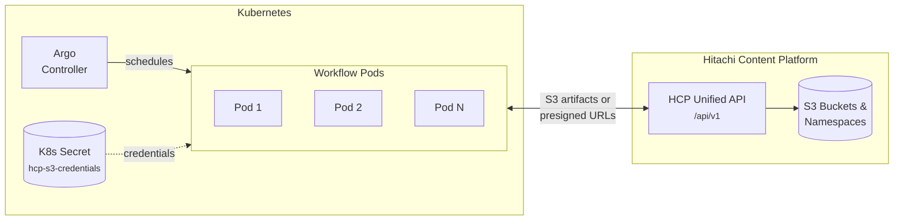
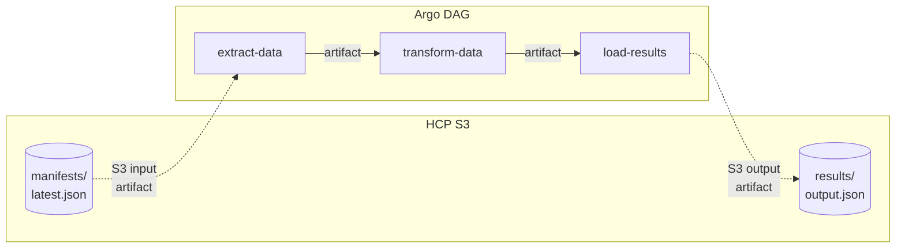
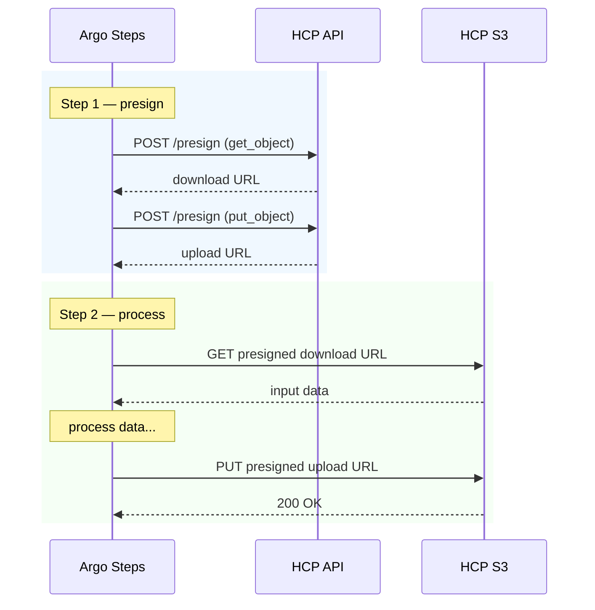
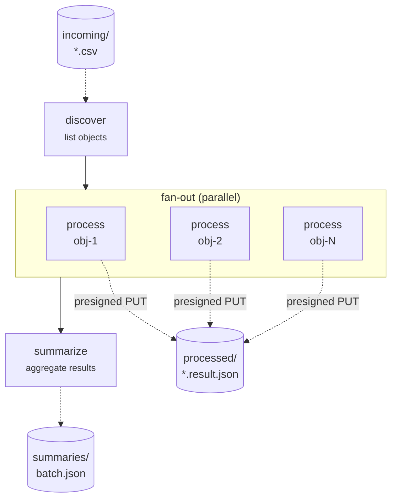
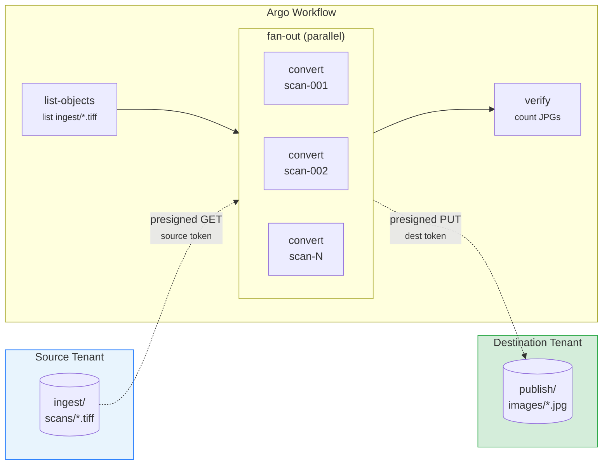
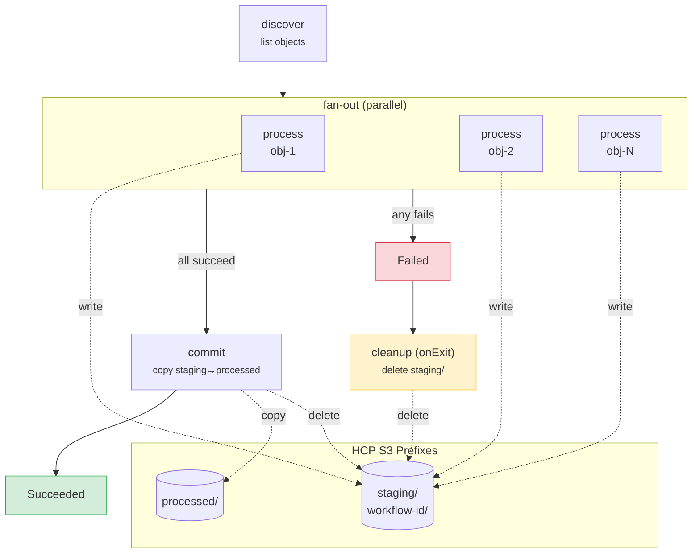

# Argo Workflows with HCP S3

[Argo Workflows](https://argoproj.github.io/workflows/) can use HCP as an S3-compatible artifact store. This enables pipelines to read input data from and write results back to HCP namespaces. The examples below show how to configure Argo to work with the HCP API's S3 credentials endpoint and presigned URLs.

All examples are provided in both **YAML** (native Argo manifests) and **[Hera](https://github.com/argoproj-labs/hera)** (Python SDK for Argo Workflows).



## Configuring HCP S3 credentials for Argo

First, retrieve the S3 credentials from the API and create a Kubernetes Secret that Argo can reference:

=== "curl"

    ```bash
    BASE="http://localhost:8000/api/v1"
    TOKEN="<your-token>"

    # Fetch S3 credentials from the HCP API
    CREDS=$(curl -s "$BASE/credentials" -H "Authorization: Bearer $TOKEN")

    ACCESS_KEY=$(echo "$CREDS" | jq -r .access_key_id)
    SECRET_KEY=$(echo "$CREDS" | jq -r .secret_access_key)
    ENDPOINT=$(echo "$CREDS" | jq -r .endpoint_url)

    # Create Kubernetes Secret for Argo
    kubectl create secret generic hcp-s3-credentials \
      --from-literal=accessKey="$ACCESS_KEY" \
      --from-literal=secretKey="$SECRET_KEY" \
      -n argo
    ```

=== "Python"

    ```python
    import httpx
    import subprocess

    BASE = "http://localhost:8000/api/v1"

    async def create_argo_s3_secret(token: str, namespace: str = "argo"):
        """Fetch HCP S3 credentials and create a Kubernetes Secret for Argo."""
        headers = {"Authorization": f"Bearer {token}"}

        async with httpx.AsyncClient(base_url=BASE, headers=headers) as c:
            resp = await c.get("/credentials")
            resp.raise_for_status()
            creds = resp.json()

        subprocess.run(
            [
                "kubectl", "create", "secret", "generic", "hcp-s3-credentials",
                f"--from-literal=accessKey={creds['access_key_id']}",
                f"--from-literal=secretKey={creds['secret_access_key']}",
                "-n", namespace,
                "--dry-run=client", "-o", "yaml",
            ],
            check=True,
        )
    ```

### Python container images

The Python-based Argo templates use `httpx` and shared helpers. Build two images:

**Base image** -- httpx only (used by the ETL and presigned URL examples):

```dockerfile
FROM python:3.13-slim
RUN pip install --no-cache-dir httpx
```

```bash
docker build -t my-registry/python-httpx:3.13 .
```

**Full image** -- httpx + Pillow + shared `hcp_s3` helper module (used by batch, cross-tenant, and error-handling examples):

```dockerfile
FROM python:3.13-slim
RUN pip install --no-cache-dir httpx Pillow
COPY hcp_s3.py /app/hcp_s3.py
ENV PYTHONPATH="/app"
```

```bash
docker build -t my-registry/hcp-convert:3.13 .
docker push my-registry/hcp-convert:3.13
```

Replace `my-registry/` with your actual container registry path.

#### What the `hcp-convert` image provides

The `hcp-convert:3.13` image bundles everything a workflow pod needs to interact with HCP S3 via presigned URLs:

| Package | Purpose |
|---------|---------|
| **httpx** | HTTP client for presigned URL transfers and HCP API calls |
| **Pillow** | Image validation and format conversion (TIFF, JPG, PNG, etc.) |
| **hcp_s3** | Shared helper module that eliminates boilerplate across workflow steps |

#### `hcp_s3` helper module -- quick reference

The `hcp_s3` module is a single Python file baked into the container at import time (`import hcp_s3`). It provides presigning, transfers, verification, listing, bulk operations, and staged-commit patterns so each workflow step stays concise.

| Function | Description |
|----------|-------------|
| `read_token(secret_path)` | Read a JWT from a mounted Kubernetes Secret |
| `auth_headers(token)` | Build an `Authorization: Bearer` header dict |
| `presign(base, token, bucket, key, method, expires=600)` | Get a presigned URL from the HCP API |
| `download(base, token, bucket, key, dest)` | Presign + GET + write to local `Path`. Returns byte count |
| `upload(base, token, bucket, key, data)` | Presign + PUT bytes. Returns ETag |
| `verify_upload(base, token, bucket, key, expected_size)` | HEAD the object and assert `Content-Length` matches |
| `list_objects(base, token, bucket, prefix, max_keys=1000)` | List objects under a prefix |
| `delete_keys(base, token, bucket, keys)` | Bulk-delete a list of object keys |
| `commit_staging(base, token, bucket, staging_prefix, dest_prefix)` | Copy all objects from staging to final prefix, then delete staging. Returns count |
| `cleanup_staging(base, token, bucket, staging_prefix)` | Delete all objects under a staging prefix (safe on errors). Returns count |
| `validate_tiff(path)` | Check magic bytes + `Image.verify()` — catches corrupt TIFFs |
| `validate_jpg(path)` | Check magic bytes + `Image.load()` — forces full decode, catches truncation |

The full source code is in the [cross-tenant section](#shared-helper-module----hcp_s3py) below.

!!! tip "When to use which image"
    - **`python-httpx:3.13`** -- Use for the ETL and presigned URL pipelines where pods work with raw data and don't need Pillow or shared helpers.
    - **`hcp-convert:3.13`** -- Use for batch fan-out, cross-tenant transformations, and error-handling workflows where pods need `import hcp_s3` for concise presigned URL operations and staged-commit patterns.

### Installing Hera

[Hera](https://github.com/argoproj-labs/hera) lets you define Argo Workflows entirely in Python instead of YAML. Install it with:

```bash
uv add hera
```

---

## ETL pipeline with HCP S3 artifacts

A workflow that reads a dataset from HCP, processes it, and writes results back:



=== "YAML"

    ```yaml
    apiVersion: argoproj.io/v1alpha1
    kind: Workflow
    metadata:
      generateName: hcp-etl-
    spec:
      entrypoint: etl-pipeline
      activeDeadlineSeconds: 1800        # workflow-level timeout: 30 min
      artifactGC:
        strategy: OnWorkflowDeletion
      templates:
        - name: etl-pipeline
          dag:
            tasks:
              - name: extract
                template: extract-data
              - name: transform
                template: transform-data
                dependencies: [extract]
              - name: load
                template: load-results
                dependencies: [transform]

        - name: extract-data
          retryStrategy:
            limit: 3
            backoff:
              duration: "5s"
              factor: 2
              maxDuration: "1m"
          container:
            image: python:3.13-slim
            command: [python, -c]
            args:
              - |
                from pathlib import Path
                import json
                # Read the input artifact (mounted by Argo from HCP S3)
                data = json.loads(Path("/tmp/input/manifest.json").read_text())
                print(f"Loaded {len(data['files'])} files from manifest")
                # Write output for next step
                Path("/tmp/output/extracted.json").write_text(json.dumps(data))
          inputs:
            artifacts:
              - name: input-manifest
                path: /tmp/input/manifest.json
                s3:
                  endpoint: hcp-s3.example.com
                  bucket: datasets
                  key: manifests/latest.json
                  accessKeySecret:
                    name: hcp-s3-credentials
                    key: accessKey
                  secretKeySecret:
                    name: hcp-s3-credentials
                    key: secretKey
                  insecure: false
          outputs:
            artifacts:
              - name: extracted
                path: /tmp/output/extracted.json

        - name: transform-data
          retryStrategy:
            limit: 3
            backoff:
              duration: "5s"
              factor: 2
              maxDuration: "1m"
          container:
            image: python:3.13-slim
            command: [python, -c]
            args:
              - |
                from pathlib import Path
                import json
                data = json.loads(Path("/tmp/input/extracted.json").read_text())
                results = {"processed": len(data.get("files", [])), "status": "ok"}
                Path("/tmp/output/results.json").write_text(json.dumps(results))
          inputs:
            artifacts:
              - name: extracted
                path: /tmp/input/extracted.json
          outputs:
            artifacts:
              - name: results
                path: /tmp/output/results.json

        - name: load-results
          retryStrategy:
            limit: 3
            backoff:
              duration: "5s"
              factor: 2
              maxDuration: "1m"
          container:
            image: python:3.13-slim
            command: [python, -c]
            args:
              - |
                from pathlib import Path
                data = Path("/tmp/input/results.json").read_text()
                print(f"Results uploaded to HCP: {data}")
          inputs:
            artifacts:
              - name: results
                path: /tmp/input/results.json
          outputs:
            artifacts:
              - name: final-results
                path: /tmp/input/results.json
                s3:
                  endpoint: hcp-s3.example.com
                  bucket: results
                  key: "etl/{{workflow.name}}/results.json"
                  accessKeySecret:
                    name: hcp-s3-credentials
                    key: accessKey
                  secretKeySecret:
                    name: hcp-s3-credentials
                    key: secretKey
    ```

=== "Hera"

    ```python
    from hera.workflows import (
        DAG,
        Artifact,
        S3Artifact,
        Workflow,
        models as m,
        script,
    )

    HCP_S3 = m.S3Artifact(
        endpoint="hcp-s3.example.com",
        bucket="datasets",
        access_key_secret=m.SecretKeySelector(name="hcp-s3-credentials", key="accessKey"),
        secret_key_secret=m.SecretKeySelector(name="hcp-s3-credentials", key="secretKey"),
        insecure=False,
    )

    RETRY = m.RetryStrategy(
        limit="3",
        backoff=m.Backoff(duration="5s", factor=2, max_duration="1m"),
    )


    @script(image="python:3.13-slim", retry_strategy=RETRY)
    def extract_data(manifest: Artifact) -> Artifact:
        """Read input from HCP S3, write extracted data."""
        from pathlib import Path
        import json

        data = json.loads(Path("/tmp/input/manifest.json").read_text())
        print(f"Loaded {len(data['files'])} files from manifest")
        Path("/tmp/output/extracted.json").write_text(json.dumps(data))


    @script(image="python:3.13-slim", retry_strategy=RETRY)
    def transform_data(extracted: Artifact) -> Artifact:
        """Process the extracted data."""
        from pathlib import Path
        import json

        data = json.loads(Path("/tmp/input/extracted.json").read_text())
        results = {"processed": len(data.get("files", [])), "status": "ok"}
        Path("/tmp/output/results.json").write_text(json.dumps(results))


    @script(image="python:3.13-slim", retry_strategy=RETRY)
    def load_results(results: Artifact) -> Artifact:
        """Upload results back to HCP S3."""
        from pathlib import Path

        data = Path("/tmp/input/results.json").read_text()
        print(f"Results uploaded to HCP: {data}")


    with Workflow(
        generate_name="hcp-etl-",
        entrypoint="etl-pipeline",
        active_deadline_seconds=1800,
        artifact_gc=m.ArtifactGC(strategy="OnWorkflowDeletion"),
    ) as w:
        with DAG(name="etl-pipeline"):
            ext = extract_data(
                name="extract",
                arguments=[
                    S3Artifact(
                        name="manifest",
                        path="/tmp/input/manifest.json",
                        **HCP_S3.dict() | {"key": "manifests/latest.json"},
                    ),
                ],
            )
            trn = transform_data(
                name="transform",
                arguments=[ext.get_artifact("extracted").with_name("extracted")],
            )
            ld = load_results(
                name="load",
                arguments=[trn.get_artifact("results").with_name("results")],
            )
            ext >> trn >> ld

    w.create()  # submit to the Argo server
    ```

---

## Presigned URL pipeline

For cases where you cannot mount S3 credentials into every pod, use the HCP API to generate presigned URLs and pass them as parameters:



=== "YAML"

    ```yaml
    apiVersion: argoproj.io/v1alpha1
    kind: Workflow
    metadata:
      generateName: hcp-presign-
    spec:
      entrypoint: presigned-pipeline
      activeDeadlineSeconds: 900         # workflow-level timeout: 15 min
      arguments:
        parameters:
          - name: hcp-api-base
            value: "http://hcp-api.default.svc:8000/api/v1"
          - name: hcp-token
            value: "<your-token>"
          - name: bucket
            value: "datasets"
      templates:
        - name: presigned-pipeline
          steps:
            - - name: generate-urls
                template: presign
            - - name: process
                template: process-with-urls
                arguments:
                  parameters:
                    - name: download-url
                      value: "{{steps.generate-urls.outputs.parameters.download-url}}"
                    - name: upload-url
                      value: "{{steps.generate-urls.outputs.parameters.upload-url}}"

        - name: presign
          retryStrategy:
            limit: 3
            backoff:
              duration: "5s"
              factor: 2
          script:
            image: curlimages/curl:latest
            command: [sh]
            source: |
              BASE="{{workflow.parameters.hcp-api-base}}"
              TOKEN="{{workflow.parameters.hcp-token}}"
              BUCKET="{{workflow.parameters.bucket}}"

              # Get download URL for input
              DL=$(curl -s -X POST "$BASE/presign" \
                -H "Authorization: Bearer $TOKEN" \
                -H "Content-Type: application/json" \
                -d "{\"bucket\":\"$BUCKET\",\"key\":\"input/data.csv\",\"method\":\"get_object\",\"expires_in\":3600}")
              echo "$DL" | grep -o '"url":"[^"]*"' | cut -d'"' -f4 > /tmp/download-url

              # Get upload URL for output
              UL=$(curl -s -X POST "$BASE/presign" \
                -H "Authorization: Bearer $TOKEN" \
                -H "Content-Type: application/json" \
                -d "{\"bucket\":\"$BUCKET\",\"key\":\"output/result.csv\",\"method\":\"put_object\",\"expires_in\":3600}")
              echo "$UL" | grep -o '"url":"[^"]*"' | cut -d'"' -f4 > /tmp/upload-url
          outputs:
            parameters:
              - name: download-url
                valueFrom:
                  path: /tmp/download-url
              - name: upload-url
                valueFrom:
                  path: /tmp/upload-url

        - name: process-with-urls
          retryStrategy:
            limit: 2
            backoff:
              duration: "10s"
              factor: 2
          inputs:
            parameters:
              - name: download-url
              - name: upload-url
          script:
            image: my-registry/python-httpx:3.13
            command: [python]
            source: |
              import httpx
              from pathlib import Path

              # Download input via presigned URL (no credentials needed)
              resp = httpx.get("{{inputs.parameters.download-url}}")
              resp.raise_for_status()
              Path("/tmp/data.csv").write_bytes(resp.content)

              # Process...
              Path("/tmp/result.csv").write_text("processed,data\n")

              # Upload result via presigned URL
              data = Path("/tmp/result.csv").read_bytes()
              httpx.put("{{inputs.parameters.upload-url}}", content=data).raise_for_status()
              print("Done: input downloaded and result uploaded via presigned URLs")
    ```

=== "Hera"

    ```python
    from hera.workflows import (
        Parameter,
        Steps,
        Workflow,
        models as m,
        script,
    )

    HCP_BASE = "http://hcp-api.default.svc:8000/api/v1"

    RETRY = m.RetryStrategy(
        limit="3",
        backoff=m.Backoff(duration="5s", factor=2),
    )


    @script(image="my-registry/python-httpx:3.13", retry_strategy=RETRY)
    def generate_presigned_urls(
        hcp_api_base: str,
        hcp_token: str,
        bucket: str,
    ):
        """Generate download and upload presigned URLs from the HCP API."""
        import httpx
        from pathlib import Path

        headers = {"Authorization": f"Bearer {hcp_token}"}

        def presign(key: str, method: str) -> str:
            resp = httpx.post(
                f"{hcp_api_base}/presign",
                json={"bucket": bucket, "key": key, "method": method, "expires_in": 3600},
                headers=headers,
            )
            resp.raise_for_status()
            return resp.json()["url"]

        dl = presign("input/data.csv", "get_object")
        ul = presign("output/result.csv", "put_object")

        Path("/tmp/download-url").write_text(dl)
        Path("/tmp/upload-url").write_text(ul)


    @script(
        image="my-registry/python-httpx:3.13",
        retry_strategy=m.RetryStrategy(limit="2", backoff=m.Backoff(duration="10s", factor=2)),
    )
    def process_with_urls(download_url: str, upload_url: str):
        """Download input, process, and upload result via presigned URLs."""
        import httpx
        from pathlib import Path

        resp = httpx.get(download_url)
        resp.raise_for_status()
        Path("/tmp/data.csv").write_bytes(resp.content)

        Path("/tmp/result.csv").write_text("processed,data\n")

        data = Path("/tmp/result.csv").read_bytes()
        httpx.put(upload_url, content=data).raise_for_status()
        print("Done: input downloaded and result uploaded via presigned URLs")


    with Workflow(
        generate_name="hcp-presign-",
        entrypoint="presigned-pipeline",
        active_deadline_seconds=900,
        arguments=[
            Parameter(name="hcp-api-base", value=HCP_BASE),
            Parameter(name="hcp-token", value="<your-token>"),
            Parameter(name="bucket", value="datasets"),
        ],
    ) as w:
        with Steps(name="presigned-pipeline"):
            urls = generate_presigned_urls(
                name="generate-urls",
                arguments={
                    "hcp_api_base": "{{workflow.parameters.hcp-api-base}}",
                    "hcp_token": "{{workflow.parameters.hcp-token}}",
                    "bucket": "{{workflow.parameters.bucket}}",
                },
            )
            process_with_urls(
                name="process",
                arguments={
                    "download_url": urls.get_parameter("download-url"),
                    "upload_url": urls.get_parameter("upload-url"),
                },
            )

    w.create()
    ```

---

## Running Hera workflows

```bash
# Submit directly from a script
uv run --with hera python etl_workflow.py

# Or export to YAML and submit with Argo CLI
uv run --with hera python -c "
from etl_workflow import w
print(w.to_yaml())
" | argo submit -

# Useful during development: validate without submitting
uv run --with hera python -c "
from etl_workflow import w
print(w.to_yaml())
" | argo lint -
```

---

## Batch processing -- fan-out over HCP objects

A common pattern: list objects from an HCP bucket, process each one in parallel (fan-out), then aggregate results (fan-in).



=== "YAML"

    ```yaml
    apiVersion: argoproj.io/v1alpha1
    kind: Workflow
    metadata:
      generateName: hcp-batch-
    spec:
      entrypoint: batch-pipeline
      arguments:
        parameters:
          - name: hcp-api-base
            value: "http://hcp-api.default.svc:8000/api/v1"
          - name: hcp-token
            value: "<your-token>"
          - name: bucket
            value: "datasets"
          - name: prefix
            value: "incoming/"
      templates:
        # ── Orchestrator DAG ─────────────────────────────────────────
        - name: batch-pipeline
          dag:
            tasks:
              - name: discover
                template: list-objects
              - name: process
                template: fan-out
                dependencies: [discover]
                arguments:
                  parameters:
                    - name: object-keys
                      value: "{{tasks.discover.outputs.parameters.keys}}"
              - name: summarize
                template: aggregate
                dependencies: [process]

        # ── Step 1: List objects from HCP via the API ────────────────
        - name: list-objects
          retryStrategy:
            limit: 3
            backoff:
              duration: "5s"
              factor: 2
          script:
            image: curlimages/curl:latest
            command: [sh]
            source: |
              BASE="{{workflow.parameters.hcp-api-base}}"
              TOKEN="{{workflow.parameters.hcp-token}}"
              BUCKET="{{workflow.parameters.bucket}}"
              PREFIX="{{workflow.parameters.prefix}}"

              RESP=$(curl -s -f "$BASE/buckets/$BUCKET/objects?prefix=$PREFIX&max_keys=100" \
                -H "Authorization: Bearer $TOKEN")

              # Extract object keys as a JSON array
              echo "$RESP" | jq '[.objects[].key]' > /tmp/keys.json
              echo "Found $(echo "$RESP" | jq '.objects | length') objects"
              cat /tmp/keys.json
          outputs:
            parameters:
              - name: keys
                valueFrom:
                  path: /tmp/keys.json

        # ── Step 2: Fan out — one pod per object ─────────────────────
        - name: fan-out
          inputs:
            parameters:
              - name: object-keys
          steps:
            - - name: process-object
                template: process-single
                arguments:
                  parameters:
                    - name: key
                      value: "{{item}}"
                withParam: "{{inputs.parameters.object-keys}}"

        - name: process-single
          retryStrategy:
            limit: 2
            backoff:
              duration: "10s"
              factor: 2
          inputs:
            parameters:
              - name: key
          script:
            image: my-registry/hcp-convert:3.13
            command: [python]
            source: |
              import hcp_s3, json
              from pathlib import Path

              BASE = "{{workflow.parameters.hcp-api-base}}"
              TOKEN = "{{workflow.parameters.hcp-token}}"
              BUCKET = "{{workflow.parameters.bucket}}"
              KEY = "{{inputs.parameters.key}}"

              # Download via presigned URL
              size = hcp_s3.download(BASE, TOKEN, BUCKET, KEY, Path("/tmp/data"))

              # Process (placeholder — replace with your logic)
              result = {"key": KEY, "size": size, "status": "processed"}
              print(json.dumps(result))

              # Upload result via presigned URL
              result_key = KEY.replace("incoming/", "processed/") + ".result.json"
              hcp_s3.upload(BASE, TOKEN, BUCKET, result_key, json.dumps(result).encode())
              print(f"Result uploaded to {result_key}")

        # ── Step 3: Fan in — aggregate results ───────────────────────
        - name: aggregate
          retryStrategy:
            limit: 2
          script:
            image: curlimages/curl:latest
            command: [sh]
            source: |
              BASE="{{workflow.parameters.hcp-api-base}}"
              TOKEN="{{workflow.parameters.hcp-token}}"
              BUCKET="{{workflow.parameters.bucket}}"

              # List all processed results
              RESULTS=$(curl -s -f "$BASE/buckets/$BUCKET/objects?prefix=processed/&max_keys=1000" \
                -H "Authorization: Bearer $TOKEN")

              COUNT=$(echo "$RESULTS" | jq '.objects | length')
              SUMMARY="{\"workflow\":\"{{workflow.name}}\",\"objects_processed\":$COUNT,\"status\":\"complete\"}"
              echo "$SUMMARY"

              # Upload summary via presigned URL
              PRESIGN=$(curl -s -X POST "$BASE/presign" \
                -H "Authorization: Bearer $TOKEN" \
                -H "Content-Type: application/json" \
                -d "{\"bucket\":\"$BUCKET\",\"key\":\"summaries/{{workflow.name}}.json\",\"method\":\"put_object\",\"expires_in\":600}")
              UPLOAD_URL=$(echo "$PRESIGN" | jq -r '.url')
              curl -s -X PUT "$UPLOAD_URL" -d "$SUMMARY"
              echo "Summary uploaded"
    ```

=== "Hera"

    ```python
    from hera.workflows import (
        DAG,
        Parameter,
        Steps,
        Workflow,
        models as m,
        script,
    )

    HCP_BASE = "http://hcp-api.default.svc:8000/api/v1"

    RETRY = m.RetryStrategy(
        limit="3",
        backoff=m.Backoff(duration="5s", factor=2),
    )


    @script(image="my-registry/hcp-convert:3.13", retry_strategy=RETRY)
    def list_objects(hcp_api_base: str, hcp_token: str, bucket: str, prefix: str):
        """List objects from HCP and output their keys as a JSON array."""
        import hcp_s3, json
        from pathlib import Path

        objs = hcp_s3.list_objects(hcp_api_base, hcp_token, bucket, prefix, max_keys=100)
        keys = [obj["key"] for obj in objs]
        print(f"Found {len(keys)} objects")
        Path("/tmp/keys.json").write_text(json.dumps(keys))


    @script(
        image="my-registry/hcp-convert:3.13",
        retry_strategy=m.RetryStrategy(limit="2", backoff=m.Backoff(duration="10s", factor=2)),
    )
    def process_single(hcp_api_base: str, hcp_token: str, bucket: str, key: str):
        """Download an object via presigned URL, process it, upload the result."""
        import hcp_s3, json
        from pathlib import Path

        # Download via presigned URL
        size = hcp_s3.download(hcp_api_base, hcp_token, bucket, key, Path("/tmp/data"))

        # Process (placeholder — replace with your logic)
        result = {"key": key, "size": size, "status": "processed"}
        print(json.dumps(result))

        # Upload result via presigned URL
        result_key = key.replace("incoming/", "processed/") + ".result.json"
        hcp_s3.upload(hcp_api_base, hcp_token, bucket, result_key, json.dumps(result).encode())
        print(f"Result uploaded to {result_key}")


    @script(image="my-registry/hcp-convert:3.13", retry_strategy=RETRY)
    def aggregate(hcp_api_base: str, hcp_token: str, bucket: str):
        """List processed results and upload a summary."""
        import hcp_s3, json

        objs = hcp_s3.list_objects(hcp_api_base, hcp_token, bucket, "processed/")
        summary = json.dumps({"objects_processed": len(objs), "status": "complete"})
        print(summary)

        # Upload summary via presigned URL
        hcp_s3.upload(hcp_api_base, hcp_token, bucket, "summaries/batch-result.json", summary.encode())


    WF_PARAMS = {
        "hcp_api_base": "{{workflow.parameters.hcp-api-base}}",
        "hcp_token": "{{workflow.parameters.hcp-token}}",
        "bucket": "{{workflow.parameters.bucket}}",
    }

    with Workflow(
        generate_name="hcp-batch-",
        entrypoint="batch-pipeline",
        arguments=[
            Parameter(name="hcp-api-base", value=HCP_BASE),
            Parameter(name="hcp-token", value="<your-token>"),
            Parameter(name="bucket", value="datasets"),
            Parameter(name="prefix", value="incoming/"),
        ],
    ) as w:
        with DAG(name="batch-pipeline"):
            # Step 1: Discover objects
            disc = list_objects(
                name="discover",
                arguments={**WF_PARAMS, "prefix": "{{workflow.parameters.prefix}}"},
            )
            # Step 2: Fan out — process each object in parallel
            with Steps(name="fan-out") as fan:
                process_single(
                    name="process-object",
                    arguments={
                        **WF_PARAMS,
                        "key": "{{item}}",
                    },
                    with_param=disc.get_parameter("keys"),
                )
            # Step 3: Aggregate results
            agg = aggregate(name="summarize", arguments=WF_PARAMS)

            disc >> fan >> agg

    w.create()
    ```

!!! tip "Which approach to use?"
    - **S3 artifacts** (YAML or Hera DAG): Best when Argo has direct network access to HCP S3. Argo handles download/upload automatically. Requires the S3 credentials Secret.
    - **Presigned URLs** (YAML or Hera Steps): Best when pods cannot reach HCP directly or you want to avoid distributing S3 credentials. The HCP API generates short-lived URLs that anyone can use.
    - **Batch fan-out**: Use `withParam` (YAML) or `with_param` (Hera) to process N objects in parallel. Argo handles scheduling and concurrency limits.
    - **YAML vs Hera**: Use YAML for simple workflows or when non-Python teams maintain them. Use Hera when you want type safety, IDE autocompletion, and Python-native DAG composition (`>>` operator).

---

## Cross-tenant data transformation -- TIFF to JPG

A common archival workflow: read TIFF images from an **ingest** tenant, convert them to JPG, and write the results to a **publish** tenant. Each tenant has its own credentials, and the workflow never exposes one tenant's token to the other.



### Security model

Each tenant has its own JWT token stored in a separate Kubernetes Secret. Pods receive **only presigned URLs** -- they never see raw credentials for either tenant. The presigned URLs are short-lived (10 minutes) and scoped to specific objects.

```bash
# Create secrets for each tenant (run once)
kubectl create secret generic hcp-source-token \
  --from-literal=token="$(curl -s -X POST "$BASE/auth/token" \
    -d "username=<source-tenant>/<username>&password=<password>" \
    | jq -r .access_token)" \
  -n argo

kubectl create secret generic hcp-dest-token \
  --from-literal=token="$(curl -s -X POST "$BASE/auth/token" \
    -d "username=<dest-tenant>/<username>&password=<password>" \
    | jq -r .access_token)" \
  -n argo
```

### Shared helper module -- `hcp_s3.py`

Since every workflow step repeats the same presigning, downloading, uploading, and verification logic, extract a shared module that gets baked into the container image. All `@script` functions import from it.

```python
# hcp_s3.py — bake into the container image (see Dockerfile below)
"""Shared helpers for HCP S3 operations in Argo workflow pods."""

from __future__ import annotations

import hashlib
from pathlib import Path

import httpx

# ── Token helpers ────────────────────────────────────────────────────

def read_token(secret_path: str = "/secrets/source/token") -> str:
    """Read a JWT token from a mounted Kubernetes Secret."""
    return Path(secret_path).read_text().strip()


def auth_headers(token: str) -> dict[str, str]:
    return {"Authorization": f"Bearer {token}"}


# ── Presign + transfer ──────────────────────────────────────────────

def presign(
    base: str, token: str, bucket: str, key: str, method: str, expires: int = 600,
) -> str:
    """Get a presigned URL from the HCP API."""
    resp = httpx.post(
        f"{base}/presign",
        json={"bucket": bucket, "key": key, "method": method, "expires_in": expires},
        headers=auth_headers(token),
    )
    resp.raise_for_status()
    return resp.json()["url"]


def download(base: str, token: str, bucket: str, key: str, dest: Path) -> int:
    """Download an object via presigned URL. Returns byte count."""
    url = presign(base, token, bucket, key, "get_object")
    resp = httpx.get(url, timeout=120.0)
    resp.raise_for_status()
    dest.write_bytes(resp.content)
    return len(resp.content)


def upload(
    base: str, token: str, bucket: str, key: str, data: bytes,
) -> str:
    """Upload data via presigned URL. Returns the ETag for verification."""
    url = presign(base, token, bucket, key, "put_object")
    resp = httpx.put(url, content=data, timeout=120.0)
    resp.raise_for_status()
    return resp.headers.get("etag", "")


def verify_upload(
    base: str, token: str, bucket: str, key: str, expected_size: int,
) -> None:
    """HEAD the uploaded object and assert size matches."""
    resp = httpx.head(
        f"{base}/buckets/{bucket}/objects/{key}",
        headers=auth_headers(token),
        timeout=30.0,
    )
    resp.raise_for_status()
    actual = int(resp.headers.get("content-length", 0))
    if actual != expected_size:
        raise RuntimeError(
            f"Upload verification failed for {key}: "
            f"expected {expected_size} bytes, got {actual}"
        )


# ── Listing + bulk operations ────────────────────────────────────────

def list_objects(
    base: str, token: str, bucket: str, prefix: str, max_keys: int = 1000,
) -> list[dict]:
    """List objects under a prefix."""
    resp = httpx.get(
        f"{base}/buckets/{bucket}/objects",
        params={"prefix": prefix, "max_keys": max_keys},
        headers=auth_headers(token),
    )
    resp.raise_for_status()
    return resp.json()["objects"]


def delete_keys(base: str, token: str, bucket: str, keys: list[str]) -> None:
    """Bulk-delete a list of object keys."""
    if not keys:
        return
    httpx.post(
        f"{base}/buckets/{bucket}/objects/delete",
        json={"keys": keys},
        headers=auth_headers(token),
    ).raise_for_status()


def commit_staging(
    base: str, token: str, bucket: str, staging_prefix: str, dest_prefix: str,
) -> int:
    """Copy all objects from staging to final prefix, then delete staging. Returns count."""
    staged = list_objects(base, token, bucket, staging_prefix)
    for obj in staged:
        src = obj["key"]
        dest = src.replace(staging_prefix, dest_prefix)
        httpx.post(
            f"{base}/buckets/{bucket}/objects/{dest}/copy",
            json={"source_bucket": bucket, "source_key": src},
            headers=auth_headers(token),
        ).raise_for_status()
    delete_keys(base, token, bucket, [obj["key"] for obj in staged])
    return len(staged)


def cleanup_staging(
    base: str, token: str, bucket: str, staging_prefix: str,
) -> int:
    """Delete all objects under a staging prefix. Returns count deleted."""
    try:
        objs = list_objects(base, token, bucket, staging_prefix)
        keys = [obj["key"] for obj in objs]
        delete_keys(base, token, bucket, keys)
        return len(keys)
    except httpx.HTTPError:
        print("Could not list staged objects — manual cleanup may be needed")
        return 0


# ── Image verification ───────────────────────────────────────────────

def validate_tiff(path: Path) -> None:
    """Verify the file is a valid TIFF by checking the magic bytes and opening it."""
    data = path.read_bytes()
    if len(data) < 8:
        raise RuntimeError(f"File too small to be a TIFF: {len(data)} bytes")
    magic = data[:4]
    if magic not in (b"II\x2a\x00", b"MM\x00\x2a", b"II\x2b\x00", b"MM\x00\x2b"):
        raise RuntimeError(f"Not a valid TIFF: magic bytes {magic!r}")
    from PIL import Image
    img = Image.open(path)
    img.verify()  # checks for corruption without fully decoding


def validate_jpg(path: Path) -> None:
    """Verify the file is a valid JPEG that can be fully decoded."""
    data = path.read_bytes()
    if not data.startswith(b"\xff\xd8\xff"):
        raise RuntimeError(f"Not a valid JPEG: wrong magic bytes")
    from PIL import Image
    img = Image.open(path)
    img.load()  # force full decode — catches truncated files
```

### Container image

Bake the helper module and dependencies into a single image used by all steps:

```dockerfile
FROM python:3.13-slim
RUN pip install --no-cache-dir httpx Pillow
COPY hcp_s3.py /app/hcp_s3.py
ENV PYTHONPATH="/app"
```

```bash
docker build -t my-registry/hcp-convert:3.13 .
docker push my-registry/hcp-convert:3.13
```

### Workflow definition

=== "YAML"

    In YAML templates each pod runs an inline script, so the shared `hcp_s3` module is imported directly:

    ```yaml
    apiVersion: argoproj.io/v1alpha1
    kind: Workflow
    metadata:
      generateName: hcp-tiff-to-jpg-
    spec:
      entrypoint: convert-pipeline
      activeDeadlineSeconds: 7200         # 2 hours max
      onExit: cleanup
      arguments:
        parameters:
          - name: hcp-api-base
            value: "http://hcp-api.default.svc:8000/api/v1"
          - name: source-bucket
            value: "scans"
          - name: source-prefix
            value: "ingest/"
          - name: dest-bucket
            value: "images"
      volumes:
        - name: source-token
          secret:
            secretName: hcp-source-token
        - name: dest-token
          secret:
            secretName: hcp-dest-token
      templates:
        # ── Orchestrator ──────────────────────────────────────────────
        - name: convert-pipeline
          dag:
            tasks:
              - name: discover
                template: list-tiffs
              - name: convert
                template: fan-out
                dependencies: [discover]
                arguments:
                  parameters:
                    - name: object-keys
                      value: "{{tasks.discover.outputs.parameters.keys}}"
              - name: verify
                template: verify-and-commit
                dependencies: [convert]

        # ── List TIFF files in the source tenant ──────────────────────
        - name: list-tiffs
          retryStrategy:
            limit: 3
            backoff:
              duration: "5s"
              factor: 2
          script:
            image: my-registry/hcp-convert:3.13
            command: [python]
            volumeMounts:
              - name: source-token
                mountPath: /secrets/source
                readOnly: true
            source: |
              import json
              from pathlib import Path
              import hcp_s3

              BASE = "{{workflow.parameters.hcp-api-base}}"
              TOKEN = hcp_s3.read_token("/secrets/source/token")
              BUCKET = "{{workflow.parameters.source-bucket}}"

              objs = hcp_s3.list_objects(BASE, TOKEN, BUCKET, "{{workflow.parameters.source-prefix}}", max_keys=500)
              keys = [o["key"] for o in objs if o["key"].lower().endswith((".tiff", ".tif"))]
              print(f"Found {len(keys)} TIFF files")
              Path("/tmp/keys.json").write_text(json.dumps(keys))
          outputs:
            parameters:
              - name: keys
                valueFrom:
                  path: /tmp/keys.json

        # ── Fan out — one conversion pod per TIFF ─────────────────────
        - name: fan-out
          inputs:
            parameters:
              - name: object-keys
          steps:
            - - name: convert-tiff
                template: convert-single
                arguments:
                  parameters:
                    - name: key
                      value: "{{item}}"
                withParam: "{{inputs.parameters.object-keys}}"

        - name: convert-single
          retryStrategy:
            limit: 2
            retryPolicy: Always
            backoff:
              duration: "15s"
              factor: 2
              maxDuration: "2m"
          activeDeadlineSeconds: 600        # 10 min per image
          inputs:
            parameters:
              - name: key
          script:
            image: my-registry/hcp-convert:3.13
            command: [python]
            volumeMounts:
              - name: source-token
                mountPath: /secrets/source
                readOnly: true
              - name: dest-token
                mountPath: /secrets/dest
                readOnly: true
            resources:
              requests:
                memory: "512Mi"
                cpu: "500m"
              limits:
                memory: "1Gi"
            source: |
              from pathlib import Path
              from PIL import Image
              import hcp_s3

              BASE = "{{workflow.parameters.hcp-api-base}}"
              SRC_TOKEN = hcp_s3.read_token("/secrets/source/token")
              DST_TOKEN = hcp_s3.read_token("/secrets/dest/token")
              SRC_BUCKET = "{{workflow.parameters.source-bucket}}"
              DST_BUCKET = "{{workflow.parameters.dest-bucket}}"
              KEY = "{{inputs.parameters.key}}"
              WF = "{{workflow.name}}"

              # 1. Download and validate TIFF
              tiff_path = Path("/tmp/input.tiff")
              size = hcp_s3.download(BASE, SRC_TOKEN, SRC_BUCKET, KEY, tiff_path)
              hcp_s3.validate_tiff(tiff_path)
              print(f"Downloaded and validated {KEY} ({size} bytes)")

              # 2. Convert TIFF → JPG and validate output
              jpg_path = Path("/tmp/output.jpg")
              img = Image.open(tiff_path)
              img.convert("RGB").save(jpg_path, "JPEG", quality=85)
              hcp_s3.validate_jpg(jpg_path)
              jpg_data = jpg_path.read_bytes()
              print(f"Converted to JPG ({len(jpg_data)} bytes, {img.size[0]}x{img.size[1]})")

              # 3. Upload to staging and verify
              filename = KEY.split("/")[-1].rsplit(".", 1)[0] + ".jpg"
              staging_key = f"staging/{WF}/{filename}"
              hcp_s3.upload(BASE, DST_TOKEN, DST_BUCKET, staging_key, jpg_data)
              hcp_s3.verify_upload(BASE, DST_TOKEN, DST_BUCKET, staging_key, len(jpg_data))
              print(f"Uploaded and verified {staging_key}")

        # ── Commit staging → published ────────────────────────────────
        - name: verify-and-commit
          retryStrategy:
            limit: 2
          script:
            image: my-registry/hcp-convert:3.13
            command: [python]
            volumeMounts:
              - name: dest-token
                mountPath: /secrets/dest
                readOnly: true
            source: |
              import hcp_s3

              BASE = "{{workflow.parameters.hcp-api-base}}"
              TOKEN = hcp_s3.read_token("/secrets/dest/token")
              BUCKET = "{{workflow.parameters.dest-bucket}}"
              WF = "{{workflow.name}}"

              count = hcp_s3.commit_staging(
                  BASE, TOKEN, BUCKET,
                  staging_prefix=f"staging/{WF}/",
                  dest_prefix="published/",
              )
              print(f"Committed {count} JPGs to published/")

        # ── Exit handler — clean up staging on failure ────────────────
        - name: cleanup
          script:
            image: my-registry/hcp-convert:3.13
            command: [python]
            volumeMounts:
              - name: dest-token
                mountPath: /secrets/dest
                readOnly: true
            source: |
              import hcp_s3

              STATUS = "{{workflow.status}}"
              if STATUS == "Succeeded":
                  print("Workflow succeeded — no cleanup needed")
                  exit(0)

              BASE = "{{workflow.parameters.hcp-api-base}}"
              TOKEN = hcp_s3.read_token("/secrets/dest/token")
              BUCKET = "{{workflow.parameters.dest-bucket}}"
              WF = "{{workflow.name}}"

              print(f"Workflow {STATUS} — cleaning up staging/{WF}/...")
              deleted = hcp_s3.cleanup_staging(BASE, TOKEN, BUCKET, f"staging/{WF}/")
              print(f"Deleted {deleted} staged objects")
    ```

=== "Hera"

    The Hera version uses the same `hcp_s3` module. Each `@script` function is compact because the heavy lifting lives in the shared helpers.

    ```python
    from hera.workflows import (
        DAG,
        Parameter,
        Steps,
        Workflow,
        models as m,
        script,
    )

    HCP_BASE = "http://hcp-api.default.svc:8000/api/v1"
    IMAGE = "my-registry/hcp-convert:3.13"

    RETRY = m.RetryStrategy(limit="3", backoff=m.Backoff(duration="5s", factor=2))
    RETRY_CONVERT = m.RetryStrategy(
        limit="2", retry_policy="Always",
        backoff=m.Backoff(duration="15s", factor=2, max_duration="2m"),
    )

    # Volume mounts for tenant tokens
    SRC_VOL = m.Volume(name="source-token", secret=m.SecretVolumeSource(secret_name="hcp-source-token"))
    DST_VOL = m.Volume(name="dest-token", secret=m.SecretVolumeSource(secret_name="hcp-dest-token"))
    SRC_MOUNT = m.VolumeMount(name="source-token", mount_path="/secrets/source", read_only=True)
    DST_MOUNT = m.VolumeMount(name="dest-token", mount_path="/secrets/dest", read_only=True)


    @script(image=IMAGE, retry_strategy=RETRY, volume_mounts=[SRC_MOUNT])
    def list_tiffs(hcp_api_base: str, source_bucket: str, source_prefix: str):
        """List TIFF files in the source tenant."""
        import json
        from pathlib import Path
        import hcp_s3

        token = hcp_s3.read_token("/secrets/source/token")
        objs = hcp_s3.list_objects(hcp_api_base, token, source_bucket, source_prefix, max_keys=500)
        keys = [o["key"] for o in objs if o["key"].lower().endswith((".tiff", ".tif"))]
        print(f"Found {len(keys)} TIFF files")
        Path("/tmp/keys.json").write_text(json.dumps(keys))


    @script(
        image=IMAGE,
        retry_strategy=RETRY_CONVERT,
        active_deadline_seconds=600,
        volume_mounts=[SRC_MOUNT, DST_MOUNT],
        resources=m.ResourceRequirements(
            requests={"memory": "512Mi", "cpu": "500m"},
            limits={"memory": "1Gi"},
        ),
    )
    def convert_single(
        hcp_api_base: str,
        source_bucket: str,
        dest_bucket: str,
        key: str,
        workflow_name: str,
    ):
        """Download TIFF, validate, convert to JPG, validate, upload, verify."""
        from pathlib import Path
        from PIL import Image
        import hcp_s3

        src_token = hcp_s3.read_token("/secrets/source/token")
        dst_token = hcp_s3.read_token("/secrets/dest/token")

        # 1. Download and validate TIFF
        tiff_path = Path("/tmp/input.tiff")
        size = hcp_s3.download(hcp_api_base, src_token, source_bucket, key, tiff_path)
        hcp_s3.validate_tiff(tiff_path)
        print(f"Downloaded and validated {key} ({size} bytes)")

        # 2. Convert TIFF → JPG and validate output
        jpg_path = Path("/tmp/output.jpg")
        img = Image.open(tiff_path)
        img.convert("RGB").save(jpg_path, "JPEG", quality=85)
        hcp_s3.validate_jpg(jpg_path)
        jpg_data = jpg_path.read_bytes()
        print(f"Converted to JPG ({len(jpg_data)} bytes, {img.size[0]}x{img.size[1]})")

        # 3. Upload to staging and verify the upload
        filename = key.split("/")[-1].rsplit(".", 1)[0] + ".jpg"
        staging_key = f"staging/{workflow_name}/{filename}"
        hcp_s3.upload(hcp_api_base, dst_token, dest_bucket, staging_key, jpg_data)
        hcp_s3.verify_upload(hcp_api_base, dst_token, dest_bucket, staging_key, len(jpg_data))
        print(f"Uploaded and verified {staging_key}")


    @script(image=IMAGE, retry_strategy=m.RetryStrategy(limit="2"), volume_mounts=[DST_MOUNT])
    def verify_and_commit(hcp_api_base: str, dest_bucket: str, workflow_name: str):
        """Commit staged JPGs to published/ prefix."""
        import hcp_s3

        token = hcp_s3.read_token("/secrets/dest/token")
        count = hcp_s3.commit_staging(
            hcp_api_base, token, dest_bucket,
            staging_prefix=f"staging/{workflow_name}/",
            dest_prefix="published/",
        )
        print(f"Committed {count} JPGs to published/")


    @script(image=IMAGE, volume_mounts=[DST_MOUNT])
    def cleanup(hcp_api_base: str, dest_bucket: str, workflow_name: str):
        """Exit handler: delete staging prefix on failure."""
        import os
        import hcp_s3

        status = os.environ.get("ARGO_WORKFLOW_STATUS", "Unknown")
        if status == "Succeeded":
            print("Workflow succeeded — no cleanup needed")
            return

        token = hcp_s3.read_token("/secrets/dest/token")
        print(f"Workflow {status} — cleaning up staging/{workflow_name}/...")
        deleted = hcp_s3.cleanup_staging(hcp_api_base, token, dest_bucket, f"staging/{workflow_name}/")
        print(f"Deleted {deleted} staged objects")


    WF_PARAMS = {"hcp_api_base": "{{workflow.parameters.hcp-api-base}}"}

    with Workflow(
        generate_name="hcp-tiff-to-jpg-",
        entrypoint="convert-pipeline",
        active_deadline_seconds=7200,
        on_exit="cleanup",
        volumes=[SRC_VOL, DST_VOL],
        arguments=[
            Parameter(name="hcp-api-base", value=HCP_BASE),
            Parameter(name="source-bucket", value="scans"),
            Parameter(name="source-prefix", value="ingest/"),
            Parameter(name="dest-bucket", value="images"),
        ],
    ) as w:
        with DAG(name="convert-pipeline"):
            disc = list_tiffs(
                name="discover",
                arguments={
                    **WF_PARAMS,
                    "source_bucket": "{{workflow.parameters.source-bucket}}",
                    "source_prefix": "{{workflow.parameters.source-prefix}}",
                },
            )
            with Steps(name="fan-out") as fan:
                convert_single(
                    name="convert-tiff",
                    arguments={
                        **WF_PARAMS,
                        "source_bucket": "{{workflow.parameters.source-bucket}}",
                        "dest_bucket": "{{workflow.parameters.dest-bucket}}",
                        "key": "{{item}}",
                        "workflow_name": "{{workflow.name}}",
                    },
                    with_param=disc.get_parameter("keys"),
                )
            ver = verify_and_commit(
                name="verify",
                arguments={
                    **WF_PARAMS,
                    "dest_bucket": "{{workflow.parameters.dest-bucket}}",
                    "workflow_name": "{{workflow.name}}",
                },
            )
            disc >> fan >> ver

        cleanup(
            name="cleanup",
            arguments={
                **WF_PARAMS,
                "dest_bucket": "{{workflow.parameters.dest-bucket}}",
                "workflow_name": "{{workflow.name}}",
            },
        )

    w.create()
    ```

### Verification pipeline

Each image goes through a 3-stage verification before it reaches the `published/` prefix:


| Step | What it catches |
|------|----------------|
| `validate_tiff` (magic bytes + `Image.verify()`) | Corrupted downloads, truncated files, non-TIFF files |
| `validate_jpg` (magic bytes + `Image.load()`) | Conversion failures, truncated output, Pillow encoding errors |
| `verify_upload` (HEAD Content-Length) | Incomplete uploads, network drops during PUT, S3 eventual-consistency delays |

The key security and reliability properties:

1. **Tenant isolation** -- each tenant's JWT is stored in a separate K8s Secret, mounted read-only into only the pods that need it.
2. **Presigned URLs** -- conversion pods never see raw S3 credentials. URLs are scoped to a single object and expire in 10 minutes.
3. **3-stage verification** -- every image is validated after download, after conversion, and after upload. Corrupt or truncated files are caught immediately and the pod retries.
4. **Staged-commit** -- JPGs are written to `staging/{workflow-name}/` in the destination tenant, then committed to `published/` only if all conversions succeed.
5. **Exit handler cleanup** -- if any conversion pod fails, the exit handler deletes all staged objects from the destination tenant.
6. **DRY helpers** -- all presigning, transfer, and verification logic lives in `hcp_s3.py`, shared across every step.

---

## Error handling for batch workflows

The batch fan-out above processes objects independently, but what happens when some pods fail? Without cleanup, partial results pollute the output prefix. This section adds an **exit handler** that cleans up on failure, plus a **staged-commit** pattern so partial results are never visible to downstream consumers.



=== "YAML"

    ```yaml
    apiVersion: argoproj.io/v1alpha1
    kind: Workflow
    metadata:
      generateName: hcp-batch-safe-
    spec:
      entrypoint: batch-pipeline
      activeDeadlineSeconds: 3600       # hard limit: 1 hour
      onExit: cleanup                   # always runs, even on failure
      arguments:
        parameters:
          - name: hcp-api-base
            value: "http://hcp-api.default.svc:8000/api/v1"
          - name: hcp-token
            value: "<your-token>"
          - name: bucket
            value: "datasets"
          - name: prefix
            value: "incoming/"
      templates:
        # ── Orchestrator ─────────────────────────────────────────────
        - name: batch-pipeline
          dag:
            tasks:
              - name: discover
                template: list-objects
              - name: process
                template: fan-out
                dependencies: [discover]
                arguments:
                  parameters:
                    - name: object-keys
                      value: "{{tasks.discover.outputs.parameters.keys}}"
              - name: commit
                template: commit-results
                dependencies: [process]

        # ── List objects ─────────────────────────────────────────────
        - name: list-objects
          retryStrategy:
            limit: 3
            backoff:
              duration: "5s"
              factor: 2
          script:
            image: curlimages/curl:latest
            command: [sh]
            source: |
              BASE="{{workflow.parameters.hcp-api-base}}"
              TOKEN="{{workflow.parameters.hcp-token}}"
              BUCKET="{{workflow.parameters.bucket}}"
              PREFIX="{{workflow.parameters.prefix}}"

              RESP=$(curl -s -f "$BASE/buckets/$BUCKET/objects?prefix=$PREFIX&max_keys=100" \
                -H "Authorization: Bearer $TOKEN")
              echo "$RESP" | jq '[.objects[].key]' > /tmp/keys.json
              echo "Found $(echo "$RESP" | jq '.objects | length') objects"
          outputs:
            parameters:
              - name: keys
                valueFrom:
                  path: /tmp/keys.json

        # ── Fan out — write to staging prefix ────────────────────────
        - name: fan-out
          inputs:
            parameters:
              - name: object-keys
          steps:
            - - name: process-object
                template: process-single
                arguments:
                  parameters:
                    - name: key
                      value: "{{item}}"
                withParam: "{{inputs.parameters.object-keys}}"

        - name: process-single
          retryStrategy:
            limit: 2
            retryPolicy: Always        # retry on OOM kills and node failures too
            backoff:
              duration: "10s"
              factor: 2
              maxDuration: "2m"
          activeDeadlineSeconds: 300    # per-pod timeout: 5 min
          inputs:
            parameters:
              - name: key
          script:
            image: my-registry/hcp-convert:3.13
            command: [python]
            source: |
              import hcp_s3, json
              from pathlib import Path

              BASE = "{{workflow.parameters.hcp-api-base}}"
              TOKEN = "{{workflow.parameters.hcp-token}}"
              BUCKET = "{{workflow.parameters.bucket}}"
              KEY = "{{inputs.parameters.key}}"
              WF = "{{workflow.name}}"

              # Download via presigned URL
              size = hcp_s3.download(BASE, TOKEN, BUCKET, KEY, Path("/tmp/data"))

              # Process (placeholder — replace with your logic)
              result = json.dumps({"key": KEY, "size": size, "status": "processed"})

              # Write to STAGING prefix — not visible to consumers yet
              staging_key = f"staging/{WF}/{KEY.split('/')[-1]}.result.json"
              hcp_s3.upload(BASE, TOKEN, BUCKET, staging_key, result.encode())
              print(f"Staged: {staging_key}")

        # ── Commit — copy staging → final prefix ─────────────────────
        - name: commit-results
          retryStrategy:
            limit: 2
          script:
            image: my-registry/hcp-convert:3.13
            command: [python]
            source: |
              import hcp_s3

              BASE = "{{workflow.parameters.hcp-api-base}}"
              TOKEN = "{{workflow.parameters.hcp-token}}"
              BUCKET = "{{workflow.parameters.bucket}}"
              WF = "{{workflow.name}}"

              count = hcp_s3.commit_staging(
                  BASE, TOKEN, BUCKET,
                  staging_prefix=f"staging/{WF}/",
                  dest_prefix="processed/",
              )
              print(f"Committed {count} results, staging cleaned up")

        # ── Exit handler — clean up staging on failure ────────────────
        - name: cleanup
          script:
            image: curlimages/curl:latest
            command: [sh]
            source: |
              BASE="{{workflow.parameters.hcp-api-base}}"
              TOKEN="{{workflow.parameters.hcp-token}}"
              BUCKET="{{workflow.parameters.bucket}}"
              WF="{{workflow.name}}"
              STATUS="{{workflow.status}}"

              if [ "$STATUS" != "Succeeded" ]; then
                echo "Workflow $STATUS — deleting staging prefix staging/$WF/..."
                # List staged objects
                KEYS=$(curl -s -f "$BASE/buckets/$BUCKET/objects?prefix=staging/$WF/&max_keys=1000" \
                  -H "Authorization: Bearer $TOKEN" | jq '[.objects[].key]')

                if [ "$(echo "$KEYS" | jq 'length')" -gt 0 ]; then
                  curl -s -X POST "$BASE/buckets/$BUCKET/objects/delete" \
                    -H "Authorization: Bearer $TOKEN" \
                    -H "Content-Type: application/json" \
                    -d "{\"keys\": $KEYS}" || true
                  echo "Staging cleaned up"
                else
                  echo "No staged objects to clean up"
                fi
              else
                echo "Workflow succeeded — no cleanup needed"
              fi
    ```

=== "Hera"

    ```python
    from hera.workflows import (
        DAG,
        Parameter,
        Steps,
        Workflow,
        models as m,
        script,
    )

    HCP_BASE = "http://hcp-api.default.svc:8000/api/v1"
    CONVERT_IMAGE = "my-registry/hcp-convert:3.13"

    RETRY = m.RetryStrategy(
        limit="3",
        backoff=m.Backoff(duration="5s", factor=2),
    )
    RETRY_POD = m.RetryStrategy(
        limit="2",
        retry_policy="Always",
        backoff=m.Backoff(duration="10s", factor=2, max_duration="2m"),
    )


    @script(image=CONVERT_IMAGE, retry_strategy=RETRY)
    def list_objects(hcp_api_base: str, hcp_token: str, bucket: str, prefix: str):
        """List objects and output keys as JSON array."""
        import hcp_s3, json
        from pathlib import Path

        objs = hcp_s3.list_objects(hcp_api_base, hcp_token, bucket, prefix, max_keys=100)
        keys = [obj["key"] for obj in objs]
        print(f"Found {len(keys)} objects")
        Path("/tmp/keys.json").write_text(json.dumps(keys))


    @script(image=CONVERT_IMAGE, retry_strategy=RETRY_POD, active_deadline_seconds=300)
    def process_single(
        hcp_api_base: str, hcp_token: str, bucket: str, key: str, workflow_name: str,
    ):
        """Download, process, and write result to staging prefix."""
        import hcp_s3, json
        from pathlib import Path

        # Download via presigned URL
        size = hcp_s3.download(hcp_api_base, hcp_token, bucket, key, Path("/tmp/data"))

        # Process (placeholder — replace with your logic)
        result = json.dumps({"key": key, "size": size, "status": "processed"})

        # Write to staging prefix (not visible to consumers)
        staging_key = f"staging/{workflow_name}/{key.split('/')[-1]}.result.json"
        hcp_s3.upload(hcp_api_base, hcp_token, bucket, staging_key, result.encode())
        print(f"Staged: {staging_key}")


    @script(image=CONVERT_IMAGE, retry_strategy=m.RetryStrategy(limit="2"))
    def commit_results(hcp_api_base: str, hcp_token: str, bucket: str, workflow_name: str):
        """Copy staging → processed, then delete staging."""
        import hcp_s3

        count = hcp_s3.commit_staging(
            hcp_api_base, hcp_token, bucket,
            staging_prefix=f"staging/{workflow_name}/",
            dest_prefix="processed/",
        )
        print(f"Committed {count} results, staging cleaned up")


    @script(image=CONVERT_IMAGE)
    def cleanup(hcp_api_base: str, hcp_token: str, bucket: str, workflow_name: str):
        """Exit handler: delete staging prefix on failure."""
        import hcp_s3, os

        status = os.environ.get("ARGO_WORKFLOW_STATUS", "Unknown")
        if status != "Succeeded":
            print(f"Workflow {status} — cleaning up staging/{workflow_name}/...")
            deleted = hcp_s3.cleanup_staging(
                hcp_api_base, hcp_token, bucket, f"staging/{workflow_name}/",
            )
            print(f"Deleted {deleted} staged objects")
        else:
            print("Workflow succeeded — no cleanup needed")


    WF_PARAMS = {
        "hcp_api_base": "{{workflow.parameters.hcp-api-base}}",
        "hcp_token": "{{workflow.parameters.hcp-token}}",
        "bucket": "{{workflow.parameters.bucket}}",
    }

    with Workflow(
        generate_name="hcp-batch-safe-",
        entrypoint="batch-pipeline",
        active_deadline_seconds=3600,
        on_exit="cleanup",
        arguments=[
            Parameter(name="hcp-api-base", value=HCP_BASE),
            Parameter(name="hcp-token", value="<your-token>"),
            Parameter(name="bucket", value="datasets"),
            Parameter(name="prefix", value="incoming/"),
        ],
    ) as w:
        with DAG(name="batch-pipeline"):
            disc = list_objects(
                name="discover",
                arguments={**WF_PARAMS, "prefix": "{{workflow.parameters.prefix}}"},
            )
            with Steps(name="fan-out") as fan:
                process_single(
                    name="process-object",
                    arguments={
                        **WF_PARAMS,
                        "key": "{{item}}",
                        "workflow_name": "{{workflow.name}}",
                    },
                    with_param=disc.get_parameter("keys"),
                )
            com = commit_results(
                name="commit",
                arguments={**WF_PARAMS, "workflow_name": "{{workflow.name}}"},
            )
            disc >> fan >> com

        # Exit handler (registered by name)
        cleanup(
            name="cleanup",
            arguments={**WF_PARAMS, "workflow_name": "{{workflow.name}}"},
        )

    w.create()
    ```

The key patterns in this workflow:

1. **Staged writes** -- fan-out pods write to `staging/{{workflow.name}}/` instead of the final `processed/` prefix. Downstream consumers never see partial results.
2. **Commit step** -- only runs if ALL fan-out pods succeed. Copies staging to final, then deletes staging.
3. **Exit handler (`onExit: cleanup`)** -- guaranteed to run on failure. Deletes the staging prefix so no orphaned objects remain.
4. **Per-pod retries** -- `retryPolicy: Always` retries on OOM kills and node evictions (not just script errors). `activeDeadlineSeconds: 300` prevents hung pods.
5. **Workflow timeout** -- `activeDeadlineSeconds: 3600` ensures the entire workflow fails rather than running forever.

---

## Related pages

- [API Workflows](workflows.md) -- curl and Python examples for authentication, S3 operations, tenant/namespace management, and more.
- [Error Handling](error-handling.md) -- Retries, exit handlers, ACID patterns, and Argo-native retry/timeout configuration.
