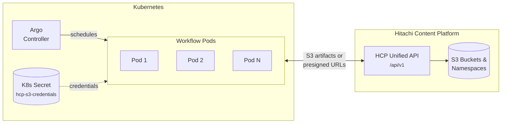
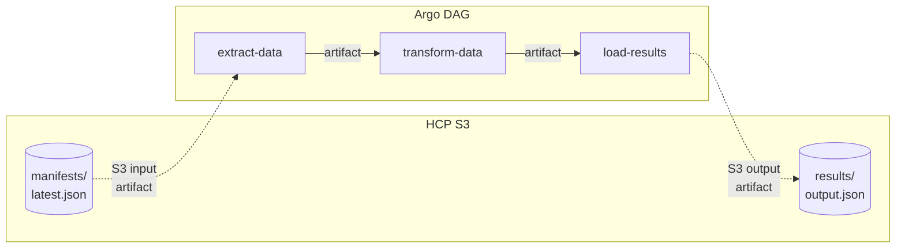
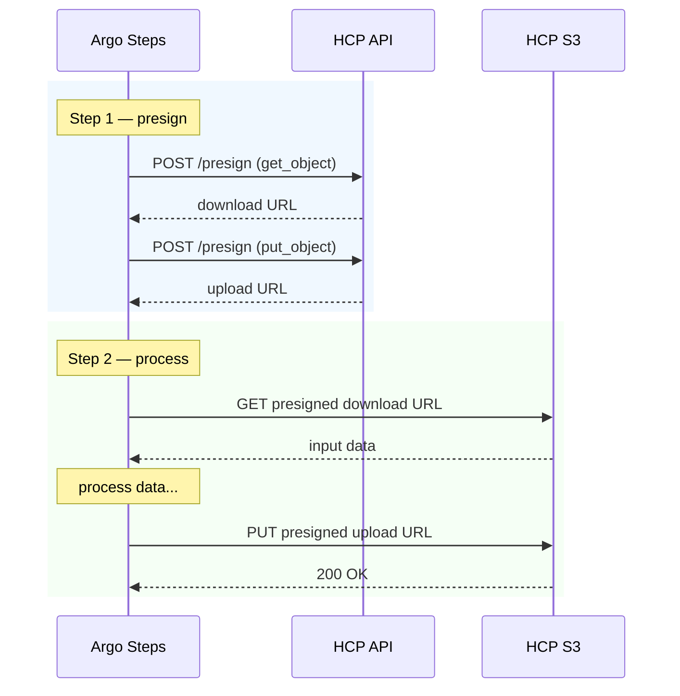
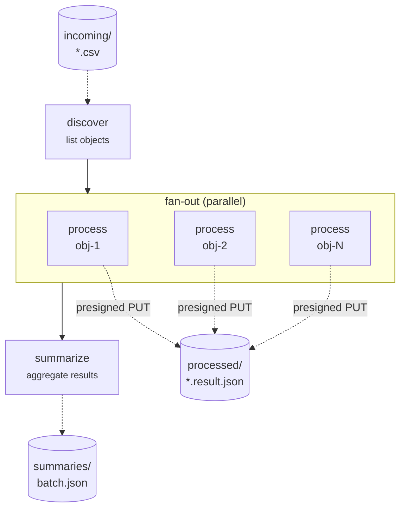
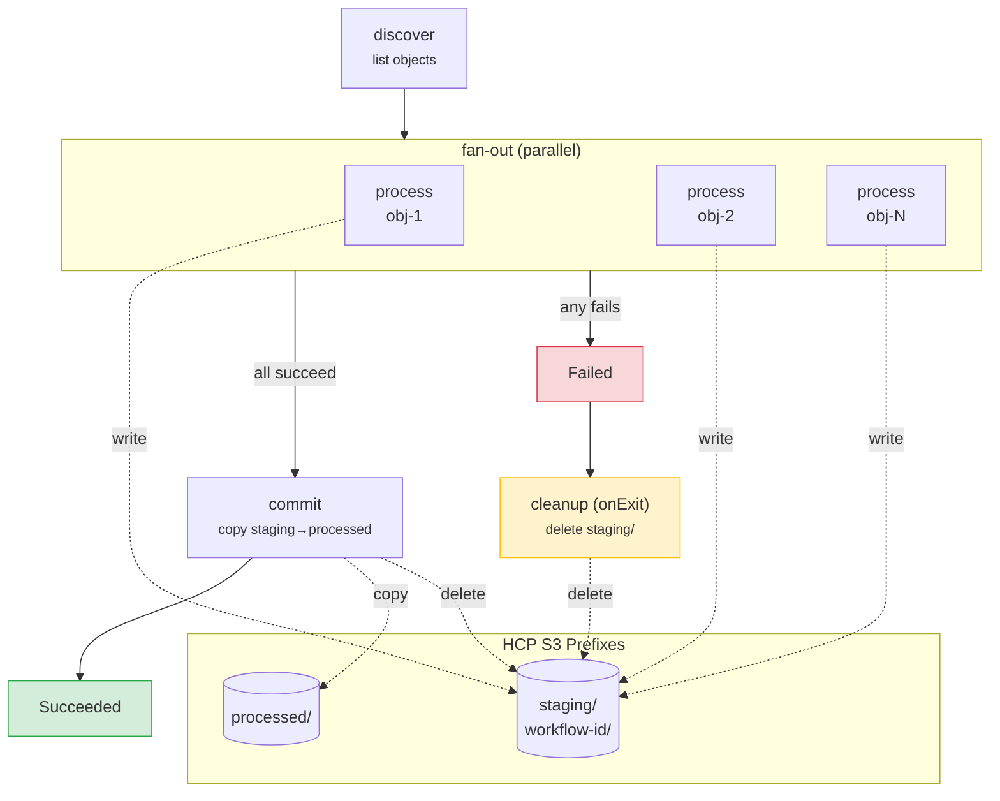

# Argo Workflows with HCP S3

[Argo Workflows](https://argoproj.github.io/workflows/) can use HCP as an S3-compatible artifact store. This enables pipelines to read input data from and write results back to HCP namespaces. The examples below show how to configure Argo to work with the HCP API's S3 credentials endpoint and presigned URLs.

All examples are provided in both **YAML** (native Argo manifests) and **[Hera](https://github.com/argoproj-labs/hera)** (Python SDK for Argo Workflows).



## Configuring HCP S3 credentials for Argo

First, retrieve the S3 credentials from the API and create a Kubernetes Secret that Argo can reference:

=== "curl"

    ```bash
    BASE="http://localhost:8000/api/v1"
    TOKEN="<your-token>"

    # Fetch S3 credentials from the HCP API
    CREDS=$(curl -s "$BASE/credentials" -H "Authorization: Bearer $TOKEN")

    ACCESS_KEY=$(echo "$CREDS" | jq -r .access_key_id)
    SECRET_KEY=$(echo "$CREDS" | jq -r .secret_access_key)
    ENDPOINT=$(echo "$CREDS" | jq -r .endpoint_url)

    # Create Kubernetes Secret for Argo
    kubectl create secret generic hcp-s3-credentials \
      --from-literal=accessKey="$ACCESS_KEY" \
      --from-literal=secretKey="$SECRET_KEY" \
      -n argo
    ```

=== "Python"

    ```python
    import httpx
    import subprocess

    BASE = "http://localhost:8000/api/v1"

    async def create_argo_s3_secret(token: str, namespace: str = "argo"):
        """Fetch HCP S3 credentials and create a Kubernetes Secret for Argo."""
        headers = {"Authorization": f"Bearer {token}"}

        async with httpx.AsyncClient(base_url=BASE, headers=headers) as c:
            resp = await c.get("/credentials")
            resp.raise_for_status()
            creds = resp.json()

        subprocess.run(
            [
                "kubectl", "create", "secret", "generic", "hcp-s3-credentials",
                f"--from-literal=accessKey={creds['access_key_id']}",
                f"--from-literal=secretKey={creds['secret_access_key']}",
                "-n", namespace,
                "--dry-run=client", "-o", "yaml",
            ],
            check=True,
        )
    ```

### Python container image

The Python-based Argo templates below use `httpx` for HTTP calls. Since `python:3.13-slim` does not include httpx, build a small custom image:

```dockerfile
FROM python:3.13-slim
RUN pip install --no-cache-dir httpx
```

```bash
docker build -t my-registry/python-httpx:3.13 .
docker push my-registry/python-httpx:3.13
```

All examples below reference this image as **`my-registry/python-httpx:3.13`** -- replace with your actual registry path.

### Installing Hera

[Hera](https://github.com/argoproj-labs/hera) lets you define Argo Workflows entirely in Python instead of YAML. Install it with:

```bash
uv add hera
```

---

## ETL pipeline with HCP S3 artifacts

A workflow that reads a dataset from HCP, processes it, and writes results back:



=== "YAML"

    ```yaml
    apiVersion: argoproj.io/v1alpha1
    kind: Workflow
    metadata:
      generateName: hcp-etl-
    spec:
      entrypoint: etl-pipeline
      activeDeadlineSeconds: 1800        # workflow-level timeout: 30 min
      artifactGC:
        strategy: OnWorkflowDeletion
      templates:
        - name: etl-pipeline
          dag:
            tasks:
              - name: extract
                template: extract-data
              - name: transform
                template: transform-data
                dependencies: [extract]
              - name: load
                template: load-results
                dependencies: [transform]

        - name: extract-data
          retryStrategy:
            limit: 3
            backoff:
              duration: "5s"
              factor: 2
              maxDuration: "1m"
          container:
            image: python:3.13-slim
            command: [python, -c]
            args:
              - |
                from pathlib import Path
                import json
                # Read the input artifact (mounted by Argo from HCP S3)
                data = json.loads(Path("/tmp/input/manifest.json").read_text())
                print(f"Loaded {len(data['files'])} files from manifest")
                # Write output for next step
                Path("/tmp/output/extracted.json").write_text(json.dumps(data))
          inputs:
            artifacts:
              - name: input-manifest
                path: /tmp/input/manifest.json
                s3:
                  endpoint: hcp-s3.example.com
                  bucket: datasets
                  key: manifests/latest.json
                  accessKeySecret:
                    name: hcp-s3-credentials
                    key: accessKey
                  secretKeySecret:
                    name: hcp-s3-credentials
                    key: secretKey
                  insecure: false
          outputs:
            artifacts:
              - name: extracted
                path: /tmp/output/extracted.json

        - name: transform-data
          retryStrategy:
            limit: 3
            backoff:
              duration: "5s"
              factor: 2
              maxDuration: "1m"
          container:
            image: python:3.13-slim
            command: [python, -c]
            args:
              - |
                from pathlib import Path
                import json
                data = json.loads(Path("/tmp/input/extracted.json").read_text())
                results = {"processed": len(data.get("files", [])), "status": "ok"}
                Path("/tmp/output/results.json").write_text(json.dumps(results))
          inputs:
            artifacts:
              - name: extracted
                path: /tmp/input/extracted.json
          outputs:
            artifacts:
              - name: results
                path: /tmp/output/results.json

        - name: load-results
          retryStrategy:
            limit: 3
            backoff:
              duration: "5s"
              factor: 2
              maxDuration: "1m"
          container:
            image: python:3.13-slim
            command: [python, -c]
            args:
              - |
                from pathlib import Path
                data = Path("/tmp/input/results.json").read_text()
                print(f"Results uploaded to HCP: {data}")
          inputs:
            artifacts:
              - name: results
                path: /tmp/input/results.json
          outputs:
            artifacts:
              - name: final-results
                path: /tmp/input/results.json
                s3:
                  endpoint: hcp-s3.example.com
                  bucket: results
                  key: "etl/{{workflow.name}}/results.json"
                  accessKeySecret:
                    name: hcp-s3-credentials
                    key: accessKey
                  secretKeySecret:
                    name: hcp-s3-credentials
                    key: secretKey
    ```

=== "Hera"

    ```python
    from hera.workflows import (
        DAG,
        Artifact,
        S3Artifact,
        Workflow,
        models as m,
        script,
    )

    HCP_S3 = m.S3Artifact(
        endpoint="hcp-s3.example.com",
        bucket="datasets",
        access_key_secret=m.SecretKeySelector(name="hcp-s3-credentials", key="accessKey"),
        secret_key_secret=m.SecretKeySelector(name="hcp-s3-credentials", key="secretKey"),
        insecure=False,
    )

    RETRY = m.RetryStrategy(
        limit="3",
        backoff=m.Backoff(duration="5s", factor=2, max_duration="1m"),
    )


    @script(image="python:3.13-slim", retry_strategy=RETRY)
    def extract_data(manifest: Artifact) -> Artifact:
        """Read input from HCP S3, write extracted data."""
        from pathlib import Path
        import json

        data = json.loads(Path("/tmp/input/manifest.json").read_text())
        print(f"Loaded {len(data['files'])} files from manifest")
        Path("/tmp/output/extracted.json").write_text(json.dumps(data))


    @script(image="python:3.13-slim", retry_strategy=RETRY)
    def transform_data(extracted: Artifact) -> Artifact:
        """Process the extracted data."""
        from pathlib import Path
        import json

        data = json.loads(Path("/tmp/input/extracted.json").read_text())
        results = {"processed": len(data.get("files", [])), "status": "ok"}
        Path("/tmp/output/results.json").write_text(json.dumps(results))


    @script(image="python:3.13-slim", retry_strategy=RETRY)
    def load_results(results: Artifact) -> Artifact:
        """Upload results back to HCP S3."""
        from pathlib import Path

        data = Path("/tmp/input/results.json").read_text()
        print(f"Results uploaded to HCP: {data}")


    with Workflow(
        generate_name="hcp-etl-",
        entrypoint="etl-pipeline",
        active_deadline_seconds=1800,
        artifact_gc=m.ArtifactGC(strategy="OnWorkflowDeletion"),
    ) as w:
        with DAG(name="etl-pipeline"):
            ext = extract_data(
                name="extract",
                arguments=[
                    S3Artifact(
                        name="manifest",
                        path="/tmp/input/manifest.json",
                        **HCP_S3.dict() | {"key": "manifests/latest.json"},
                    ),
                ],
            )
            trn = transform_data(
                name="transform",
                arguments=[ext.get_artifact("extracted").with_name("extracted")],
            )
            ld = load_results(
                name="load",
                arguments=[trn.get_artifact("results").with_name("results")],
            )
            ext >> trn >> ld

    w.create()  # submit to the Argo server
    ```

---

## Presigned URL pipeline

For cases where you cannot mount S3 credentials into every pod, use the HCP API to generate presigned URLs and pass them as parameters:



=== "YAML"

    ```yaml
    apiVersion: argoproj.io/v1alpha1
    kind: Workflow
    metadata:
      generateName: hcp-presign-
    spec:
      entrypoint: presigned-pipeline
      activeDeadlineSeconds: 900         # workflow-level timeout: 15 min
      arguments:
        parameters:
          - name: hcp-api-base
            value: "http://hcp-api.default.svc:8000/api/v1"
          - name: hcp-token
            value: "<your-token>"
          - name: bucket
            value: "datasets"
      templates:
        - name: presigned-pipeline
          steps:
            - - name: generate-urls
                template: presign
            - - name: process
                template: process-with-urls
                arguments:
                  parameters:
                    - name: download-url
                      value: "{{steps.generate-urls.outputs.parameters.download-url}}"
                    - name: upload-url
                      value: "{{steps.generate-urls.outputs.parameters.upload-url}}"

        - name: presign
          retryStrategy:
            limit: 3
            backoff:
              duration: "5s"
              factor: 2
          script:
            image: curlimages/curl:latest
            command: [sh]
            source: |
              BASE="{{workflow.parameters.hcp-api-base}}"
              TOKEN="{{workflow.parameters.hcp-token}}"
              BUCKET="{{workflow.parameters.bucket}}"

              # Get download URL for input
              DL=$(curl -s -X POST "$BASE/presign" \
                -H "Authorization: Bearer $TOKEN" \
                -H "Content-Type: application/json" \
                -d "{\"bucket\":\"$BUCKET\",\"key\":\"input/data.csv\",\"method\":\"get_object\",\"expires_in\":3600}")
              echo "$DL" | grep -o '"url":"[^"]*"' | cut -d'"' -f4 > /tmp/download-url

              # Get upload URL for output
              UL=$(curl -s -X POST "$BASE/presign" \
                -H "Authorization: Bearer $TOKEN" \
                -H "Content-Type: application/json" \
                -d "{\"bucket\":\"$BUCKET\",\"key\":\"output/result.csv\",\"method\":\"put_object\",\"expires_in\":3600}")
              echo "$UL" | grep -o '"url":"[^"]*"' | cut -d'"' -f4 > /tmp/upload-url
          outputs:
            parameters:
              - name: download-url
                valueFrom:
                  path: /tmp/download-url
              - name: upload-url
                valueFrom:
                  path: /tmp/upload-url

        - name: process-with-urls
          retryStrategy:
            limit: 2
            backoff:
              duration: "10s"
              factor: 2
          inputs:
            parameters:
              - name: download-url
              - name: upload-url
          script:
            image: my-registry/python-httpx:3.13
            command: [python]
            source: |
              import httpx
              from pathlib import Path

              # Download input via presigned URL (no credentials needed)
              resp = httpx.get("{{inputs.parameters.download-url}}")
              resp.raise_for_status()
              Path("/tmp/data.csv").write_bytes(resp.content)

              # Process...
              Path("/tmp/result.csv").write_text("processed,data\n")

              # Upload result via presigned URL
              data = Path("/tmp/result.csv").read_bytes()
              httpx.put("{{inputs.parameters.upload-url}}", content=data).raise_for_status()
              print("Done: input downloaded and result uploaded via presigned URLs")
    ```

=== "Hera"

    ```python
    from hera.workflows import (
        Parameter,
        Steps,
        Workflow,
        models as m,
        script,
    )

    HCP_BASE = "http://hcp-api.default.svc:8000/api/v1"

    RETRY = m.RetryStrategy(
        limit="3",
        backoff=m.Backoff(duration="5s", factor=2),
    )


    @script(image="my-registry/python-httpx:3.13", retry_strategy=RETRY)
    def generate_presigned_urls(
        hcp_api_base: str,
        hcp_token: str,
        bucket: str,
    ):
        """Generate download and upload presigned URLs from the HCP API."""
        import httpx
        from pathlib import Path

        headers = {"Authorization": f"Bearer {hcp_token}"}

        def presign(key: str, method: str) -> str:
            resp = httpx.post(
                f"{hcp_api_base}/presign",
                json={"bucket": bucket, "key": key, "method": method, "expires_in": 3600},
                headers=headers,
            )
            resp.raise_for_status()
            return resp.json()["url"]

        dl = presign("input/data.csv", "get_object")
        ul = presign("output/result.csv", "put_object")

        Path("/tmp/download-url").write_text(dl)
        Path("/tmp/upload-url").write_text(ul)


    @script(
        image="my-registry/python-httpx:3.13",
        retry_strategy=m.RetryStrategy(limit="2", backoff=m.Backoff(duration="10s", factor=2)),
    )
    def process_with_urls(download_url: str, upload_url: str):
        """Download input, process, and upload result via presigned URLs."""
        import httpx
        from pathlib import Path

        resp = httpx.get(download_url)
        resp.raise_for_status()
        Path("/tmp/data.csv").write_bytes(resp.content)

        Path("/tmp/result.csv").write_text("processed,data\n")

        data = Path("/tmp/result.csv").read_bytes()
        httpx.put(upload_url, content=data).raise_for_status()
        print("Done: input downloaded and result uploaded via presigned URLs")


    with Workflow(
        generate_name="hcp-presign-",
        entrypoint="presigned-pipeline",
        active_deadline_seconds=900,
        arguments=[
            Parameter(name="hcp-api-base", value=HCP_BASE),
            Parameter(name="hcp-token", value="<your-token>"),
            Parameter(name="bucket", value="datasets"),
        ],
    ) as w:
        with Steps(name="presigned-pipeline"):
            urls = generate_presigned_urls(
                name="generate-urls",
                arguments={
                    "hcp_api_base": "{{workflow.parameters.hcp-api-base}}",
                    "hcp_token": "{{workflow.parameters.hcp-token}}",
                    "bucket": "{{workflow.parameters.bucket}}",
                },
            )
            process_with_urls(
                name="process",
                arguments={
                    "download_url": urls.get_parameter("download-url"),
                    "upload_url": urls.get_parameter("upload-url"),
                },
            )

    w.create()
    ```

---

## Running Hera workflows

```bash
# Submit directly from a script
uv run --with hera python etl_workflow.py

# Or export to YAML and submit with Argo CLI
uv run --with hera python -c "
from etl_workflow import w
print(w.to_yaml())
" | argo submit -

# Useful during development: validate without submitting
uv run --with hera python -c "
from etl_workflow import w
print(w.to_yaml())
" | argo lint -
```

---

## Batch processing -- fan-out over HCP objects

A common pattern: list objects from an HCP bucket, process each one in parallel (fan-out), then aggregate results (fan-in).



=== "YAML"

    ```yaml
    apiVersion: argoproj.io/v1alpha1
    kind: Workflow
    metadata:
      generateName: hcp-batch-
    spec:
      entrypoint: batch-pipeline
      arguments:
        parameters:
          - name: hcp-api-base
            value: "http://hcp-api.default.svc:8000/api/v1"
          - name: hcp-token
            value: "<your-token>"
          - name: bucket
            value: "datasets"
          - name: prefix
            value: "incoming/"
      templates:
        # ── Orchestrator DAG ─────────────────────────────────────────
        - name: batch-pipeline
          dag:
            tasks:
              - name: discover
                template: list-objects
              - name: process
                template: fan-out
                dependencies: [discover]
                arguments:
                  parameters:
                    - name: object-keys
                      value: "{{tasks.discover.outputs.parameters.keys}}"
              - name: summarize
                template: aggregate
                dependencies: [process]

        # ── Step 1: List objects from HCP via the API ────────────────
        - name: list-objects
          retryStrategy:
            limit: 3
            backoff:
              duration: "5s"
              factor: 2
          script:
            image: curlimages/curl:latest
            command: [sh]
            source: |
              BASE="{{workflow.parameters.hcp-api-base}}"
              TOKEN="{{workflow.parameters.hcp-token}}"
              BUCKET="{{workflow.parameters.bucket}}"
              PREFIX="{{workflow.parameters.prefix}}"

              RESP=$(curl -s -f "$BASE/s3/buckets/$BUCKET/objects?prefix=$PREFIX&max_keys=100" \
                -H "Authorization: Bearer $TOKEN")

              # Extract object keys as a JSON array
              echo "$RESP" | jq '[.objects[].key]' > /tmp/keys.json
              echo "Found $(echo "$RESP" | jq '.objects | length') objects"
              cat /tmp/keys.json
          outputs:
            parameters:
              - name: keys
                valueFrom:
                  path: /tmp/keys.json

        # ── Step 2: Fan out — one pod per object ─────────────────────
        - name: fan-out
          inputs:
            parameters:
              - name: object-keys
          steps:
            - - name: process-object
                template: process-single
                arguments:
                  parameters:
                    - name: key
                      value: "{{item}}"
                withParam: "{{inputs.parameters.object-keys}}"

        - name: process-single
          retryStrategy:
            limit: 2
            backoff:
              duration: "10s"
              factor: 2
          inputs:
            parameters:
              - name: key
          script:
            image: my-registry/python-httpx:3.13
            command: [python]
            source: |
              import httpx, json, os
              from pathlib import Path

              BASE = "{{workflow.parameters.hcp-api-base}}"
              TOKEN = "{{workflow.parameters.hcp-token}}"
              BUCKET = "{{workflow.parameters.bucket}}"
              KEY = "{{inputs.parameters.key}}"
              headers = {"Authorization": f"Bearer {TOKEN}"}

              # Get a presigned download URL from the HCP API
              resp = httpx.post(
                  f"{BASE}/s3/presign",
                  json={"bucket": BUCKET, "key": KEY, "method": "get_object", "expires_in": 600},
                  headers=headers,
              )
              url = resp.json()["url"]

              # Download and process the object
              resp = httpx.get(url)
              resp.raise_for_status()
              Path("/tmp/data").write_bytes(resp.content)
              size = os.path.getsize("/tmp/data")
              result = {"key": KEY, "size": size, "status": "processed"}
              print(json.dumps(result))

              # Upload result back via presigned PUT
              result_key = KEY.replace("incoming/", "processed/") + ".result.json"
              resp = httpx.post(
                  f"{BASE}/s3/presign",
                  json={"bucket": BUCKET, "key": result_key, "method": "put_object", "expires_in": 600},
                  headers=headers,
              )
              upload_url = resp.json()["url"]
              httpx.put(upload_url, content=json.dumps(result).encode()).raise_for_status()
              print(f"Result uploaded to {result_key}")

        # ── Step 3: Fan in — aggregate results ───────────────────────
        - name: aggregate
          retryStrategy:
            limit: 2
          script:
            image: curlimages/curl:latest
            command: [sh]
            source: |
              BASE="{{workflow.parameters.hcp-api-base}}"
              TOKEN="{{workflow.parameters.hcp-token}}"
              BUCKET="{{workflow.parameters.bucket}}"

              # List all processed results
              RESULTS=$(curl -s -f "$BASE/s3/buckets/$BUCKET/objects?prefix=processed/&max_keys=1000" \
                -H "Authorization: Bearer $TOKEN")

              COUNT=$(echo "$RESULTS" | jq '.objects | length')
              SUMMARY="{\"workflow\":\"{{workflow.name}}\",\"objects_processed\":$COUNT,\"status\":\"complete\"}"
              echo "$SUMMARY"

              # Upload summary via presigned URL
              PRESIGN=$(curl -s -X POST "$BASE/s3/presign" \
                -H "Authorization: Bearer $TOKEN" \
                -H "Content-Type: application/json" \
                -d "{\"bucket\":\"$BUCKET\",\"key\":\"summaries/{{workflow.name}}.json\",\"method\":\"put_object\",\"expires_in\":600}")
              UPLOAD_URL=$(echo "$PRESIGN" | jq -r '.url')
              curl -s -X PUT "$UPLOAD_URL" -d "$SUMMARY"
              echo "Summary uploaded"
    ```

=== "Hera"

    ```python
    from hera.workflows import (
        DAG,
        Parameter,
        Steps,
        Workflow,
        models as m,
        script,
    )

    HCP_BASE = "http://hcp-api.default.svc:8000/api/v1"

    RETRY = m.RetryStrategy(
        limit="3",
        backoff=m.Backoff(duration="5s", factor=2),
    )


    @script(image="my-registry/python-httpx:3.13", retry_strategy=RETRY)
    def list_objects(hcp_api_base: str, hcp_token: str, bucket: str, prefix: str):
        """List objects from HCP and output their keys as a JSON array."""
        import httpx, json
        from pathlib import Path

        resp = httpx.get(
            f"{hcp_api_base}/s3/buckets/{bucket}/objects",
            params={"prefix": prefix, "max_keys": 100},
            headers={"Authorization": f"Bearer {hcp_token}"},
        )
        resp.raise_for_status()
        keys = [obj["key"] for obj in resp.json()["objects"]]
        print(f"Found {len(keys)} objects")
        Path("/tmp/keys.json").write_text(json.dumps(keys))


    @script(
        image="my-registry/python-httpx:3.13",
        retry_strategy=m.RetryStrategy(limit="2", backoff=m.Backoff(duration="10s", factor=2)),
    )
    def process_single(hcp_api_base: str, hcp_token: str, bucket: str, key: str):
        """Download an object via presigned URL, process it, upload the result."""
        import httpx, json, os
        from pathlib import Path

        headers = {"Authorization": f"Bearer {hcp_token}"}

        # Presign download
        resp = httpx.post(
            f"{hcp_api_base}/s3/presign",
            json={"bucket": bucket, "key": key, "method": "get_object", "expires_in": 600},
            headers=headers,
        )
        url = resp.json()["url"]

        # Download and process
        resp = httpx.get(url)
        resp.raise_for_status()
        Path("/tmp/data").write_bytes(resp.content)
        size = os.path.getsize("/tmp/data")
        result = {"key": key, "size": size, "status": "processed"}
        print(json.dumps(result))

        # Presign upload and write result
        result_key = key.replace("incoming/", "processed/") + ".result.json"
        resp = httpx.post(
            f"{hcp_api_base}/s3/presign",
            json={"bucket": bucket, "key": result_key, "method": "put_object", "expires_in": 600},
            headers=headers,
        )
        upload_url = resp.json()["url"]
        httpx.put(upload_url, content=json.dumps(result).encode()).raise_for_status()
        print(f"Result uploaded to {result_key}")


    @script(image="my-registry/python-httpx:3.13", retry_strategy=RETRY)
    def aggregate(hcp_api_base: str, hcp_token: str, bucket: str):
        """List processed results and upload a summary."""
        import httpx, json

        headers = {"Authorization": f"Bearer {hcp_token}"}

        resp = httpx.get(
            f"{hcp_api_base}/s3/buckets/{bucket}/objects",
            params={"prefix": "processed/", "max_keys": 1000},
            headers=headers,
        )
        resp.raise_for_status()
        count = len(resp.json()["objects"])
        summary = json.dumps({"objects_processed": count, "status": "complete"})
        print(summary)

        # Upload summary via presigned URL
        resp = httpx.post(
            f"{hcp_api_base}/s3/presign",
            json={"bucket": bucket, "key": "summaries/batch-result.json", "method": "put_object", "expires_in": 600},
            headers=headers,
        )
        upload_url = resp.json()["url"]
        httpx.put(upload_url, content=summary.encode()).raise_for_status()


    WF_PARAMS = {
        "hcp_api_base": "{{workflow.parameters.hcp-api-base}}",
        "hcp_token": "{{workflow.parameters.hcp-token}}",
        "bucket": "{{workflow.parameters.bucket}}",
    }

    with Workflow(
        generate_name="hcp-batch-",
        entrypoint="batch-pipeline",
        arguments=[
            Parameter(name="hcp-api-base", value=HCP_BASE),
            Parameter(name="hcp-token", value="<your-token>"),
            Parameter(name="bucket", value="datasets"),
            Parameter(name="prefix", value="incoming/"),
        ],
    ) as w:
        with DAG(name="batch-pipeline"):
            # Step 1: Discover objects
            disc = list_objects(
                name="discover",
                arguments={**WF_PARAMS, "prefix": "{{workflow.parameters.prefix}}"},
            )
            # Step 2: Fan out — process each object in parallel
            with Steps(name="fan-out") as fan:
                process_single(
                    name="process-object",
                    arguments={
                        **WF_PARAMS,
                        "key": "{{item}}",
                    },
                    with_param=disc.get_parameter("keys"),
                )
            # Step 3: Aggregate results
            agg = aggregate(name="summarize", arguments=WF_PARAMS)

            disc >> fan >> agg

    w.create()
    ```

!!! tip "Which approach to use?"
    - **S3 artifacts** (YAML or Hera DAG): Best when Argo has direct network access to HCP S3. Argo handles download/upload automatically. Requires the S3 credentials Secret.
    - **Presigned URLs** (YAML or Hera Steps): Best when pods cannot reach HCP directly or you want to avoid distributing S3 credentials. The HCP API generates short-lived URLs that anyone can use.
    - **Batch fan-out**: Use `withParam` (YAML) or `with_param` (Hera) to process N objects in parallel. Argo handles scheduling and concurrency limits.
    - **YAML vs Hera**: Use YAML for simple workflows or when non-Python teams maintain them. Use Hera when you want type safety, IDE autocompletion, and Python-native DAG composition (`>>` operator).

---

## Error handling for batch workflows

The batch fan-out above processes objects independently, but what happens when some pods fail? Without cleanup, partial results pollute the output prefix. This section adds an **exit handler** that cleans up on failure, plus a **staged-commit** pattern so partial results are never visible to downstream consumers.



=== "YAML"

    ```yaml
    apiVersion: argoproj.io/v1alpha1
    kind: Workflow
    metadata:
      generateName: hcp-batch-safe-
    spec:
      entrypoint: batch-pipeline
      activeDeadlineSeconds: 3600       # hard limit: 1 hour
      onExit: cleanup                   # always runs, even on failure
      arguments:
        parameters:
          - name: hcp-api-base
            value: "http://hcp-api.default.svc:8000/api/v1"
          - name: hcp-token
            value: "<your-token>"
          - name: bucket
            value: "datasets"
          - name: prefix
            value: "incoming/"
      templates:
        # ── Orchestrator ─────────────────────────────────────────────
        - name: batch-pipeline
          dag:
            tasks:
              - name: discover
                template: list-objects
              - name: process
                template: fan-out
                dependencies: [discover]
                arguments:
                  parameters:
                    - name: object-keys
                      value: "{{tasks.discover.outputs.parameters.keys}}"
              - name: commit
                template: commit-results
                dependencies: [process]

        # ── List objects ─────────────────────────────────────────────
        - name: list-objects
          retryStrategy:
            limit: 3
            backoff:
              duration: "5s"
              factor: 2
          script:
            image: curlimages/curl:latest
            command: [sh]
            source: |
              BASE="{{workflow.parameters.hcp-api-base}}"
              TOKEN="{{workflow.parameters.hcp-token}}"
              BUCKET="{{workflow.parameters.bucket}}"
              PREFIX="{{workflow.parameters.prefix}}"

              RESP=$(curl -s -f "$BASE/s3/buckets/$BUCKET/objects?prefix=$PREFIX&max_keys=100" \
                -H "Authorization: Bearer $TOKEN")
              echo "$RESP" | jq '[.objects[].key]' > /tmp/keys.json
              echo "Found $(echo "$RESP" | jq '.objects | length') objects"
          outputs:
            parameters:
              - name: keys
                valueFrom:
                  path: /tmp/keys.json

        # ── Fan out — write to staging prefix ────────────────────────
        - name: fan-out
          inputs:
            parameters:
              - name: object-keys
          steps:
            - - name: process-object
                template: process-single
                arguments:
                  parameters:
                    - name: key
                      value: "{{item}}"
                withParam: "{{inputs.parameters.object-keys}}"

        - name: process-single
          retryStrategy:
            limit: 2
            retryPolicy: Always        # retry on OOM kills and node failures too
            backoff:
              duration: "10s"
              factor: 2
              maxDuration: "2m"
          activeDeadlineSeconds: 300    # per-pod timeout: 5 min
          inputs:
            parameters:
              - name: key
          script:
            image: my-registry/python-httpx:3.13
            command: [python]
            source: |
              import httpx, json, os
              from pathlib import Path

              BASE = "{{workflow.parameters.hcp-api-base}}"
              TOKEN = "{{workflow.parameters.hcp-token}}"
              BUCKET = "{{workflow.parameters.bucket}}"
              KEY = "{{inputs.parameters.key}}"
              WF = "{{workflow.name}}"
              headers = {"Authorization": f"Bearer {TOKEN}"}

              # Download via presigned URL
              resp = httpx.post(
                  f"{BASE}/s3/presign",
                  json={"bucket": BUCKET, "key": KEY, "method": "get_object", "expires_in": 600},
                  headers=headers,
              )
              resp.raise_for_status()
              data = httpx.get(resp.json()["url"])
              data.raise_for_status()
              Path("/tmp/data").write_bytes(data.content)

              # Process (placeholder)
              size = os.path.getsize("/tmp/data")
              result = json.dumps({"key": KEY, "size": size, "status": "processed"})

              # Write to STAGING prefix — not visible to consumers yet
              staging_key = f"staging/{WF}/{KEY.split('/')[-1]}.result.json"
              resp = httpx.post(
                  f"{BASE}/s3/presign",
                  json={"bucket": BUCKET, "key": staging_key, "method": "put_object", "expires_in": 600},
                  headers=headers,
              )
              resp.raise_for_status()
              httpx.put(resp.json()["url"], content=result.encode()).raise_for_status()
              print(f"Staged: {staging_key}")

        # ── Commit — copy staging → final prefix ─────────────────────
        - name: commit-results
          retryStrategy:
            limit: 2
          script:
            image: my-registry/python-httpx:3.13
            command: [python]
            source: |
              import httpx, json

              BASE = "{{workflow.parameters.hcp-api-base}}"
              TOKEN = "{{workflow.parameters.hcp-token}}"
              BUCKET = "{{workflow.parameters.bucket}}"
              WF = "{{workflow.name}}"
              headers = {"Authorization": f"Bearer {TOKEN}"}

              # List all staged results for this workflow run
              resp = httpx.get(
                  f"{BASE}/s3/buckets/{BUCKET}/objects",
                  params={"prefix": f"staging/{WF}/", "max_keys": 1000},
                  headers=headers,
              )
              resp.raise_for_status()
              staged = resp.json()["objects"]
              print(f"Committing {len(staged)} results...")

              # Copy each from staging/ → processed/
              for obj in staged:
                  src = obj["key"]
                  dest = src.replace(f"staging/{WF}/", "processed/")
                  resp = httpx.post(
                      f"{BASE}/s3/buckets/{BUCKET}/objects/{dest}/copy",
                      json={"source_bucket": BUCKET, "source_key": src},
                      headers=headers,
                  )
                  resp.raise_for_status()

              # Delete staging prefix
              keys = [obj["key"] for obj in staged]
              httpx.post(
                  f"{BASE}/s3/buckets/{BUCKET}/objects/delete",
                  json={"keys": keys},
                  headers=headers,
              ).raise_for_status()
              print(f"Committed {len(staged)} results, staging cleaned up")

        # ── Exit handler — clean up staging on failure ────────────────
        - name: cleanup
          script:
            image: curlimages/curl:latest
            command: [sh]
            source: |
              BASE="{{workflow.parameters.hcp-api-base}}"
              TOKEN="{{workflow.parameters.hcp-token}}"
              BUCKET="{{workflow.parameters.bucket}}"
              WF="{{workflow.name}}"
              STATUS="{{workflow.status}}"

              if [ "$STATUS" != "Succeeded" ]; then
                echo "Workflow $STATUS — deleting staging prefix staging/$WF/..."
                # List staged objects
                KEYS=$(curl -s -f "$BASE/s3/buckets/$BUCKET/objects?prefix=staging/$WF/&max_keys=1000" \
                  -H "Authorization: Bearer $TOKEN" | jq '[.objects[].key]')

                if [ "$(echo "$KEYS" | jq 'length')" -gt 0 ]; then
                  curl -s -X POST "$BASE/s3/buckets/$BUCKET/objects/delete" \
                    -H "Authorization: Bearer $TOKEN" \
                    -H "Content-Type: application/json" \
                    -d "{\"keys\": $KEYS}" || true
                  echo "Staging cleaned up"
                else
                  echo "No staged objects to clean up"
                fi
              else
                echo "Workflow succeeded — no cleanup needed"
              fi
    ```

=== "Hera"

    ```python
    from hera.workflows import (
        DAG,
        Parameter,
        Steps,
        Workflow,
        models as m,
        script,
    )

    HCP_BASE = "http://hcp-api.default.svc:8000/api/v1"
    PYTHON_IMAGE = "my-registry/python-httpx:3.13"

    RETRY = m.RetryStrategy(
        limit="3",
        backoff=m.Backoff(duration="5s", factor=2),
    )
    RETRY_POD = m.RetryStrategy(
        limit="2",
        retry_policy="Always",
        backoff=m.Backoff(duration="10s", factor=2, max_duration="2m"),
    )


    @script(image=PYTHON_IMAGE, retry_strategy=RETRY)
    def list_objects(hcp_api_base: str, hcp_token: str, bucket: str, prefix: str):
        """List objects and output keys as JSON array."""
        import httpx, json
        from pathlib import Path

        resp = httpx.get(
            f"{hcp_api_base}/s3/buckets/{bucket}/objects",
            params={"prefix": prefix, "max_keys": 100},
            headers={"Authorization": f"Bearer {hcp_token}"},
        )
        resp.raise_for_status()
        keys = [obj["key"] for obj in resp.json()["objects"]]
        print(f"Found {len(keys)} objects")
        Path("/tmp/keys.json").write_text(json.dumps(keys))


    @script(image=PYTHON_IMAGE, retry_strategy=RETRY_POD, active_deadline_seconds=300)
    def process_single(
        hcp_api_base: str, hcp_token: str, bucket: str, key: str, workflow_name: str,
    ):
        """Download, process, and write result to staging prefix."""
        import httpx, json, os
        from pathlib import Path

        headers = {"Authorization": f"Bearer {hcp_token}"}

        # Download via presigned URL
        resp = httpx.post(
            f"{hcp_api_base}/s3/presign",
            json={"bucket": bucket, "key": key, "method": "get_object", "expires_in": 600},
            headers=headers,
        )
        resp.raise_for_status()
        data = httpx.get(resp.json()["url"])
        data.raise_for_status()
        Path("/tmp/data").write_bytes(data.content)

        # Process
        size = os.path.getsize("/tmp/data")
        result = json.dumps({"key": key, "size": size, "status": "processed"})

        # Write to staging prefix (not visible to consumers)
        staging_key = f"staging/{workflow_name}/{key.split('/')[-1]}.result.json"
        resp = httpx.post(
            f"{hcp_api_base}/s3/presign",
            json={"bucket": bucket, "key": staging_key, "method": "put_object", "expires_in": 600},
            headers=headers,
        )
        resp.raise_for_status()
        httpx.put(resp.json()["url"], content=result.encode()).raise_for_status()
        print(f"Staged: {staging_key}")


    @script(image=PYTHON_IMAGE, retry_strategy=m.RetryStrategy(limit="2"))
    def commit_results(hcp_api_base: str, hcp_token: str, bucket: str, workflow_name: str):
        """Copy staging → processed, then delete staging."""
        import httpx

        headers = {"Authorization": f"Bearer {hcp_token}"}

        # List staged results
        resp = httpx.get(
            f"{hcp_api_base}/s3/buckets/{bucket}/objects",
            params={"prefix": f"staging/{workflow_name}/", "max_keys": 1000},
            headers=headers,
        )
        resp.raise_for_status()
        staged = resp.json()["objects"]
        print(f"Committing {len(staged)} results...")

        # Copy each to final prefix
        for obj in staged:
            src = obj["key"]
            dest = src.replace(f"staging/{workflow_name}/", "processed/")
            httpx.post(
                f"{hcp_api_base}/s3/buckets/{bucket}/objects/{dest}/copy",
                json={"source_bucket": bucket, "source_key": src},
                headers=headers,
            ).raise_for_status()

        # Delete staging
        keys = [obj["key"] for obj in staged]
        httpx.post(
            f"{hcp_api_base}/s3/buckets/{bucket}/objects/delete",
            json={"keys": keys},
            headers=headers,
        ).raise_for_status()
        print(f"Committed {len(staged)} results, staging cleaned up")


    @script(image=PYTHON_IMAGE)
    def cleanup(hcp_api_base: str, hcp_token: str, bucket: str, workflow_name: str):
        """Exit handler: delete staging prefix on failure."""
        import httpx, os

        status = os.environ.get("ARGO_WORKFLOW_STATUS", "Unknown")
        if status != "Succeeded":
            print(f"Workflow {status} — cleaning up staging/{workflow_name}/...")
            headers = {"Authorization": f"Bearer {hcp_token}"}
            resp = httpx.get(
                f"{hcp_api_base}/s3/buckets/{bucket}/objects",
                params={"prefix": f"staging/{workflow_name}/", "max_keys": 1000},
                headers=headers,
            )
            if resp.status_code == 200:
                keys = [obj["key"] for obj in resp.json().get("objects", [])]
                if keys:
                    httpx.post(
                        f"{hcp_api_base}/s3/buckets/{bucket}/objects/delete",
                        json={"keys": keys},
                        headers=headers,
                    )
                    print(f"Deleted {len(keys)} staged objects")
            else:
                print("Could not list staged objects — manual cleanup may be needed")
        else:
            print("Workflow succeeded — no cleanup needed")


    WF_PARAMS = {
        "hcp_api_base": "{{workflow.parameters.hcp-api-base}}",
        "hcp_token": "{{workflow.parameters.hcp-token}}",
        "bucket": "{{workflow.parameters.bucket}}",
    }

    with Workflow(
        generate_name="hcp-batch-safe-",
        entrypoint="batch-pipeline",
        active_deadline_seconds=3600,
        on_exit="cleanup",
        arguments=[
            Parameter(name="hcp-api-base", value=HCP_BASE),
            Parameter(name="hcp-token", value="<your-token>"),
            Parameter(name="bucket", value="datasets"),
            Parameter(name="prefix", value="incoming/"),
        ],
    ) as w:
        with DAG(name="batch-pipeline"):
            disc = list_objects(
                name="discover",
                arguments={**WF_PARAMS, "prefix": "{{workflow.parameters.prefix}}"},
            )
            with Steps(name="fan-out") as fan:
                process_single(
                    name="process-object",
                    arguments={
                        **WF_PARAMS,
                        "key": "{{item}}",
                        "workflow_name": "{{workflow.name}}",
                    },
                    with_param=disc.get_parameter("keys"),
                )
            com = commit_results(
                name="commit",
                arguments={**WF_PARAMS, "workflow_name": "{{workflow.name}}"},
            )
            disc >> fan >> com

        # Exit handler (registered by name)
        cleanup(
            name="cleanup",
            arguments={**WF_PARAMS, "workflow_name": "{{workflow.name}}"},
        )

    w.create()
    ```

The key patterns in this workflow:

1. **Staged writes** -- fan-out pods write to `staging/{{workflow.name}}/` instead of the final `processed/` prefix. Downstream consumers never see partial results.
2. **Commit step** -- only runs if ALL fan-out pods succeed. Copies staging to final, then deletes staging.
3. **Exit handler (`onExit: cleanup`)** -- guaranteed to run on failure. Deletes the staging prefix so no orphaned objects remain.
4. **Per-pod retries** -- `retryPolicy: Always` retries on OOM kills and node evictions (not just script errors). `activeDeadlineSeconds: 300` prevents hung pods.
5. **Workflow timeout** -- `activeDeadlineSeconds: 3600` ensures the entire workflow fails rather than running forever.

---

## Related pages

- [API Workflows](workflows.md) -- curl and Python examples for authentication, S3 operations, tenant/namespace management, and more.
- [Error Handling](error-handling.md) -- Retries, exit handlers, ACID patterns, and Argo-native retry/timeout configuration.
