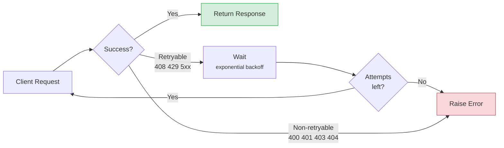
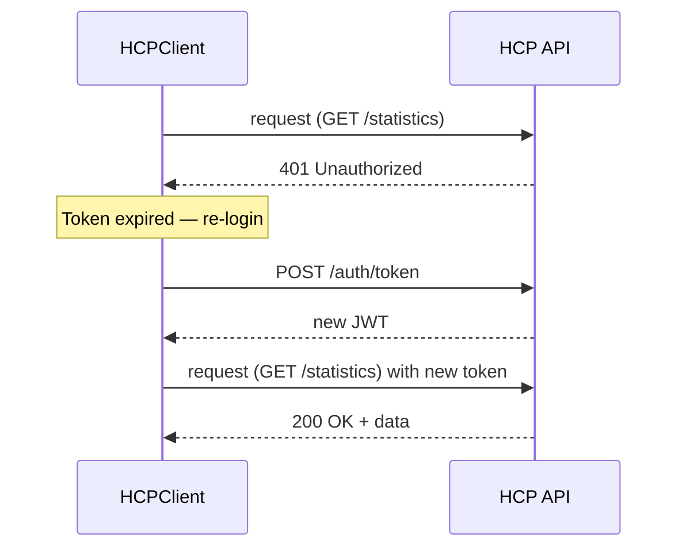
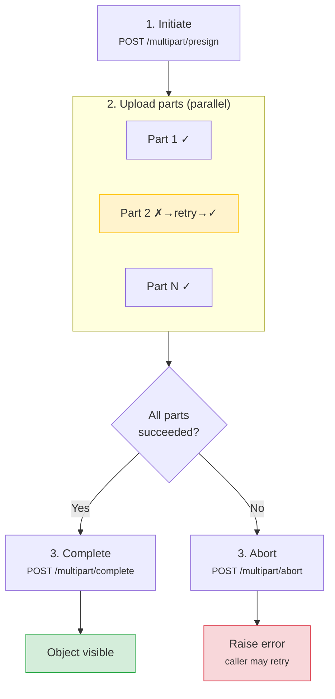
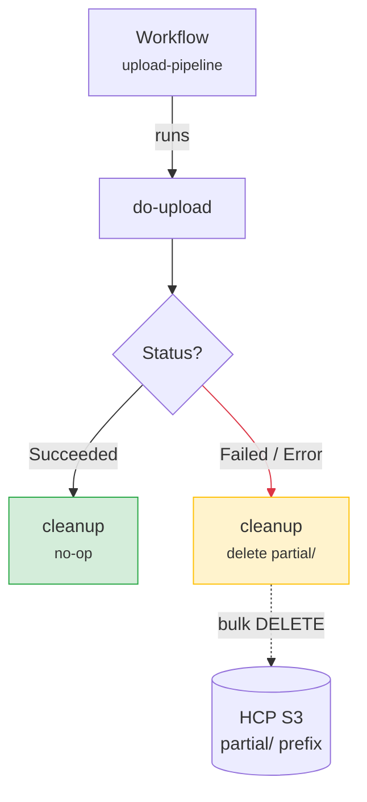
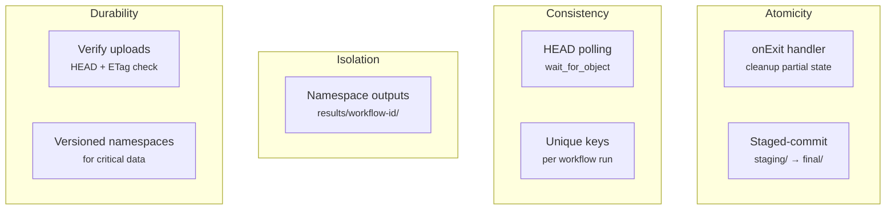
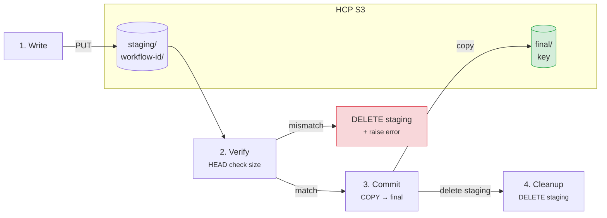

# Error Handling, Retries, and Idempotency

Production scripts need to handle transient failures, token expiry, and partial-success scenarios. HCP's S3 layer is **eventually consistent** for certain operations -- the patterns below help build resilient automation.

!!! tip "The rahcp SDK handles most of this automatically"
    The [Python SDK](../sdk/index.md) includes built-in retries with exponential backoff, automatic token refresh on 401, presigned URL error safety, and the staged-commit pattern as `commit_staging()` / `cleanup_staging()`. The patterns below are for raw `httpx`/`curl` usage or when you need custom error handling beyond what the SDK provides.



## Retry with exponential backoff

```python
import asyncio
import httpx
from collections.abc import Callable
from typing import Any

RETRYABLE_STATUS = {408, 429, 500, 502, 503, 504}

async def retry(
    fn: Callable[..., Any],
    *args: Any,
    max_attempts: int = 4,
    base_delay: float = 1.0,
    **kwargs: Any,
) -> Any:
    """Retry an async function with exponential backoff.

    Retries on network errors and retryable HTTP status codes.
    """
    last_exc: Exception | None = None
    for attempt in range(max_attempts):
        try:
            return await fn(*args, **kwargs)
        except httpx.HTTPStatusError as exc:
            if exc.response.status_code not in RETRYABLE_STATUS:
                raise  # 400, 401, 403, 404, 409 -- don't retry
            last_exc = exc
        except (httpx.ConnectError, httpx.ReadTimeout, httpx.WriteTimeout) as exc:
            last_exc = exc

        delay = base_delay * (2 ** attempt)
        print(f"  Attempt {attempt + 1} failed, retrying in {delay:.1f}s...")
        await asyncio.sleep(delay)

    raise RuntimeError(f"All {max_attempts} attempts failed") from last_exc
```

---

## Auto-refreshing auth wrapper



```python
import httpx
from dataclasses import dataclass, field

BASE = "http://localhost:8000/api/v1"

@dataclass
class HCPClient:
    """HTTP client that re-authenticates on 401."""

    username: str
    password: str
    tenant: str | None = None
    _token: str = field(default="", init=False, repr=False)
    _client: httpx.AsyncClient = field(init=False, repr=False)

    async def __aenter__(self):
        self._client = httpx.AsyncClient(base_url=BASE, timeout=30.0)
        await self._login()
        return self

    async def __aexit__(self, *exc: object):
        await self._client.aclose()

    async def _login(self):
        data: dict[str, str] = {
            "username": self.username,
            "password": self.password,
        }
        if self.tenant:
            data["tenant"] = self.tenant
        resp = await self._client.post("/auth/token", data=data)
        resp.raise_for_status()
        self._token = resp.json()["access_token"]
        self._client.headers["Authorization"] = f"Bearer {self._token}"

    async def request(self, method: str, url: str, **kwargs) -> httpx.Response:
        """Make a request, re-authenticate once on 401."""
        resp = await self._client.request(method, url, **kwargs)
        if resp.status_code == 401:
            await self._login()
            resp = await self._client.request(method, url, **kwargs)
        return resp
```

Usage:

```python
async def main():
    async with HCPClient("<username>", "<password>", tenant="<tenant>") as hcp:
        resp = await hcp.request("GET", "/mapi/tenants/<tenant>/statistics")
        print(resp.json())
```

---

## curl error handling

```bash
# Reusable function with status-code checking
hcp_request() {
  local METHOD="$1" URL="$2"; shift 2
  local RESP
  RESP=$(curl -s -w "\n%{http_code}" -X "$METHOD" "$URL" \
    -H "Authorization: Bearer $TOKEN" "$@")
  local BODY=$(echo "$RESP" | sed '$d')
  local CODE=$(echo "$RESP" | tail -1)

  case "$CODE" in
    2[0-9][0-9]) echo "$BODY" | jq . ;;
    401) echo "ERROR: Token expired -- re-authenticate" >&2; return 1 ;;
    404) echo "ERROR: Not found -- $URL" >&2; return 1 ;;
    409) echo "ERROR: Conflict -- resource already exists" >&2; return 1 ;;
    429|5[0-9][0-9])
      echo "WARN: Retryable error $CODE, waiting 5s..." >&2
      sleep 5
      hcp_request "$METHOD" "$URL" "$@"  # retry once
      ;;
    *) echo "ERROR $CODE: $BODY" >&2; return 1 ;;
  esac
}

# Usage
hcp_request GET "$BASE/mapi/tenants/$TENANT/statistics"
hcp_request PUT "$BASE/mapi/tenants/$TENANT/namespaces" \
  -H "Content-Type: application/json" \
  -d '{"name": "test-ns", "hardQuota": "10 GB"}'
```

---

## Idempotent operations

Many HCP API operations are naturally idempotent. Knowing which ones are safe to retry avoids duplicate side-effects:

| Operation | Idempotent? | Notes |
|-----------|:-----------:|-------|
| `GET` / `HEAD` any endpoint | Yes | Read-only, always safe to retry |
| `PUT` create tenant/namespace | Yes | Returns `409 Conflict` if already exists -- check and continue |
| `PUT` create user | Yes | Same -- `409` means user already exists |
| `POST` upload object (same key) | Yes | Overwrites existing object with same key |
| `DELETE` object/user/namespace | Yes | Second delete returns `404` -- treat as success |
| `POST` update settings | Yes | Applies the same state, no cumulative effect |
| `POST` change password | **No** | Repeated calls succeed but generate audit events |
| `PUT` multipart presign | **No** | Each call creates a new upload ID |

---

## Safe "create-if-not-exists" pattern

=== "Python"

    ```python
    import httpx

    async def ensure_namespace(
        client: httpx.AsyncClient,
        tenant: str,
        name: str,
        hard_quota: str = "100 GB",
    ) -> dict:
        """Create a namespace, or return the existing one."""
        # Try to create
        resp = await client.put(
            f"/mapi/tenants/{tenant}/namespaces",
            json={"name": name, "hardQuota": hard_quota},
        )
        match resp.status_code:
            case 201 | 200:
                print(f"Created namespace '{name}'")
                return resp.json()
            case 409:
                # Already exists -- fetch and return it
                resp = await client.get(
                    f"/mapi/tenants/{tenant}/namespaces/{name}",
                    params={"verbose": True},
                )
                resp.raise_for_status()
                print(f"Namespace '{name}' already exists")
                return resp.json()
            case _:
                resp.raise_for_status()  # raises for unexpected errors
                return {}  # unreachable, satisfies type checker
    ```

=== "curl"

    ```bash
    # Bash equivalent -- create-if-not-exists
    CODE=$(curl -s -o /dev/null -w "%{http_code}" -X PUT \
      "$BASE/mapi/tenants/$TENANT/namespaces" \
      -H "$AUTH" -H "Content-Type: application/json" \
      -d "{\"name\": \"$NS\", \"hardQuota\": \"100 GB\"}")

    if [ "$CODE" = "201" ] || [ "$CODE" = "200" ]; then
      echo "Created namespace $NS"
    elif [ "$CODE" = "409" ]; then
      echo "Namespace $NS already exists (OK)"
    else
      echo "Failed to create namespace: HTTP $CODE" >&2
      exit 1
    fi
    ```

---

## Multipart upload with fault tolerance

Presigned multipart upload can resume after partial failures. If some parts fail, re-upload only the missing ones:



```python
import asyncio
import httpx
from pathlib import Path

BASE = "http://localhost:8000/api/v1"

async def resilient_multipart_upload(
    token: str,
    bucket: str,
    key: str,
    file_path: str,
    concurrency: int = 6,
    part_retries: int = 3,
):
    """Multipart upload that retries individual failed parts."""
    headers = {"Authorization": f"Bearer {token}"}
    path = Path(file_path)
    file_size = path.stat().st_size

    # 1. Initiate
    async with httpx.AsyncClient(base_url=BASE, headers=headers) as c:
        resp = await c.post(
            f"/buckets/{bucket}/multipart/{key}/presign",
            json={"file_size": file_size},
        )
        resp.raise_for_status()
        presign = resp.json()

    upload_id = presign["upload_id"]
    part_size = presign["part_size"]
    data = path.read_bytes()
    semaphore = asyncio.Semaphore(concurrency)
    completed: dict[int, dict] = {}
    failed: list[int] = []

    async def upload_part(part_info: dict) -> None:
        pn = part_info["part_number"]
        url = part_info["url"]
        start = (pn - 1) * part_size
        end = min(start + part_size, file_size)
        chunk = data[start:end]

        async with semaphore:
            for attempt in range(part_retries):
                try:
                    async with httpx.AsyncClient(timeout=120.0) as hcp:
                        resp = await hcp.put(url, content=chunk)
                        resp.raise_for_status()
                        completed[pn] = {
                            "PartNumber": pn,
                            "ETag": resp.headers["etag"],
                        }
                        print(f"  Part {pn}/{len(presign['urls'])} OK")
                        return
                except (httpx.HTTPError, httpx.StreamError):
                    delay = 2.0 ** attempt
                    print(f"  Part {pn} attempt {attempt + 1} failed, retry in {delay}s")
                    await asyncio.sleep(delay)
            failed.append(pn)

    # 2. Upload all parts with per-part retries
    await asyncio.gather(*[upload_part(u) for u in presign["urls"]])

    if failed:
        # Abort the upload -- caller can retry the whole thing
        async with httpx.AsyncClient(base_url=BASE, headers=headers) as c:
            await c.post(
                f"/buckets/{bucket}/multipart/{key}/abort",
                json={"upload_id": upload_id},
            )
        raise RuntimeError(f"Parts {failed} failed after {part_retries} retries each")

    # 3. Complete
    parts = sorted(completed.values(), key=lambda p: p["PartNumber"])
    async with httpx.AsyncClient(base_url=BASE, headers=headers) as c:
        resp = await c.post(
            f"/buckets/{bucket}/multipart/{key}/complete",
            json={"upload_id": upload_id, "parts": parts},
        )
        resp.raise_for_status()
        print("Upload complete:", resp.json())
```

---

## Consistency considerations

HCP follows S3 semantics for consistency:

| Operation | Consistency |
|-----------|-------------|
| `PUT` new object | **Read-after-write** -- immediately visible |
| `PUT` overwrite existing object | **Eventually consistent** -- stale reads possible briefly |
| `DELETE` object | **Eventually consistent** -- object may still appear in listings briefly |
| `LIST` objects | **Eventually consistent** -- recently added/deleted objects may not appear immediately |
| MAPI `PUT`/`POST` create/update | **Strongly consistent** -- change visible on next read |

!!! tip "Eventual consistency workaround"
    If your script writes an object and then immediately reads it back (e.g., to verify a checksum), add a brief delay or use a `HEAD` request with retries:

    ```python
    import asyncio
    import httpx

    async def wait_for_object(
        client: httpx.AsyncClient,
        bucket: str,
        key: str,
        max_wait: float = 10.0,
    ) -> bool:
        """Poll until an object is visible after upload."""
        elapsed = 0.0
        delay = 0.5
        while elapsed < max_wait:
            resp = await client.head(f"/buckets/{bucket}/objects/{key}")
            if resp.status_code == 200:
                return True
            await asyncio.sleep(delay)
            elapsed += delay
            delay = min(delay * 2, 2.0)
        return False
    ```

---

## Argo-native retries and timeouts

Argo Workflows has built-in retry and timeout support at the template level. Use these **in addition to** application-level retries -- Argo retries restart the entire pod, which handles OOM kills, node evictions, and infrastructure failures that application code cannot catch.

=== "YAML"

    ```yaml
    templates:
      - name: process-data
        retryStrategy:
          limit: 3                    # max 3 retries (4 total attempts)
          retryPolicy: Always         # retry on both errors and node failures
          backoff:
            duration: "10s"           # initial delay
            factor: 2                 # exponential: 10s, 20s, 40s
            maxDuration: "2m"         # cap at 2 minutes
        activeDeadlineSeconds: 600    # hard timeout: kill pod after 10 min
        container:
          image: python:3.13-slim
          command: [python, -c]
          args:
            - |
              # your processing code here
              print("processing...")
    ```

=== "Hera"

    ```python
    from hera.workflows import models as m, script

    @script(
        image="python:3.13-slim",
        retry_strategy=m.RetryStrategy(
            limit="3",
            retry_policy="Always",
            backoff=m.Backoff(duration="10s", factor=2, max_duration="2m"),
        ),
        active_deadline_seconds=600,
    )
    def process_data():
        """Processing with Argo-managed retries and timeout."""
        print("processing...")
    ```

---

## Cleanup on failure -- exit handlers

Use Argo exit handlers to guarantee cleanup runs regardless of workflow success or failure. This is essential for aborting in-progress multipart uploads, deleting partial results, or releasing resources.



=== "YAML"

    ```yaml
    apiVersion: argoproj.io/v1alpha1
    kind: Workflow
    metadata:
      generateName: hcp-safe-upload-
    spec:
      entrypoint: upload-pipeline
      onExit: cleanup                    # always runs, even on failure
      arguments:
        parameters:
          - name: hcp-api-base
            value: "http://hcp-api.default.svc:8000/api/v1"
          - name: hcp-token
            value: "<your-token>"
          - name: bucket
            value: "datasets"
      templates:
        - name: upload-pipeline
          steps:
            - - name: upload
                template: do-upload

        - name: do-upload
          retryStrategy:
            limit: 2
          script:
            image: python:3.13-slim
            command: [python]
            source: |
              # ... upload logic ...
              print("uploading data")

        # ── Guaranteed cleanup ──────────────────────────────────────
        - name: cleanup
          script:
            image: curlimages/curl:latest
            command: [sh]
            source: |
              BASE="{{workflow.parameters.hcp-api-base}}"
              TOKEN="{{workflow.parameters.hcp-token}}"
              BUCKET="{{workflow.parameters.bucket}}"
              STATUS="{{workflow.status}}"    # Succeeded / Failed / Error

              if [ "$STATUS" != "Succeeded" ]; then
                echo "Workflow $STATUS -- cleaning up partial uploads..."

                # Abort any in-progress multipart uploads
                # Delete partial results to avoid polluting the bucket
                curl -s -X POST "$BASE/buckets/$BUCKET/objects/delete" \
                  -H "Authorization: Bearer $TOKEN" \
                  -H "Content-Type: application/json" \
                  -d "{\"keys\": [\"partial/{{workflow.name}}/\"]}" || true

                echo "Cleanup complete"
              else
                echo "Workflow succeeded -- no cleanup needed"
              fi
    ```

=== "Hera"

    ```python
    from hera.workflows import DAG, Parameter, Steps, Workflow, models as m, script

    HCP_BASE = "http://hcp-api.default.svc:8000/api/v1"


    @script(image="python:3.13-slim", retry_strategy=m.RetryStrategy(limit="2"))
    def do_upload(hcp_api_base: str, hcp_token: str, bucket: str):
        """Upload data to HCP."""
        print("uploading data")


    @script(image="curlimages/curl:latest")
    def cleanup(hcp_api_base: str, hcp_token: str, bucket: str):
        """Clean up partial uploads on failure. Runs as onExit handler."""
        import subprocess, os

        status = os.environ.get("ARGO_WORKFLOW_STATUS", "Unknown")
        if status != "Succeeded":
            print(f"Workflow {status} -- cleaning up...")
            subprocess.run(
                [
                    "curl", "-s", "-X", "POST",
                    f"{hcp_api_base}/buckets/{bucket}/objects/delete",
                    "-H", f"Authorization: Bearer {hcp_token}",
                    "-H", "Content-Type: application/json",
                    "-d", '{"keys": ["partial/"]}',
                ],
                check=False,  # don't fail cleanup on errors
            )
            print("Cleanup complete")
        else:
            print("Workflow succeeded -- no cleanup needed")


    with Workflow(
        generate_name="hcp-safe-upload-",
        entrypoint="upload-pipeline",
        on_exit="cleanup",
        arguments=[
            Parameter(name="hcp-api-base", value=HCP_BASE),
            Parameter(name="hcp-token", value="<your-token>"),
            Parameter(name="bucket", value="datasets"),
        ],
    ) as w:
        with Steps(name="upload-pipeline"):
            do_upload(
                name="upload",
                arguments={
                    "hcp_api_base": "{{workflow.parameters.hcp-api-base}}",
                    "hcp_token": "{{workflow.parameters.hcp-token}}",
                    "bucket": "{{workflow.parameters.bucket}}",
                },
            )

        # Exit handler template (registered by name via on_exit="cleanup")
        cleanup(
            name="cleanup",
            arguments={
                "hcp_api_base": "{{workflow.parameters.hcp-api-base}}",
                "hcp_token": "{{workflow.parameters.hcp-token}}",
                "bucket": "{{workflow.parameters.bucket}}",
            },
        )

    w.create()
    ```

---

## ACID-like guarantees for workflows

Object storage is not a relational database -- there are no transactions. But you can approximate ACID properties through careful workflow design:



| Property | S3/HCP reality | How to achieve it |
|----------|---------------|-------------------|
| **Atomicity** | Individual PUTs are atomic, but a multi-object "transaction" is not. | Use exit handlers (`onExit`) to clean up partial state on failure. Write to a staging prefix first, then "commit" by copying to the final location. |
| **Consistency** | New PUTs are read-after-write consistent. Overwrites and deletes are eventually consistent. | Use `HEAD` polling after writes ([`wait_for_object`](#consistency-considerations) above). Use unique keys per workflow run (`{{workflow.name}}`) to avoid overwrites. |
| **Isolation** | No locking — concurrent writers to the same key cause last-write-wins. | Namespace outputs by workflow run ID: `results/{{workflow.name}}/output.json`. Never write to a shared key from parallel pods. |
| **Durability** | S3 objects are durable once the PUT succeeds (HCP replicates across nodes). | Verify uploads with a `HEAD` request checking `Content-Length` and `ETag`. For critical data, use versioning-enabled namespaces. |

### Staged-commit pattern

Write results to a temporary prefix, verify them, then "commit" by copying to the final location. On failure, the exit handler deletes the staging prefix.

!!! tip "Use the rahcp SDK"
    The SDK handles the staged-commit pattern in two method calls:
    ```python
    async with HCPClient.from_env() as client:
        # Write files to staging/...
        for f in files:
            await client.s3.upload("bucket", f"staging/batch-1/{f.name}", f)
        # Commit: copy staging → final, delete staging
        count = await client.s3.commit_staging("bucket", "staging/batch-1/", "final/batch-1/")
        # On failure: await client.s3.cleanup_staging("bucket", "staging/batch-1/")
    ```



=== "Python"

    ```python
    import httpx

    BASE = "http://localhost:8000/api/v1"

    async def staged_upload(
        token: str,
        bucket: str,
        final_key: str,
        data: bytes,
        workflow_id: str,
    ):
        """Upload to a staging key, verify, then copy to the final location."""
        headers = {"Authorization": f"Bearer {token}"}
        staging_key = f"staging/{workflow_id}/{final_key}"

        async with httpx.AsyncClient(base_url=BASE, headers=headers, timeout=60.0) as c:
            # 1. Write to staging
            resp = await c.put(
                f"/buckets/{bucket}/objects/{staging_key}",
                content=data,
            )
            resp.raise_for_status()

            # 2. Verify — HEAD to confirm size
            resp = await c.head(f"/buckets/{bucket}/objects/{staging_key}")
            resp.raise_for_status()
            actual_size = int(resp.headers.get("content-length", 0))
            if actual_size != len(data):
                # Mismatch — delete staging and raise
                await c.delete(f"/buckets/{bucket}/objects/{staging_key}")
                raise RuntimeError(
                    f"Size mismatch: expected {len(data)}, got {actual_size}"
                )

            # 3. Commit — copy from staging to final
            resp = await c.post(
                f"/buckets/{bucket}/objects/{final_key}/copy",
                json={"source_bucket": bucket, "source_key": staging_key},
            )
            resp.raise_for_status()

            # 4. Clean up staging
            await c.delete(f"/buckets/{bucket}/objects/{staging_key}")

            print(f"Committed {final_key} ({actual_size} bytes)")
    ```

=== "curl"

    ```bash
    # Bash equivalent — staged commit
    STAGING_KEY="staging/$(uuidgen)/$FINAL_KEY"

    # 1. Write to staging
    curl -s -X PUT "$BASE/buckets/$BUCKET/objects/$STAGING_KEY" \
      -H "$AUTH" --data-binary @"$LOCAL_FILE"

    # 2. Verify
    SIZE=$(curl -s -I "$BASE/buckets/$BUCKET/objects/$STAGING_KEY" \
      -H "$AUTH" | grep -i content-length | awk '{print $2}' | tr -d '\r')
    EXPECTED=$(stat -f%z "$LOCAL_FILE")
    if [ "$SIZE" != "$EXPECTED" ]; then
      echo "ERROR: Size mismatch ($SIZE != $EXPECTED)" >&2
      curl -s -X DELETE "$BASE/buckets/$BUCKET/objects/$STAGING_KEY" -H "$AUTH"
      exit 1
    fi

    # 3. Commit — copy to final location
    curl -s -X POST "$BASE/buckets/$BUCKET/objects/$FINAL_KEY/copy" \
      -H "$AUTH" -H "Content-Type: application/json" \
      -d "{\"source_bucket\": \"$BUCKET\", \"source_key\": \"$STAGING_KEY\"}"

    # 4. Clean up staging
    curl -s -X DELETE "$BASE/buckets/$BUCKET/objects/$STAGING_KEY" -H "$AUTH"

    echo "Committed $FINAL_KEY"
    ```

=== "rahcp SDK"

    ```python
    from rahcp_client import HCPClient
    from pathlib import Path

    async def staged_upload_sdk(
        bucket: str,
        local_dir: Path,
        staging_prefix: str,
        final_prefix: str,
    ):
        """Upload files to staging, then commit to final — or clean up on failure."""
        async with HCPClient.from_env() as client:
            try:
                # 1. Write all files to staging
                for f in local_dir.rglob("*"):
                    if f.is_file():
                        key = f"{staging_prefix}{f.relative_to(local_dir)}"
                        await client.s3.upload(bucket, key, f)

                # 2. Commit: copy staging → final, delete staging
                count = await client.s3.commit_staging(bucket, staging_prefix, final_prefix)
                print(f"Committed {count} files to {final_prefix}")

            except Exception:
                # 3. Rollback: delete staging prefix
                deleted = await client.s3.cleanup_staging(bucket, staging_prefix)
                print(f"Rolled back {deleted} staged files")
                raise
    ```

!!! warning "Multipart uploads are not atomic"
    A multipart upload is only visible after `CompleteMultipartUpload`. If the workflow fails between uploading parts and completing, the parts remain as invisible orphans consuming storage. Always use exit handlers to call `AbortMultipartUpload` on failure, and consider enabling `artifactGC` on the workflow to clean up Argo-managed artifacts.

---

## Related pages

- [Python SDK](../sdk/index.md) -- `rahcp-client` with built-in retries, presigned URLs, staged-commit, and multipart uploads.
- [API Workflows](workflows.md) -- curl and Python examples for authentication, S3 operations, tenant/namespace management, and more.
- [Argo Workflows](argo.md) -- ETL pipelines, presigned URL workflows, and batch fan-out/fan-in with YAML and Hera.
