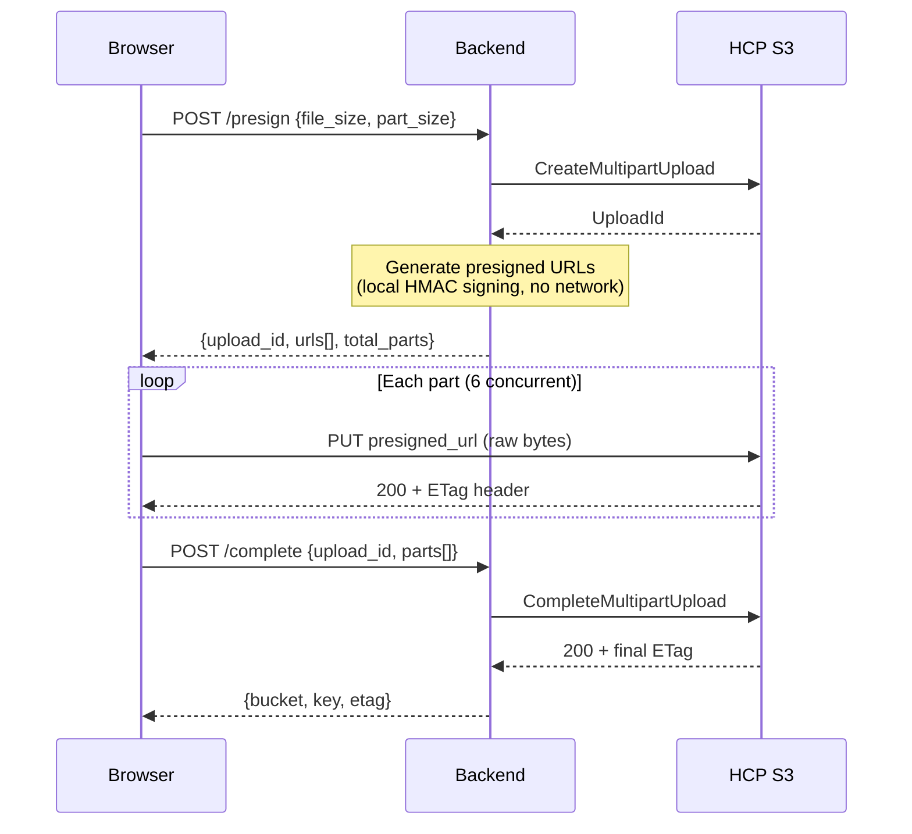

# S3 Objects API

Manage objects within S3-compatible buckets. All endpoints require JWT authentication.

**Base path:** `/api/v1/buckets/{bucket}/objects`

!!! tip "rahcp SDK and CLI"
    ```python
    # Upload (auto presigned, auto multipart for large files)
    await client.s3.upload("bucket", "key", Path("file.bin"))
    # Download
    await client.s3.download("bucket", "key", Path("output.bin"))
    ```
    ```bash
    # CLI — single file or entire directory
    rahcp s3 upload my-bucket data/file.bin ./file.bin
    rahcp s3 upload-all my-bucket ./local-dir
    rahcp s3 download my-bucket data/file.bin -o ./file.bin
    rahcp s3 download-all my-bucket -o ./local-backup
    ```
    See the [Python SDK](../sdk/index.md) for full documentation.

!!! tip "Full schema details"
    See the auto-generated [S3 Schema Reference](reference/s3.md) for exact field types and defaults, or the [Swagger UI](/docs#/S3%20Objects) for try-it-out.

---

## Single-Object Endpoints

These endpoints operate on individual objects using the object key as a path parameter.

| Method | Path | Description |
|--------|------|-------------|
| `POST` | `.../objects/{key}` | Upload an object |
| `GET` | `.../objects/{key}` | Download an object |
| `HEAD` | `.../objects/{key}` | Get object metadata |
| `DELETE` | `.../objects/{key}` | Delete an object |
| `POST` | `.../objects/{key}/copy` | Copy an object |
| `GET` | `.../objects/{key}/acl` | Get object ACL |
| `PUT` | `.../objects/{key}/acl` | Set object ACL |

!!! info "Path parameter"
    The `{key}` parameter supports full paths (e.g., `folder/subfolder/file.txt`). It captures everything after `/objects/`.

---

### Upload object

```
POST /api/v1/buckets/{bucket}/objects/{key}
```

Upload a file as a multipart form. The object key is specified in the URL path.

**Request body:** Multipart form data with a `file` field.

**Response:** `UploadObjectResponse` — `{ bucket, key, status }`

---

### Download object

```
GET /api/v1/buckets/{bucket}/objects/{key}
```

Returns the object content as a streaming response with appropriate `Content-Type` and `Content-Disposition` headers.

**Query parameters:**

| Parameter | Type | Default | Description |
|-----------|------|---------|-------------|
| `version_id` | string | | Download a specific version of the object |

---

### Get object metadata

```
HEAD /api/v1/buckets/{bucket}/objects/{key}
```

**Response:** `HeadObjectResponse`

| Field | Type | Description |
|-------|------|-------------|
| `content_length` | integer | File size in bytes |
| `content_type` | string | MIME type |
| `etag` | string | Entity tag (hash) |
| `last_modified` | string | Last modification timestamp |

---

### Delete object

```
DELETE /api/v1/buckets/{bucket}/objects/{key}
```

**Query parameters:**

| Parameter | Type | Default | Description |
|-----------|------|---------|-------------|
| `version_id` | string | | Delete a specific version permanently (bypasses delete markers) |

**Response:** `ObjectMutationResponse` — `{ status, bucket, key }`

---

### Copy object

```
POST /api/v1/buckets/{bucket}/objects/{key}/copy
```

Copy an object from a source location to this destination key.

**Request body:**

| Field | Type | Required | Description |
|-------|------|----------|-------------|
| `source_bucket` | string | Yes | Source bucket name |
| `source_key` | string | Yes | Source object key |

**Response:** `ObjectMutationResponse`

---

### Get object ACL

```
GET /api/v1/buckets/{bucket}/objects/{key}/acl
```

**Response:** `AclResponse` — `{ owner, grants }`

---

### Set object ACL

```
PUT /api/v1/buckets/{bucket}/objects/{key}/acl
```

**Request body:** `AclPolicy` — `{ Owner, Grants }`

**Response:** `StatusResponse`

---

## Bulk Endpoints

These endpoints operate on multiple objects at once.

| Method | Path | Description |
|--------|------|-------------|
| `GET` | `.../objects` | List objects in a bucket |
| `POST` | `.../objects/delete` | Bulk delete objects |
| `POST` | `.../objects/download` | Bulk download as ZIP |
| `POST` | `.../objects/presign` | Bulk presigned URLs |

---

### List objects

```
GET /api/v1/buckets/{bucket}/objects
```

**Query parameters:**

| Parameter | Type | Default | Description |
|-----------|------|---------|-------------|
| `prefix` | string | | Filter objects by key prefix |
| `max_keys` | integer | 1000 | Maximum number of keys to return |
| `continuation_token` | string | | Token for paginating results |
| `delimiter` | string | | Group keys by delimiter (e.g., `/` for directory listing) |

**Response:** `ListObjectsResponse`

| Field | Type | Description |
|-------|------|-------------|
| `objects` | array | List of objects (`key`, `size`, `last_modified`, `etag`, `storage_class`, `owner`) |
| `common_prefixes` | array | Grouped prefixes when using delimiter |
| `is_truncated` | boolean | Whether there are more results |
| `next_continuation_token` | string | Token for the next page |
| `key_count` | integer | Number of keys returned |

---

### Bulk delete

```
POST /api/v1/buckets/{bucket}/objects/delete
```

**Request body:**

| Field | Type | Required | Description |
|-------|------|----------|-------------|
| `keys` | array | Yes | List of object keys to delete |

**Response:** `DeleteObjectsResponse` — `{ status, deleted, errors }`

---

### Bulk download (ZIP)

```
POST /api/v1/buckets/{bucket}/objects/download
```

Downloads multiple objects as a single ZIP archive (streaming response).

**Request body:**

| Field | Type | Required | Description |
|-------|------|----------|-------------|
| `keys` | array | Yes | List of object keys to include |

---

### Bulk presigned URLs

```
POST /api/v1/buckets/{bucket}/objects/presign
```

Generate presigned URLs for multiple objects.

**Request body:**

| Field | Type | Required | Description |
|-------|------|----------|-------------|
| `keys` | array | Yes | List of object keys |
| `expires_in` | integer | No | URL expiration in seconds (default: 3600) |

**Response:** `BulkPresignResponse` — `{ urls: [{ key, url }], expires_in }`

---

## Object Versions

Browse version history for objects in versioning-enabled buckets.

| Method | Path | Description |
|--------|------|-------------|
| `GET` | `.../versions` | List all object versions in a bucket |

---

### List object versions

```
GET /api/v1/buckets/{bucket}/versions
```

Returns all object versions and delete markers for the bucket.

**Query parameters:**

| Parameter | Type | Default | Description |
|-----------|------|---------|-------------|
| `prefix` | string | | Filter versions by key prefix |
| `max_keys` | integer | 1000 | Maximum number of entries to return |
| `key_marker` | string | | Start listing after this key (pagination) |
| `version_id_marker` | string | | Start listing after this version ID (pagination) |

**Response:** `ListObjectVersionsResponse`

| Field | Type | Description |
|-------|------|-------------|
| `versions` | array | Version entries (`Key`, `VersionId`, `IsLatest`, `LastModified`, `ETag`, `Size`, `StorageClass`) |
| `delete_markers` | array | Delete marker entries (`Key`, `VersionId`, `IsLatest`, `LastModified`) |
| `is_truncated` | boolean | Whether there are more results |
| `next_key_marker` | string | Key marker for the next page |
| `next_version_id_marker` | string | Version ID marker for the next page |
| `key_count` | integer | Total entries returned |

!!! tip "Version-aware operations"
    Use the `version_id` query parameter on the [Download](#download-object) and [Delete](#delete-object) endpoints to target a specific version. Deleting a specific version permanently removes it (no delete marker). Deleting a delete marker restores the object.

---

## Multipart Upload

Upload large files in parts. The frontend automatically uses **presigned multipart upload** for files >= 100 MB — the browser uploads parts directly to HCP/S3 via presigned URLs, bypassing the backend for data transfer.

**Base path:** `/api/v1/buckets/{bucket}/multipart`

| Method | Path | Description |
|--------|------|-------------|
| `POST` | `.../multipart/{key}/presign` | Generate presigned URLs for direct upload |
| `POST` | `.../multipart/{key}` | Initiate a multipart upload (proxied) |
| `PUT` | `.../multipart/{key}` | Upload a part (proxied) |
| `POST` | `.../multipart/{key}/complete` | Complete the upload |
| `POST` | `.../multipart/{key}/abort` | Abort the upload |
| `GET` | `.../multipart/{key}/parts` | List uploaded parts |

---

### Presigned multipart upload (recommended)

```
POST /api/v1/buckets/{bucket}/multipart/{key}/presign
```

Creates a multipart upload and returns presigned URLs for each part. The browser uploads parts directly to HCP/S3, bypassing the backend for data transfer. This is the recommended approach for large files.

**Request body:**

| Field | Type | Required | Default | Description |
|-------|------|----------|---------|-------------|
| `file_size` | integer | Yes | | Total file size in bytes (must be > 0) |
| `part_size` | integer | No | 25 MB | Part size in bytes (min 5 MB, max 5 GB) |
| `expires_in` | integer | No | 3600 | URL expiration in seconds (min 60, max 12h) |

**Response:** `PresignedMultipartResponse`

| Field | Type | Description |
|-------|------|-------------|
| `bucket` | string | Bucket name |
| `key` | string | Object key |
| `upload_id` | string | Upload ID for complete/abort |
| `part_size` | integer | Part size used |
| `total_parts` | integer | Number of parts |
| `urls` | array | List of `{ part_number, url }` presigned URLs |
| `expires_in` | integer | URL expiration in seconds |

**Errors:**

- `400` — Too many parts (file_size / part_size > 10,000)
- `422` — Invalid file_size or part_size

!!! warning "CORS required"
    Presigned multipart uploads require CORS configuration on the HCP namespace. See [CORS Configuration for Presigned Uploads](#cors-configuration-for-presigned-uploads) below.

**Flow:**



1. Client calls this endpoint → gets `upload_id` + presigned URLs
2. Client PUTs raw bytes directly to each presigned URL (no FormData, no backend proxy)
3. Client reads `ETag` from each response header
4. Client calls [Complete](#complete-multipart-upload) with the collected `{ PartNumber, ETag }` pairs

---

### Initiate multipart upload (proxied)

```
POST /api/v1/buckets/{bucket}/multipart/{key}
```

Returns an upload ID to use for subsequent proxied part uploads. For new integrations, prefer the [presigned approach](#presigned-multipart-upload-recommended) instead.

**Response:** `CreateMultipartUploadResponse` (201 Created)

| Field | Type | Description |
|-------|------|-------------|
| `bucket` | string | Bucket name |
| `key` | string | Object key |
| `upload_id` | string | Upload ID for subsequent operations |

---

### Upload part

```
PUT /api/v1/buckets/{bucket}/multipart/{key}
```

Upload a single part of a multipart upload.

**Query parameters:**

| Parameter | Type | Required | Description |
|-----------|------|----------|-------------|
| `upload_id` | string | Yes | Upload ID from initiate |
| `part_number` | integer | Yes | Part number (1-10000) |

**Request body:** Binary file data (multipart form with `file` field)

**Response:** `UploadPartResponse`

| Field | Type | Description |
|-------|------|-------------|
| `PartNumber` | integer | Part number |
| `ETag` | string | Part ETag (needed for completion) |

---

### Complete multipart upload

```
POST /api/v1/buckets/{bucket}/multipart/{key}/complete
```

Assemble all uploaded parts into the final object.

**Request body:**

| Field | Type | Required | Description |
|-------|------|----------|-------------|
| `upload_id` | string | Yes | Upload ID from initiate |
| `parts` | array | Yes | List of `{ PartNumber, ETag }` for each part |

**Response:** `CompleteMultipartUploadResponse` — `{ bucket, key, etag }`

---

### Abort multipart upload

```
POST /api/v1/buckets/{bucket}/multipart/{key}/abort
```

Abort an in-progress upload and discard all uploaded parts.

**Request body:**

| Field | Type | Required | Description |
|-------|------|----------|-------------|
| `upload_id` | string | Yes | Upload ID to abort |

**Response:** `StatusResponse` — `{ status: "aborted" }`

---

### List uploaded parts

```
GET /api/v1/buckets/{bucket}/multipart/{key}/parts
```

**Query parameters:**

| Parameter | Type | Default | Description |
|-----------|------|---------|-------------|
| `upload_id` | string | (required) | Upload ID |
| `max_parts` | integer | 1000 | Maximum parts to return |

**Response:** `ListPartsResponse`

| Field | Type | Description |
|-------|------|-------------|
| `bucket` | string | Bucket name |
| `key` | string | Object key |
| `upload_id` | string | Upload ID |
| `parts` | array | List of parts (`PartNumber`, `Size`, `ETag`, `LastModified`) |
| `is_truncated` | boolean | Whether there are more parts |

---

## S3 Credentials & Presigned URLs

These endpoints are at the API root level (not scoped to a bucket).

| Method | Path | Description |
|--------|------|-------------|
| `POST` | `/api/v1/presign` | Generate a presigned URL |
| `GET` | `/api/v1/credentials` | Get S3 credentials |

### Generate presigned URL

```
POST /api/v1/presign
```

**Request body:**

| Field | Type | Required | Description |
|-------|------|----------|-------------|
| `bucket` | string | Yes | Bucket name |
| `key` | string | Yes | Object key |
| `expires_in` | integer | No | Expiration in seconds |
| `method` | string | Yes | `get_object` or `put_object` |

**Response:** `PresignedUrlResponse` — `{ url, bucket, key, expires_in, method }`

### Get S3 credentials

```
GET /api/v1/credentials
```

**Response:** `S3CredentialsResponse`

| Field | Type | Description |
|-------|------|-------------|
| `access_key_id` | string | S3 access key (base64-encoded HCP username) |
| `secret_access_key` | string | S3 secret key (MD5-hashed HCP password) |
| `username` | string | HCP username |
| `tenant` | string | Tenant name |
| `endpoint_url` | string | S3 endpoint URL |

---

## CORS Configuration for Presigned Uploads

Presigned multipart uploads send `PUT` requests directly from the browser to the HCP S3 endpoint. For this to work, the target HCP namespace must have CORS configured to:

1. Allow `PUT` requests from your frontend origin
2. Expose the `ETag` response header (needed to complete the upload)

### Required CORS configuration

Set this on the **namespace-level** CORS settings (or tenant-level as a default):

```xml
<CORSConfiguration>
  <CORSRule>
    <AllowedOrigin>https://your-frontend-domain.com</AllowedOrigin>
    <AllowedMethod>GET</AllowedMethod>
    <AllowedMethod>PUT</AllowedMethod>
    <AllowedHeader>*</AllowedHeader>
    <ExposeHeader>ETag</ExposeHeader>
  </CORSRule>
</CORSConfiguration>
```

!!! danger "Without CORS"
    If CORS is not configured, presigned uploads will fail with a browser network error. The `ETag` header will be invisible to JavaScript, causing the complete step to fail. Both the **Namespace CORS** and **Tenant Settings CORS** pages in the UI include guidance on the required settings.

### What each setting does

| Setting | Why it's needed |
|---------|----------------|
| `AllowedOrigin` | Permits cross-origin requests from your frontend to the HCP S3 endpoint |
| `AllowedMethod: PUT` | Allows the browser to send `PUT` requests for part uploads |
| `AllowedHeader: *` | Allows any request headers (content-type, etc.) |
| `ExposeHeader: ETag` | Makes the `ETag` response header readable by JavaScript — required for `complete_multipart_upload` |

---

## Code Examples

```bash
# List objects with prefix
curl -s "http://localhost:8000/api/v1/buckets/my-bucket/objects?prefix=documents/&max_keys=50" \
  -H "Authorization: Bearer $TOKEN" | jq .

# Upload an object
curl -s -X POST \
  http://localhost:8000/api/v1/buckets/my-bucket/objects/documents/report.pdf \
  -H "Authorization: Bearer $TOKEN" \
  -F "file=@/path/to/report.pdf" | jq .

# Download an object
curl -s http://localhost:8000/api/v1/buckets/my-bucket/objects/documents/report.pdf \
  -H "Authorization: Bearer $TOKEN" -o report.pdf

# Get object metadata
curl -s -I http://localhost:8000/api/v1/buckets/my-bucket/objects/documents/report.pdf \
  -H "Authorization: Bearer $TOKEN"

# Bulk delete
curl -s -X POST http://localhost:8000/api/v1/buckets/my-bucket/objects/delete \
  -H "Authorization: Bearer $TOKEN" \
  -H "Content-Type: application/json" \
  -d '{"keys": ["temp/file1.txt", "temp/file2.txt"]}' | jq .

# Copy an object between buckets
curl -s -X POST \
  http://localhost:8000/api/v1/buckets/dest-bucket/objects/archive/report.pdf/copy \
  -H "Authorization: Bearer $TOKEN" \
  -H "Content-Type: application/json" \
  -d '{"source_bucket": "source-bucket", "source_key": "documents/report.pdf"}' | jq .

# Get S3 credentials
curl -s http://localhost:8000/api/v1/credentials \
  -H "Authorization: Bearer $TOKEN" | jq .

# List object versions
curl -s "http://localhost:8000/api/v1/buckets/my-bucket/versions?prefix=documents/" \
  -H "Authorization: Bearer $TOKEN" | jq .

# Download a specific version
curl -s "http://localhost:8000/api/v1/buckets/my-bucket/objects/report.pdf?version_id=v123" \
  -H "Authorization: Bearer $TOKEN" -o report-v123.pdf

# Delete a specific version permanently
curl -s -X DELETE \
  "http://localhost:8000/api/v1/buckets/my-bucket/objects/report.pdf?version_id=v123" \
  -H "Authorization: Bearer $TOKEN" | jq .

# Presigned multipart upload: get presigned URLs (recommended)
curl -s -X POST \
  http://localhost:8000/api/v1/buckets/my-bucket/multipart/large-file.bin/presign \
  -H "Authorization: Bearer $TOKEN" \
  -H "Content-Type: application/json" \
  -d '{"file_size": 52428800}' | jq .

# Presigned multipart upload: upload part directly to HCP (raw bytes, no auth needed)
curl -s -X PUT "PRESIGNED_URL_FROM_ABOVE" \
  --data-binary @/path/to/part1.bin

# Multipart upload: initiate (proxied — legacy)
curl -s -X POST \
  http://localhost:8000/api/v1/buckets/my-bucket/multipart/large-file.bin \
  -H "Authorization: Bearer $TOKEN" | jq .

# Multipart upload: upload part (proxied — legacy)
curl -s -X PUT \
  "http://localhost:8000/api/v1/buckets/my-bucket/multipart/large-file.bin?upload_id=UPLOAD_ID&part_number=1" \
  -H "Authorization: Bearer $TOKEN" \
  -F "file=@/path/to/part1.bin" | jq .

# Multipart upload: complete
curl -s -X POST \
  http://localhost:8000/api/v1/buckets/my-bucket/multipart/large-file.bin/complete \
  -H "Authorization: Bearer $TOKEN" \
  -H "Content-Type: application/json" \
  -d '{"upload_id": "UPLOAD_ID", "parts": [{"PartNumber": 1, "ETag": "\"etag1\""}]}' | jq .
```
