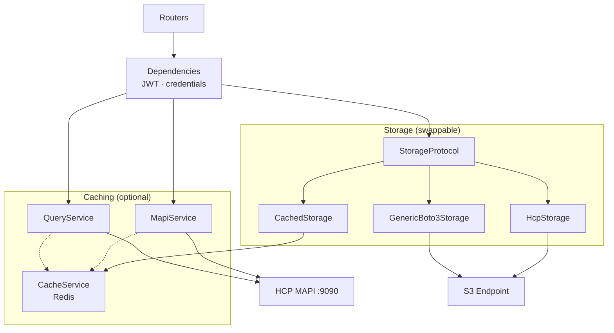
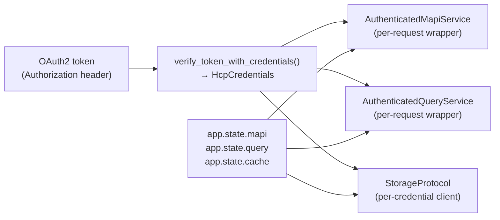
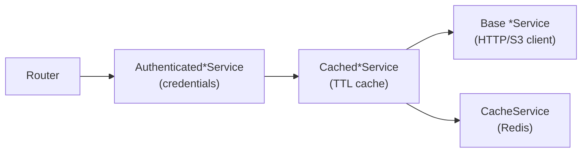

# Backend Architecture

The FastAPI backend is organized in layers:



## Layered architecture

The backend separates concerns into four layers, each with a clear responsibility:

| Layer | Location | Responsibility |
|-------|----------|----------------|
| **Routers** | `app/api/v1/endpoints/` | HTTP interface — request parsing, response serialization, error translation |
| **Dependencies** | `app/api/dependencies.py` | Per-request wiring — credential extraction, service lookup, S3 client caching |
| **Services** | `app/services/` | Business logic — MAPI client, query client, cache, storage adapters |
| **Core** | `app/core/` | Cross-cutting — config, auth, telemetry, tenant routing |

A typical request flows like this:

1. Router receives the HTTP request and extracts path/query/body parameters.
2. FastAPI's `Depends()` resolves the dependency chain: JWT token → credentials → authenticated service.
3. The service makes the external call (MAPI, S3, or Query API) and returns domain objects.
4. The router serializes the response (JSON or XML) and returns it.

Exceptions bubble up through the same path. Domain exceptions (`MapiError`, `StorageError`) are caught by exception handlers in `main.py` and translated to HTTP responses. Routers never import `httpx` or `boto3` — they only talk to service interfaces.

This layering makes the backend testable at every level. Unit tests can inject mock services. Integration tests can swap the storage backend from HCP to MinIO. The router layer is thin enough that service-level tests cover most logic.

## Configuration

Settings are organized into six `pydantic_settings.BaseSettings` classes in `app/core/config.py`. Each class maps to a deployment concern, reads from `.env`, and ignores unknown variables (`extra = "ignore"`).

| Class | Purpose | Key env vars |
|-------|---------|-------------|
| `MapiSettings` | HCP Management API connection | `HCP_HOST`, `HCP_DOMAIN`, `HCP_PORT` (9090), `HCP_AUTH_TYPE` (hcp\|ad), `HCP_VERIFY_SSL`, `HCP_TIMEOUT` (60s) |
| `S3Settings` | S3 credential derivation | `HCP_USERNAME`, `HCP_PASSWORD`, `HCP_DOMAIN`, `S3_ENDPOINT_URL`, `S3_REGION` (us-east-1) |
| `StorageSettings` | Storage backend selection | `STORAGE_BACKEND` (hcp\|minio\|generic), `S3_ADDRESSING_STYLE` (path\|virtual\|auto), `S3_ACCESS_KEY`, `S3_SECRET_KEY` |
| `CacheSettings` | Redis and TTL configuration | `REDIS_URL`, `CACHE_DEFAULT_TTL` (300s), `CACHE_STATS_TTL` (60s), `CACHE_CONFIG_TTL` (600s), `CACHE_S3_LIST_TTL` (120s), `CACHE_S3_META_TTL` (300s), `CACHE_QUERY_OBJECT_TTL` (60s), `CACHE_QUERY_OPERATION_TTL` (120s), `CACHE_KEY_PREFIX` (hcp) |
| `AuthSettings` | JWT signing and CORS | `API_SECRET_KEY`, `API_TOKEN_EXPIRE_MINUTES` (480), `CORS_ORIGINS` (comma-separated) |

Settings are never mutated after initialization. Dependency functions cache them with `@lru_cache()` so each class is instantiated exactly once per process. `S3Settings` derives `access_key` and `secret_key` lazily via properties that call `derive_s3_keys()`.

The split into separate classes means a deployment that only uses MAPI (no S3) doesn't need S3 env vars, and a deployment without Redis doesn't need cache vars. Each class documents its own requirements.

## Authentication — pass-through model

The backend does not maintain a user database. It acts as a credential proxy: the frontend sends HCP credentials, the backend embeds them in a JWT, and every subsequent API call extracts those credentials and forwards them to HCP.

This design exists because HCP is the sole authority for authentication and authorization. The backend cannot validate credentials independently — it would need to call HCP to check. Rather than building a secondary auth layer, the backend passes credentials through and lets HCP reject unauthorized requests at the point of use.

### JWT structure

`create_access_token()` in `app/core/security.py` produces a JWT with these claims:

| Claim | Type | Source |
|-------|------|--------|
| `sub` | string | HCP username |
| `pwd` | string | HCP password (plaintext) |
| `tenant` | string \| null | Target tenant (omitted for system-level access) |
| `exp` | datetime | Expiry (default 8 hours) |

The JWT is signed with HS256 using `API_SECRET_KEY`. Storing the password in the JWT is intentional — the backend needs it for every proxied call. The JWT is httpOnly, never exposed to client JavaScript, and short-lived.

### S3 credential derivation

HCP uses a specific convention for S3 access keys:

- **Access key**: `base64(username)` — e.g., `admin` → `YWRtaW4=`
- **Secret key**: `md5(password)` — the 32-character hex digest

These are computed by `derive_s3_keys()` in `app/core/auth_utils.py`. No separate S3 credentials need to be configured — they're derived deterministically from HCP credentials.

### Login flow

`POST /api/v1/auth/token` accepts an OAuth2 password form. Tenant resolution uses a first-match strategy:

1. Explicit `tenant` form field
2. `tenant/username` parsed from the username field (e.g., `corp/admin`)
3. Omitted — system-level access

The endpoint validates the tenant name format (`^[a-zA-Z0-9]([a-zA-Z0-9-]*[a-zA-Z0-9])?$`) and issues a JWT. Login always succeeds from the proxy's perspective. If the credentials are wrong, HCP will reject the first actual API call, and the frontend will redirect to login.

### Tenant routing

Three pure functions in `app/core/tenant_routing.py` derive virtual-hosted URLs from the tenant name and HCP domain:

- `mapi_host_for_tenant(tenant, domain)` → `{tenant}.{domain}` or `admin.{domain}` for system-level
- `query_url_for_tenant(tenant, domain)` → `https://{tenant}.{domain}/query`
- `s3_endpoint_for_tenant(tenant, domain)` → `https://{tenant}.{domain}`

## Dependency injection

FastAPI's `Depends()` wires services per-request. The dependency graph looks like this:



Settings are cached with `@lru_cache()`:

```python
@lru_cache()
def get_mapi_settings() -> MapiSettings:
    return MapiSettings()
```

Services live on `app.state`, initialized in the lifespan handler. Dependencies read from `request.app.state` — no module-level mutable globals.

For MAPI and Query services, the dependency creates an `Authenticated*Service` wrapper that binds JWT credentials and the tenant-specific host to the shared inner service. The wrapper is created per-request and discarded after.

S3 clients are special: HCP requires per-user clients because credentials are baked into the boto3 session. The dependency maintains a cache in `app.state.s3_cache` keyed by `HcpCredentials`. Each unique user gets their own boto3 client, lazily created on first request. For MinIO/generic backends, a single shared client keyed by `"default"` is used instead.

## Services

### MapiService

`MapiService` (`app/services/mapi_service.py`) is an async HTTP client for HCP's Management API (port 9090). It uses `httpx.AsyncClient` with lazy initialization.

The core method is `request()`, which handles:

- URL construction: `https://{host}:{port}/mapi{path}?{query}`
- Pydantic model serialization for request bodies
- HCP authentication headers via `get_hcp_auth_header()`
- Transport error mapping: `TimeoutException` → 504, `ConnectError` → 502

Two convenience methods build on `request()`:

- `fetch_json(path, resource)` — GET + status check + JSON parse (one-liner for read endpoints)
- `send(method, path, resource)` — request + status check (for writes)

`raise_for_hcp_status()` maps HCP-specific status codes to HTTP statuses. Notable: HCP returns 302 for "not found" (mapped to 404), and HCP 500 is mapped to 502 (it's the upstream that failed, not us).

`AuthenticatedMapiService` wraps any inner service (plain or cached) with credentials and tenant host. It delegates all calls, injecting `username`, `password`, and `host` automatically. Its `close()` is a no-op — the base service owns the httpx client.

### QueryService

`QueryService` (`app/services/query_service.py`) is an async HTTP client for HCP's Metadata Query Engine. It POSTs JSON queries to `https://{tenant}.{domain}/query`.

Two query types:

- `object_query()` — searches object metadata (name, size, dates, custom metadata)
- `operation_query()` — searches operation logs (reads, writes, deletes)

Both unwrap HCP's `{"queryResult": {...}}` response envelope and validate against Pydantic response models. `AuthenticatedQueryService` follows the same composition pattern as the MAPI wrapper.

### CacheService

`CacheService` (`app/services/cache_service.py`) wraps Redis with graceful degradation. It maintains two Redis clients:

- **Async client** (`aioredis.Redis`) — used by MAPI and Query services running in the async event loop
- **Sync client** (`redis.Redis`) — used by Storage services running inside `asyncio.to_thread()`

`connect()` attempts to reach Redis and silently disables caching if it fails. The `enabled` property reflects whether Redis is actually available. All cache operations swallow exceptions — a Redis failure never breaks the application.

Operations: `get`, `set` (with TTL), `delete`, `invalidate_pattern` (SCAN-based). Each has both async and sync variants. All keys are prefixed with `{cache_key_prefix}:` (default `hcp:`).

OTel instrumentation records three counters: `cache.hits`, `cache.misses`, `cache.errors`. Every operation also creates a trace span.

### LanceService

`LanceService` (`app/services/lance_service.py`) connects to S3-hosted Lance datasets via `lancedb`. It provides table listing, schema inspection, paginated row reads, full-text/vector/hybrid search, and single-cell byte access.

Data reads use Lance's native push-down filtering, which is more efficient than serializing through Redis. Only metadata operations (`list_tables`, `get_schema`) are cached.

## Cached wrappers — the composition pattern

All caching wrappers use composition: each wraps an `inner` service and a `CacheService`. No inheritance is involved. This means the same wrapper works regardless of whether the inner service is a base service or another wrapper.



### CachedMapiService

Intercepts `request()` at the transport level:

- **GET requests**: check cache first (key = `mapi:{host}:{path}?{sorted_query}`), delegate on miss, cache response
- **PUT/POST/DELETE**: delegate first, then invalidate the resource and its parent collection via pattern `mapi:{host}:{path}*`

TTL is selected by path pattern:

| Path contains | TTL | Reason |
|---------------|-----|--------|
| `statistics`, `chargeback` | 60s (`cache_stats_ttl`) | Changes frequently |
| `consoleSecurity`, `permissions`, `protocols` | 600s (`cache_config_ttl`) | Rarely changes |
| Everything else | 300s (`cache_default_ttl`) | Balanced |

Paths like `/logs`, `/healthCheck`, `/support` are never cached.

### CachedQueryService

Cache keys use truncated SHA-256 hashes of the query body: `query:{tenant}:obj:{hash[:16]}` for object queries, `query:{tenant}:ops:{hash[:16]}` for operation queries.

The Query API is read-only, so there's no invalidation — entries simply expire via TTL (object 60s, operation 120s).

### CachedStorage

Uses sync cache methods because storage operations run inside `asyncio.to_thread()`.

Cached reads: `list_buckets`, `head_bucket`, `list_objects` (first page only — continuation tokens are not cached), `head_object`, `get_bucket_versioning`, `get_bucket_acl`, `get_object_acl`.

Uncached reads: `get_object` (streams binary data), `list_object_versions`, `generate_presigned_url`.

Write operations delegate first, then precisely invalidate affected cache entries. For example, `create_bucket` invalidates `list_buckets` + `head_bucket` + versioning + ACL + all `list_objects` patterns for that bucket. This precision avoids over-invalidation while keeping the cache consistent.

### CachedLanceService

Only caches metadata: `list_tables` (default TTL) and `get_schema` (config TTL). Data reads are not cached — Lance's native push-down is more efficient than serializing through Redis. Uncached methods are forwarded via `__getattr__`.

## Routers and endpoints

The API is organized into five endpoint groups:

| Group | Prefix | Auth | Examples |
|-------|--------|------|----------|
| **S3 Data-Plane** | `/api/v1/buckets`, `/objects`, `/versions`, `/multipart`, `/credentials` | JWT | Bucket CRUD, object upload/download, presigned URLs |
| **System MAPI** | `/api/v1/mapi/system/` | System admin | Tenant management, replication, erasure coding |
| **Tenant MAPI** | `/api/v1/mapi/tenants/{tenant}/` | Tenant admin/monitor/security | Users, groups, settings, chargeback |
| **Namespace MAPI** | `/api/v1/mapi/tenants/{tenant}/namespaces/` | Admin/compliance | Namespace config, compliance, protocols, CORS |
| **Query** | `/api/v1/query/` | JWT | Metadata search |

All routes except auth require `Depends(get_current_user)` as a route-level dependency.

### Endpoint patterns

MAPI reads use `fetch_json()` — a one-liner that GETs, checks status, and parses JSON:

```python
@router.get("/{tenant_name}/consoleSecurity", response_model=ConsoleSecurity)
async def get_console_security(
    tenant_name: str,
    hcp: MapiService = Depends(get_mapi_service),
):
    return await hcp.fetch_json(f"/tenants/{tenant_name}/consoleSecurity")
```

MAPI writes use `send()`:

```python
@router.post("/{tenant_name}/consoleSecurity", response_model=StatusResponse)
async def modify_console_security(
    tenant_name: str, body: ConsoleSecurity,
    hcp: MapiService = Depends(get_mapi_service),
):
    await hcp.send("POST", f"/tenants/{tenant_name}/consoleSecurity", body=body)
    return {"status": "updated"}
```

S3 operations use `run_storage()`, a helper in `app/api/errors.py` that wraps `asyncio.to_thread()` and catches `StorageError` → `HTTPException`:

```python
@router.get("", response_model=ListBucketsResponse)
async def list_buckets(s3: StorageProtocol = Depends(get_s3_service)):
    result = await run_storage(s3.list_buckets, "buckets")
    buckets = [BucketInfo.model_validate(b) for b in result.get("Buckets", [])]
    ...
```

### Error handling

Domain exceptions are decoupled from the web framework. `MapiError` and `StorageError` hierarchies are pure Python exceptions with an `http_status` attribute. Translation to `HTTPException` happens in two places:

1. `run_storage()` / `run_mapi()` helpers in `app/api/errors.py` — used by routers
2. Global exception handlers in `main.py` — catch anything that escapes the routers

The global handler for unhandled exceptions returns 500 with the `request_id` in the response body and logs the full traceback.

### Special endpoint patterns

- **Background ZIP download** (`POST /objects/download`): returns 202 with a task ID. The client polls `GET /objects/download/{task_id}` until the ZIP is ready. Tasks are stored in Redis (or an in-memory dict as fallback). Max 50,000 objects, batched in groups of 20.
- **Streaming download** (`GET /objects/{key:path}`): returns a `StreamingResponse` using `body.iter_chunks()`.
- **Force-delete bucket**: empties the bucket, reconfigures the namespace via MAPI (disables `keepDeletionRecords`, enables pruning, disables search), then retries delete up to 3 times.

## App lifecycle

### Lifespan

The `lifespan()` async context manager in `app/main.py` handles startup and shutdown:

**Startup:**

1. Create `CacheService(CacheSettings())` and `await cache.connect()`
2. Create `MapiService(MapiSettings())`, wrap with `CachedMapiService` if cache is enabled → `app.state.mapi`
3. Initialize empty dicts: `app.state.s3_cache = {}`, `app.state.lance_cache = {}`
4. Create `QueryService(MapiSettings())`, wrap with `CachedQueryService` if cache is enabled → `app.state.query`

**Shutdown:** Close query service, MAPI service, and cache in order.

### Middleware stack

Middleware runs outermost-first:

1. **`RequestIDMiddleware`**: reads `X-Request-ID` header or generates a UUID. Sets `request.state.request_id` and correlates with the OTel span. Records HTTP metrics (`http.server.request.duration`, `http.server.request.count`). Produces structured access logs with best-effort JWT user/tenant extraction (no signature validation for logging — it only needs the `sub` and `tenant` claims). Skips logging for health paths (`/healthz`, `/readyz`, `/health`).
2. **`GZipMiddleware`**: compresses responses larger than 500 bytes.
3. **`CORSMiddleware`**: empty `CORS_ORIGINS` allows all origins without credentials; non-empty restricts to specified origins with credentials.

### Health endpoints

- `GET /healthz` — liveness probe, always returns `{"status": "ok"}`
- `GET /readyz` — readiness probe, checks HCP MAPI reachability and Redis connectivity
- `GET /health` — legacy, returns cache status

## Observability

`setup_telemetry()` in `app/core/telemetry.py` configures OpenTelemetry for traces, metrics, and logs.

### Tracing

If `OTEL_EXPORTER_OTLP_ENDPOINT` is set, spans are exported via OTLP. Otherwise, they go to a `ConsoleSpanExporter` for local development. Auto-instrumentation covers FastAPI (request spans) and HTTPX (outbound call spans). Authorization headers are redacted in both.

Manual spans are created throughout the service layer:

- Every `Boto3Operations` method: `s3.list_buckets`, `s3.put_object`, etc.
- Every cached wrapper method: `cached_s3.list_buckets`, `cached_mapi.request`, etc.
- Every cache operation: `cache.get`, `cache.set`, `cache.delete`, `cache.invalidate`
- Every Lance operation: `lance.list_tables`, `lance.search`, etc.

### Metrics

| Metric | Type | Source |
|--------|------|--------|
| `http.server.request.duration` | histogram (ms) | `RequestIDMiddleware` |
| `http.server.request.count` | counter | `RequestIDMiddleware` |
| `cache.hits` | counter | `CacheService` |
| `cache.misses` | counter | `CacheService` |
| `cache.errors` | counter | `CacheService` |

### Logging

A custom `JSONFormatter` emits structured JSON lines to stderr. Each log entry includes: `ts`, `level`, `logger`, `msg`, and request context fields: `request_id`, `method`, `path`, `query`, `status`, `duration_ms`, `user`, `tenant`, `client_ip`, `trace_id`, `span_id`.

The `trace_id` and `span_id` fields correlate logs with distributed traces, enabling end-to-end request debugging across the frontend, backend, and HCP.
