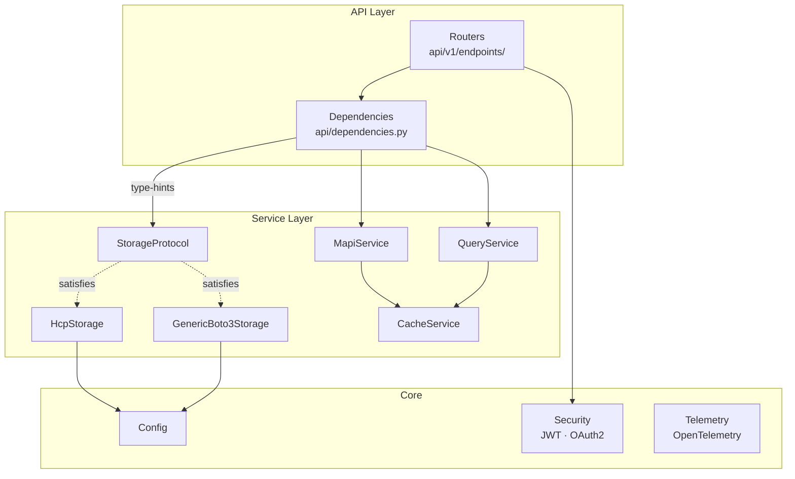

# Backend Architecture

The FastAPI backend is organized in layers:

## Key Design Decisions

- **Credential pass-through**: The API does not store user passwords. Credentials are embedded in the JWT and forwarded to HCP on each request. HCP is the sole authority for authentication and authorization.

- **Optional caching**: When Redis is configured, cached wrappers (`CachedMapiService`, `CachedQueryService`, `CachedHcpStorage`) add TTL-based caching. Without Redis, base services are used directly.

- **S3 credential derivation**: S3 access keys are derived from HCP credentials (base64-encoded username + MD5-hashed password) per HCP convention. No separate S3 credentials need to be configured.

- **Composition-based storage**: The S3 data-plane uses `StorageProtocol` (structural typing) as the contract. Adapters compose a shared `Boto3Operations` helper rather than inheriting from a base class. See [Storage Layer](storage.md) for details.

- **Sync-over-async S3**: Storage operations use synchronous boto3 calls executed via `asyncio.to_thread()`. This avoids the complexity of async S3 clients while keeping the FastAPI event loop non-blocking.

## Router Organization

The API is organized into five endpoint groups, each with distinct auth requirements:

| Group | Prefix | Auth | Examples |
|-------|--------|------|----------|
| **S3 Data-Plane** | `/api/v1/buckets`, `/objects`, `/versions`, `/multipart`, `/credentials` | JWT | Bucket CRUD, object upload/download, presigned URLs |
| **System MAPI** | `/api/v1/mapi/system/` | System admin | Tenant management, replication, erasure coding |
| **Tenant MAPI** | `/api/v1/mapi/tenants/{tenant}/` | Tenant admin/monitor/security | Users, groups, settings, chargeback |
| **Namespace MAPI** | `/api/v1/mapi/tenants/{tenant}/namespaces/` | Admin/compliance | Namespace config, compliance, protocols, CORS |
| **Query** | `/api/v1/query/` | JWT | Metadata search |
