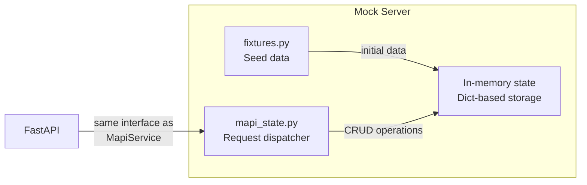
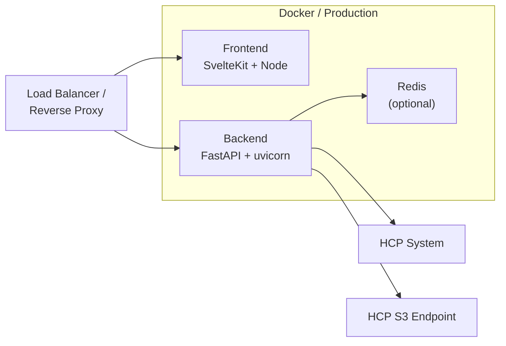

# Deployment

## Containerization

The project uses [Dagger](https://dagger.io/) for reproducible container builds and CI/CD pipelines (see `dagger.json` and `.dagger/`). A `docker-compose.yml` is also provided for local multi-service development:

```bash
docker compose -f .docker/docker-compose.yml up
```

This starts the backend, frontend, and Redis together with health checks and automatic service linking.

## Mock Server

For development without an HCP system, the backend includes a mock server:



The mock server implements the same interface as the real MAPI service, allowing the frontend to be developed and tested independently. Start it with `make run-api-mock`.

## Production Architecture



| Component | Technology | Port |
|-----------|-----------|------|
| Frontend | SvelteKit 2 + Svelte 5, Deno | 5173 (dev) |
| Backend | FastAPI, Python 3.12+, uv | 8000 |
| Storage adapters | HcpStorage (boto3) — pluggable via StorageProtocol | — |
| Cache | Redis 7+ (optional) | 6379 |
| HCP MAPI | Hitachi Content Platform | 9090 |
| S3 endpoint | S3-compatible endpoint (HCP, MinIO, Ceph, AWS) | 443 |
