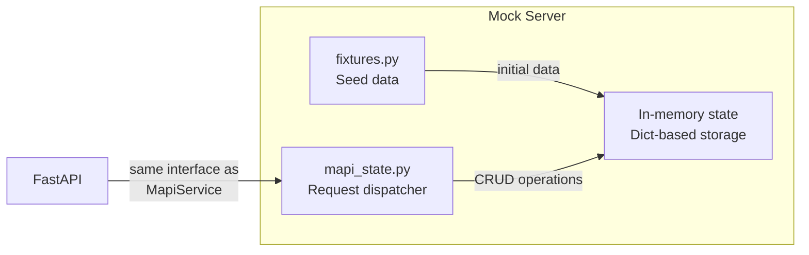
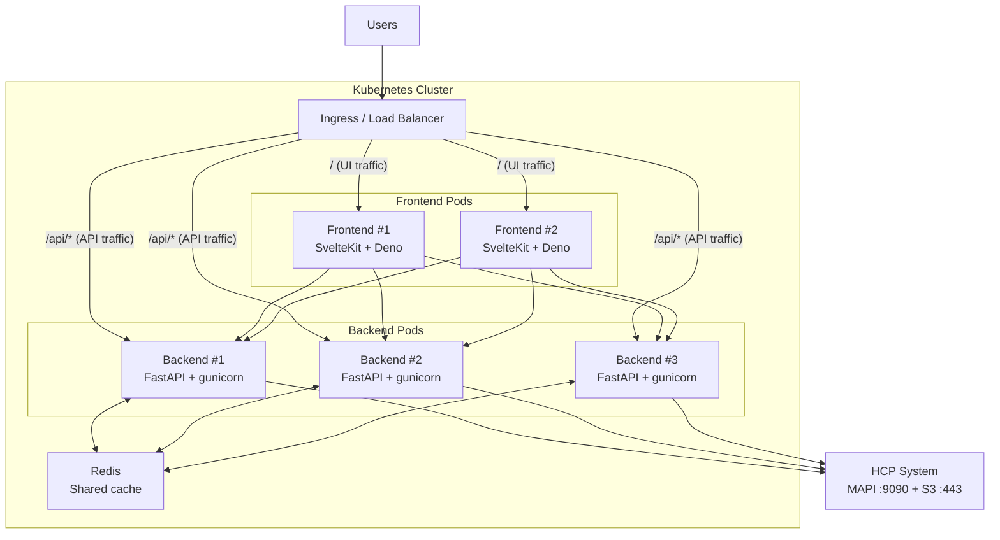
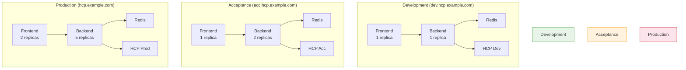

# Deployment

## Containerization

The project uses [Dagger](https://dagger.io/) for reproducible container builds and CI/CD pipelines (see `dagger.json` and `.dagger/`). A `docker-compose.yml` is also provided for local multi-service development:

```bash
docker compose -f .docker/docker-compose.yml up
```

This starts the backend, frontend, and Redis together with health checks and automatic service linking.

## Mock Server

For development without an HCP system, the backend includes a mock server:



The mock server implements the same interface as the real MAPI service, allowing the frontend to be developed and tested independently. Start it with `make run-api-mock`.

## Publishing Container Images

The project uses a Dagger pipeline (`.dagger/publish.go`) to build and push images to Docker Hub. Three Make targets are available:

```bash
# Publish both backend and frontend
make publish TAG=v0.1.0

# Publish individually
make publish-backend TAG=v0.1.0
make publish-frontend TAG=v0.1.0
```

Credentials are read from `.env`:

| Variable | Description |
|----------|-------------|
| `DOCKER_USERNAME` | Docker Hub username |
| `DOCKER_PASSWORD` | Docker Hub password or access token |

Published images:

| Image | Default repository |
|-------|--------------------|
| Backend | `riksarkivet/ra-hcp` |
| Frontend | `riksarkivet/ra-hcp-frontend` |

## Helm Chart

A Helm chart is provided in `charts/helm-ra-hcp-v0.1.0/` for Kubernetes deployment. Install with:

```bash
helm install ra-hcp charts/helm-ra-hcp-v0.1.0 \
  --set env.HCP_DOMAIN=hcp.example.com \
  --set secret.API_SECRET_KEY=your-secret-key
```

Key configuration values (see `charts/helm-ra-hcp-v0.1.0/values.yaml` for the full reference):

| Value | Default | Description |
|-------|---------|-------------|
| `image.repository` | `riksarkivet/ra-hcp` | Backend image |
| `image.tag` | `""` (uses `appVersion`) | Image tag |
| `backend.workers` | `2` | Gunicorn worker processes per pod |
| `replicaCount` | `1` | Number of backend pods |
| `service.type` | `NodePort` | Backend service type |
| `service.port` | `8000` | Backend service port |
| `service.nodePort` | `30081` | Backend NodePort |
| `frontend.enabled` | `false` | Enable frontend deployment |
| `frontend.service.nodePort` | `30517` | Frontend NodePort |
| `redis.enabled` | `false` | Enable Redis sidecar |
| `opentelemetry.enabled` | `false` | Enable OTEL export |

Enable the frontend and Redis:

```bash
helm install ra-hcp charts/helm-ra-hcp-v0.1.0 \
  --set frontend.enabled=true \
  --set redis.enabled=true \
  --set env.HCP_DOMAIN=hcp.example.com
```

## Production Architecture

A production deployment consists of a frontend, a backend, an optional Redis cache, and the HCP system it manages. A load balancer or ingress controller sits in front and routes traffic.



| Component | Technology | Port |
|-----------|-----------|------|
| Frontend | SvelteKit 2 + Svelte 5, Deno | 5173 (dev), 8000 (container) |
| Backend | FastAPI, Python 3.13+, uv | 8000 |
| Storage adapters | HcpStorage (aioboto3) — pluggable via StorageProtocol | — |
| Cache | Redis 7+ (optional) | 6379 |
| HCP MAPI | Hitachi Content Platform | 9090 |
| S3 endpoint | S3-compatible endpoint (HCP, MinIO, Ceph, AWS) | 443 |

### Scaling

There are two ways to scale the backend. They are independent and can be combined.

#### Vertical scaling — gunicorn workers (processes per pod)

Each backend pod runs gunicorn with uvicorn worker processes. Gunicorn's primary benefit is **reliability** — automatic worker restarts, memory leak protection, and graceful reloads — not speed. A single async uvicorn worker already handles hundreds of requests/second. The default of 2 workers provides resilience (if one crashes, the other keeps serving):

```
Pod (1 replica, 2 workers):
┌──────────────────────────────────────────────┐
│  gunicorn (master)                           │
│    ├─ uvicorn worker 1  ─→ handles requests  │
│    └─ uvicorn worker 2  ─→ handles requests  │
└──────────────────────────────────────────────┘
```

Gunicorn manages the worker processes (restarts crashed workers, graceful reloads, pre-fork model). Uvicorn handles the async requests inside each worker. This is the [recommended production setup](https://www.uvicorn.org/deployment/#gunicorn) from both FastAPI and uvicorn.

The Dockerfile runs:

```dockerfile
CMD ["gunicorn", "app.main:app", \
     "--worker-class", "uvicorn.workers.UvicornWorker", \
     "--bind", "0.0.0.0:8000", \
     "--workers", "2", \
     "--max-requests", "10000", \
     "--max-requests-jitter", "1000", \
     "--timeout", "120", \
     "--keep-alive", "5", \
     "--access-logfile", "-"]
```

| Flag | Value | Why |
|------|-------|-----|
| `--workers` | 2 | Number of worker processes (configurable via Helm) |
| `--max-requests` | 10000 | Recycle workers after 10K requests to prevent memory leaks |
| `--max-requests-jitter` | 1000 | Randomize recycling so workers don't restart simultaneously |
| `--timeout` | 120 | Kill workers that hang for 2 minutes (covers slow HCP responses) |
| `--keep-alive` | 5 | Keep idle HTTP connections open for 5 seconds (reduces handshake overhead) |
| `--access-logfile` | `-` | Log access requests to stdout (picked up by Kubernetes logging) |

The number of workers is configurable via the Helm chart:

```yaml
# values.yaml
backend:
  workers: 2  # gunicorn worker processes per pod
```

The Helm deployment template passes this value to gunicorn's `--workers` flag.

!!! tip "How many workers?"
    A good starting point is `2 × CPU cores + 1`. For presign-heavy workloads (bulk SDK transfers), 2-4 workers is usually enough — presigning is CPU-light (~1ms CPU per URL). Each worker uses ~50-100 MB RAM. Monitor with `kubectl top pod` and increase if CPU is saturated.

#### Horizontal scaling — replica count (pods)

Adding replicas creates multiple independent pods, each running their own set of workers. Kubernetes load-balances requests across them:

```
Default (1 replica × 2 workers):              Combined (2 replicas × 4 workers):
┌──────────────────────────┐                  ┌──────────────────────────────┐
│ Pod 1                    │                  │ Pod 1                        │
│  gunicorn → 2 workers    │                  │  gunicorn → 4 worker procs  │
└──────────────────────────┘                  ├──────────────────────────────┤
= 2 processes total                           │ Pod 2                        │
                                              │  gunicorn → 4 worker procs  │
                                              └──────────────────────────────┘
                                              = 8 processes total
```

Both frontend and backend are **stateless** and can be horizontally scaled:

- **Frontend**: Each replica runs SvelteKit with SSR. No shared state — any request can go to any replica. Scale when you have many concurrent browser sessions.
- **Backend**: Each replica runs FastAPI. All replicas connect to the same Redis and HCP system. Scale when API throughput needs increase or HCP response times are high.
- **Redis**: Runs as a single instance. All backend replicas share it, so a cache fill from one replica is available to all others. For most deployments, a single Redis instance is sufficient.

```bash
# Scale backend to 5 replicas
kubectl scale deployment ra-hcp --replicas=5

# Scale frontend to 3 replicas
kubectl scale deployment ra-hcp-frontend --replicas=3
```

Or via the Helm chart:

```yaml
# values.yaml
replicaCount: 3           # 3 pods
backend:
  workers: 4              # 4 gunicorn processes per pod = 12 total
```

Autoscaling is also supported — set `autoscaling.enabled: true` to let Kubernetes scale replicas based on CPU utilization (see `values.yaml` for thresholds).

#### Which scaling approach to use?

!!! info "The default (1 pod, 2 workers) is enough for most use cases"
    A single async uvicorn worker handles hundreds of requests/second. The SDK sends ~2 presign requests/second during bulk transfers. More workers and replicas help with **multi-user concurrency** and **fault tolerance**, not single-user transfer speed. Transfer speed is limited by network bandwidth, not the API server.

| Scenario | Recommendation |
|----------|---------------|
| 1-2 users doing bulk transfers | Default (`1 pod, 2 workers`) — more than enough |
| Multiple concurrent users or API clients | Vertical (`backend.workers: 4`) — handle more presign requests in parallel |
| High availability requirement | Horizontal (`replicaCount: 2+` with `podDisruptionBudget`) — survives node failures |
| Many concurrent users + HA | Both — `replicaCount: 2, backend.workers: 4` gives 8 processes across 2 nodes |

!!! note "SDK `bulk_workers` vs server workers"
    The SDK's `bulk_workers` setting controls how many files are transferred in parallel on **your machine**. Server workers (gunicorn/replicas) control how many API requests the **backend** handles in parallel. These are completely different — SDK workers talk directly to HCP S3 for file data. The backend is only involved for presigning URLs (~2 requests/second during bulk transfers). See [Performance tuning](../sdk/cli.md#performance-tuning) in the SDK docs for details.

### Health Probes

The backend exposes health endpoints for Kubernetes liveness and readiness probes:

| Endpoint | Purpose | Checks |
|----------|---------|--------|
| `GET /liveness` | Liveness probe | Always returns 200 — the process is alive |
| `GET /readiness` | Readiness probe | Checks HCP MAPI reachability and Redis connectivity |
| `GET /health` | Legacy | Returns cache status |

The Helm chart configures these probes automatically. A backend pod that can't reach HCP is marked unready and removed from the load balancer until connectivity is restored.

## Environment Isolation

### One Stack Per HCP Domain

Each environment (development, acceptance, production) gets its **own isolated deployment**: its own frontend, backend, Redis, and HCP domain configuration. Environments never share components or cross-connect.



The **1:1 relationship** between a deployment and an HCP domain is enforced by design: the `HCP_DOMAIN` environment variable is set at startup and determines which HCP system the backend communicates with. There is no runtime domain switching.

### Why Isolate?

| Concern | How isolation helps |
|---------|-------------------|
| **Data safety** | A dev frontend can never reach prod data — the backend only knows its configured domain |
| **Independent lifecycle** | Upgrade acceptance while production stays on the current version |
| **Independent scaling** | Production runs 5 backend replicas; development runs 1 |
| **Blast radius** | A misconfiguration in dev cannot affect prod |
| **Compliance** | Clear audit trail — each environment has its own logs, traces, and cache |

### Deploying Multiple Environments

Use separate Helm releases with environment-specific values files:

```bash
# Development — minimal resources, mock-friendly
helm install hcp-dev charts/helm-ra-hcp-v0.1.0 \
  -n hcp-dev --create-namespace \
  -f values-dev.yaml \
  --set env.HCP_DOMAIN=dev.hcp.example.com \
  --set secret.API_SECRET_KEY=$(python -c "import secrets; print(secrets.token_urlsafe(64))")

# Acceptance — moderate resources, SSL enabled
helm install hcp-acc charts/helm-ra-hcp-v0.1.0 \
  -n hcp-acc --create-namespace \
  -f values-acc.yaml \
  --set env.HCP_DOMAIN=acc.hcp.example.com \
  --set env.HCP_VERIFY_SSL=true \
  --set secret.API_SECRET_KEY=$(python -c "import secrets; print(secrets.token_urlsafe(64))")

# Production — full resources, all security features
helm install hcp-prod charts/helm-ra-hcp-v0.1.0 \
  -n hcp-prod --create-namespace \
  -f values-prod.yaml \
  --set env.HCP_DOMAIN=hcp.example.com \
  --set env.HCP_VERIFY_SSL=true \
  --set env.CORS_ORIGINS=https://hcp-ui.example.com \
  --set secret.API_SECRET_KEY=$(python -c "import secrets; print(secrets.token_urlsafe(64))")
```

!!! tip "Use Kubernetes namespaces"
    Deploy each environment to its own namespace (`hcp-dev`, `hcp-acc`, `hcp-prod`). This provides network isolation, independent RBAC, and clean resource accounting.

### Example: Production values file

```yaml
# values-prod.yaml
replicaCount: 5

backend:
  workers: 4  # 5 pods × 4 workers = 20 processes

frontend:
  enabled: true
  replicaCount: 2

redis:
  enabled: true

ingress:
  enabled: true
  className: nginx
  hosts:
    - host: hcp-ui.example.com
      paths:
        - path: /api
          pathType: Prefix
          backend: api
        - path: /
          pathType: Prefix
          backend: frontend
  tls:
    - secretName: hcp-tls
      hosts:
        - hcp-ui.example.com

env:
  HCP_DOMAIN: hcp.example.com
  HCP_VERIFY_SSL: "true"
  CORS_ORIGINS: "https://hcp-ui.example.com"

resources:
  requests:
    memory: "256Mi"
    cpu: "250m"
  limits:
    memory: "512Mi"
    cpu: "1000m"
```

## Security Hardening Checklist

Before going to production, verify these settings:

| Item | What to check | Risk if skipped |
|------|--------------|-----------------|
| `API_SECRET_KEY` | Set to a unique, random 64+ character value per environment | JWTs can be forged — full admin access |
| `HCP_VERIFY_SSL` | Set to `true` in production | Man-in-the-middle attacks on HCP communication |
| `CORS_ORIGINS` | Set to your specific frontend URL(s) | Cross-origin requests from malicious sites |
| Container security | Verify `runAsNonRoot: true`, `readOnlyRootFilesystem: true`, `drop: ALL` | Container escape or privilege escalation |
| Redis network | Redis should only be accessible from backend pods (ClusterIP service) | Cache data exposure |
| Kubernetes namespace | Each environment in its own namespace with network policies | Cross-environment access |
| Ingress TLS | Terminate TLS at the ingress with a valid certificate | Traffic interception |
| HCP credentials | Use dedicated service accounts, not personal admin accounts | Over-privileged access, no audit trail |

!!! warning "The default `API_SECRET_KEY` is `change-me-in-production`"
    This is intentionally insecure for local development. **You must change it** in any non-local deployment. Generate a secure key with:

    ```bash
    python -c "import secrets; print(secrets.token_urlsafe(64))"
    ```
