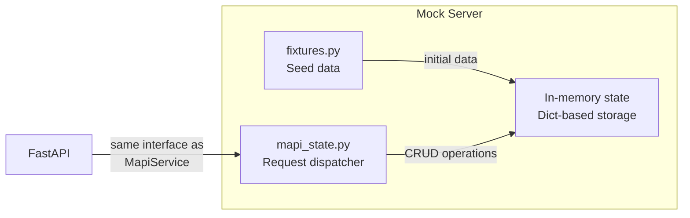
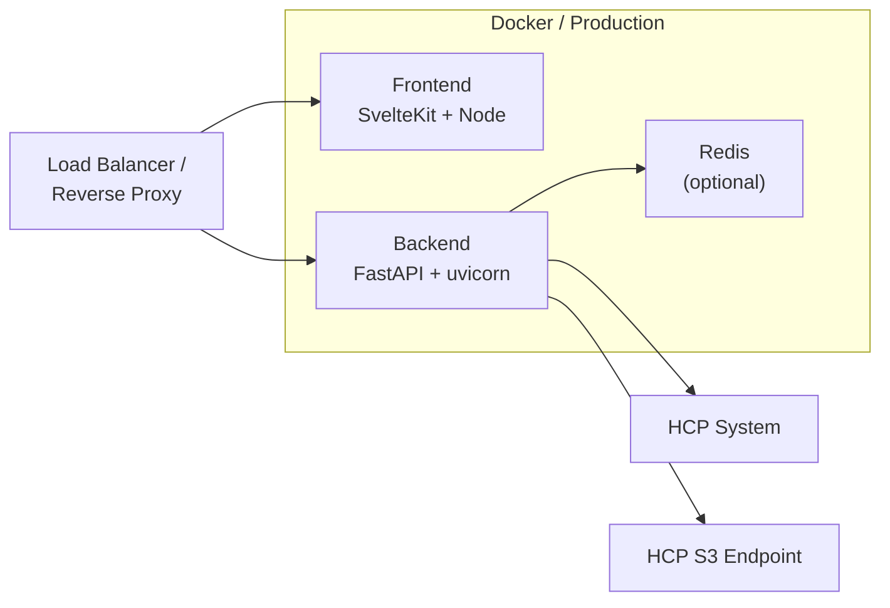

# Deployment

## Containerization

The project uses [Dagger](https://dagger.io/) for reproducible container builds and CI/CD pipelines (see `dagger.json` and `.dagger/`). A `docker-compose.yml` is also provided for local multi-service development:

```bash
docker compose -f .docker/docker-compose.yml up
```

This starts the backend, frontend, and Redis together with health checks and automatic service linking.

## Mock Server

For development without an HCP system, the backend includes a mock server:



The mock server implements the same interface as the real MAPI service, allowing the frontend to be developed and tested independently. Start it with `make run-api-mock`.

## Publishing Container Images

The project uses a Dagger pipeline (`.dagger/publish.go`) to build and push images to Docker Hub. Three Make targets are available:

```bash
# Publish both backend and frontend
make publish TAG=v0.1.0

# Publish individually
make publish-backend TAG=v0.1.0
make publish-frontend TAG=v0.1.0
```

Credentials are read from `.env`:

| Variable | Description |
|----------|-------------|
| `DOCKER_USERNAME` | Docker Hub username |
| `DOCKER_PASSWORD` | Docker Hub password or access token |

Published images:

| Image | Default repository |
|-------|--------------------|
| Backend | `riksarkivet/ra-hcp` |
| Frontend | `riksarkivet/ra-hcp-frontend` |

## Helm Chart

A Helm chart is provided in `charts/helm-ra-hcp-v0.1.0/` for Kubernetes deployment. Install with:

```bash
helm install ra-hcp charts/helm-ra-hcp-v0.1.0 \
  --set env.HCP_DOMAIN=hcp.example.com \
  --set secret.API_SECRET_KEY=your-secret-key
```

Key configuration values (see `charts/helm-ra-hcp-v0.1.0/values.yaml` for the full reference):

| Value | Default | Description |
|-------|---------|-------------|
| `image.repository` | `riksarkivet/ra-hcp` | Backend image |
| `image.tag` | `""` (uses `appVersion`) | Image tag |
| `service.type` | `NodePort` | Backend service type |
| `service.port` | `8000` | Backend service port |
| `service.nodePort` | `30081` | Backend NodePort |
| `frontend.enabled` | `false` | Enable frontend deployment |
| `frontend.service.nodePort` | `30517` | Frontend NodePort |
| `redis.enabled` | `false` | Enable Redis sidecar |
| `opentelemetry.enabled` | `false` | Enable OTEL export |

Enable the frontend and Redis:

```bash
helm install ra-hcp charts/helm-ra-hcp-v0.1.0 \
  --set frontend.enabled=true \
  --set redis.enabled=true \
  --set env.HCP_DOMAIN=hcp.example.com
```

## Production Architecture



| Component | Technology | Port |
|-----------|-----------|------|
| Frontend | SvelteKit 2 + Svelte 5, Deno | 5173 (dev) |
| Backend | FastAPI, Python 3.13+, uv | 8000 |
| Storage adapters | HcpStorage (boto3) — pluggable via StorageProtocol | — |
| Cache | Redis 7+ (optional) | 6379 |
| HCP MAPI | Hitachi Content Platform | 9090 |
| S3 endpoint | S3-compatible endpoint (HCP, MinIO, Ceph, AWS) | 443 |
