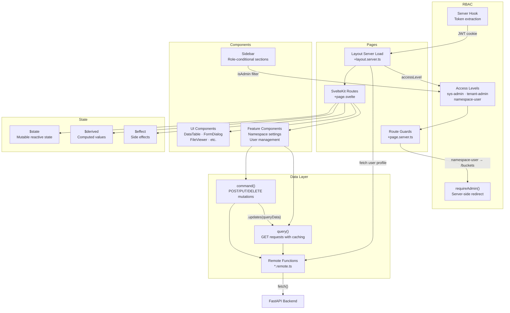
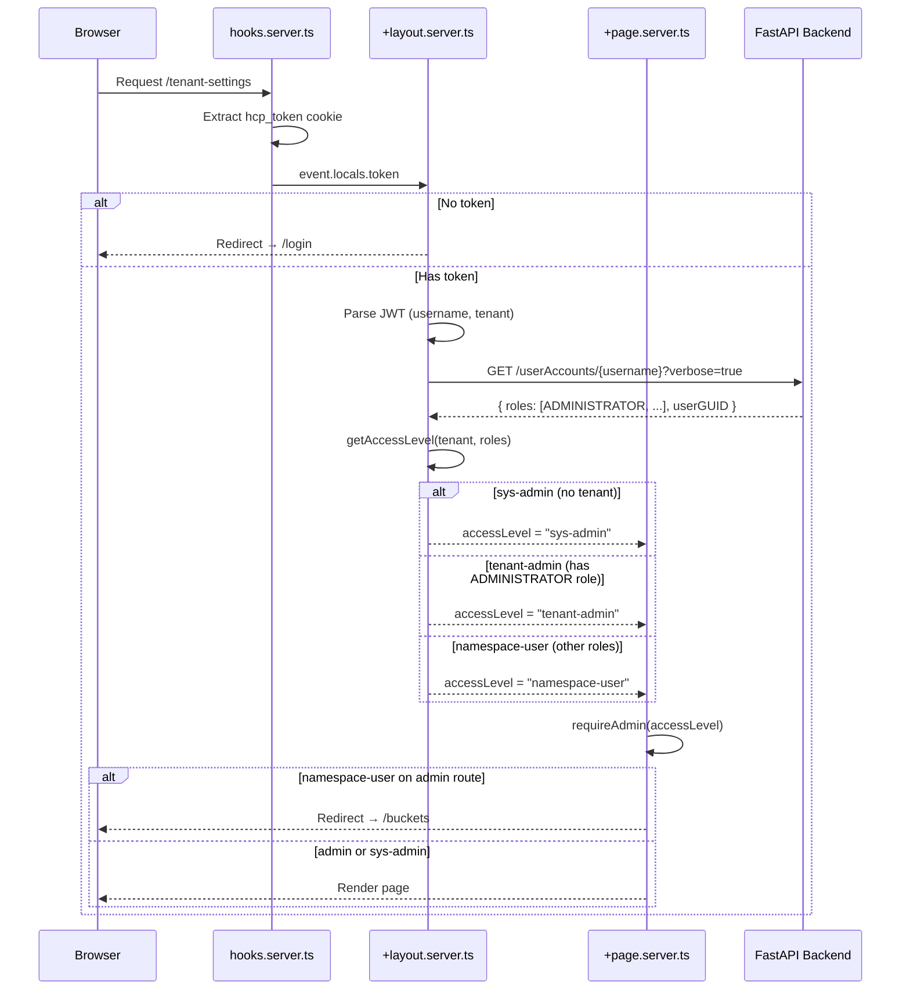

# Frontend Architecture

The SvelteKit frontend follows a reactive pattern with remote function abstractions and server-side RBAC:

## RBAC

The frontend enforces role-based access control entirely on the server side, making it impossible to bypass via client-side manipulation.

### Access levels

| Level | Condition | Access |
|-------|-----------|--------|
| **sys-admin** | No tenant in JWT | Full access to all routes |
| **tenant-admin** | Has `ADMINISTRATOR` role | Full access to tenant routes |
| **namespace-user** | Any other role set | Storage routes only (buckets, access control, analytics, settings) |

### Protected routes

These routes call `requireAdmin()` in their `+page.server.ts` and redirect non-admin users to `/buckets`:

- `/namespaces`, `/namespaces/[namespace]`
- `/users`, `/users/[username]`, `/users/groups/[groupname]`
- `/tenant-settings`
- `/search`
- `/content-classes`, `/content-classes/[name]`

### Sidebar filtering

The sidebar conditionally renders sections based on access level:

- **All users**: Storage (Buckets, Access Control), Analytics (Data Explorer)
- **Admins only**: Tenant (Namespaces, Users & Groups, Tenant Settings), Search & Indexing (Search, Content Classes)

## Patterns

- **Remote functions**: All API calls are defined in `*.remote.ts` files using `query()` for reads and `command()` for mutations.

- **Mutation refresh**: After a mutation, `command(...).updates(queryData)` automatically invalidates and refetches the relevant query data.

- **Svelte 5 runes**: Components use `$state` for mutable state, `$derived` for computed values, and `$effect` for async side effects with cancellation.
