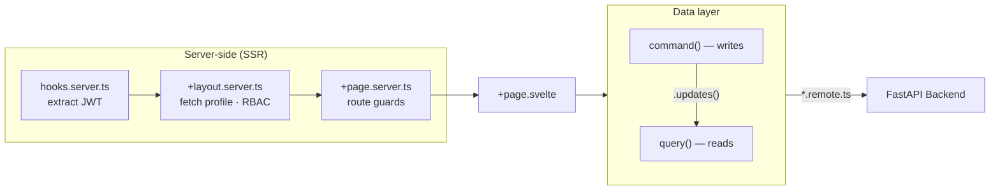
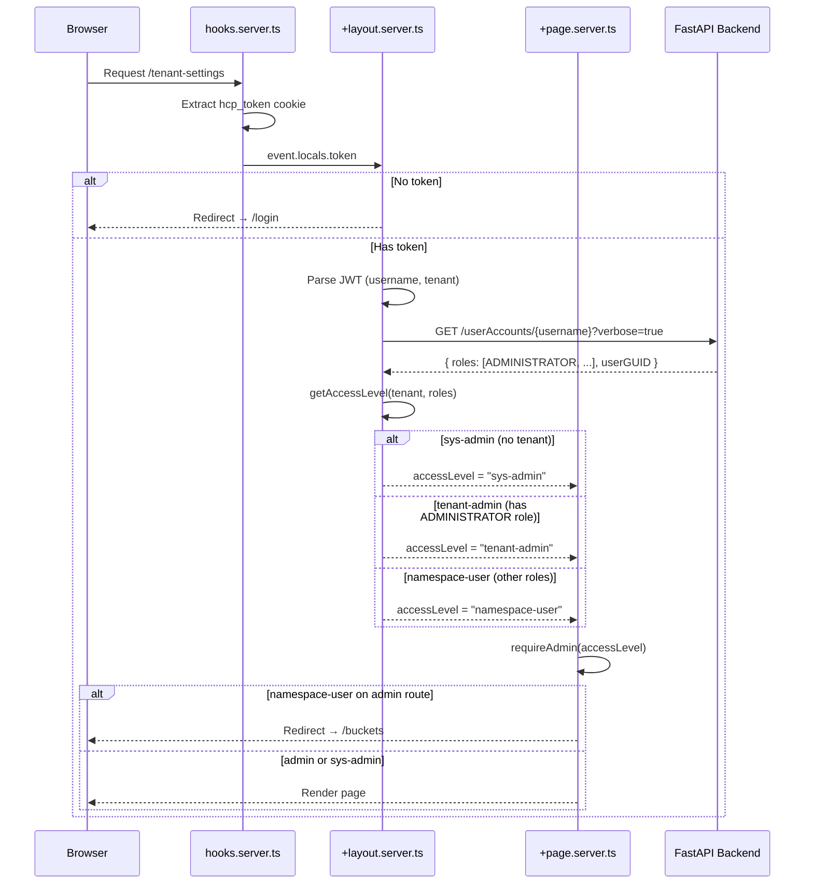

# Frontend Architecture

The SvelteKit frontend follows a reactive pattern with remote function abstractions and server-side RBAC:



## Technology choices

**SvelteKit 2 + Svelte 5** — Svelte 5's runes (`$state`, `$derived`, `$effect`) provide fine-grained reactivity without a virtual DOM. SvelteKit adds server-side rendering, file-based routing, and remote functions (server-side RPC). The combination means the frontend can fetch data on the server, enforce access control before any HTML reaches the browser, and still have a reactive client-side experience.

**Deno** — TypeScript-first runtime with built-in formatting and linting. The security model (explicit permissions) and modern tooling (`deno fmt`, `deno lint`) reduce configuration overhead compared to Node.js + ESLint + Prettier.

**shadcn-svelte** — copy-paste UI components built on Bits UI accessibility primitives and Tailwind CSS. The project owns every component file, so customization doesn't fight upstream. Bits UI handles keyboard navigation, focus management, and ARIA attributes.

## Authentication flow

### Cookie-based sessions

`src/hooks.server.ts` intercepts every request and extracts the active session:

```typescript
export const handle: Handle = ({ event, resolve }) => {
  const token = event.cookies.get("hcp_token");
  if (token) event.locals.token = token;
  event.locals.sessions = enumerateSessions(event.cookies, token);
  return resolve(event);
};
```

The JWT is stored in an httpOnly cookie (`hcp_token`), inaccessible to client JavaScript. `event.locals.token` is available to all server-side load functions and remote function handlers.

### Multi-session support

Users can log in to multiple tenants simultaneously. Each session gets its own cookie named `hcp_token__{tenant}__{username}` (with a `__sysadmin` slug for system-level sessions). The active session is copied to `hcp_token`.

`src/lib/server/sessions.ts` manages the cookie lifecycle:

| Function | Purpose |
|----------|---------|
| `enumerateSessions()` | Iterates all `hcp_token__*` cookies, parses JWT claims, returns a `TenantSession[]` with `isActive` flag |
| `setSessionCookies()` | Sets both the per-session cookie and the active `hcp_token` cookie |
| `switchSession()` | Copies a stored session token to `hcp_token` |
| `deleteActiveSession()` | Removes the active session, falls back to the next remaining session |
| `deleteAllSessions()` | Removes all session cookies |

All cookies use `{ httpOnly: true, sameSite: "lax", maxAge: 28800 }` (8 hours, matching the JWT expiry).

### User profile and access levels

`src/routes/(app)/+layout.server.ts` runs on every authenticated page load:

```typescript
export const load: LayoutServerLoad = async ({ locals }) => {
  if (!locals.token) redirect(302, "/login");
  const claims = parseJwtPayload(locals.token);
  const username = claims.sub as string;
  const tenant = claims.tenant as string | undefined;
  const profile = tenant
    ? await fetchUserProfile(locals.token, tenant, username)
    : { userGUID: undefined, roles: [] };
  const accessLevel = getAccessLevel(tenant, profile.roles);
  return { authenticated: true, username, tenant, userGUID: profile.userGUID,
           roles: profile.roles, accessLevel, sessions: locals.sessions };
};
```

`parseJwtPayload()` base64-decodes the JWT payload without verifying the signature — the backend already validated it. `fetchUserProfile()` calls the backend's MAPI endpoint to get the user's roles and GUID, degrading gracefully on failure (empty roles, no GUID).

### Three-tier access model

`getAccessLevel()` in `src/lib/constants.ts` computes the access level:

```typescript
export function getAccessLevel(
  tenant: string | undefined, roles: string[]
): AccessLevel {
  if (!tenant) return "sys-admin";
  if (roles.includes("ADMINISTRATOR")) return "tenant-admin";
  return "namespace-user";
}
```

The access level is computed server-side and passed to every page via layout data. Client components read it but cannot modify it.

### Route guards

Protected pages call `requireAdmin()` in their `+page.server.ts`:

```typescript
export const load: PageServerLoad = async ({ parent }) => {
  const { accessLevel } = await parent();
  requireAdmin(accessLevel);
};
```

`requireAdmin()` (`src/lib/server/guards.ts`) redirects `namespace-user` to `/buckets`. The guard runs on the server before any page HTML is generated — there's no flash of protected content.



### Access levels

| Level | Condition | Visible sidebar sections | Protected routes (redirects to `/buckets`) |
|-------|-----------|--------------------------|---------------------------------------------|
| **sys-admin** | No tenant in JWT | All sections | None — full access |
| **tenant-admin** | Has `ADMINISTRATOR` role | All sections | None — full access to tenant |
| **namespace-user** | Any other role set | Storage, Analytics | `/namespaces`, `/users`, `/tenant-settings`, `/search`, `/content-classes` |

## Remote functions — the data layer

### What are remote functions?

SvelteKit remote functions are server-side RPC endpoints defined in `*.remote.ts` files. They execute on the server, have access to `event.locals`, and return reactive data to Svelte components. The framework handles serialization, caching, and re-fetching transparently.

Two primitives:

- `query()` — for reads. Returns a reactive object with a `.current` property that updates when the query is re-fetched.
- `command()` — for writes. Returns a promise that resolves on success or throws on failure.

All remote files live in `src/lib/remote/`:

| File | Scope |
|------|-------|
| `users.remote.ts` | User/group CRUD, permissions, passwords |
| `namespaces.remote.ts` | Namespace CRUD, protocols, compliance, retention, CORS |
| `content-classes.remote.ts` | Content class CRUD |
| `tenant-info.remote.ts` | Tenant info, statistics, chargeback, settings |
| `buckets.remote.ts` | S3 bucket/object CRUD, ACL, versioning, presign, multipart, ZIP download |
| `search.remote.ts` | Object and operation search |
| `lance.remote.ts` | LanceDB table discovery, schema, rows, search |
| `system.remote.ts` | System-level admin operations |
| `replication.remote.ts` | Replication link management |

### How apiFetch works

`apiFetch()` in `src/lib/server/api.ts` is the bridge between remote functions and the backend:

```typescript
export function apiFetch(path: string, init?: RequestInit): Promise<Response> {
  const event = getRequestEvent();
  const token = event.locals.token;
  const headers = new Headers(init?.headers);
  if (token) headers.set("Authorization", `Bearer ${token}`);
  return fetch(`${BACKEND_URL}${path}`, { ...init, headers });
}
```

It uses `getRequestEvent()` to access the current request's `locals.token` and injects the `Authorization` header automatically. `BACKEND_URL` defaults to `http://127.0.0.1:8000`. This function is server-only — it can't run in the browser because `getRequestEvent()` requires a SvelteKit server context.

### Query pattern

Queries validate parameters with Zod and return sensible defaults on failure:

```typescript
export const get_users = query(
  z.object({ tenant: z.string() }),
  async ({ tenant }) => {
    const res = await apiFetch(
      `/api/v1/mapi/tenants/${tenant}/userAccounts?verbose=true`
    );
    if (res.ok) {
      const data = await res.json();
      return data.userAccounts ?? [];
    }
    return []; // graceful degradation
  },
);
```

Queries without parameters omit the Zod schema:

```typescript
export const get_buckets = query(async () => { ... });
```

The empty-array fallback is deliberate: partial data is better than a crashed page. Errors are logged to the console, not thrown to the UI.

### Command pattern

Commands throw errors so the calling component can show feedback:

```typescript
export const create_user = command(
  z.object({ tenant: z.string(), username: z.string(), /* ... */ }),
  async ({ tenant, ...body }) => {
    const res = await apiFetch(`/api/v1/mapi/tenants/${tenant}/userAccounts`, {
      method: "PUT",
      headers: { "Content-Type": "application/json" },
      body: JSON.stringify(body),
    });
    if (!res.ok) {
      const err = await res.json().catch(() => ({ detail: "Failed" }));
      throw new Error(err.detail);
    }
  },
);
```

### The .updates() pattern

After a command succeeds, related queries need to reflect the change. The `.updates()` method triggers a re-fetch:

```typescript
await create_namespace({ tenant, name, ... }).updates(get_namespaces);
```

This replaces manual `invalidate()` calls. The component doesn't need to know which queries to refresh — the remote function call declares its dependencies explicitly.

## Reactive state patterns

### $state — mutable reactive variables

`$state` is used for local UI state that changes in response to user interaction:

```svelte
let activeTab = $state('users');
let createUserOpen = $state(false);
let userSearch = $state('');
let sorting = $state<SortingState>([]);
```

### $derived — computed values

`$derived` creates read-only values that update automatically when their dependencies change:

```svelte
let tenant = $derived(page.data.tenant as string | undefined);
let usersData = $derived(tenant ? get_users({ tenant }) : undefined);
let users = $derived((usersData?.current ?? []) as User[]);
let filteredUsers = $derived(
  users.filter((u) => u.username.toLowerCase().includes(userSearch.toLowerCase()))
);
```

This creates a reactive chain: `tenant` → `usersData` → `users` → `filteredUsers`. When the tenant changes, the entire chain re-evaluates. When the search filter changes, only `filteredUsers` re-evaluates.

For complex derivations that need intermediate variables, `$derived.by()` accepts a function:

```svelte
let userPermsMap = $derived.by(() => {
  const map = new SvelteMap<string, ...>();
  for (const u of users) {
    map.set(u.username, get_user_permissions({ tenant, username: u.username }));
  }
  return map;
});
```

`$derived` is preferred over `$effect` for data transformations because it's synchronous, predictable, and has no side effects. It cannot trigger infinite loops or race conditions.

### $effect — side effects

`$effect` runs a callback whenever its reactive dependencies change. It's used sparingly, primarily for two patterns:

**Async work with cancellation:**

```svelte
$effect(() => {
  const currentUrl = url;
  let cancelled = false;
  if (open && category === 'text' && currentUrl) {
    (async () => {
      loading = true;
      try {
        const res = await fetch(currentUrl);
        if (cancelled) return;
        textContent = await res.text();
      } finally {
        if (!cancelled) loading = false;
      }
    })();
  }
  return () => { cancelled = true; };
});
```

The `cancelled` flag prevents stale async results from overwriting newer state. The cleanup function runs when the effect re-runs or the component is destroyed.

**Syncing remote data to local state after save:**

```svelte
$effect(() => {
  const current = (permsData?.current as DataAccessPermissions) ?? {};
  void saver.syncVersion; // re-run when save completes
  localPerms = current.namespacePermission ?? [];
});
```

### The useSave pattern

`useSave()` (`src/lib/utils/use-save.svelte.ts`) encapsulates save logic with loading state and toast feedback:

```typescript
export function useSave(opts: { successMsg: string; errorMsg: string }) {
  let saving = $state(false);
  let syncVersion = $state(0);

  async function run(fn: () => Promise<unknown>) {
    saving = true;
    try {
      await fn();
      syncVersion++;
      toast.success(opts.successMsg);
    } catch {
      toast.error(opts.errorMsg);
    } finally {
      saving = false;
    }
  }

  return { get saving() { return saving; }, get syncVersion() { return syncVersion; }, run };
}
```

The key insight is `syncVersion`. Components reference it inside `$effect` blocks to trigger re-sync of local state from server data. When `saver.run()` succeeds, it increments `syncVersion`, which causes any `$effect` reading it to re-run — pulling fresh data from the query's `.current` property into local `$state`.

Usage in a component:

```svelte
const saver = useSave({ successMsg: 'Saved', errorMsg: 'Failed to save' });

$effect(() => {
  const current = (remoteData?.current as Settings) ?? {};
  void saver.syncVersion; // dependency trigger
  localSettings = structuredClone(current);
});

<SaveButton dirty={dirty} saving={saver.saving}
  onclick={() => saver.run(async () => await update_settings(localSettings).updates(get_settings))} />
```

### The useDelete pattern

`useDelete()` (`src/lib/utils/use-delete.svelte.ts`) manages delete confirmation state:

- `requestDelete(name)` opens a confirmation dialog for a single item
- `requestBulkDelete()` opens a confirmation dialog for selected items
- `confirmDelete(deleteFn)` executes the delete and shows toast feedback
- `confirmBulkDelete(names, deleteFn, onDone?)` deletes items sequentially with per-item error tracking

### The useSelection pattern

`useSelection()` (`src/lib/utils/use-selection.svelte.ts`) manages row selection for data tables:

```typescript
export function useSelection<T>(items: () => T[], key: (item: T) => string) {
  const selected = new SvelteSet<string>();
  const allSelected = $derived(
    items().length > 0 && items().every((i) => selected.has(key(i)))
  );
  return { selected, get allSelected() { return allSelected; }, toggleAll, toggleOne };
}
```

Uses `SvelteSet` for reactive set operations — adding or removing a key automatically triggers any `$derived` that reads the set.

## Page composition

### Layout structure

The layout nests three levels:

```
Root layout (+layout.svelte)
├── app.css (global styles)
├── ModeWatcher (dark/light mode)
├── Toaster (toast notifications)
└── View Transition API (login transitions)
    └── App layout ((app)/+layout.svelte)
        ├── NavigationProgress (top loading bar)
        ├── AppSidebar (navigation)
        └── Sidebar.Inset
            ├── AppHeader (user menu, tenant switcher)
            └── Page content (+page.svelte)
```

The root layout applies global CSS, initializes theme watching, and mounts the toast container. View transitions are only used for login/logout navigations.

The app layout sets up the sidebar shell. It passes `accessLevel` from layout data to the sidebar, and `username`, `tenant`, `userGUID`, and `sessions` to the header.

### Section components

Pages are composed of self-contained section components, each rendering as a card:

```svelte
<div class="grid gap-6 lg:grid-cols-2">
  <NamespaceSettingsSection {tenant} {namespaceName} />
  <NamespaceQuotaSection {tenant} {namespaceName} {chargeback} />
  <NamespaceComplianceSection {tenant} {namespaceName} />
  <NamespacePermissionsSection {tenant} {namespaceName} />
</div>
```

Each section fetches its own data via `query()`, manages its own edit state via `$state`, and handles saves independently via `useSave()`. The structure is `Card.Root` > `Card.Header` > `Card.Content` > `Card.Footer` (with `SaveButton`). This pattern means sections can be rearranged, added, or removed without affecting siblings.

### Sidebar navigation

`AppSidebar.svelte` filters navigation items by access level:

```svelte
let { accessLevel }: { accessLevel: AccessLevel } = $props();
const isAdmin = $derived(accessLevel !== 'namespace-user');
```

Admin-only groups (Tenant, Search & Indexing) are wrapped in `{#if isAdmin}`. Storage and Analytics are visible to all users. Active state is detected by matching `page.url.pathname` against each item's `href` using `startsWith()`.

The sidebar uses `collapsible="icon"` — it collapses to an icon-only rail on smaller screens or when toggled.

### Data tables (TanStack Table)

`createSvelteTable()` (`src/lib/components/ui/data-table/data-table.svelte.ts`) wraps `@tanstack/table-core` with Svelte 5 reactivity. Table state is stored in `$state`, and the table instance is created via `$derived`.

Usage pattern:

```svelte
let sorting = $state<SortingState>([]);
let pagination = $state<PaginationState>({ pageIndex: 0, pageSize: 25 });

let columns = $derived.by((): ColumnDef<User>[] => [
  {
    accessorKey: 'username',
    header: ({ column }) =>
      renderComponent(DataTableHeaderButton, {
        label: 'Username',
        onclick: column.getToggleSortingHandler(),
      }),
    cell: ({ row }) => renderSnippet(usernameCell, row.original),
  },
  // ...
]);

let table = $derived(
  createSvelteTable({
    get data() { return filteredUsers; },
    get columns() { return columns; },
    state: { get sorting() { return sorting; }, get pagination() { return pagination; } },
    onSortingChange: (updater) => {
      sorting = typeof updater === 'function' ? updater(sorting) : updater;
    },
    getCoreRowModel: getCoreRowModel(),
    getSortedRowModel: getSortedRowModel(),
    getPaginationRowModel: getPaginationRowModel(),
  })
);
```

Column cells use two rendering helpers: `renderComponent()` for mounting a Svelte component inside a cell, and `renderSnippet()` for inline markup via Svelte 5 snippets.

The `DataTable` component renders the table with sortable headers, clickable rows, pagination controls (auto-shown when >25 rows), and an empty state message. Over 11 pages use this pattern for tables.

## Component library

### shadcn-svelte components

The project owns all shadcn-svelte component files in `src/lib/components/ui/`. These are copy-paste components built on Bits UI accessibility primitives. Key components: Button, Card, Dialog, AlertDialog, Table, Badge, Input, Select, Tabs, DropdownMenu, Sidebar, Sonner (toasts), Checkbox, Label, Separator, Tooltip, Progress.

### Custom components

Project-specific components live in `src/lib/components/custom/`:

| Component | Purpose |
|-----------|---------|
| `PageHeader` | Page title + description + optional action buttons slot |
| `SaveButton` | Save button with dirty/saving states, spinner, "Unsaved changes" indicator |
| `FormDialog` | Reusable dialog with form, error banner, submit/cancel buttons |
| `DeleteConfirmDialog` | Alert dialog for delete confirmation with optional force-delete checkbox |
| `ErrorBanner` | Conditional red error message banner |
| `CopyableInput` | Read-only input with copy-to-clipboard, optional secret masking |
| `TagInput` | Add/remove tags as badge list with text input |
| `IpListEditor` | Add/remove IP addresses or CIDRs as badge list |
| `CorsEditor` | XML textarea for CORS rules with save/delete and dirty tracking |
| `NamespacePermissionsEditor` | Permission editor with toggleable permission badges per namespace |
| `StatCard` | Dashboard stat card with icon, value, and entry animation |
| `StorageProgressBar` | Color-coded progress bar (green → yellow → red) |
| `BackButton` | Arrow-left navigation link with tooltip |
| `FileViewer` | Full modal file previewer (images, video, audio, PDF, text/code) with prev/next navigation |
| `ServiceTagBadge` | Colored badge for service tags (lakefs, nfs, cifs, hdfs, s3, smtp) |
| `StepProgress` | Vertical step list with pending/running/done/failed status icons |
| `NoTenantPlaceholder` | Placeholder shown when no tenant is selected |
| `NavigationProgress` | Animated top bar shown during SvelteKit navigations |
| `AppSidebar` | Main navigation sidebar with access-level filtering |
| `AppHeader` | Header with user menu, tenant switcher, theme toggle |
