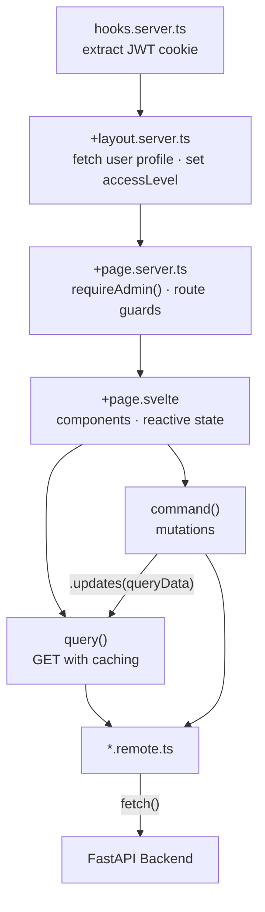
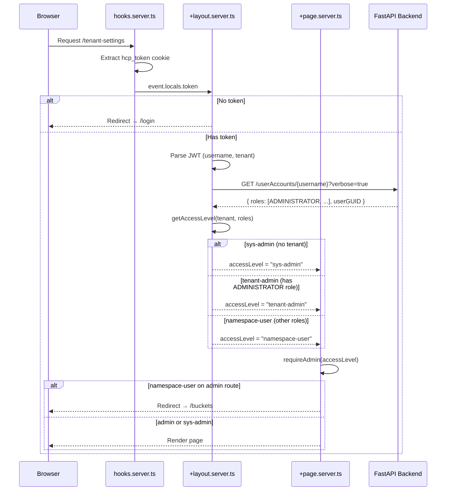

# Frontend Architecture

The SvelteKit frontend follows a reactive pattern with remote function abstractions and server-side RBAC:

## RBAC

The frontend enforces role-based access control entirely on the server side, making it impossible to bypass via client-side manipulation.

### Access levels

| Level | Condition | Visible sidebar sections | Protected routes (redirects to `/buckets`) |
|-------|-----------|--------------------------|---------------------------------------------|
| **sys-admin** | No tenant in JWT | All sections | None — full access |
| **tenant-admin** | Has `ADMINISTRATOR` role | All sections | None — full access to tenant |
| **namespace-user** | Any other role set | Storage, Analytics | `/namespaces`, `/users`, `/tenant-settings`, `/search`, `/content-classes` |
