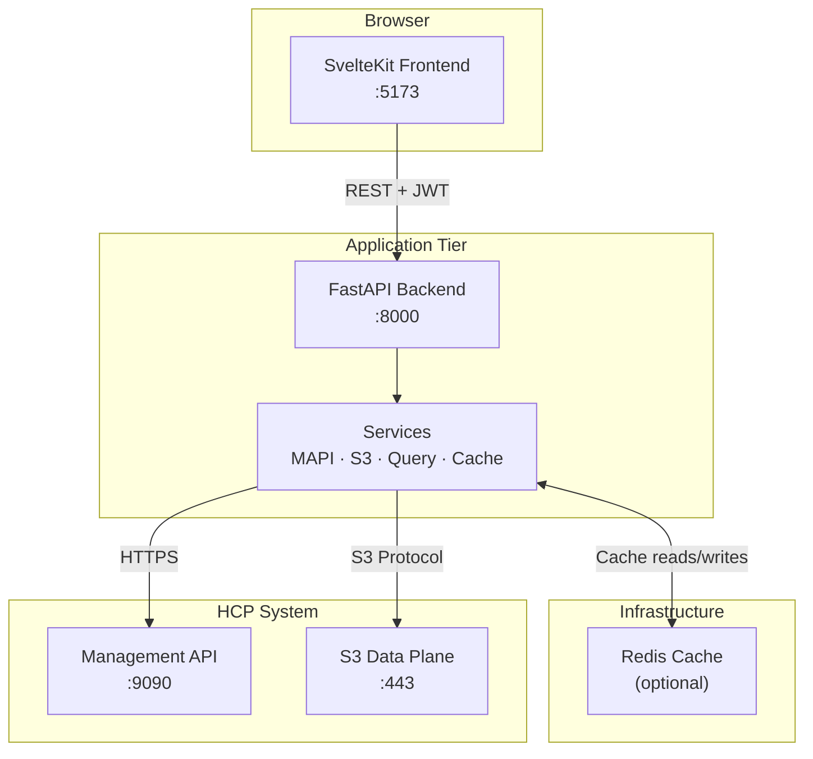
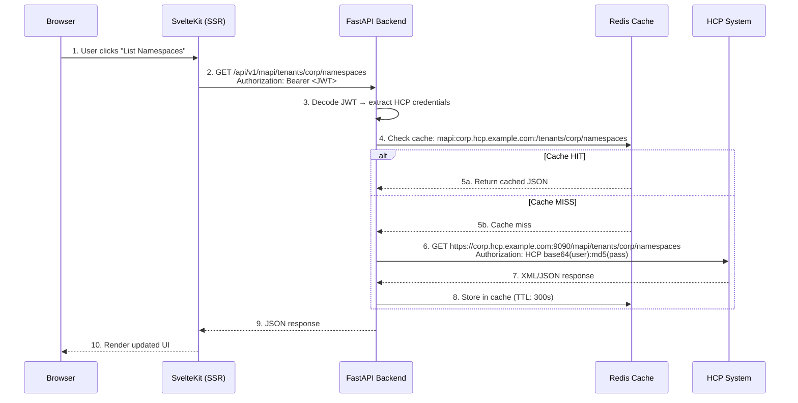
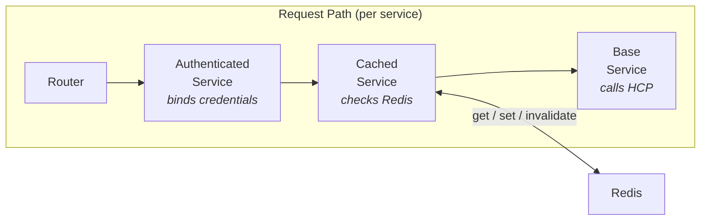
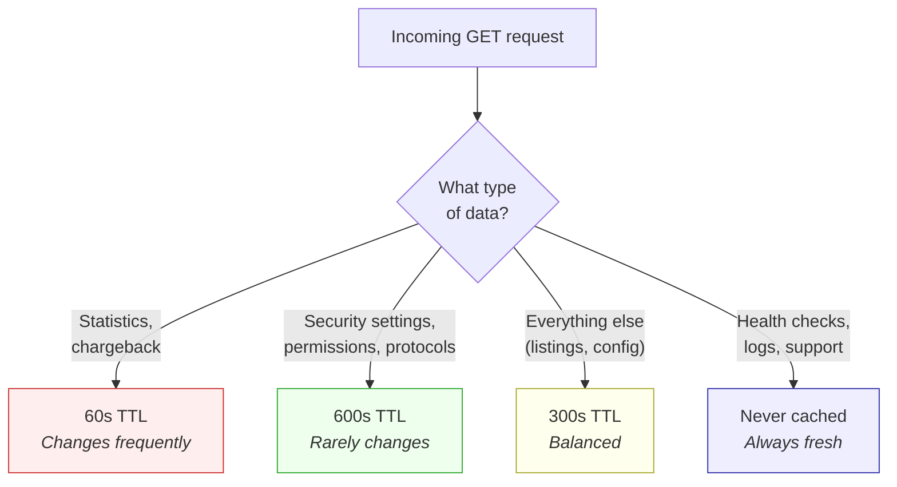
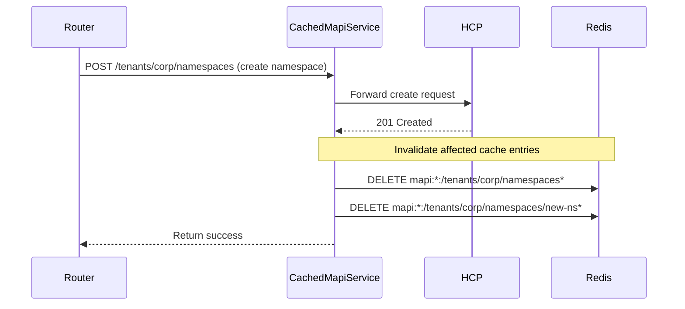
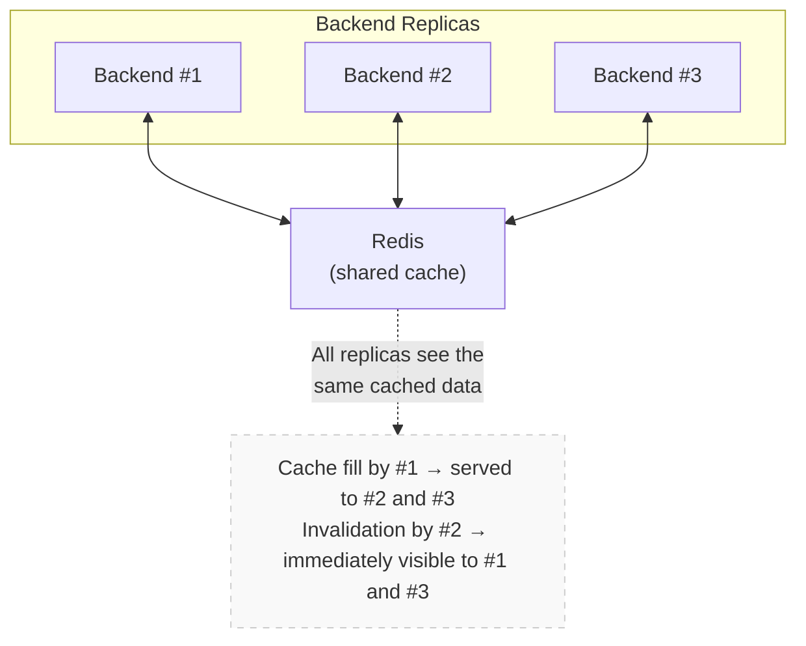
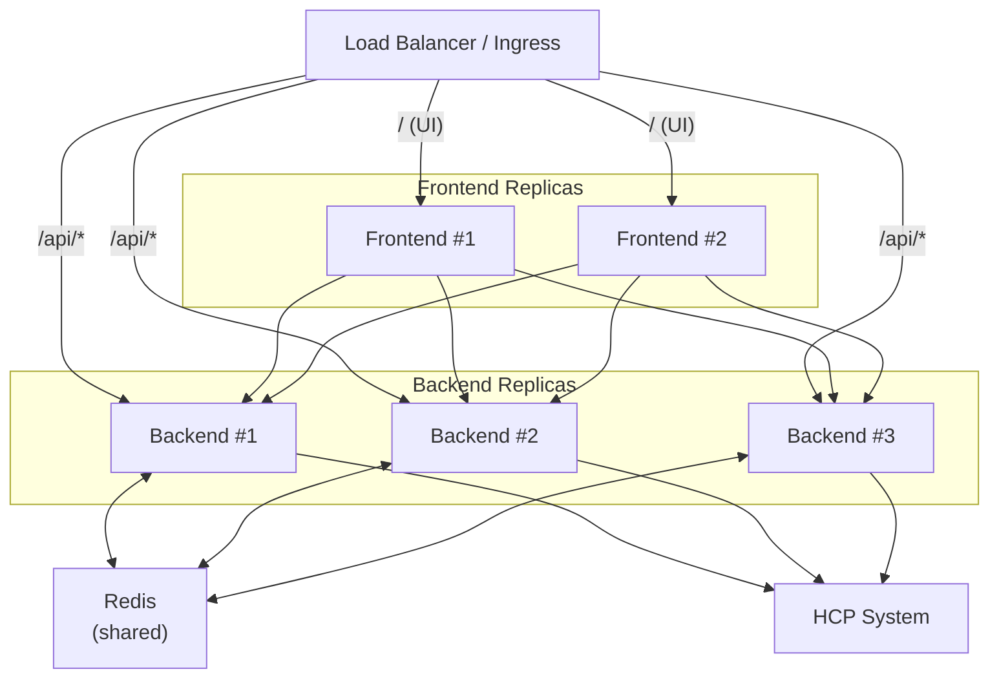
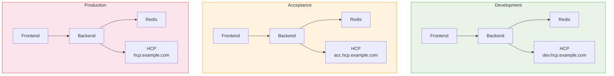
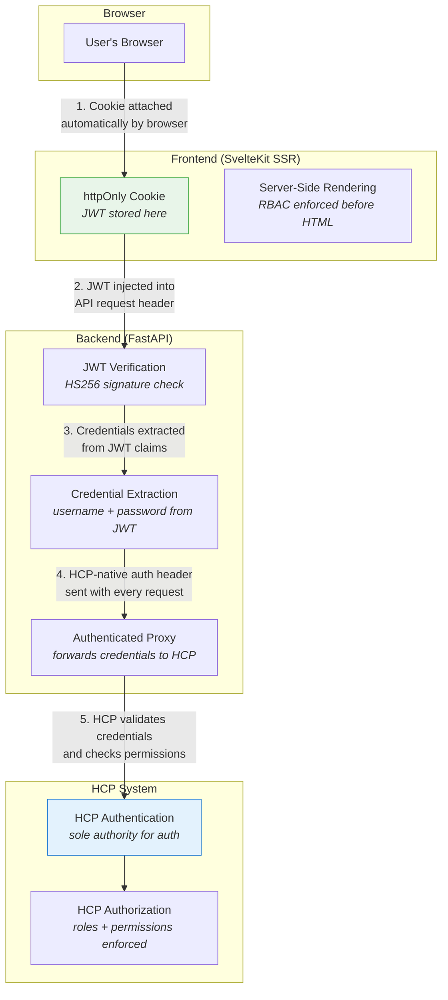

# Architecture

This page explains how the HCP App is designed, how the pieces fit together, and why. If you're evaluating the system for production use, start here.

## How It Works — The Big Picture

The HCP App is a **three-tier web application** that sits between your users and a Hitachi Content Platform (HCP) system. It provides a modern web interface for HCP administration and S3 data operations.



**In plain terms:**

1. A user opens the web UI in their browser (the **frontend**).
2. The frontend makes API calls to the **backend**, attaching a JWT for authentication.
3. The backend decodes the JWT, extracts HCP credentials, and calls the **HCP system** on behalf of the user.
4. Responses are optionally cached in **Redis** to reduce load on HCP and speed up repeat requests.
5. The backend returns JSON to the frontend, which renders the UI.

The frontend never talks to HCP directly — the backend acts as a secure proxy that handles authentication, caching, and protocol translation.

## Request Flow

This sequence diagram shows exactly what happens when a user performs an action:



## Caching Architecture

Caching is **optional but recommended**. When Redis is available, the backend caches responses from HCP to reduce latency and load. When Redis is unavailable, every request goes directly to HCP — the application works identically, just slower.

### How Cache Layers Work

The backend uses a **composition pattern** where each service can be wrapped with a caching layer. The caching is transparent — the router doesn't know or care whether responses come from cache or from HCP.



There are four independently cached services:

| Service | What it caches | Cache key pattern | Example |
|---------|---------------|-------------------|---------|
| **CachedMapiService** | Admin API responses (tenant config, namespace settings, user lists) | `mapi:{host}:{path}?{query}` | `mapi:corp.hcp.com:/tenants/corp/namespaces` |
| **CachedQueryService** | Metadata search results | `query:{tenant}:obj:{sha256[:16]}` | `query:corp:obj:a1b2c3d4e5f67890` |
| **CachedStorage** | S3 listings, metadata, ACLs, versioning status | `s3:{bucket}:{operation}` | `s3:invoices:list_objects` |
| **CachedLanceService** | Table listings and schemas (metadata only) | `lance:{table}:{operation}` | `lance:my_table:schema` |

### TTL Strategy — Different Data, Different Lifetimes

Not all data changes at the same rate. The cache uses **path-based TTL selection** so frequently-changing data expires faster:



| Data type | TTL | Rationale |
|-----------|-----|-----------|
| Statistics & chargeback | 60 seconds | Storage usage changes with every write |
| Security, permissions, protocols | 600 seconds | Admin settings change infrequently |
| General listings & config | 300 seconds | Balanced — catches most reads without stale data |
| S3 object listings | 120 seconds | Object lists change with uploads/deletes |
| Query results (objects) | 60 seconds | Search results should reflect recent changes |
| Query results (operations) | 120 seconds | Operation logs are append-only, slightly less volatile |

### Cache Invalidation — Keeping Data Consistent

When a **write operation** succeeds, the cache layer automatically invalidates affected entries:



The invalidation is **precise** — creating a namespace invalidates the namespace list and the new namespace's cache entries, but not unrelated tenant settings. This avoids both stale data (under-invalidation) and unnecessary cache misses (over-invalidation).

### Redis as a Shared, Distributed Cache

Redis runs as a **single shared instance** that all backend replicas connect to. This means:

- All backend replicas share the **same cache state** — a cache fill from one replica benefits all others
- Cache invalidation from one replica is immediately visible to all others
- No cache duplication or inconsistency between replicas



!!! tip "Graceful degradation"
    If Redis goes down, the application continues to work. Cache operations silently fail, and every request hits HCP directly. When Redis recovers, caching resumes automatically. No restart required.

## Scaling and Load Balancing

### Frontend and Backend Scale Independently

The frontend and backend are **separate containers** that can be scaled independently. A load balancer or ingress controller distributes traffic to the available replicas.



**Scaling guidelines:**

| Component | When to add replicas | Stateless? |
|-----------|---------------------|------------|
| Frontend | High number of concurrent browser sessions | Yes — no server-side state beyond the request |
| Backend | High API throughput or slow HCP responses | Yes — all state is in Redis + HCP |
| Redis | Typically not replicated (single instance is sufficient for most deployments) | N/A — this is the shared state |

Both frontend and backend are **fully stateless** — any request can go to any replica. This makes horizontal scaling straightforward with standard Kubernetes HPA or load balancer health checks.

## Environment Isolation — One Stack Per Domain

Each environment (development, acceptance, production) gets its **own dedicated stack**: its own frontend, its own backend, its own Redis, all pointing to its own HCP domain. Environments are **never mixed**.



### Why 1:1 Isolation?

The backend is configured at startup with a single `HCP_DOMAIN` environment variable. This domain determines which HCP system (and therefore which tenants, namespaces, and data) the backend communicates with. There is no runtime domain switching.

This design provides:

- **Data safety** — A development frontend cannot accidentally connect to a production backend. The `HCP_DOMAIN` is baked into each deployment.
- **Independent scaling** — Production can have 5 backend replicas while development runs with 1.
- **Independent upgrades** — Roll out a new version in acceptance first, verify, then promote to production.
- **Blast radius containment** — A misconfiguration in development cannot affect production data.

### Deploying Multiple Environments with Helm

Each environment is a separate Helm release with its own values:

```bash
# Development
helm install hcp-dev charts/helm-ra-hcp-v0.1.0 \
  -f values-dev.yaml \
  --set env.HCP_DOMAIN=dev.hcp.example.com

# Acceptance
helm install hcp-acc charts/helm-ra-hcp-v0.1.0 \
  -f values-acc.yaml \
  --set env.HCP_DOMAIN=acc.hcp.example.com

# Production
helm install hcp-prod charts/helm-ra-hcp-v0.1.0 \
  -f values-prod.yaml \
  --set env.HCP_DOMAIN=hcp.example.com
```

You can run multiple replicas within each environment, but the replicas always share the same `HCP_DOMAIN` — they never cross environment boundaries.

## Security Architecture

### Security Model Overview



### Authentication — No Stored Credentials

The backend does **not** maintain a user database. It acts as a **credential proxy**:

1. The user logs in with HCP credentials.
2. The backend wraps them in a **signed JWT** (HS256) and returns it as an **httpOnly cookie**.
3. On every subsequent request, the browser sends the cookie, the backend extracts the credentials, and forwards them to HCP.
4. **HCP is the sole authority** for authentication and authorization. If the credentials are invalid, HCP rejects the request.

This means there is no secondary auth layer to compromise — the backend cannot grant access that HCP wouldn't.

### Defense in Depth

The application applies security at every layer:

| Layer | Protection | How |
|-------|-----------|-----|
| **Browser → Frontend** | JWT is never exposed to JavaScript | httpOnly, sameSite=lax cookies; 8-hour expiry |
| **Frontend (SSR)** | Access control before HTML rendering | Server-side route guards check roles before generating any page content |
| **Frontend → Backend** | Tamper-proof authentication | JWT signed with HS256 using `API_SECRET_KEY`; signature verified on every request |
| **Backend → HCP** | Credential forwarding | HCP-native auth headers; backend never stores credentials beyond the JWT lifetime |
| **Network** | TLS everywhere | HTTPS for all HCP communication; configurable SSL verification |
| **Container** | Principle of least privilege | Non-root user (UID 1000), read-only root filesystem (backend), all Linux capabilities dropped |
| **CORS** | Cross-origin protection | Configurable `CORS_ORIGINS`; empty = allow all (dev), explicit list = restricted (prod) |

### Container Security Hardening

The Helm chart enforces security best practices at the container level:

```yaml
# Pod-level: all containers run as non-root
securityContext:
  runAsUser: 1000
  runAsGroup: 1000
  runAsNonRoot: true

# Container-level: minimal permissions
securityContext:
  allowPrivilegeEscalation: false
  readOnlyRootFilesystem: true    # backend
  capabilities:
    drop: ["ALL"]                 # no Linux capabilities
```

Redis runs as its own non-root user (UID 999) with the same hardened profile.

### Common Security Questions

??? question "Are credentials stored in the JWT? Is that safe?"
    Yes, the JWT contains the HCP password. This is intentional — the backend needs it for every proxied request. The JWT is:

    - **Signed** with a server-side secret (not readable without the key)
    - Stored in an **httpOnly cookie** (JavaScript cannot access it)
    - **Short-lived** (8 hours by default)
    - **Never logged** (middleware extracts user/tenant from JWT for logging but never the password)

    The alternative (storing credentials server-side in a session store) would add complexity and a new attack surface without meaningful security improvement, since the backend must have access to the plaintext password regardless.

??? question "What happens if Redis is compromised?"
    Redis stores **cached API responses** (namespace lists, configuration data, etc.). It does **not** store credentials, JWTs, or authentication tokens. A compromised Redis could expose cached HCP metadata (what namespaces exist, their settings, etc.) but could not be used to authenticate to HCP or access object data.

    For additional protection in sensitive environments:

    - Use Redis ACLs to restrict access to the cache key prefix
    - Enable Redis TLS (`rediss://` URL scheme)
    - Run Redis on a private network segment accessible only to backend pods

??? question "Can the frontend be used to attack the backend?"
    The frontend communicates with the backend through a well-defined API with JWT authentication. The backend validates every request independently:

    - JWT signature is verified before any action
    - All MAPI/S3 operations use the credentials from the JWT — the backend cannot be tricked into using different credentials
    - Domain exceptions are translated to HTTP errors — internal errors don't leak stack traces or implementation details
    - Request IDs enable end-to-end tracing for audit

??? question "How does RBAC work?"
    Access control is enforced at **two levels**:

    1. **Frontend (server-side)**: Route guards check the user's HCP roles before rendering any page. A `namespace-user` is redirected away from admin pages before any HTML is generated.
    2. **HCP (authoritative)**: Every API call carries the user's HCP credentials. HCP enforces its own role-based permissions — even if the frontend guard were bypassed, HCP would reject unauthorized operations.

    The frontend RBAC is a UX optimization (hide what you can't use), while HCP RBAC is the actual security boundary.

## Deeper Dives

For detailed information about each layer, see:

- **[Backend Architecture](backend.md)** — FastAPI layering, dependency injection, services, cached wrappers, observability
- **[Frontend Architecture](frontend.md)** — SvelteKit patterns, remote functions, reactive state, component library
- **[Storage Layer](storage.md)** — S3 abstraction, pluggable backends, HCP-specific workarounds
- **[Deployment](deployment.md)** — Docker, Helm, CI/CD, production configuration
