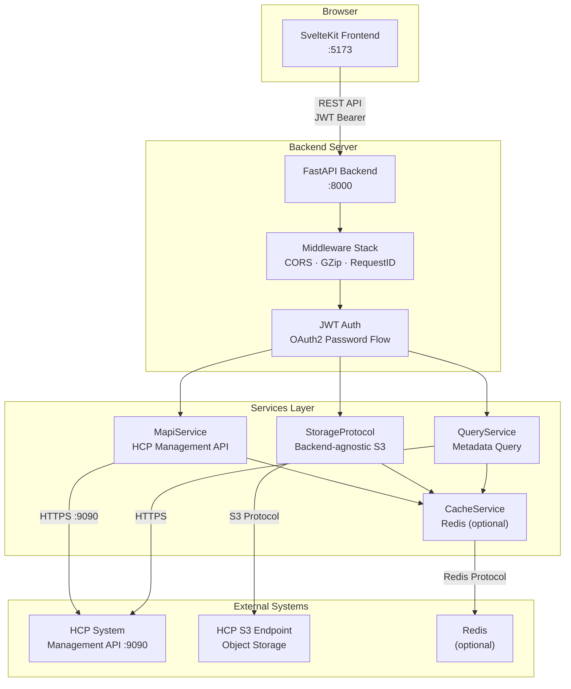
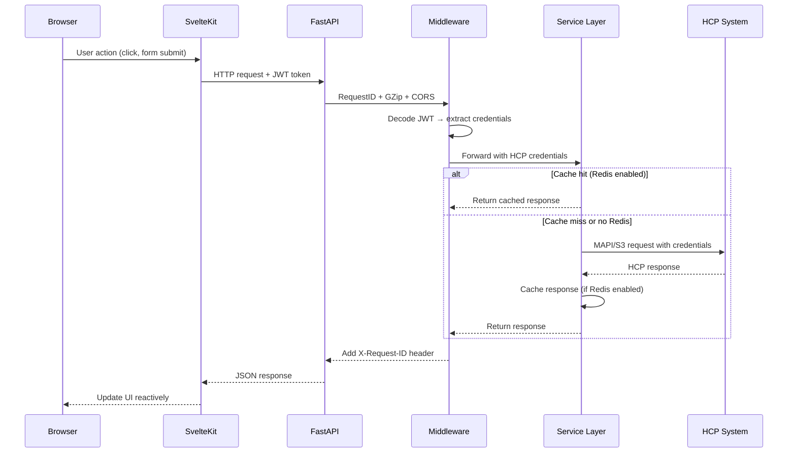

# Architecture

This page describes the overall design of the HCP application, how the backend and frontend work together, and the key architectural decisions.

## System Overview

## Request Flow

