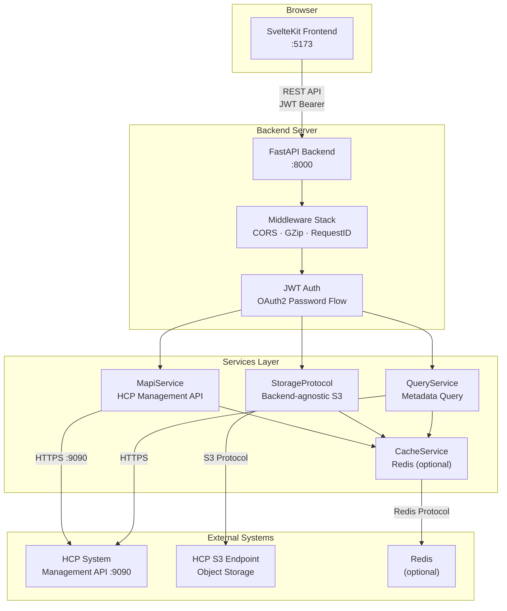
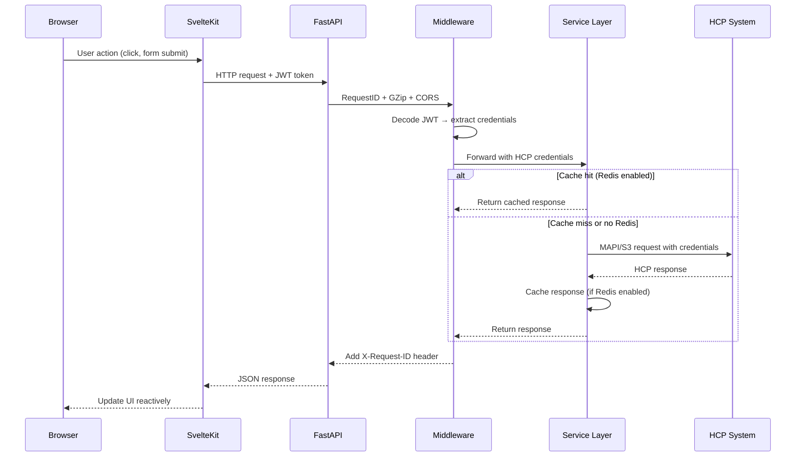
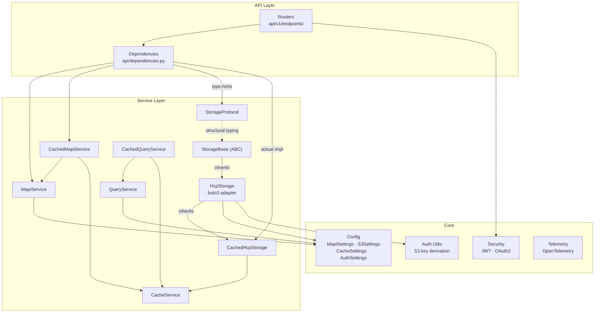
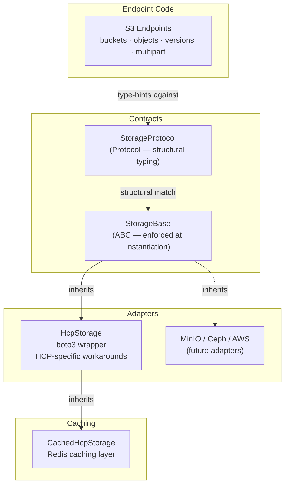
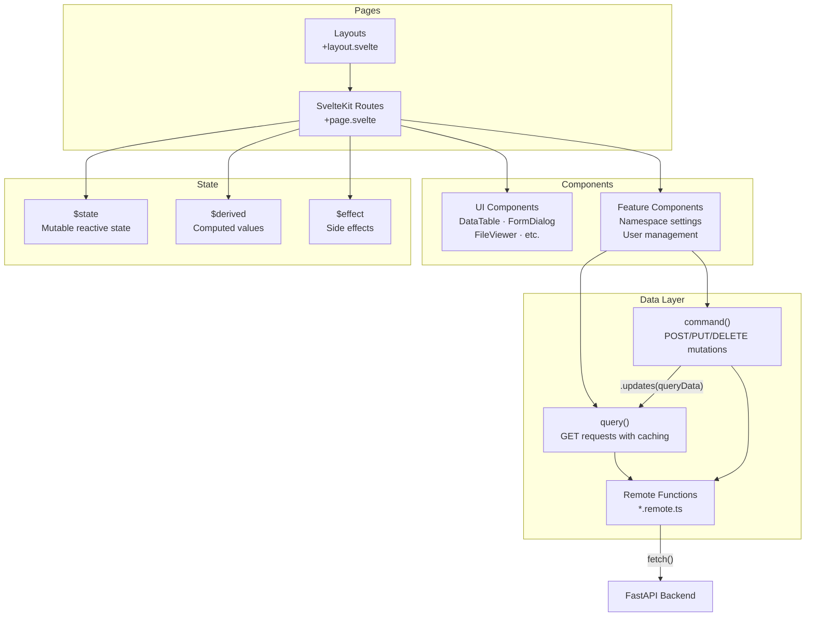
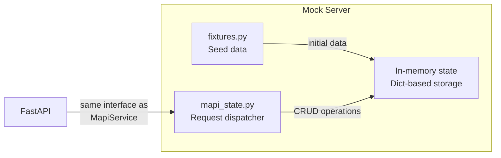
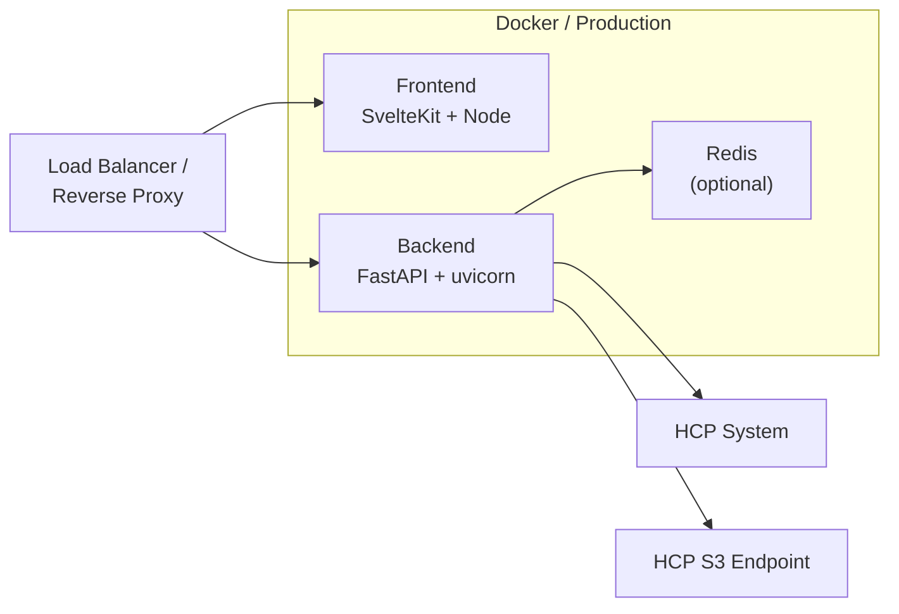

# Architecture

This page describes the overall design of the HCP application, how the backend and frontend work together, and the key architectural decisions.

## System Overview

## Request Flow

## Backend Architecture

The FastAPI backend is organized in layers:

### Key Design Decisions

- **Credential pass-through**: The API does not store user passwords. Credentials are embedded in the JWT and forwarded to HCP on each request. HCP is the sole authority for authentication and authorization.

- **Optional caching**: When Redis is configured, `CachedMapiService`, `CachedQueryService`, and `CachedHcpStorage` wrap the base services with TTL-based caching. When Redis is not configured, the base services are used directly.

- **S3 credential derivation**: S3 access keys are derived from HCP credentials (base64-encoded username + MD5-hashed password) per HCP convention. No separate S3 credentials need to be configured.

- **Backend-agnostic storage layer**: The S3 data-plane uses a hybrid Protocol + ABC pattern so storage backends (HCP, MinIO, Ceph, AWS) can be swapped without touching endpoint code. See [Storage Layer Architecture](#storage-layer-architecture) for details.

## Storage Layer Architecture

The S3 data-plane is designed to be backend-agnostic. Endpoint code type-hints against `StorageProtocol` (structural typing) and never imports backend-specific libraries like `boto3`.

### How it works

| Layer | File | Role |
|-------|------|------|
| `StorageProtocol` | `services/storage/protocol.py` | Structural typing interface — endpoint DI type hints use this |
| `StorageBase` | `services/storage/base.py` | Abstract base class — enforces method implementation at instantiation |
| `HcpStorage` | `services/storage/adapters/hcp.py` | Concrete adapter — wraps boto3 with HCP-specific workarounds |
| `CachedHcpStorage` | `services/cached_s3.py` | Caching decorator — inherits from `HcpStorage`, adds Redis caching |
| `StorageError` | `services/storage/errors.py` | Backend-agnostic exceptions — adapters catch library errors and re-raise |

### Adding a new storage backend

To add support for MinIO, Ceph, or AWS S3:

1. Create `services/storage/adapters/minio.py` (or similar)
2. Inherit from `StorageBase` — the ABC enforces all required methods
3. Catch the backend's native exceptions and re-raise as `StorageError`
4. Register the new adapter in the dependency injection layer
5. No endpoint code changes needed — they type-hint against `StorageProtocol`

### Storage operations

The storage layer supports these operation groups:

| Group | Operations |
|-------|-----------|
| **Buckets** | list, create, head, delete |
| **Objects** | list, put, get, head, delete, copy, bulk delete |
| **Versioning** | get/set bucket versioning, list object versions, version-aware get/delete |
| **ACLs** | get/set bucket ACL, get/set object ACL |
| **Multipart uploads** | create, upload part, complete, abort, list parts |
| **Presigned URLs** | generate for get/put operations |

## Frontend Architecture

The SvelteKit frontend follows a reactive pattern with remote function abstractions:

### Frontend Patterns

- **Remote functions**: All API calls are defined in `*.remote.ts` files using `query()` for reads and `command()` for mutations.

- **Mutation refresh**: After a mutation, `command(...).updates(queryData)` automatically invalidates and refetches the relevant query data.

- **Svelte 5 runes**: Components use `$state` for mutable state, `$derived` for computed values, and `$effect` for async side effects with cancellation.

## Mock Server

For development without an HCP system, the backend includes a mock server:

The mock server implements the same interface as the real MAPI service, allowing the frontend to be developed and tested independently. Start it with `make run-api-mock`.

## Deployment

| Component | Technology | Port |
|-----------|-----------|------|
| Frontend | SvelteKit 2 + Svelte 5, Deno | 5173 (dev) |
| Backend | FastAPI, Python 3.12+, uv | 8000 |
| Storage adapters | HcpStorage (boto3) — pluggable via StorageProtocol | — |
| Cache | Redis 7+ (optional) | 6379 |
| HCP MAPI | Hitachi Content Platform | 9090 |
| S3 endpoint | S3-compatible endpoint (HCP, MinIO, Ceph, AWS) | 443 |
