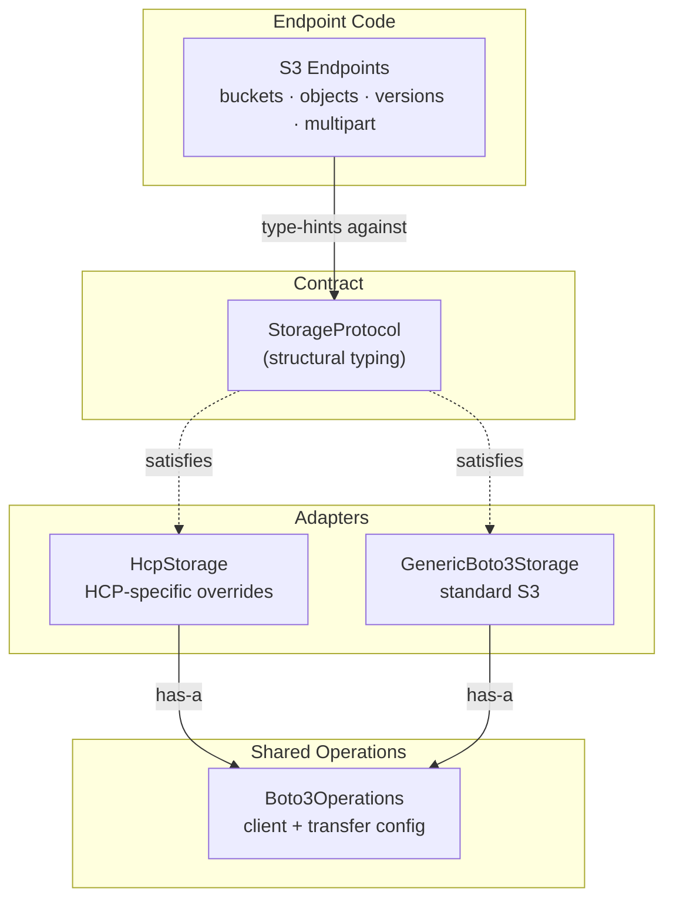

# Storage Layer

The S3 data-plane is designed to be backend-agnostic. Endpoint code type-hints against `StorageProtocol` (structural typing) and never imports backend-specific libraries like `boto3`.

## How it works

| Layer | File | Role |
|-------|------|------|
| `StorageProtocol` | `services/storage/protocol.py` | Structural typing contract — all DI type hints use this |
| `Boto3Operations` | `services/storage/adapters/_boto3_mixin.py` | Shared boto3 operations — injected into adapters via composition |
| `HcpStorage` | `services/storage/adapters/hcp.py` | HCP adapter — composes `Boto3Operations`, overrides HCP-specific behavior |
| `GenericBoto3Storage` | `services/storage/adapters/generic_boto3.py` | Generic S3 adapter — composes `Boto3Operations` for standard S3 backends |
| `StorageError` | `services/storage/errors.py` | Backend-agnostic exceptions — adapters catch library errors and re-raise |

## Adding a new storage backend

To add support for MinIO, Ceph, or AWS S3:

1. Create `services/storage/adapters/minio.py` (or similar)
2. Compose `Boto3Operations` for shared functionality
3. Override only the methods that differ from standard S3 behavior
4. Catch the backend's native exceptions and re-raise as `StorageError`
5. Register the new adapter in the factory (`services/storage/factory.py`)
6. No endpoint code changes needed — they type-hint against `StorageProtocol`

## Storage operations

| Group | Operations |
|-------|-----------|
| **Buckets** | list, create, head, delete |
| **Objects** | list, put, get, head, delete, copy, bulk delete |
| **Versioning** | get/set bucket versioning, list object versions, version-aware get/delete |
| **ACLs** | get/set bucket ACL, get/set object ACL |
| **Multipart uploads** | create, upload part, complete, abort, list parts |
| **Presigned URLs** | generate for get/put operations |

## HCP-specific workarounds

The `HcpStorage` adapter handles several HCP quirks that differ from standard S3:

| Workaround | Reason |
|------------|--------|
| Disabled S3 region redirector | HCP returns non-standard redirect responses that confuse boto3 |
| Path-style addressing | HCP does not support virtual-hosted bucket names |
| Individual deletes for bulk | HCP requires `Content-MD5` on multi-delete but boto3 sends CRC32 instead |
| OTel span tracing | Every storage operation is traced with bucket, key, and method attributes |

## Namespace protocol configuration

Each HCP namespace supports multiple access protocols configured independently via MAPI:

| Protocol | Schema | Description |
|----------|--------|-------------|
| **HTTP/REST/S3/WebDAV** | `HttpProtocol` | Primary data access protocols with IP-based access control |
| **NFS** | `NfsProtocol` | Network file system mount access |
| **CIFS/SMB** | `CifsProtocol` | Windows file sharing access |
| **SMTP** | `SmtpProtocol` | Email ingestion (storing email as objects) |

Protocol settings are managed through the namespace access endpoints (`/api/v1/mapi/tenants/{tenant}/namespaces/{ns}/protocols/`) and each includes `ipSettings` for IP-based access control.
