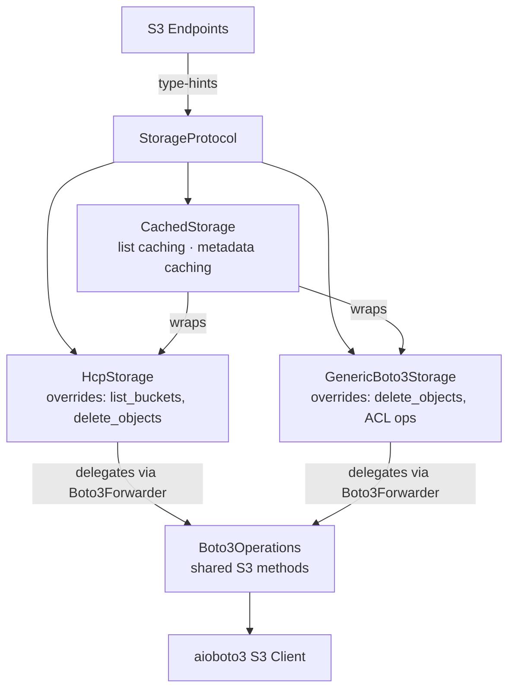

# Storage Layer

The S3 data-plane is designed to be backend-agnostic. Endpoint code type-hints against `StorageProtocol` (structural typing) and never imports backend-specific libraries like `aioboto3`.

## How it works

| Layer | File | Role |
|-------|------|------|
| `StorageProtocol` | `services/storage/protocol.py` | `@runtime_checkable` Protocol — all DI type hints use this |
| `Boto3Operations` | `services/storage/adapters/_boto3_ops.py` | Shared async S3 operations (aioboto3) — composed into adapters via `Boto3Forwarder` |
| `Boto3Forwarder` | `services/storage/adapters/_boto3_ops.py` | Typed forwarding base class — thin forwarders that delegate to `self._ops` |
| `HcpStorage` | `services/storage/adapters/hcp.py` | HCP adapter — composes `Boto3Operations` via `Boto3Forwarder`, overrides `list_buckets` and `delete_objects` |
| `GenericBoto3Storage` | `services/storage/adapters/generic_boto3.py` | Generic S3 adapter — composes `Boto3Operations` via `Boto3Forwarder`, overrides `delete_objects` and ACL operations |
| `CachedStorage` | `services/cached_storage.py` | Caching decorator — wraps any `StorageProtocol` implementation with TTL-based caching via KVCache |
| `StorageError` | `services/storage/errors.py` | Backend-agnostic exceptions — adapters catch library errors and re-raise |
| `create_storage` | `services/storage/factory.py` | Async factory function — instantiates and connects the correct adapter based on `storage_backend` setting |

### The `Boto3Forwarder` pattern

Adapters inherit from `Boto3Forwarder`, a base class with typed forwarding methods that delegate to `self._ops` (a `Boto3Operations` instance). Adapters only define the methods they need to customize — everything else is forwarded through the base class. This keeps the composition pattern while making all methods statically visible to type checkers.

## Adding a new storage backend

To add support for MinIO, Ceph, or AWS S3:

1. Create `services/storage/adapters/my_backend.py`
2. Inherit from `Boto3Forwarder` and compose `Boto3Operations` for shared functionality
3. Override only the methods that differ
4. Catch the backend's native exceptions and re-raise as `StorageError`
5. Register the new adapter in the factory (`services/storage/factory.py`)
6. No endpoint code changes needed — they type-hint against `StorageProtocol`

## Storage operations

| Group | Operations |
|-------|-----------|
| **Buckets** | list, create, head, delete |
| **Objects** | list, put, get, head, delete, copy, bulk delete |
| **Versioning** | get/set bucket versioning, list object versions, version-aware get/delete |
| **ACLs** | get/set bucket ACL, get/set object ACL |
| **Multipart uploads** | create, upload part, complete, abort, list parts, presigned multipart |
| **Presigned URLs** | generate for get/put/upload_part operations (supports `extra_params`) |

## HCP-specific workarounds

The `HcpStorage` adapter handles several HCP quirks that differ from standard S3:

| Workaround | Reason |
|------------|--------|
| Disabled S3 region redirector | HCP returns non-standard redirect responses that confuse boto3 |
| Path-style addressing | HCP does not support virtual-hosted bucket names |
| Individual deletes for bulk | HCP requires `Content-MD5` on multi-delete but boto3 sends CRC32 instead |
| OTel span tracing | Every storage operation is traced with bucket, key, and method attributes |

## Namespace protocol configuration

Each HCP namespace supports multiple access protocols configured independently via MAPI:

| Protocol | Schema | Description |
|----------|--------|-------------|
| **HTTP/REST/S3/WebDAV** | `HttpProtocol` | Primary data access protocols with IP-based access control |
| **NFS** | `NfsProtocol` | Network file system mount access |
| **CIFS/SMB** | `CifsProtocol` | Windows file sharing access |
| **SMTP** | `SmtpProtocol` | Email ingestion (storing email as objects) |

Protocol settings are managed through the namespace access endpoints (`/api/v1/mapi/tenants/{tenant}/namespaces/{ns}/protocols/`) and each includes `ipSettings` for IP-based access control.
