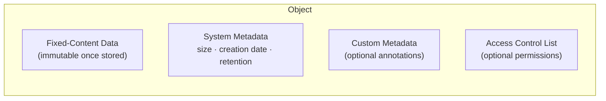
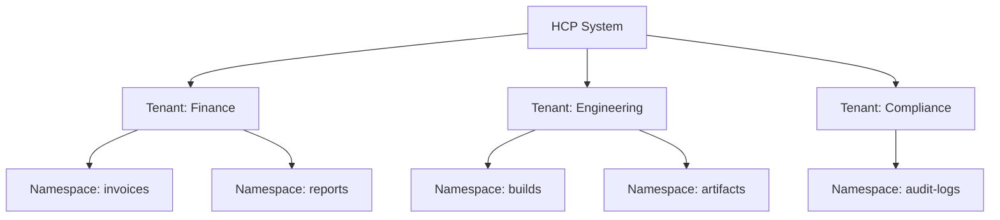
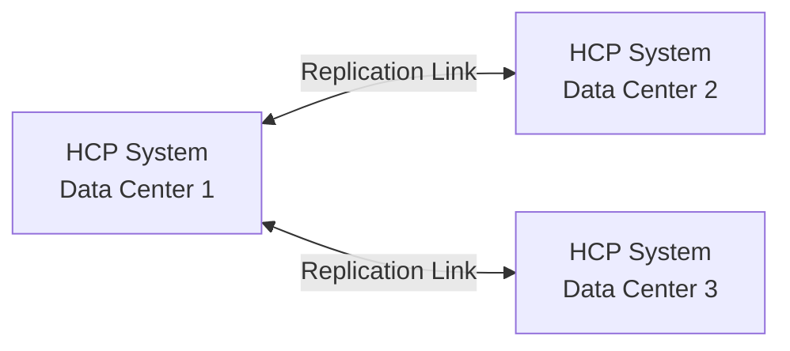

# HCP Concepts

This page explains the core concepts of Hitachi Content Platform (HCP) that you'll encounter when using the HCP App.

## How HCP Differs from Standard S3

If you're coming from AWS S3, MinIO, or Ceph, HCP will feel familiar on the data plane (it speaks S3) but very different on the management and compliance side.

| Concept | AWS S3 / MinIO | HCP |
|---------|---------------|-----|
| **Hierarchy** | Flat: just buckets | Multi-tenant: System → Tenants → Namespaces (= buckets) |
| **Management API** | Same S3 API for data + config | Separate MAPI (REST/XML on port 9090) for all admin operations |
| **Access protocols** | S3 only | S3, REST, NFS, CIFS/SMB, SMTP, WebDAV — all accessing the same data |
| **Version IDs** | UUIDs (`"aBcDeFgH..."`) | Integers (`0`, `1`, `2`, ...) |
| **Authentication** | Access key + secret key (arbitrary) | `base64(username)` + `md5(password)` — derived from user credentials |
| **Bucket addressing** | Virtual-hosted or path-style | Path-style only |
| **Retention** | S3 Object Lock (Governance/Compliance) | Built-in WORM + retention classes + S3 Object Lock |
| **Search** | External (Athena, OpenSearch) | Built-in Metadata Query API with Lucene-like syntax |
| **Content classes** | No equivalent | Schema-based custom metadata with typed, indexed properties |
| **Replication** | Cross-region replication rules | Built-in active/active geo-replication between HCP systems |
| **Bulk delete** | `DeleteObjects` with CRC32 | Requires `Content-MD5` — this app works around it with individual deletes |

!!! tip
    The HCP App abstracts most of these differences. The S3 data plane handles HCP quirks (path-style, credential derivation, bulk delete workaround) transparently, while MAPI operations are exposed through a unified REST API.

### HCP-Specific S3 Headers

HCP extends the S3 API with custom headers for retention and compliance:

| Header | Description |
|--------|-------------|
| `X-HCP-RETENTION` | Set/get retention setting (`0` deletable, `-1` permanent, `-2` unspecified, or datetime). |
| `X-HCP-RETENTIONHOLD` | Set/get a simple hold (`true`/`false`). Prevents deletion regardless of retention. |
| `X-HCP-LABELRETENTIONHOLD` | Manage multiple named retention holds (up to 100 per object). |
| `X-HCP-PRIVILEGED` | Privileged delete — remove objects under retention. Requires `PRIVILEGED` permission. |

### S3 Compatibility

HCP supports: bucket CRUD, object CRUD, ACLs, CORS, versioning, multipart uploads, presigned URLs, server-side encryption, Object Lock, and AWS Signature V2/V4. **Not supported**: lifecycle, tagging, policy, website, logging, notifications, metrics, analytics, inventory, replication config, encryption config, public access block, client-side encryption.

## Object-Based Storage

HCP stores **objects** in a repository. Each object permanently associates data with metadata:



| Component | Description |
|-----------|-------------|
| **Fixed-content data** | The actual file content. Once stored, it cannot be modified (WORM -- write once, read many). |
| **System metadata** | Automatically managed properties: size, creation date, retention policy, hash, etc. |
| **Custom metadata** | Optional user-provided annotations (XML or key-value pairs via `x-amz-meta-*` headers). |
| **ACL** | Optional access control list defining who can read, write, or manage the object. |

## Tenants

A **tenant** is an administrative entity that owns and manages a portion of the HCP repository. Tenants typically correspond to organizations, departments, or business units.



Each tenant has:

- **Quotas** -- hard and soft storage limits
- **User accounts** -- tenant-scoped credentials with role-based access
- **Configuration** -- console security, email notifications, namespace defaults
- **Statistics** -- storage usage and chargeback reporting

## Namespaces (Buckets)

A **namespace** (also called a **bucket** in S3 terminology) is a logical container for objects within a tenant. Objects in one namespace are not visible in any other namespace.

Namespaces provide:

- **Isolation** -- separate data for different applications or purposes
- **Protocol configuration** -- each namespace can enable/disable HTTP, S3, NFS, CIFS, SMTP independently
- **Compliance settings** -- retention policies, versioning, and hold rules per namespace
- **Search indexing** -- custom metadata indexing for the Metadata Query API

!!! tip "Buckets = Namespaces"
    In the S3 API, namespaces are called "buckets." The terms are interchangeable. When you create a bucket via S3, you're creating a namespace. When you manage namespaces via MAPI, you're managing buckets.

## Versioning

HCP can store **multiple versions** of an object, providing a history of changes over time. Each version is a separate object with its own metadata.

| Concept | Description |
|---------|-------------|
| **Version ID** | Integer identifier for each version (HCP uses integer IDs, not UUIDs like AWS S3). |
| **Delete marker** | When versioning is enabled, deleting an object creates a delete marker instead of removing data. |
| **Pruning** | Removing old versions of an object while keeping the current version. |
| **Purging** | Permanently removing all versions of an object, including the current version. |

Versioning is enabled per namespace and can be toggled between `Enabled` and `Suspended`.

## Retention & Compliance

HCP provides WORM (Write Once, Read Many) storage with configurable retention policies to prevent premature deletion.

### Retention Modes

| Mode | Value | Behavior |
|------|-------|----------|
| **Deletion Allowed** | `0` | Object can be deleted at any time. |
| **Deletion Prohibited** | `-1` | Object can never be deleted (permanent retention). |
| **Initial Unspecified** | `-2` | Retention not yet set -- can be set later. |
| **Fixed date** | datetime | Object cannot be deleted until the specified date. |
| **Offset** | `A+7y` | Retention calculated relative to ingest time (e.g., 7 years after creation). |
| **Retention class** | class name | Retention defined by a named class with a specific period. |

### S3 Object Lock

HCP also supports **S3 Object Lock** for applications using the S3 API:

- **Governance mode** -- most users cannot delete, but users with `BypassGovernanceRetention` permission can override.
- **Compliance mode** -- no one can delete until the retention period expires, not even administrators.
- **Legal holds** -- prevent deletion regardless of retention settings. Up to 100 labeled holds per object.

### Retention Classes

Retention classes are named policies defined at the namespace level. They simplify management by letting you assign a class name instead of a specific date to each object. When you update a retention class, all objects using that class are updated automatically.

## Roles & Permissions

### Tenant Roles

User accounts within a tenant are assigned one or more roles:

| Role | Permissions |
|------|-------------|
| **ADMINISTRATOR** | Full tenant administration: namespaces, users, settings, protocols. |
| **SECURITY** | Manage console security, search security, and user accounts. |
| **MONITOR** | Read-only access to statistics, chargeback reports, and configuration. |
| **COMPLIANCE** | Manage compliance settings, retention classes, and content classes. |

### Data Access Permissions

In addition to roles, users can be granted **data access permissions** for individual namespaces:

| Permission | Description |
|------------|-------------|
| BROWSE | List namespace contents. |
| READ | View and retrieve objects and their metadata. |
| WRITE | Store, copy, and modify objects. |
| DELETE | Delete objects and versions. |
| PURGE | Permanently remove all versions. |
| SEARCH | Search objects via the Metadata Query API. |
| READ_ACL | View object and bucket ACLs. |
| WRITE_ACL | Modify object and bucket ACLs. |
| CHANGE_OWNER | Change object ownership. |
| PRIVILEGED | Delete objects under retention (privileged delete). |

## Protocols

HCP supports multiple access protocols, each configured independently per namespace:

| Protocol | Use Case |
|----------|----------|
| **S3** | Primary API for modern applications. RESTful, compatible with AWS S3 tools. |
| **REST** | HCP-native HTTP API with additional metadata features. |
| **NFS** | Legacy file system access (mount namespaces as directories). |
| **CIFS/SMB** | Windows file sharing access. |
| **SMTP** | Email ingestion (storing email as objects). |
| **WebDAV** | Web-based file management. |

!!! tip
    Objects stored through any protocol are immediately accessible through all other enabled protocols. The S3 and REST protocols are automatically enabled when you create a namespace via S3.

## Replication

HCP supports **cross-system replication** for data protection across geographically distributed systems.



Key concepts:

- **Replication link** -- a connection between two HCP systems for data synchronization.
- **Active/active** -- both systems accept writes; changes replicate bidirectionally.
- **Failover/failback** -- redirect traffic to a surviving system during outages.
- **Geo-protection** -- data is stored in multiple geographic locations for disaster recovery.

## Metadata Query API

The **Metadata Query API** lets you search for objects based on their metadata. It supports:

- **Object-based queries** -- search current objects by system metadata, custom metadata, ACLs, and content properties using a Lucene-like query language.
- **Operation-based queries** -- search for create, delete, purge, and dispose events for audit trails.

The API returns metadata only (not object data). Results can be paginated and sorted.

### Query Syntax

Property-based criteria use a Lucene-like syntax:

```
property:value                    # exact match
property:(value1 value2)          # match any
property:(+value1 -value2)        # must/must-not
property:[start TO end]           # inclusive range
property:{start TO end}           # exclusive range
property:[start TO *]             # open-ended range
```

Boolean operators: `+criterion` (must match), `-criterion` (must not match), no operator (should match, affects ranking). Group with parentheses.

Wildcards: `?` (single char), `*` (any chars) — valid at end/middle of terms only, never at the beginning.

### Searchable Properties

| Property | Type | Description |
|----------|------|-------------|
| `namespace` | string | `namespace-name.tenant-name` |
| `objectPath` | string | Full object path |
| `utf8Name` | string | Object filename |
| `size` | long | Object size in bytes |
| `contentType` | string | MIME type |
| `ingestTimeString` | datetime | Time object was stored |
| `changeTimeString` | datetime | Time object was last modified |
| `retention` | string | Retention setting (`0`, `-1`, `-2`, or datetime) |
| `retentionClass` | string | Assigned retention class name |
| `hold` | boolean | Whether object is on hold |
| `customMetadataContent` | text | Full-text search of custom metadata XML |

### Query Examples

```
# Large files (>1MB) in the finance namespace
+(namespace:"finance.europe") +size:[1048576 TO *]

# PDFs ingested in 2025
+contentType:application/pdf +ingestTimeString:[2025-01-01T00:00:00 TO 2025-12-31T23:59:59]

# Objects with custom metadata containing "department" but not "foreign"
+customMetadataContent:(+"department" -"foreign")

# Objects on hold
+hold:true
```

Pagination: use `count` (max results, 1–10,000) and `offset` (skip N, max 100,000). For >100,000 results, paginate using `changeTimeMilliseconds` ranges. Response status `COMPLETE` means all results returned; `INCOMPLETE` means more pages available.

## Authentication

HCP uses a token-based authentication scheme:

| Type | Header format | Description |
|------|--------------|-------------|
| **HCP native** | `Authorization: HCP base64(username):md5(password)` | Username is base64-encoded, password is MD5-hashed. |
| **Active Directory** | `Authorization: AD username@domain:password` | For AD-integrated environments. Plaintext credentials. |

The HCP App wraps this in a JWT-based flow -- see [Authentication](../api/authentication.md) for details on how the API handles credential management.

### MAPI Conventions

The Management API (port 9090) accepts XML or JSON request/response bodies. Key query parameters:

| Parameter | Description |
|-----------|-------------|
| `verbose=true` | Return all properties (default returns only modifiable ones). |
| `prettyprint` | Format response for readability (testing only). |
| `offset` / `count` | Pagination for list endpoints. |

Response headers always include `X-HCP-SoftwareVersion`; errors include `X-HCP-ErrorMessage` with human-readable details.

## Content Classes

**Content classes** define custom metadata schemas for object classification. They map XML elements in custom metadata to named, typed properties that can be:

- Indexed for fast search via the Metadata Query API
- Used as facets for aggregate analysis
- Typed as string, integer, date, or boolean

Content classes are defined at the tenant level and associated with specific namespaces.

For detailed coverage of content properties, indexing settings, and XPath expressions, see [Administration](../hcp-platform/administration.md).

## Further Reading

- **[Data Protection](../hcp-platform/data-protection.md)** — Erasure coding, service plans, compliance modes, retention deep dive, and replication deep dive.
- **[Administration](../hcp-platform/administration.md)** — Namespace configuration, protocol details, CORS, chargeback reporting, and HCP quirks.
