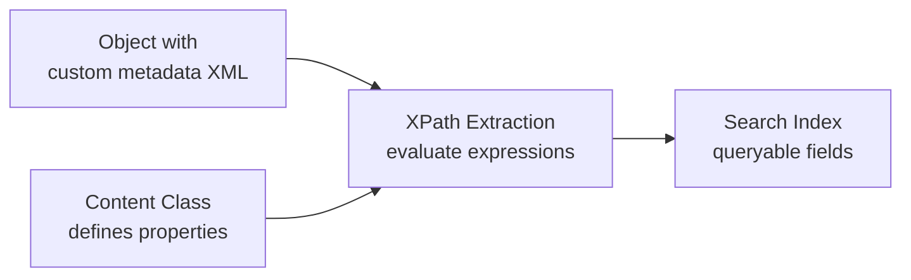
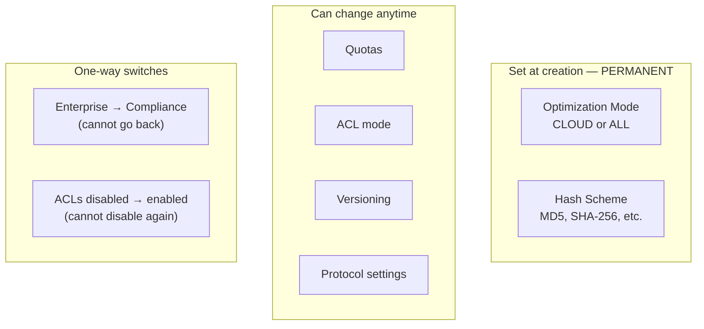
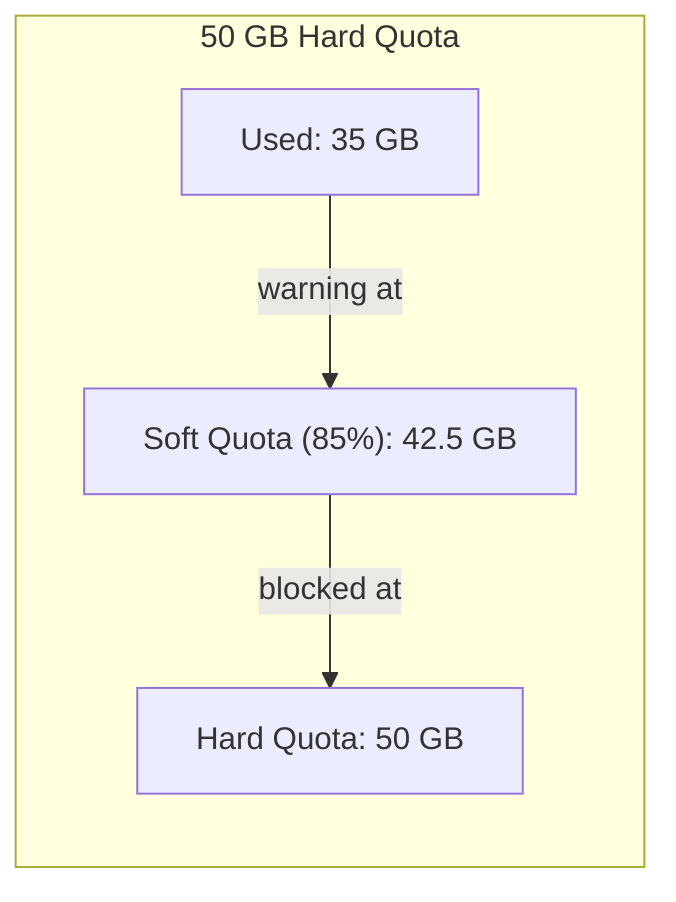
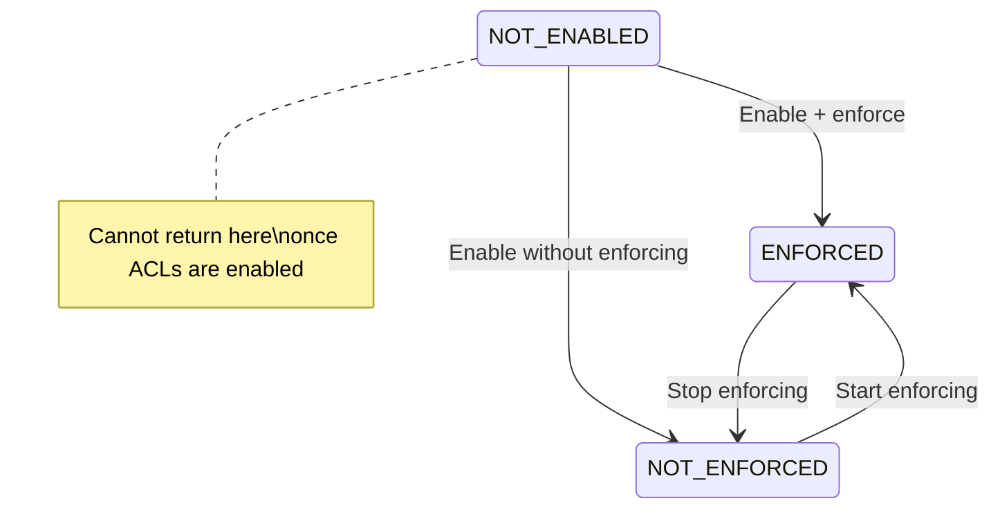
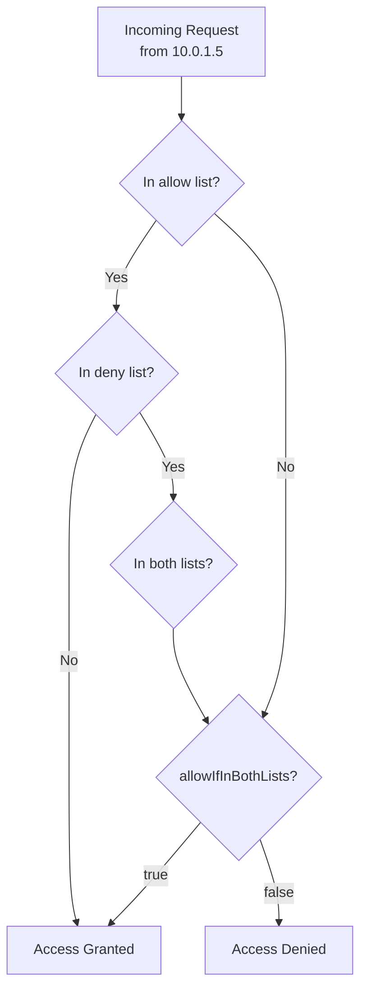
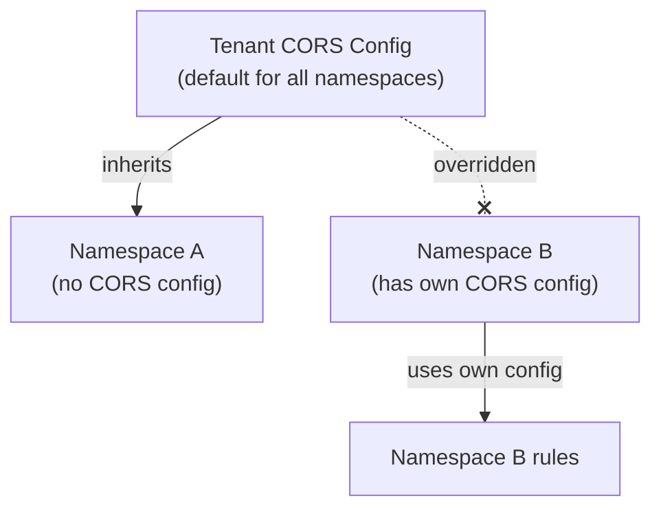

# Administration

Detailed configuration reference for HCP namespaces, protocols, content metadata, and operational concerns. See [HCP Concepts](../getting-started/concepts.md) for the introductory overview.

## Content Properties

Content classes group **content properties** — typed fields extracted from custom metadata XML using XPath expressions. When objects are ingested, HCP reads the custom metadata XML, evaluates the XPath expressions, and indexes the extracted values for fast search.

### How Content Indexing Works



For example, given this custom metadata XML on an ingested medical image:

```xml
<dicom_image>
  <doctor>
    <name>Dr. Lindqvist</name>
    <department>Radiology</department>
  </doctor>
  <study_date>2024-03-15</study_date>
</dicom_image>
```

A content class with properties like `doctor_name` (XPath: `/dicom_image/doctor/name`) and `study_date` (XPath: `/dicom_image/study_date`) would extract those values and make them searchable via the Metadata Query API.

### Property Definition

| Field | Description |
|-------|-------------|
| `name` | 1–25 characters, alphanumeric + underscore, case-sensitive. |
| `expression` | XPath to extract the value (e.g., `/dicom_image/doctor/name`). Can include annotation prefixes: `@annot-name:xpath-expression`. |
| `type` | `STRING`, `INTEGER`, `BOOLEAN`, `DATE`, `FLOAT`, `FULLTEXT`. |
| `multivalued` | Whether the property can have multiple values per object. |
| `format` | Date/number format pattern (e.g., `MM/dd/yyyy` for DATE). |

### Custom Metadata Indexing Settings

Each namespace can configure what custom metadata gets indexed:

| Setting | Description |
|---------|-------------|
| `customMetadataIndexingEnabled` | Master switch for indexing. Must be `true` for any indexing to occur. |
| `fullIndexingEnabled` | Index the full text of custom metadata XML (for `customMetadataContent` searches). |
| `contentClasses` | List of content classes to apply when objects are ingested. |
| `excludedAnnotations` | Wildcard patterns for annotations to skip (e.g., `misc*`, `email`). |

## Namespace Configuration

Namespaces have several settings that are permanent — they cannot be changed after creation. Understanding these decisions upfront prevents surprises later.

### Permanent vs Mutable Settings



### Optimization Mode

The optimization mode affects internal storage layout and determines which access protocols are available:

| Mode | Value | Description |
|------|-------|-------------|
| Cloud | `CLOUD` | Optimized for S3/REST protocols only. Required for erasure coding. Supports balanced or unbalanced directory usage. |
| All protocols | `ALL` | Supports all access protocols including NFS, CIFS, SMTP, WebDAV. Cannot use erasure coding. |

Cannot be changed after namespace creation. Choose based on your access pattern requirements.

### Hash Scheme

Each namespace uses a cryptographic hash algorithm for object integrity verification. Set at creation time and **cannot be changed later**:

MD5, SHA-1, SHA-256, SHA-384, SHA-512, RIPEMD-160

Values are case-sensitive. SHA-256 is recommended for new namespaces.

### Quotas

| Quota | Description |
|-------|-------------|
| **Hard quota** | Maximum storage in decimal format with units (e.g., `50 GB`, `1.25 TB`). Includes data, metadata, and redundancy overhead from the service plan. Minimum 1 GB or 0.01 TB. |
| **Soft quota** | Percentage (10–95%) of the hard quota. When storage exceeds the soft quota, HCP generates a warning notification. Default: 85%. |



### Multipart Upload Auto-Abort

`multipartUploadAutoAbortDays` controls when incomplete multipart uploads are automatically cleaned up (0–180 days, default: 30). Setting to 0 means never auto-abort — incomplete uploads accumulate indefinitely, consuming storage.

### ACL Support

`aclsUsage` has three states. The transition between them is restricted — notably, once ACLs are enabled, they can **never be disabled**.



| State | Description |
|-------|-------------|
| `NOT_ENABLED` | ACLs disabled. |
| `ENFORCED` | ACLs required and checked for access decisions. |
| `NOT_ENFORCED` | ACLs stored but not checked for access decisions. |

## Protocol Details

HCP supports multiple access protocols, each with its own configuration. All protocols access the same underlying data — an object stored via S3 is immediately visible via NFS, CIFS, and other enabled protocols.

### CIFS/SMB

CIFS (Common Internet File System) provides Windows file share access to namespace data:

| Setting | Description |
|---------|-------------|
| `caseSensitive` | HCP is natively case-sensitive; CIFS can override this (default: `true`). |
| `caseForcing` | Force filenames to `uppercase`, `lowercase`, or `disabled`. |
| `requiresAuthentication` | When `true`, requires Active Directory authentication. |

### NFS

NFS access uses POSIX-style ownership:

| Setting | Description |
|---------|-------------|
| `uid` / `gid` | Default POSIX user/group IDs for objects (default: `0` / root). |
| IP access | NFS only supports IP allow lists (no deny list). |

### SMTP

HCP can ingest email directly via SMTP — useful for email archiving:

| Setting | Description |
|---------|-------------|
| `emailFormat` | `.eml` or `.mbox` (default: `.eml`). |
| `emailLocation` | Directory path for email storage (default: `/email/`; HCP auto-creates it). |
| `separateAttachments` | Store email attachments as separate objects alongside the email. |

### IP-Based Access Control

Each protocol has independent `ipSettings` that control network-level access:

| Setting | Description |
|---------|-------------|
| `allowAddresses` | IPs/CIDRs allowed access (e.g., `192.168.100.0/24`). Default: `0.0.0.0/0` (all). |
| `denyAddresses` | IPs/CIDRs denied access. Default: empty. |
| `allowIfInBothLists` | When `true`, IPs appearing in both lists (or neither) are allowed. When `false`, they are denied. |



## CORS Configuration

HCP supports **Cross-Origin Resource Sharing** at two levels, with a clear inheritance hierarchy:



**Inheritance rules:**

1. If a namespace has its own CORS configuration → tenant-level rules are **completely ignored** for that namespace
2. If a namespace has no CORS configuration → tenant-level rules apply
3. If neither is configured → CORS requests are rejected

### CORS Rule Structure

CORS rules are configured as XML:

```xml
<CORSConfiguration>
  <CORSRule>
    <AllowedOrigin>https://app.example.com</AllowedOrigin>
    <AllowedMethod>GET</AllowedMethod>
    <AllowedMethod>PUT</AllowedMethod>
    <AllowedMethod>POST</AllowedMethod>
    <AllowedHeader>*</AllowedHeader>
  </CORSRule>
</CORSConfiguration>
```

| Operation | Description |
|-----------|-------------|
| `PUT` on the CORS resource | Sets the configuration (replaces any existing). |
| `GET` | Retrieves the current configuration. |
| `DELETE` | Removes the configuration (returns 404 if none exists). |

## Chargeback Reporting

Chargeback reports provide detailed storage usage metrics per namespace, used for cost allocation across departments or customers.

### Report Parameters

| Parameter | Description |
|-----------|-------------|
| `start` | Start time in ISO 8601 with timezone (e.g., `2024-01-01T00:00:00-0500`). |
| `end` | End time in ISO 8601 with timezone. |
| `granularity` | `hour`, `day`, or `total` (aggregate for the entire period). |

### Metrics

| Metric | Description |
|--------|-------------|
| `objectCount` | Total objects (each version counted separately; multipart counted as one). |
| `ingestedVolume` | Size before compression/dedup — the "original" data size. |
| `storageCapacityUsed` | Bytes including data, metadata, **and service plan redundancy overhead**. |
| `bytesIn` / `bytesOut` | Data transferred in/out during the interval. |
| `reads` / `writes` / `deletes` | Operation counts during the interval. |
| `multipartObjects` / `multipartObjectParts` / `multipartObjectBytes` | Completed multipart upload statistics. |
| `multipartUploads` / `multipartUploadParts` / `multipartUploadBytes` | In-progress multipart upload statistics. |

The difference between `ingestedVolume` and `storageCapacityUsed` is important for billing: `ingestedVolume` is what the user uploaded, while `storageCapacityUsed` includes the overhead of keeping multiple copies or fragments for data protection.

HCP retains **180 days** of chargeback statistics. Limit chargeback report requests to **once per hour** — more frequent polling can cause system instability.

## HCP Quirks and Gotchas

Behaviors that differ from standard S3 or may surprise developers:

| Behavior | Description |
|----------|-------------|
| **Bulk delete requires Content-MD5** | HCP validates `Content-MD5` on `DeleteObjects`, but boto3 sends CRC32. The backend works around this with individual deletes. |
| **302 means "not found"** | For HEAD requests, HCP returns `302 Found` when a resource doesn't exist (or you lack permission). The backend maps this to 404. |
| **Port 9090 is required for MAPI** | Missing port 9090 in the URL returns `403 Forbidden`, not a connection error. |
| **Auto-adjusted dates** | Invalid retention dates are silently corrected (November 33 → December 3) rather than rejected. |
| **Version IDs are integers** | HCP uses sequential integers (`0`, `1`, `2`...) instead of the UUIDs that AWS S3 uses. |
| **Path-style addressing only** | HCP requires path-style S3 URLs, not virtual-hosted style. |
| **Region redirector crashes boto3** | HCP returns non-standard redirect responses that crash boto3's `S3RegionRedirectorv2`. The backend explicitly unregisters it. |
| **Connection lifetime** | HCP closes idle connections after 10 minutes. |
| **Statistics polling** | Limit GET requests for statistics to once per hour — more frequent polling can cause system instability. |
| **Username in credentials** | S3 access keys are `base64(username)`, not arbitrary strings. Knowing someone's access key reveals their username. |
| **One-way compliance mode** | Switching a namespace from enterprise to compliance mode is permanent. |
| **ACLs can't be disabled** | Once ACLs are enabled on a namespace, they can never be turned off. |
| **Hash scheme is permanent** | The hash algorithm chosen at namespace creation cannot be changed. |
