# Data Protection

HCP provides multiple mechanisms for protecting data against loss, corruption, and unauthorized modification. Each mechanism addresses a different concern — understanding when to use each one is key to designing a robust data management strategy.

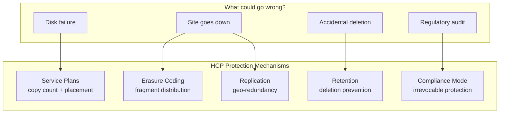

See [HCP Concepts](../getting-started/concepts.md) for the introductory overview of these mechanisms.

## Erasure Coding

Erasure coding is HCP's method for distributing data across multiple geographically separated HCP systems with lower storage overhead than full replication.

### How It Works

The core idea is simple: instead of keeping complete copies of every object on multiple systems (which doubles or triples storage), erasure coding breaks each object into smaller **data fragments** and adds **parity fragments** for redundancy. Any subset of the fragments can reconstruct the original object — so if one system fails, nothing is lost.

Think of it like a RAID array, but across geographically separated data centers instead of disks in a single server.

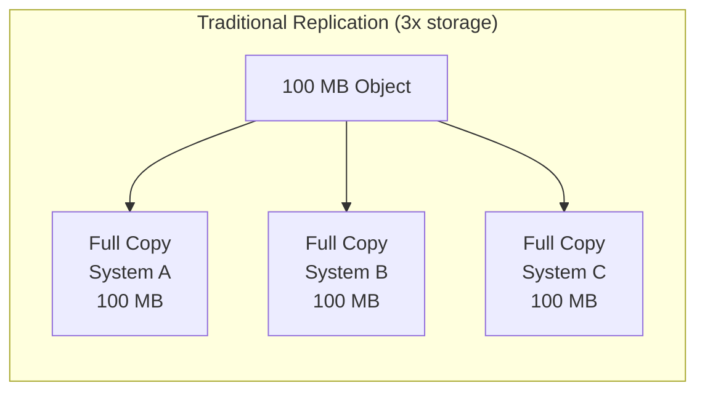

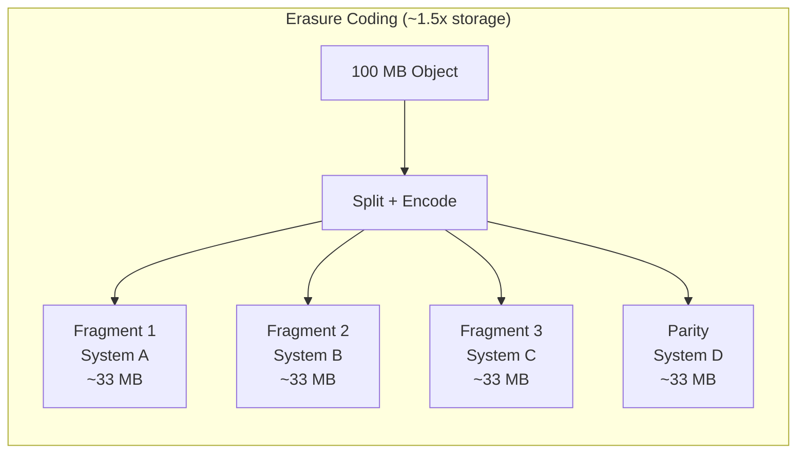

The trade-off: reads are slower with erasure coding because fragments must be fetched from multiple systems and reassembled. Replication gives instant reads from any copy.

### Topologies

Erasure coding topologies define which HCP systems participate and how they connect to each other. The topology determines how fragments are distributed and what happens when systems fail.

#### Fully Connected

Every system has a direct replication link to every other system. This provides the highest redundancy and fastest recovery, but requires more network connections.

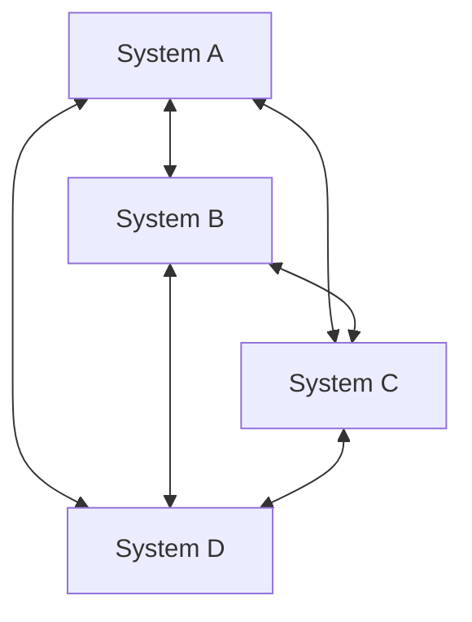

#### Ring

Systems form a ring where each connects to exactly two neighbors. This requires fewer network links but provides less redundancy — a break in the ring can isolate systems.

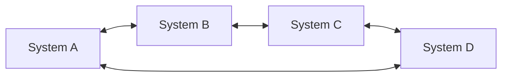

Both topologies support 3–6 systems. Choose fully connected when maximum availability matters most; choose ring when minimizing network infrastructure is the priority.

### Key Settings

| Setting | Range | Description |
|---------|-------|-------------|
| `fullCopy` | boolean | When `true`, each system keeps a complete copy **plus** fragments. When `false` (default), only fragments are distributed — lower storage but slower recovery. |
| `erasureCodingDelay` | 0–3,650 days | Days after object creation before fragments are distributed. Allows frequently-accessed new objects to stay local before fragmenting. |
| `restorePeriod` | 0–180 days | Days to keep a restored object local before re-fragmenting. |
| `minimumObjectSize` | 4,096–1,048,576 bytes | Only objects above this size are erasure-coded. Small objects aren't worth fragmenting due to the overhead. |

### Topology Status

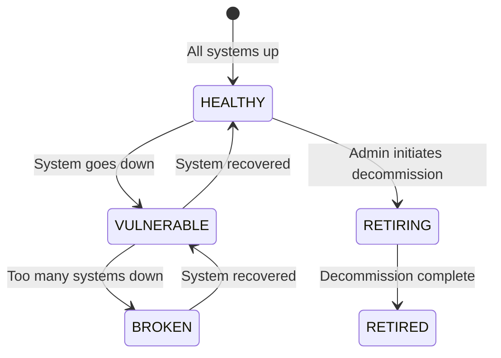

| Status | Meaning |
|--------|---------|
| `HEALTHY` | All systems operational, fragments distributed correctly. |
| `VULNERABLE` | At least one system down — data still readable but not fully protected. |
| `BROKEN` | Too many systems down — some objects may be unreadable. |
| `RETIRING` | Topology is being decommissioned. |
| `RETIRED` | Topology has been fully decommissioned. |

### Namespace-Level Control

Erasure coding is enabled per namespace with `allowErasureCoding`. Two prerequisites must be met:

1. The namespace must be cloud-optimized (`optimizedFor: CLOUD`)
2. The tenant must have `erasureCodingSelectionEnabled` set to `true`

### Erasure Coding vs Replication

| Aspect | Erasure Coding | Replication |
|--------|---------------|-------------|
| **Storage overhead** | ~1.3–1.5x | 2–3x |
| **Read performance** | Slower (assemble fragments) | Fast (read any copy) |
| **Write performance** | Slower (compute + distribute) | Fast (write + replicate) |
| **Recovery speed** | Slower (reconstruct) | Fast (copy exists) |
| **Best for** | Large, infrequently accessed data | Hot data needing fast reads |

## Service Plans

Service plans define the **data protection and placement strategy** for objects in a namespace. They replace the deprecated DPL (Data Protection Level) system.

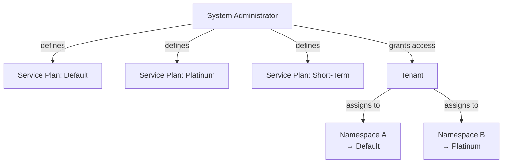

A service plan specifies:

- **Copy count** — how many copies of each object to maintain
- **Placement** — where copies are stored (which nodes, which storage tiers)
- **Protection method** — whether to use erasure coding or replication
- **Performance** — I/O priority and tiering behavior

Service plans are defined at the **system level** by HCP administrators. Tenants can assign available plans to their namespaces if `servicePlanSelectionEnabled` is `true` on the tenant. Each tenant sees only the plans the system administrator has made accessible to it.

The legacy `dpl` property on namespaces now always returns `"Dynamic"` and `isDplDynamic` always returns `true`. All data protection is managed through service plans.

## Compliance Modes

HCP namespaces operate in one of two compliance modes. The choice fundamentally affects what operations are allowed on retained objects — and the switch from enterprise to compliance mode is permanent.

### Enterprise Mode vs Compliance Mode

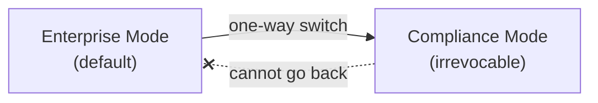

| Operation | Enterprise Mode | Compliance Mode |
|-----------|----------------|-----------------|
| Privileged delete (remove objects under retention) | Allowed (requires `PRIVILEGED` permission) | **Prohibited** |
| Shorten retention period | Allowed | **Prohibited** |
| Delete retention classes in use | Allowed | **Prohibited** |
| Extend retention period | Allowed | Allowed |
| Change from this mode to the other | Can switch to Compliance | **Cannot switch back** |

Enterprise mode is the default for new namespaces. Once a namespace is switched to compliance mode, it **cannot be reverted**. This ensures that regulatory commitments made with compliance mode are irrevocable — even system administrators cannot circumvent the retention rules.

### Retention Type

Each namespace has a `retentionType` that determines which retention mechanism is used:

- **`HCP`** — traditional HCP retention with offset values, retention classes, and privileged delete
- **`S3`** — S3 Object Lock (Governance and Compliance modes). Choosing this automatically enables versioning, delete markers, and cloud-optimized protocols.

## Retention Deep Dive

Retention is HCP's mechanism for preventing premature deletion of objects. Understanding the different ways to specify retention is essential for compliance workflows.

### Object Lifecycle

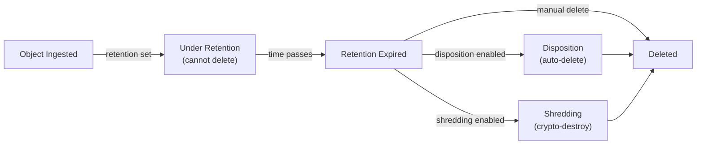

### Retention Value Formats

HCP supports four formats for specifying retention. Each serves a different use case:

**1. Special values** — for simple permanent or temporary states:

| Value | Name | Meaning |
|-------|------|---------|
| `0` | Deletion Allowed | Object can be deleted anytime. |
| `-1` | Deletion Prohibited | Object can never be deleted (except privileged delete in enterprise mode). |
| `-2` | Initial Unspecified | Prevents deletion but allows retention to be set later. Think of it as a "pending review" state. |

**2. Offset values** — relative to the object's ingest time, for policies like "keep for 7 years":

```
A+7y           → 7 years after ingest
A+100y         → 100 years after ingest
A+2y+1d        → 2 years and 1 day after ingest
A+20d-5h       → 20 days minus 5 hours after ingest
```

The format regex is `A([+-]\d+y)?([+-]\d+M)?([+-]\d+w)?([+-]\d+d)?([+-]\d+h)?([+-]\d+m)?([+-]\d+s)?$`. Units must appear in largest-to-smallest order. Case matters: uppercase `M` for months, lowercase `m` for minutes.

**3. Retention class reference** — `C+class-name` (e.g., `C+HlthReg-107`). The actual retention period is defined by the class and can be updated centrally, affecting all objects that reference it.

**4. Fixed date** — either epoch seconds or ISO 8601 format `yyyy-MM-ddThh:mm:ssZ`. Note that HCP **auto-adjusts** invalid dates rather than rejecting them (e.g., November 33 becomes December 3).

### Retention Classes

Retention classes are named policies defined at the namespace level. They centralize retention management — instead of setting individual dates on each object, you assign a class name and update the class when policies change.

```xml
<retentionClass>
    <name>FN-Std-42</name>
    <description>Finance department standard #42 - keep for 10 years</description>
    <value>A+10y</value>
    <allowDisposition>true</allowDisposition>
</retentionClass>
```

When `allowDisposition` is `true`, objects assigned to this class are automatically deleted when their retention expires (if disposition is enabled on the namespace).

### Shredding

When `shreddingDefault` is enabled on a namespace's compliance settings, objects are **cryptographically destroyed** after their retention expires rather than simply deleted. The storage areas where the object data resided are overwritten with random data, making recovery impossible even with physical access to the storage media.

This is required for highly sensitive data where normal deletion (which may leave data recoverable through forensic techniques) is insufficient.

### Disposition

Disposition is the automatic deletion of objects after their retention expires. It operates as a background service and requires three conditions:

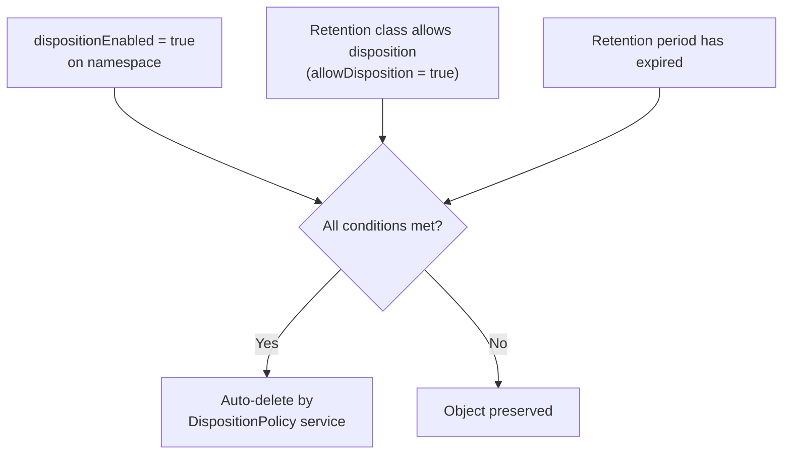

## Replication Deep Dive

Replication copies data between geographically separated HCP systems for disaster recovery and high availability. Unlike erasure coding (which distributes fragments), replication keeps **complete copies** of objects on each system.

### Link Types

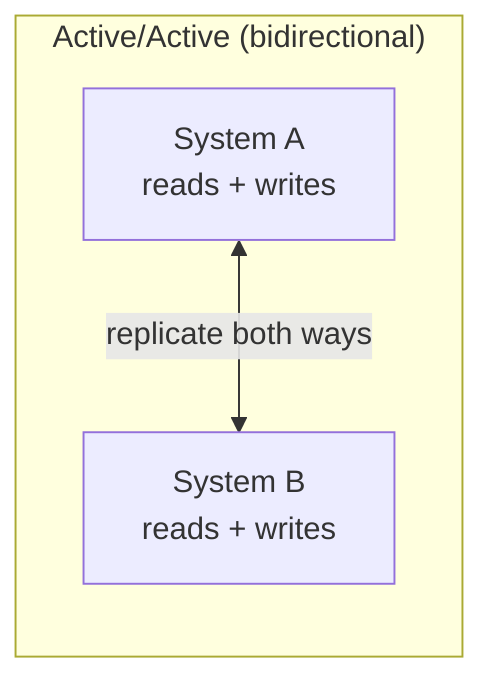

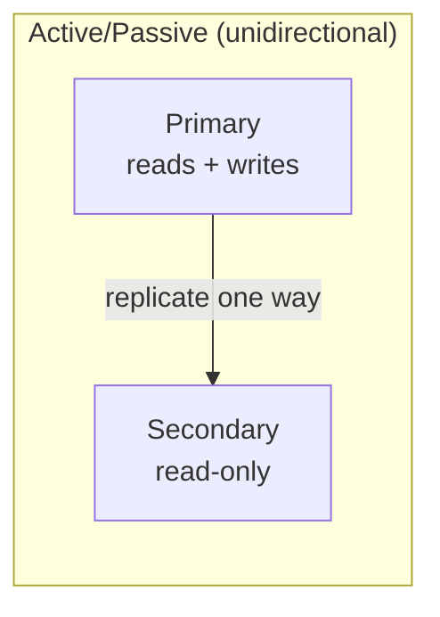

| Type | Direction | Description |
|------|-----------|-------------|
| `ACTIVE_ACTIVE` | Bidirectional | Both systems accept writes. Changes replicate in both directions. Both sides can read and write simultaneously. |
| `ACTIVE_PASSIVE` (outbound) | Unidirectional | Local system sends data to remote. Remote is read-only. Used for disaster recovery. |
| `ACTIVE_PASSIVE` (inbound) | Unidirectional | Remote system sends data to local. Local receives only. |

Active/active links support separate local and remote schedules. Active/passive links have a single schedule. Active/passive links can be **chained** (the passive end of one link can feed into another), but active/active links cannot be chained.

### Replication Schedules

Replication bandwidth is managed through **performance levels** on time-based schedules. This lets administrators balance replication throughput against production workloads:

| Level | Description |
|-------|-------------|
| `HIGH` | Maximum bandwidth for replication. |
| `MEDIUM` | Balanced bandwidth. |
| `LOW` | Minimal bandwidth (background replication). |
| `CUSTOM` | Custom bandwidth limit. |
| `OFF` | No replication during this period (cannot set the entire week to OFF). |

Schedules use **transitions**: at a specific day and hour (e.g., `Sun:00`), the performance level changes. A typical schedule might use `LOW` during business hours (when production traffic is heavy) and `HIGH` overnight and on weekends (when the network is quiet).

### Collision Handling

When two sites in an active/active link modify the same object at the same time, a **collision** occurs. This is inherent to active/active architectures — two users at different sites can edit the same object before replication has time to sync.

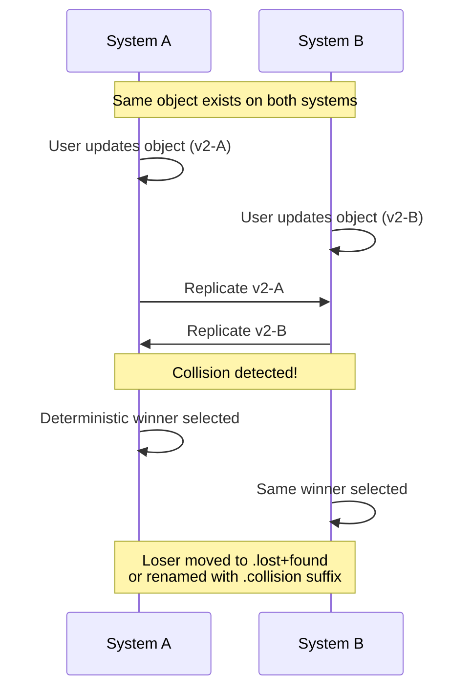

HCP uses a **deterministic algorithm** to pick the winner — the same version wins on both sides, ensuring consistency across systems. The losing version is preserved so administrators can manually reconcile if needed.

| Setting | Options | Description |
|---------|---------|-------------|
| `action` | `MOVE` or `RENAME` | `MOVE` puts the losing version in `.lost+found`. `RENAME` appends `.collision` to the losing version's name. |
| `deleteEnabled` | boolean | Whether to auto-delete collision artifacts after a set period. |
| `deleteDays` | 0–36,500 | Days to keep collision artifacts before auto-deleting them. |

### Failover and Recovery

When a system becomes unreachable, HCP can automatically redirect traffic to the surviving system.

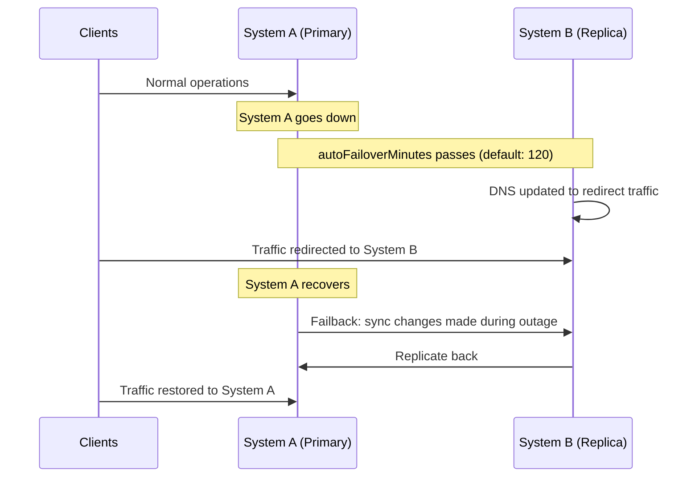

| Setting | Description |
|---------|-------------|
| `autoFailover` | Automatically redirect DNS when the remote system becomes unreachable. |
| `autoFailoverMinutes` | How long to wait before triggering failover (7–9,999 minutes, default: 120). |
| `autoCompleteRecovery` | For active/passive links, automatically complete recovery when the primary comes back. |
| `autoCompleteRecoveryMinutes` | Time threshold for auto-recovery. |

### Read from Replica

When `readFromReplica` is enabled on a namespace, read requests can be served from **any replica** — not just the system the client connected to. This is transparent to the client and improves read performance by serving data from the geographically nearest copy.

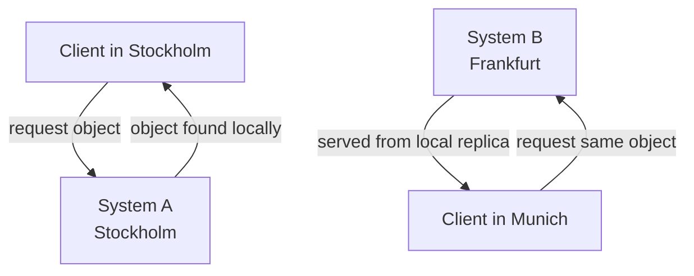
