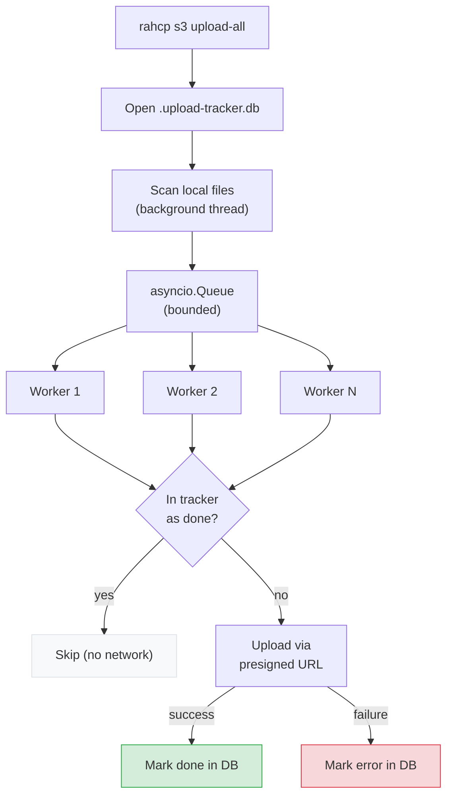
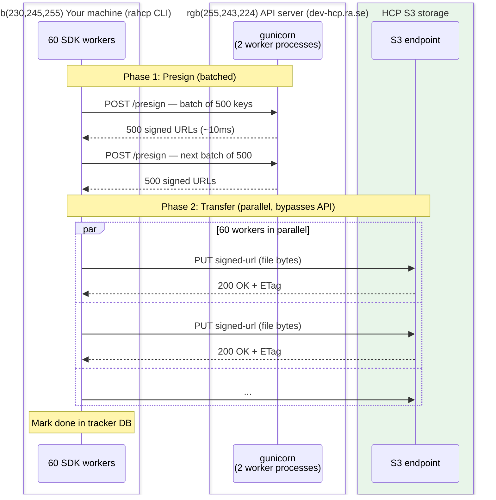
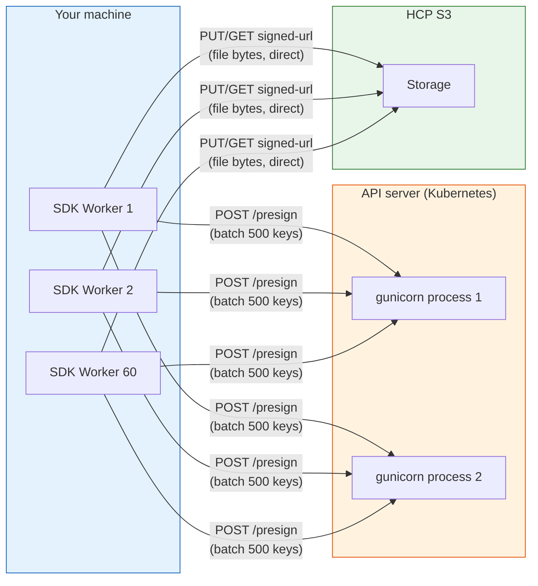
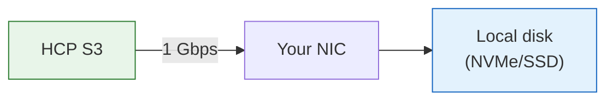
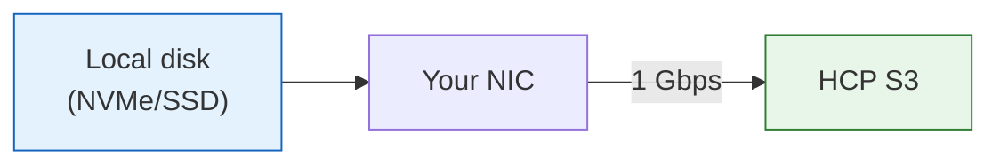
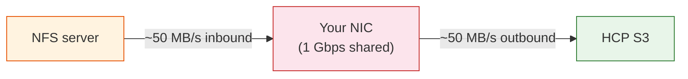
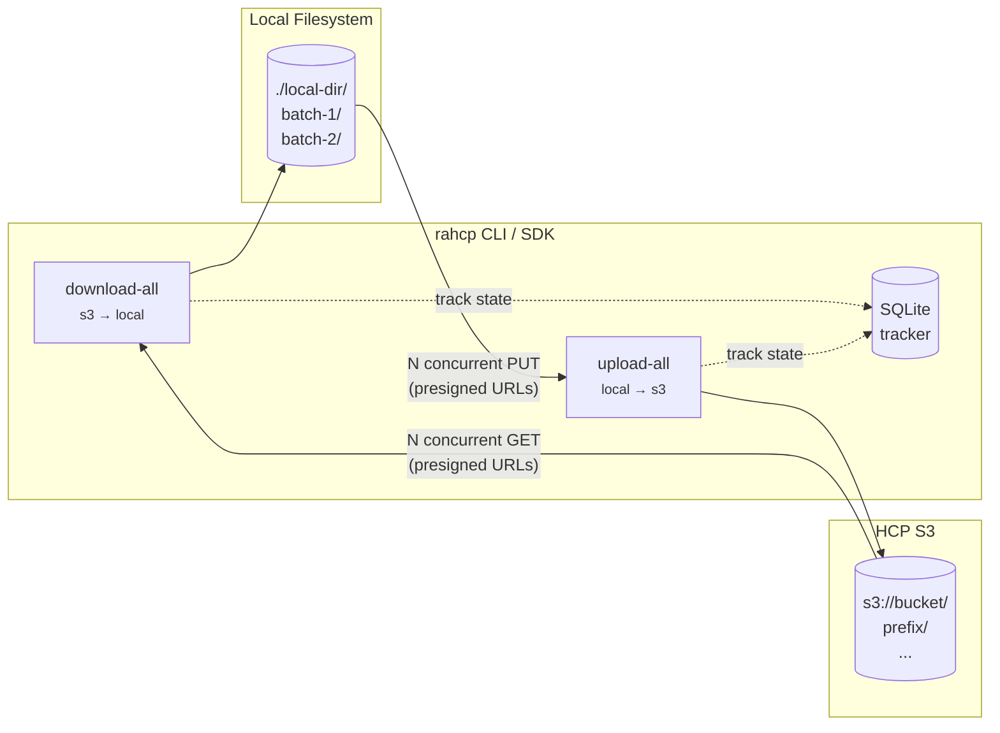

# rahcp-cli

Command-line interface built on [Typer](https://typer.tiangolo.com/) and [Rich](https://rich.readthedocs.io/).

## Quick start

```bash
# Check identity
rahcp auth whoami

# List buckets
rahcp s3 ls

# List objects in a bucket
rahcp s3 ls my-bucket --prefix data/

# Upload a single file
rahcp s3 upload my-bucket reports/q1.pdf ./q1-report.pdf

# Upload an entire directory
rahcp s3 upload-all my-bucket ./local-data --prefix data/

# Download a single file
rahcp s3 download my-bucket reports/q1.pdf --output ./q1.pdf

# Download all objects from a bucket
rahcp s3 download-all my-bucket --output ./local-backup

# Delete objects
rahcp s3 rm my-bucket temp/file1.txt temp/file2.txt

# Get a presigned URL
rahcp s3 presign my-bucket reports/q1.pdf --expires 7200
```

!!! tip "Local development"
    When running from the repo without installing, prefix with `uv run`:
    ```bash
    uv run rahcp s3 ls
    uv run rahcp s3 upload-all mlflow-artifacts /path/to/dump
    ```

## Configuration

Settings are resolved in priority order: **CLI flags > environment variables > config file profile > defaults**.

### Config file

Create `~/.rahcp/config.yaml` (or copy from `.rahcp.example.yaml`):

```yaml
default: dev

profiles:
  dev:
    endpoint: http://localhost:8000/api/v1
    username: admin
    password: secret
    tenant: dev-ai
    verify_ssl: false       # disable for local dev
    timeout: 60             # seconds per request (default 30)
    log_level: info         # debug | info | warning | error

    # Multipart upload thresholds
    multipart_threshold: 104857600  # 100 MB (trigger multipart above this)
    multipart_chunk: 67108864       # 64 MB per part
    multipart_concurrency: 6       # parallel part uploads

    # Bulk transfer defaults (upload-all / download-all)
    bulk_workers: 60                # concurrent transfers
    bulk_presign_batch_size: 500    # URLs presigned per API call
    bulk_chunk_size: 4194304        # 4 MB — chunk size for streaming large files
    bulk_stream_threshold: 104857600 # 100 MB — files below this are read in one shot
    bulk_progress_interval: 5.0     # seconds between progress reports
    bulk_queue_depth: 16            # queue size = workers × this
    bulk_tracker_flush_every: 500   # tracker DB writes buffered per flush
    bulk_tracker_dir: ""            # tracker DB directory (default: ~/.rahcp/)
    bulk_tracker_prefix: ""         # prefix for tracker DB names (e.g. "andraarkiv")

    # IIIF download settings (rahcp iiif commands)
    iiif_url: https://iiifintern-ai.ra.se
    iiif_timeout: 60
    iiif_query_params: full/max/0/default.jpg   # IIIF image API params
    iiif_workers: 4                 # concurrent IIIF downloads

  prod:
    endpoint: https://hcp-api.example.com/api/v1
    username: svc-account
    password: ""
    tenant: prod-archive
    verify_ssl: true        # always verify in production
    log_level: warning      # quiet in production
    bulk_workers: 30        # more workers for production throughput
    otel_endpoint: https://otlp-gateway.example.com/otlp
    otel_protocol: http/protobuf   # or grpc
    otel_service_name: rahcp-cli
```

### Global options

| Flag | Env var | Description |
|------|---------|-------------|
| `--config` | `RAHCP_CONFIG` | Path to config YAML |
| `--profile` / `-c` | `HCP_PROFILE` | Named profile |
| `--endpoint` / `-e` | `HCP_ENDPOINT` | API base URL |
| `--username` / `-u` | `HCP_USERNAME` | Username |
| `--password` / `-p` | `HCP_PASSWORD` | Password |
| `--tenant` / `-t` | `HCP_TENANT` | Tenant |
| `--log-level` | `RAHCP_LOG_LEVEL` | Log level: `debug`, `info`, `warning`, `error` |
| `--otel-endpoint` | `OTEL_EXPORTER_OTLP_ENDPOINT` | OTLP endpoint for traces (empty = disabled) |
| `--json` | -- | Output raw JSON |

## Commands

### `rahcp auth`

| Command | Description |
|---------|-------------|
| `whoami` | Decode JWT and show current user/tenant |

### `rahcp s3`

| Command | Description |
|---------|-------------|
| `ls [BUCKET]` | List buckets (no args) or objects in a bucket |
| `upload BUCKET KEY FILE` | Upload single file (auto multipart for large files) |
| `upload-all BUCKET DIR` | Upload directory with tracked resume and parallel workers |
| `download BUCKET KEY` | Download single object (with `--output` / `-o`) |
| `download-all BUCKET` | Download bucket with tracked resume and parallel workers |
| `rm BUCKET KEY [KEY ...]` | Delete one or more objects |
| `presign BUCKET KEY` | Generate presigned download URL (with `--expires`) |
| `verify BUCKET DIR` | Verify all local files exist in bucket with matching sizes |

#### `rahcp s3 ls` -- browsing objects

The `ls` command supports pagination, prefix filtering, delimiter grouping, and key search:

| Flag | Short | Default | Description |
|------|-------|---------|-------------|
| `--prefix` | `-p` | `""` | Filter by key prefix |
| `--max-keys` | `-n` | `100` | Max results per page |
| `--delimiter` | `-d` | -- | Group by delimiter (e.g. `/` for folder view) |
| `--filter` | `-f` | -- | Client-side filter: only show keys containing this string |
| `--page` | -- | -- | Continuation token for next page (shown when results are truncated) |

**Examples:**

```bash
# List all buckets
rahcp s3 ls

# First 20 objects in a bucket
rahcp s3 ls ai-lagfart -n 20

# Only objects under data/
rahcp s3 ls ai-lagfart --prefix data/

# Top-level folders only (delimiter groups)
rahcp s3 ls ai-lagfart -d /

# Filter keys containing "lagfart"
rahcp s3 ls ai-lagfart -f lagfart

# Next page (if truncated, the CLI shows the token)
rahcp s3 ls ai-lagfart --page <token>

# Combine: first 10 TIFF files under data/
rahcp s3 ls ai-lagfart --prefix data/ -n 10 -f .tif
```

When results are truncated, the CLI prints a `More results available` hint with the exact `--page` command to fetch the next page.

#### `rahcp s3 download-all` -- bulk download

Download all objects from a bucket (or prefix) to a local directory with concurrent transfers. Uses a producer-consumer pipeline with SQLite-backed progress tracking for crash-safe resume.

| Flag | Short | Default | Description |
|------|-------|---------|-------------|
| `--prefix` | `-p` | `""` | Only download keys under this prefix |
| `--output` | `-o` | `.` | Local destination directory |
| `--workers` | `-w` | `10` | Number of concurrent downloads |
| `--include` / `-I` | -- | all files | Only download keys matching these glob patterns (repeatable) |
| `--exclude` / `-E` | -- | none | Skip keys matching these glob patterns (repeatable) |
| `--validate` | -- | off | Validate each file after download (auto-detects format by extension) |
| `--verify` | -- | off | Verify each download by checking file size after transfer |
| `--retry-errors` | -- | off | Only retry files that failed in a previous run |
| `--tracker-db` | -- | same dir as config.yaml | Path to SQLite tracker database |
| `--tracker-prefix` | -- | none | Prefix for tracker DB name (e.g. `backup` → `backup.download-tracker.db`) |

**Examples:**

```bash
# Download entire bucket to current directory
rahcp s3 download-all my-bucket

# Download a prefix to a specific directory
rahcp s3 download-all my-bucket --prefix data/scans/ -o ./local-scans

# Download only JPEGs with validation and verification
rahcp s3 download-all my-bucket --include '*.jpg' --validate --verify -o ./output

# Retry only files that failed last time
rahcp s3 download-all my-bucket --retry-errors --validate --verify

# Only download JPEGs
rahcp s3 download-all my-bucket --include '*.jpg' --include '*.jpeg'

# Skip temp files
rahcp s3 download-all my-bucket --exclude '*.tmp' --exclude '*.log'

# Verify file integrity after each download
rahcp s3 download-all my-bucket --verify

# Use a custom tracker location
rahcp s3 download-all my-bucket --tracker-db /tmp/my-download.db
```

#### `rahcp s3 upload-all` -- bulk upload

Upload an entire local directory to a bucket, preserving the directory structure as S3 key prefixes. Uses a producer-consumer pipeline with SQLite-backed progress tracking for crash-safe resume.

| Flag | Short | Default | Description |
|------|-------|---------|-------------|
| `--prefix` | `-p` | `""` | Key prefix to prepend to all uploaded keys |
| `--workers` | `-w` | `10` | Number of concurrent uploads |
| `--skip-existing` / `--overwrite` | -- | `--skip-existing` | Skip files that already exist with matching size (idempotent) |
| `--include` / `-I` | -- | all files | Only upload files matching these glob patterns (repeatable) |
| `--exclude` / `-E` | -- | none | Skip files matching these glob patterns (repeatable) |
| `--validate` | -- | off | Validate each file before upload (auto-detects format by extension) |
| `--verify` | -- | off | Verify each upload by checking remote size (HEAD) after transfer |
| `--retry-errors` | -- | off | Only retry files that failed in a previous run |
| `--tracker-db` | -- | same dir as config.yaml | Path to SQLite tracker database |
| `--tracker-prefix` | -- | none | Prefix for tracker DB name (e.g. `andraarkiv` → `andraarkiv.upload-tracker.db`) |

**Examples:**

```bash
# Upload a directory to a bucket (preserves folder structure)
rahcp s3 upload-all my-bucket ./local-scans

# Upload with a key prefix
rahcp s3 upload-all my-bucket ./scans --prefix data/2025/

# Only upload JPEGs, validate and verify each one (maximum safety)
rahcp s3 upload-all my-bucket ./scans --include '*.jpg' --validate --verify

# Upload everything except temp files
rahcp s3 upload-all my-bucket ./data --exclude '*.tmp' --exclude '*.log'

# Retry only files that failed last time
rahcp s3 upload-all my-bucket ./archive --retry-errors --validate --verify

# After upload, batch-verify everything
rahcp s3 verify my-bucket ./scans --prefix data/2025/
```

**How `--validate` works:**

Auto-detects file type by extension and runs format-specific checks:

| Extension | Validation |
|-----------|-----------|
| `.jpg` / `.jpeg` | SOI/EOI markers + Pillow full decode |
| `.tif` / `.tiff` | Magic bytes + version 42 + Pillow full decode |
| `.png` | PNG signature + Pillow full decode |
| Other | Skipped (no validation error) |

Requires `rahcp-validate` (`uv pip install 'rahcp-cli[validate]'`).

**Error handling:**

Failed files (validation, transfer, or verification) are marked as `error` in the tracker with the reason. The job **continues** — it does not stop on errors. After completion:

```bash
# See what failed
uv run python -c "
from rahcp_tracker import SqliteTracker
from pathlib import Path
t = SqliteTracker(Path('.rahcp/.upload-tracker.db'))
for key, size in t.error_entries():
    print(key)
t.close()
"

# Retry only the failures
rahcp s3 upload-all my-bucket ./scans --retry-errors --validate --verify
```

The command is **idempotent by default** -- re-running it skips files that already exist in the bucket with matching size. This makes it safe to retry after partial failures.

The command recursively finds all files in the source directory and uploads them with keys that mirror the local path. For example, uploading `./scans/` with `--prefix data/` maps:

```
./scans/batch-1/image-001.tif  →  s3://my-bucket/data/batch-1/image-001.tif
./scans/batch-1/image-002.tif  →  s3://my-bucket/data/batch-1/image-002.tif
./scans/batch-2/image-003.tif  →  s3://my-bucket/data/batch-2/image-003.tif
```

#### Bulk transfer tracking

Both `upload-all` and `download-all` track progress in a local SQLite database (`.upload-tracker.db` / `.download-tracker.db` in the current working directory by default). This enables:

- **Instant resume** -- on re-run, completed files are skipped without any network calls
- **Selective retry** -- `--retry-errors` retries only files that failed previously
- **Progress visibility** -- periodic stats with files/s and MB/s throughput

The tracker database persists across runs. To start fresh, delete the `.db` file.

Tracker location resolution: `--tracker-db` (exact path) > `--tracker-prefix` + default name > `bulk_tracker_prefix` in profile > `bulk_tracker_dir` in profile > config file directory.

Use `--tracker-prefix` to keep separate tracker DBs per dataset (SQLite only):

```bash
rahcp s3 upload-all bucket ./andraarkiv --tracker-prefix andraarkiv
# → .rahcp/andraarkiv.upload-tracker.db

rahcp s3 upload-all bucket ./familysearch --tracker-prefix familysearch
# → .rahcp/familysearch.upload-tracker.db
```

Or set it in the config file to apply to all commands:

```yaml
bulk_tracker_prefix: andraarkiv
```



#### Performance tuning

Bulk transfer throughput depends on network bandwidth, HCP endpoint capacity, file sizes, and local I/O. The default settings are conservative — here's how to tune them for your hardware.

##### The full request path

A bulk transfer has two phases: **presigning** (get URLs from the API server) and **transferring** (send/receive bytes directly to/from HCP S3). The API server is only involved in presigning — actual file data never flows through it.



The SDK workers batch presign requests (default 200 keys per call, configurable up to 1000+), then use the returned URLs to transfer files directly to HCP S3. The API server's only job is signing URLs — it never touches file data.

##### `bulk_workers` vs API server workers

These have the same name but are completely different things:



| | `bulk_workers` (SDK/CLI) | API server workers (gunicorn/replicas) |
|--|--------------------------|---------------------------------------|
| **Where it runs** | Your machine | The API server (`dev-hcp.ra.se`) |
| **What it does** | Controls how many files are transferred in parallel | Controls how many presign requests are handled in parallel |
| **Default** | 10 | 2 (gunicorn with 2 uvicorn workers) |
| **Configured via** | `config.yaml` or `--workers` flag | Helm `backend.workers` / `replicaCount` — see [Scaling](../architecture/deployment.md#scaling) |
| **When to increase** | Throughput increases with more workers | Presign requests are slow or cause transport errors |

**Why 60 SDK workers but only 2 backend workers?** Because they do fundamentally different work. The SDK workers spend 99% of their time transferring file bytes directly to HCP S3 — the backend is not involved. The backend is only called for batch presigning: ~1 request every 30 seconds (500 URLs per batch). A single backend worker can handle hundreds of requests per second, so 2 workers is massive overkill for presigning — the extra worker is for resilience (if one crashes, the other keeps serving).

The real bottleneck is your **network pipe**, not the backend. Adding more backend workers makes presign go from 50ms to 25ms — saving 25ms every 30 seconds (0.08% improvement, unmeasurable). Adding more SDK workers keeps more file transfers in flight, which keeps the pipe full.

Batch presigning (`bulk_presign_batch_size`) reduces the number of backend round-trips by requesting many URLs in a single call instead of one at a time.

##### Why more SDK workers help (up to a point)

Each worker is idle while waiting for network I/O (bytes arriving or departing). More workers means more files in flight simultaneously, which keeps the network pipe full:

```mermaid
gantt
    title Network utilization with different worker counts
    dateFormat X
    axisFormat %s

    section 3 workers
    Transfer file A     :a1, 0, 3
    Transfer file B     :a2, 3, 6
    Transfer file C     :a3, 6, 9
    idle (pipe empty)   :crit, a4, 9, 12

    section 10 workers
    Worker 1 :b1, 0, 3
    Worker 2 :b2, 1, 4
    Worker 3 :b3, 2, 5
    Worker 4 :b4, 3, 6
    Worker 5 :b5, 4, 7
    Worker 6-10 :b6, 5, 10
```



With few workers, the network pipe has gaps. With enough workers, transfers overlap and the pipe stays full. But beyond ~60 workers on a 1 Gbps link with typical 5 MB files, adding more just adds overhead (more open connections, more memory) without increasing throughput — the pipe is already saturated.

##### Bottleneck: download vs upload

The bottleneck depends on where your files are.

**Download** — single network hop, network-bound:



- Theoretical max: 125 MB/s (1 Gbps)
- TCP/TLS overhead: ~8-10%
- Practical max: ~113 MB/s
- Typical result: 70-90 MB/s (presign latency and connection setup consume the rest)

**Upload from local disk** — single network hop, same as download:



Expected: ~90+ MB/s — similar to download since only one direction of network traffic.

**Upload from NFS** — double network hop, **shared pipe**:



Your NIC does double duty — reading from NFS **and** writing to HCP simultaneously. Both directions share the same 1 Gbps link. If NFS reads consume ~50 MB/s inbound, that leaves ~65 MB/s outbound for HCP — and contention reduces it further. Typical result: ~46 MB/s effective upload.

The single biggest win for upload is **getting files off NFS onto local disk first**.

##### What actually affects speed

| Change | Expected gain | Priority |
|--------|--------------|----------|
| Upload from local disk (not NFS) | 46 → 90+ MB/s (doubles upload speed) | Highest — eliminates NFS bandwidth sharing |
| Faster network (10 Gbps) | 90 → 900+ MB/s | If budget allows |
| Increase `bulk_workers` to 80-100 | +5-10 MB/s if pipe not yet saturated | Low — diminishing returns past ~60 |
| Increase `bulk_presign_batch_size` to 500-1000 | Fewer API round-trips, ~2-3 less calls/sec | Low — marginal improvement |

!!! note "Gunicorn workers and replicas don't increase speed"
    The backend handles ~2 presign requests/second during bulk transfers. A single worker can handle hundreds of req/sec. Adding more backend workers or pods makes presign go from 50ms to 25ms — saving 25ms every 30 seconds (unmeasurable).

    Gunicorn is about **reliability**, not speed:

    | What gunicorn adds | Speed impact | Why it matters |
    |---|---|---|
    | Worker restart on crash | 0 MB/s | Transfer doesn't fail if a backend process dies |
    | Memory leak protection (`--max-requests`) | 0 MB/s | Backend stays healthy over weeks/months |
    | Graceful reload | 0 MB/s | Deploy new code without dropping requests |

    Increase `backend.workers` or `replicaCount` when you have **multiple concurrent users** (not for single-user speed). See [Scaling](../architecture/deployment.md#scaling) for details.

##### Key settings

| Setting | config.yaml | CLI | Default | What it controls | Effect on speed |
|---------|------------|-----|---------|-----------------|-----------------|
| `bulk_workers` | Yes | `--workers` | 10 | Concurrent coroutines doing transfers simultaneously | More workers = more parallel transfers. Beyond a point, adding workers just adds queue contention since they share the same network pipe. |
| `bulk_presign_batch_size` | Yes | `--presign-batch-size` | 200 | How many URLs are presigned in one API call | Reduces presign round-trips. 500 keys = 1 API call instead of 500. Saves ~5-10ms per file. |
| `bulk_queue_depth` | Yes | — | 8 | Queue size = workers × depth. How many items are buffered ahead of workers | Keeps workers from starving when the producer is doing a presign batch call. Higher = workers always have work. |
| `bulk_chunk_size` | Yes | — | 1 MB | Chunk size for streaming large files | Only matters for files above `stream_threshold`. For typical ~5 MB images: irrelevant (single-shot path). |
| `bulk_stream_threshold` | Yes | — | 100 MB | Files below this are read into memory in one shot | Small files hit the fast single-shot path. No effect unless you have files above this threshold. |
| `bulk_tracker_flush_every` | Yes | — | 200 | How often SQLite writes buffered marks | Lower = more disk I/O. Higher = risk losing state on crash. |
| `bulk_progress_interval` | Yes | — | 5.0 | Seconds between progress reports | |
| `bulk_tracker_dir` | Yes | `--tracker-db` | same dir as config.yaml | Where the tracker DB lives | |
| `bulk_tracker_prefix` | Yes | `--tracker-prefix` | none | Prefix tracker DB name per dataset | |
| `multipart_threshold` | Yes | — | 100 MB | Files above this use multipart upload | |
| `multipart_chunk` | Yes | — | 64 MB | Part size for multipart uploads | |
| `multipart_concurrency` | Yes | — | 6 | Parallel parts per multipart upload | |
| `verify_ssl` | Yes | — | true | Set `false` for self-signed HCP certs | |

##### Recommended config by direction

=== "Download (HCP → local disk)"

    Network-bound. Maximize parallelism to keep the pipe full:

    ```yaml
    bulk_workers: 60
    bulk_presign_batch_size: 500
    bulk_queue_depth: 16
    bulk_tracker_flush_every: 500
    ```

=== "Upload from local disk"

    Same as download — single network hop, maximize parallelism:

    ```yaml
    bulk_workers: 60
    bulk_presign_batch_size: 500
    bulk_queue_depth: 16
    bulk_tracker_flush_every: 500
    ```

=== "Upload from NFS mount"

    Shared bandwidth — be less aggressive to avoid NFS contention:

    ```yaml
    bulk_workers: 40              # NFS reads compete for bandwidth
    bulk_presign_batch_size: 500
    bulk_queue_depth: 8
    bulk_tracker_flush_every: 500
    ```

    Better: copy files to local disk first, then upload with 60 workers.

##### Tuning by file size

=== "Many small files (< 5 MB each)"

    The bottleneck is request overhead — each file needs a presigned URL + a PUT. Increase workers aggressively:

    ```yaml
    bulk_workers: 60        # more concurrent requests
    bulk_presign_batch_size: 500  # fewer presign API calls
    bulk_queue_depth: 16    # keep workers fed
    bulk_tracker_flush_every: 500  # less frequent DB writes
    ```

    Expected: 30-60 files/s depending on network latency to HCP.

=== "Fewer large files (> 100 MB each)"

    The bottleneck is bandwidth. Workers don't help much — tune multipart instead:

    ```yaml
    bulk_workers: 10        # fewer concurrent transfers
    multipart_threshold: 52428800   # 50 MB — trigger multipart sooner
    multipart_chunk: 33554432       # 32 MB parts — more parallelism per file
    multipart_concurrency: 10       # more parallel parts
    ```

=== "Mixed sizes (archive directories)"

    Balance between request concurrency and bandwidth:

    ```yaml
    bulk_workers: 20
    bulk_queue_depth: 8
    multipart_concurrency: 6
    ```

=== "Slow or high-latency network"

    Reduce workers to avoid overwhelming the connection, increase timeouts:

    ```yaml
    bulk_workers: 5
    timeout: 120
    verify_ssl: false       # if SSL handshake adds latency
    ```

=== "Fast datacenter network (> 1 Gbps)"

    Push workers high and reduce overhead:

    ```yaml
    bulk_workers: 60
    bulk_queue_depth: 16
    bulk_tracker_flush_every: 1000
    ```

##### How to diagnose bottlenecks

| Symptom | Likely bottleneck | Fix |
|---------|------------------|-----|
| files/s increases with more workers | Worker-bound | Increase `bulk_workers` |
| files/s plateaus despite more workers | Network or HCP-bound | Don't increase workers further |
| MB/s is high but files/s is low | Large files | Normal — fewer files but more bytes per file |
| MB/s is low and CPU is low | Network latency | Increase `bulk_workers` to overlap round-trips |
| High memory usage (>10 GB) | Large file list in memory | Normal for millions of files — `done_keys` set + file list |
| Errors appearing | SSL, timeout, or HCP rate limit | Check `verify_ssl`, increase `timeout`, reduce workers |
| Transport errors at high worker count | API server can't keep up with presign | Add gunicorn workers — see [Scaling](../architecture/deployment.md#scaling) |

**Monitoring a running transfer:**

```bash
# Reattach to the tmux session
tmux attach -t upload

# Check tracker DB from another terminal
uv run python -c "
from rahcp_tracker import SqliteTracker
from pathlib import Path
t = SqliteTracker(Path.home() / '.rahcp/.upload-tracker.db')
print(t.summary())
t.close()
"

# Verify what's on S3 so far
rahcp s3 ls my-bucket -n 5
```

**Running long transfers safely:**

Always run bulk transfers inside `tmux` or `screen` so they survive SSH disconnects:

```bash
tmux new -s upload
rahcp s3 upload-all my-bucket ./data --workers 20
# Ctrl+B, D to detach — reattach with: tmux attach -t upload
```

If the process is interrupted (Ctrl+C, crash, reboot), re-run the same command. The tracker skips all completed files instantly — no re-upload, no HEAD requests.

#### Integrity verification

There are two ways to verify transfers. Choose based on your needs:

**Option 1: `--verify` flag (inline, per-file)**

Checks each file immediately after transfer. Adds one HEAD request per upload or one size check per download.

```bash
rahcp s3 upload-all my-bucket ./critical-data --verify
rahcp s3 download-all my-bucket --verify
```

**Cost:** 50% more API calls on upload (presign + PUT + HEAD per file instead of presign + PUT). On a 1.9M file upload at 40 files/s, this drops throughput to ~25-30 files/s and adds ~5-7 hours. Downloads are cheaper — the size check is local (no extra API call).

**When to use:** Mission-critical data where a single corrupt file is unacceptable and you need immediate detection.

**Option 2: `rahcp s3 verify` (post-transfer, batch)**

Runs a single pass after the transfer is complete. Lists all remote objects and compares sizes against local files.

```bash
# After upload finishes
rahcp s3 verify my-bucket ./local-scans
rahcp s3 verify my-bucket ./scans --prefix data/2025/
```

**Cost:** One paginated listing (1 request per 1000 objects) + local file walk. For 1.9M files, that's ~1,900 API calls total vs ~1.9M HEAD calls with `--verify`.

**When to use:** Most transfers. Run once at the end — if anything is missing or wrong, use `--retry-errors` to fix it.

Output:
```
Verification: 603 local files, 601 remote objects

  597 OK — present with matching size
  6 MISSING — not found in bucket:
    0/955e67d3.../artifacts/donut-model/model.safetensors
    17/6802f8af.../artifacts/weights/best.pt
    ...
```

Exits with code 1 if any files are missing or have size mismatches, making it usable in scripts and CI.

**Recommendation:** For large transfers (>10K files), use `verify` after the transfer. For small critical batches (<1K files), use `--verify` inline.

#### Bulk transfer overview



### `rahcp ns`

| Command | Description |
|---------|-------------|
| `list TENANT` | List namespaces (with `--verbose`) |
| `get TENANT NS` | Get namespace details (with `--verbose`) |
| `create TENANT` | Create namespace (with `--name`, `--quota`) |
| `delete TENANT NS` | Delete namespace |
| `export TENANT NS` | Export namespace as JSON template (with `--output`) |
| `import TENANT FILE` | Create namespace(s) from exported template |

### `rahcp iiif`

Download images from [IIIF](https://iiif.io/) endpoints (e.g. Riksarkivet's internal image server) with parallel workers and resumable tracking.

| Command | Description |
|---------|-------------|
| `download BATCH_ID` | Download all images from a single IIIF batch |
| `download-batches JOB_FILE` | Download images from multiple batches listed in a text file |

| Flag | Short | Default | Description |
|------|-------|---------|-------------|
| `--output` | `-o` | `.` | Output directory |
| `--workers` | `-w` | `4` | Concurrent downloads |
| `--query-params` | `-q` | `full/max/0/default.jpg` | IIIF image API parameters |
| `--iiif-url` | -- | `https://iiifintern-ai.ra.se` | IIIF server base URL |
| `--max-images` | `-n` | all | Limit images per batch |
| `--validate` | -- | off | Validate each image after download |
| `--tracker-db` | -- | `.rahcp/.iiif-download.db` | Tracker DB path |
| `--tracker-prefix` | -- | none | Prefix for tracker DB name (e.g. `familysearch` → `familysearch.iiif-download.db`) |

**Examples:**

```bash
# Download a single batch
rahcp iiif download C0074667 -o ./images/

# Download with validation and custom resolution
rahcp iiif download C0074667 -o ./images/ \
  --validate --query-params "full/,1200/0/default.jpg"

# Download multiple batches from a job file
cat > batches.txt << EOF
C0074667
C0074865
A0065852
EOF
rahcp iiif download-batches batches.txt -o ./images/ --workers 10

# Then upload to HCP (reuses existing upload-all)
rahcp s3 upload-all images-batch ./images/ --validate --workers 20

# Use --tracker-prefix to keep separate tracker DBs per dataset
rahcp iiif download-batches batches.txt -o ./images/ --tracker-prefix familysearch
rahcp s3 upload-all images-batch ./images/ --tracker-prefix familysearch
# Creates: .rahcp/familysearch.iiif-download.db, .rahcp/familysearch.upload-tracker.db
```

IIIF settings can be configured per profile in `config.yaml`:

```yaml
profiles:
  dev:
    iiif_url: https://iiifintern-ai.ra.se
    iiif_timeout: 60
    iiif_query_params: full/max/0/default.jpg
    iiif_workers: 4
```

Override priority: CLI flags > env vars (`IIIF_URL`) > config file > defaults.
