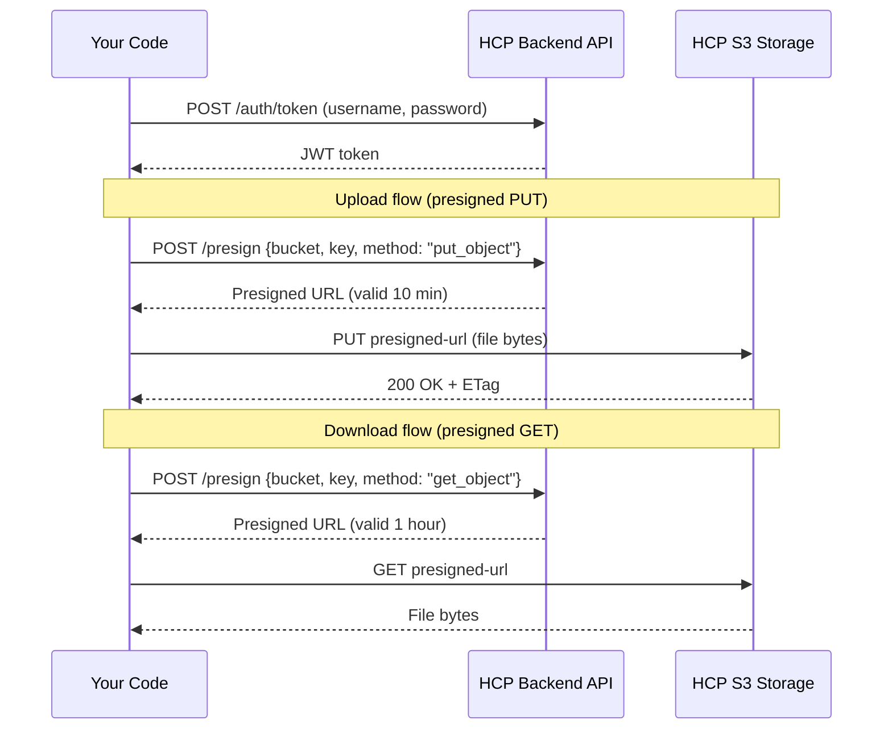
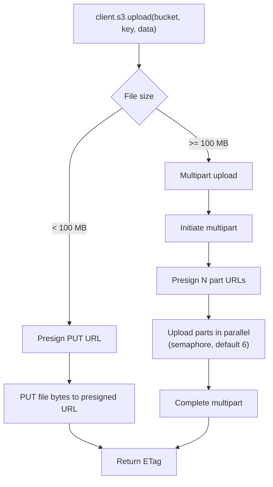
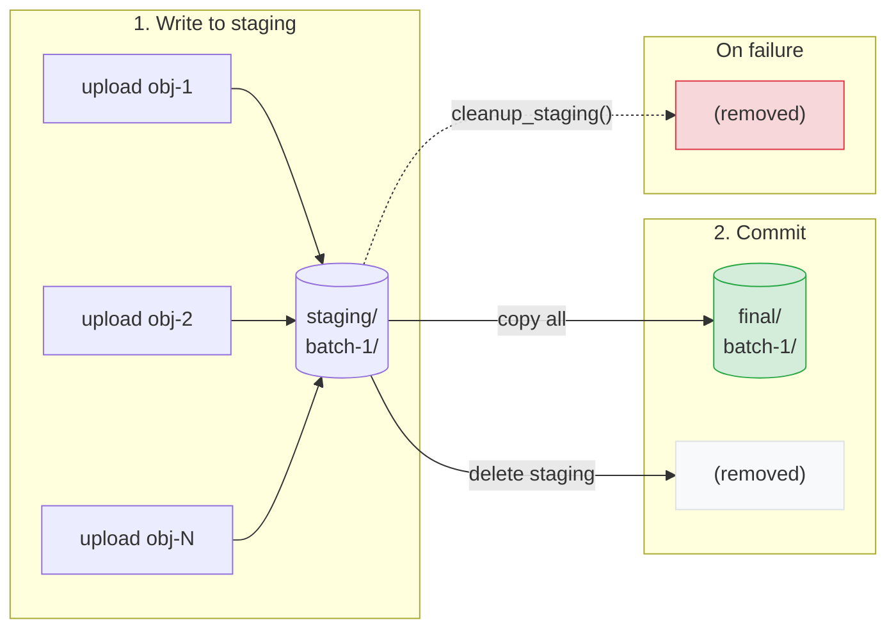
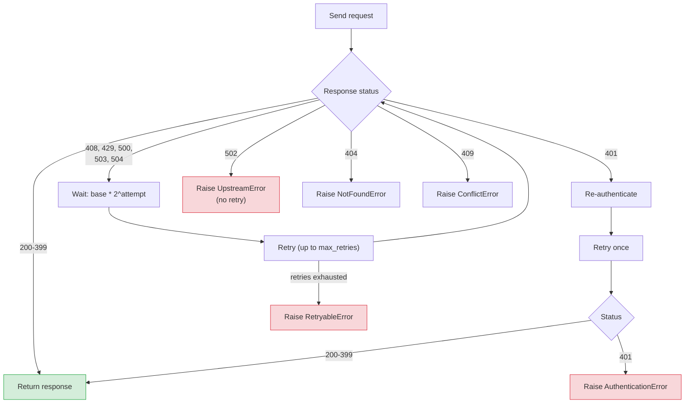

# rahcp-client

Async HTTP client built on `httpx`. Handles authentication, retries, presigned URL transfers, multipart uploads, and bulk transfers. Uses `rahcp-tracker` for resumable progress tracking.

## How it works

The SDK never sends file data through the backend API. Instead, it uses **presigned URLs** -- short-lived, signed S3 URLs that allow direct transfer between your code and HCP storage:



This design keeps the backend stateless and avoids bottlenecking large transfers through the API server.

## Quick start

```python
import asyncio
from rahcp_client import HCPClient

async def main():
    async with HCPClient(
        endpoint="http://localhost:8000/api/v1",
        username="admin",
        password="password",
        tenant="dev-ai",
    ) as client:
        # List buckets
        result = await client.s3.list_buckets()
        print(result)

        # Upload a file (auto-selects presigned or multipart)
        from pathlib import Path
        etag = await client.s3.upload("my-bucket", "data/report.pdf", Path("report.pdf"))
        print(f"Uploaded: {etag}")

        # Download
        size = await client.s3.download("my-bucket", "data/report.pdf", Path("out.pdf"))
        print(f"Downloaded {size} bytes")

asyncio.run(main())
```

## Configuration

`HCPClient` accepts these parameters:

| Parameter | Type | Default | Description |
|-----------|------|---------|-------------|
| `endpoint` | `str` | `http://localhost:8000/api/v1` | HCP API base URL |
| `username` | `str` | `""` | HCP username |
| `password` | `str` | `""` | HCP password |
| `tenant` | `str \| None` | `None` | Target tenant (omit for system-level) |
| `timeout` | `float` | `30.0` | Request timeout in seconds |
| `max_retries` | `int` | `4` | Maximum retries for transient failures |
| `retry_base_delay` | `float` | `1.0` | Base delay for exponential backoff |
| `multipart_threshold` | `int` | `104857600` | File size threshold for multipart upload (100 MB) |
| `multipart_chunk` | `int` | `67108864` | Chunk size per multipart part (64 MB) |
| `multipart_concurrency` | `int` | `6` | Number of parallel part uploads |
| `verify_ssl` | `bool` | `True` | Verify SSL certificates for S3 data transfers |

### From environment variables

```python
client = HCPClient.from_env()
```

Reads from `HCP_ENDPOINT`, `HCP_USERNAME`, `HCP_PASSWORD`, `HCP_TENANT`, `HCP_TIMEOUT`, `HCP_MAX_RETRIES`, `HCP_MULTIPART_THRESHOLD`, `HCP_MULTIPART_CHUNK`, `HCP_MULTIPART_CONCURRENCY`, `HCP_VERIFY_SSL`.

### Properties

| Property | Type | Description |
|----------|------|-------------|
| `client.s3` | `S3Ops` | S3 data-plane operations (lazy-loaded) |
| `client.mapi` | `MapiOps` | MAPI namespace administration (lazy-loaded) |
| `client.token` | `str \| None` | Current JWT bearer token (set after login) |
| `client.transfer_settings` | `TransferSettings` | Bulk transfer settings (verify_ssl, timeout, multipart_threshold) — used internally by the bulk engine |

## S3 operations

`client.s3` returns an `S3Ops` instance with these methods:

### Uploads and downloads

The `upload()` method automatically selects the best transfer strategy based on file size:



```python
# Upload (auto-selects presigned PUT or multipart based on file size)
etag = await client.s3.upload("bucket", "key", data_or_path)

# Multipart upload (explicit, parallel parts)
etag = await client.s3.upload_multipart("bucket", "key", Path("large.bin"), concurrency=6)

# Download to file
byte_count = await client.s3.download("bucket", "key", Path("dest.bin"))

# Download to bytes
data = await client.s3.download_bytes("bucket", "key")
```

### Presigned URLs

All data transfers use presigned URLs internally. You can also generate them directly for sharing or browser-based transfers:

```python
# Single presigned URL
url = await client.s3.presign_get("bucket", "key", expires=3600)
url = await client.s3.presign_put("bucket", "key", expires=3600)

# Bulk presigned download URLs
urls = await client.s3.presign_bulk("bucket", ["key1", "key2"], expires=3600)
```

### Listing and metadata

```python
# List buckets
result = await client.s3.list_buckets()

# List objects (with prefix filtering)
result = await client.s3.list_objects("bucket", prefix="data/", max_keys=1000)
# Returns: {'objects': [...], 'common_prefixes': [...], 'is_truncated': bool, ...}

# Object metadata (HEAD)
meta = await client.s3.head("bucket", "key")
```

### Delete and copy

```python
# Single delete
await client.s3.delete("bucket", "key")

# Bulk delete
result = await client.s3.delete_bulk("bucket", ["key1", "key2", "key3"])

# Copy object
await client.s3.copy("dest-bucket", "dest-key", "src-bucket", "src-key")
```

### Staging pattern

Atomic directory-level operations: upload to a staging prefix, validate, then commit to the final prefix in one step. This prevents downstream consumers from seeing partial results.



```python
# Move all objects from staging/ to final/
count = await client.s3.commit_staging("bucket", "staging/batch-1/", "final/batch-1/")

# Clean up staging on failure
count = await client.s3.cleanup_staging("bucket", "staging/batch-1/")
```

??? example "Full runnable example — staging_commit.py"

    ```python
    --8<-- "examples/staging_commit.py:staging-commit"
    ```

## Bulk transfers

The `bulk_upload` and `bulk_download` functions provide the same producer-consumer pipeline used by the CLI, available for programmatic use:

```python
import asyncio
from pathlib import Path
from rahcp_client import HCPClient, BulkUploadConfig, BulkDownloadConfig, bulk_upload, bulk_download
from rahcp_tracker import SqliteTracker

async def main():
    async with HCPClient.from_env() as client:
        tracker = SqliteTracker(Path(".upload-tracker.db"))

        stats = await bulk_upload(BulkUploadConfig(
            client=client,
            bucket="images-batch",
            source_dir=Path("/data/scans"),
            tracker=tracker,
            prefix="2025/",
            workers=20,
            on_progress=lambda s: print(f"{s.done} files, {s.mb_per_sec:.1f} MB/s"),
            on_error=lambda key, exc: print(f"FAILED: {key} — {exc}"),
        ))

        print(f"Done: {stats.ok} uploaded, {stats.skipped} skipped, {stats.errors} errors")
        print(f"Throughput: {stats.mb_per_sec:.1f} MB/s over {stats.elapsed:.0f}s")
        tracker.close()

asyncio.run(main())
```

### BulkUploadConfig

| Field | Type | Default | Description |
|-------|------|---------|-------------|
| `client` | `HCPClient` | required | Authenticated client instance |
| `bucket` | `str` | required | Target S3 bucket |
| `source_dir` | `Path` | required | Local directory to upload |
| `tracker` | `TrackerProtocol` | required | Progress tracker (e.g. `SqliteTracker`) |
| `prefix` | `str` | `""` | Key prefix prepended to all keys |
| `workers` | `int` | `10` | Number of concurrent upload workers |
| `queue_depth` | `int` | `8` | Queue size multiplier (queue = workers × depth) |
| `presign_batch_size` | `int` | `200` | URLs presigned per API call (higher = fewer round-trips) |
| `chunk_size` | `int` | `1048576` | Chunk size in bytes for streaming uploads (1 MB) |
| `skip_existing` | `bool` | `True` | Skip files already on remote with matching size |
| `retry_errors` | `bool` | `False` | Only process files marked as error in tracker |
| `include` | `list[str]` | `[]` | Glob patterns — only matching filenames are transferred |
| `exclude` | `list[str]` | `[]` | Glob patterns — matching filenames are skipped |
| `validate_file` | `Callable` | `None` | Pre-upload validation callback `fn(Path)` — raises on failure |
| `verify_upload` | `bool` | `False` | HEAD check after each upload to verify size matches |
| `on_progress` | callback | `None` | Called periodically with `TransferStats` |
| `on_error` | callback | `None` | Called on each file failure with `(key, exception)` |
| `progress_interval` | `float` | `5.0` | Minimum seconds between progress callbacks |

### BulkDownloadConfig

| Field | Type | Default | Description |
|-------|------|---------|-------------|
| `client` | `HCPClient` | required | Authenticated client instance |
| `bucket` | `str` | required | Source S3 bucket |
| `dest_dir` | `Path` | required | Local destination directory |
| `tracker` | `TrackerProtocol` | required | Progress tracker (e.g. `SqliteTracker`) |
| `prefix` | `str` | `""` | Only download keys under this prefix |
| `workers` | `int` | `10` | Number of concurrent download workers |
| `queue_depth` | `int` | `8` | Queue size multiplier (queue = workers × depth) |
| `presign_batch_size` | `int` | `200` | URLs presigned per API call (higher = fewer round-trips) |
| `chunk_size` | `int` | `1048576` | Chunk size in bytes for streaming large files (1 MB) |
| `stream_threshold` | `int` | `104857600` | Files below this (100 MB) are downloaded in one shot |
| `retry_errors` | `bool` | `False` | Only process files marked as error in tracker |
| `include` | `list[str]` | `[]` | Glob patterns — only matching keys are downloaded |
| `exclude` | `list[str]` | `[]` | Glob patterns — matching keys are skipped |
| `validate_file` | `Callable` | `None` | Post-download validation callback `fn(Path)` — raises on failure |
| `verify_download` | `bool` | `False` | Verify each download by checking file size after transfer |
| `on_progress` | callback | `None` | Called periodically with `TransferStats` |
| `on_error` | callback | `None` | Called on each file failure with `(key, exception)` |
| `progress_interval` | `float` | `5.0` | Minimum seconds between progress callbacks |

Downloads always skip files that already exist on disk with matching size (no `skip_existing` flag — this behavior is always on).

### Transfer tracking (rahcp-tracker)

Transfer state is managed by the standalone `rahcp-tracker` package. The tracker is shared across S3 bulk transfers and IIIF downloads — any backend implementing `TrackerProtocol` can be used.

The default backend is `SqliteTracker` (aliased as `TransferTracker` for backwards compatibility), backed by SQLite with WAL mode and buffered writes.

```python
from rahcp_tracker import SqliteTracker, TransferStatus

tracker = SqliteTracker(Path("my-job.db"), flush_every=200)

# Mark files
tracker.mark("folder/file.jpg", 12345, TransferStatus.done, etag='"abc"', validated=True)
tracker.mark("folder/bad.jpg", 0, TransferStatus.error, "SSL timeout")

# Query state
done = tracker.done_keys()           # set[str] — instant skip lookups
errors = tracker.error_entries()     # list[(key, size)] — for retry
summary = tracker.summary()          # {"pending": 0, "done": 500, "error": 3}

# Audit — find files needing post-transfer verification or validation
unverified = tracker.unverified_keys()    # list[(key, size, etag)]
unvalidated = tracker.unvalidated_keys()  # list[(key, size)]

# Lifecycle
tracker.commit()  # flush buffered marks to DB
tracker.close()   # flush + release resources
```

The tracker package is structured for pluggable backends:

```
rahcp-tracker/
  models.py     — TransferStatus enum + Transfer table (SQLModel, shared across backends)
  protocol.py   — TrackerProtocol (interface — 8 methods any backend must implement)
  sqlite.py     — SqliteTracker (default SQLite implementation)
```

To add a new backend (e.g. Postgres), implement `TrackerProtocol` in a new file — no changes to `bulk.py`, the CLI, or any consumer code. The `Transfer` SQLModel table in `models.py` works with both SQLite and Postgres via SQLAlchemy's dialect system.

## MAPI operations

`client.mapi` returns a `MapiOps` instance for namespace administration:

```python
# List namespaces
namespaces = await client.mapi.list_namespaces("dev-ai", verbose=True)

# Get namespace details
ns = await client.mapi.get_namespace("dev-ai", "datasets", verbose=True)

# Create namespace
result = await client.mapi.create_namespace("dev-ai", {
    "name": "new-ns",
    "description": "My namespace",
    "hardQuota": "100 GB",
    "softQuota": 80,
})

# Update namespace
await client.mapi.update_namespace("dev-ai", "new-ns", {
    "description": "Updated description",
})

# Delete namespace
await client.mapi.delete_namespace("dev-ai", "new-ns")

# Export as template
template = await client.mapi.export_namespace("dev-ai", "datasets")

# Export multiple
bundle = await client.mapi.export_namespaces("dev-ai", ["datasets", "archives"])
```

## Error handling

All errors inherit from `HCPError`:

| Exception | HTTP status | When |
|-----------|------------|------|
| `AuthenticationError` | 401, 403 | Invalid credentials or insufficient permissions |
| `NotFoundError` | 404 | Resource does not exist |
| `ConflictError` | 409 | Resource already exists |
| `RetryableError` | 408, 429, 500, 503, 504 | Transient failure (raised after retries exhausted) |
| `UpstreamError` | 502 | HCP system unreachable |

```python
from rahcp_client.errors import HCPError, NotFoundError

try:
    await client.s3.head("bucket", "missing-key")
except NotFoundError:
    print("Object not found")
except HCPError as e:
    print(f"HCP error {e.status_code}: {e.message}")
```

## Observability

The SDK has optional OpenTelemetry tracing. Every API request creates a span with method, path, and status code attributes.

```bash
# Install with OTel support
uv pip install "rahcp-client[otel]"
```

When `opentelemetry-api` is installed, the SDK creates spans automatically for every HTTP request and key S3 operations (upload, download, multipart). The OTEL exporter is configured via standard environment variables -- the same ones the backend uses:

```bash
OTEL_SERVICE_NAME=rahcp-cli
OTEL_EXPORTER_OTLP_ENDPOINT=https://otlp-gateway.example.com/otlp
OTEL_EXPORTER_OTLP_PROTOCOL=http/protobuf    # or grpc
OTEL_EXPORTER_OTLP_HEADERS=Authorization=Basic%20...
```

When OTel is **not** installed, the tracer is a no-op -- zero overhead, no dependency. Structured logging via Python's `logging` module is always active (method, path, status, duration in ms).

OTEL can also be configured programmatically in the SDK:

```python
from rahcp_client.tracing import configure_tracing

configure_tracing(
    service_name="my-etl-pipeline",
    endpoint="https://otlp-gateway.example.com/otlp",
    protocol="http/protobuf",  # or "grpc"
)
```

Or via the CLI config file (`otel_endpoint`, `otel_protocol`, `otel_service_name` fields per profile).

### Logging

Control log verbosity with the `--log-level` flag, the `RAHCP_LOG_LEVEL` env var, or the `log_level` profile setting:

```bash
# Debug — see every HTTP request with timing
rahcp --log-level debug s3 ls

# Info — see auth events and summaries
rahcp --log-level info s3 download-all my-bucket
```

| Level | What you see |
|-------|-------------|
| `debug` | Every HTTP request with method, path, status, duration (ms) |
| `info` | Authentication, upload/download summaries |
| `warning` | Retries, transport errors (default) |
| `error` | Non-retryable failures |

### Credential safety

The SDK never logs passwords or tokens. Error messages from HCP are redacted -- any JSON response field matching `password`, `token`, `access_token`, `secret`, or `authorization` is replaced with `[REDACTED]` before logging or raising exceptions.

Presigned URL errors (e.g. 403 on upload/download) never expose the signed URL -- the SDK strips the signature parameters and shows only `403 Forbidden for bucket/key`. Use `--log-level debug` for the full request path and redacted response body.

## Retry behavior

The client automatically retries transient failures with exponential backoff:


