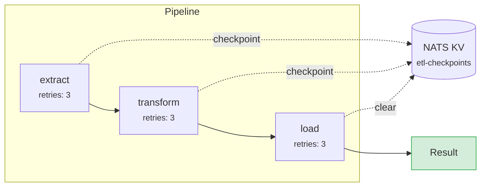

# rahcp-etl

Stateful ETL orchestration with [NATS JetStream](https://docs.nats.io/nats-concepts/jetstream) for event-driven pipelines.

## Pipeline DAG

Define multi-stage pipelines with per-stage retry policies and checkpoint-based resumption:



Each stage saves a checkpoint after success. If the pipeline fails and is re-run with the same `pipeline_id`, it resumes from the last checkpoint.

```python
import asyncio
from rahcp_etl.pipeline import Pipeline
from rahcp_etl.checkpointing import CheckpointStore
import nats

async def main():
    nc = await nats.connect("nats://localhost:4222")
    store = await CheckpointStore.create(nc)
    pipeline = Pipeline(checkpoint_store=store)

    @pipeline.stage("extract", retries=3, backoff=2.0)
    async def extract(payload):
        # Download source data
        return {"records": ["a", "b", "c"]}

    @pipeline.stage("transform")
    async def transform(payload):
        # Process records
        return {"transformed": [r.upper() for r in payload["records"]]}

    @pipeline.stage("load")
    async def load(payload):
        # Write results
        return {"loaded": len(payload["transformed"])}

    result = await pipeline.run(
        {"source": "s3://bucket/input"},
        pipeline_id="batch-2025-03-18",  # enables checkpoint resume
    )
    print(result)

asyncio.run(main())
```

**`Stage` dataclass** (`name`, `handler`, `retries=3`, `backoff=2.0`):

- Stages execute sequentially; each receives the output of the previous stage
- Failed stages retry with exponential backoff (`delay * backoff^attempt`)
- After each successful stage, a checkpoint is saved to NATS KV
- If a pipeline fails and is re-run with the same `pipeline_id`, it resumes from the last checkpoint
- Checkpoints are cleared on successful completion

## JetStream consumer

Durable message consumer for event-driven processing:

```python
from rahcp_etl.consumer import ETLConsumer

consumer = ETLConsumer(
    nats_url="nats://localhost:4222",
    stream="INGEST",
    subject="ingest.images.>",
    durable="image-processor",
    max_deliver=5,
    ack_wait=30.0,
)

async def handle(payload: bytes):
    data = json.loads(payload)
    # Process message...
    return {"status": "ok"}

await consumer.start(handle)
```

## Dead letter queue

Route permanently-failed messages for inspection and replay:

```python
from rahcp_etl.dlq import DeadLetterHandler

dlq = await DeadLetterHandler.create(nc)

# Send failed message to DLQ
await dlq.send("ingest.images.batch-1", payload, error="corrupt TIFF")

# Replay all DLQ messages back to original subjects
count = await dlq.replay()

# Purge old messages
count = await dlq.purge(older_than=timedelta(days=7))
```
