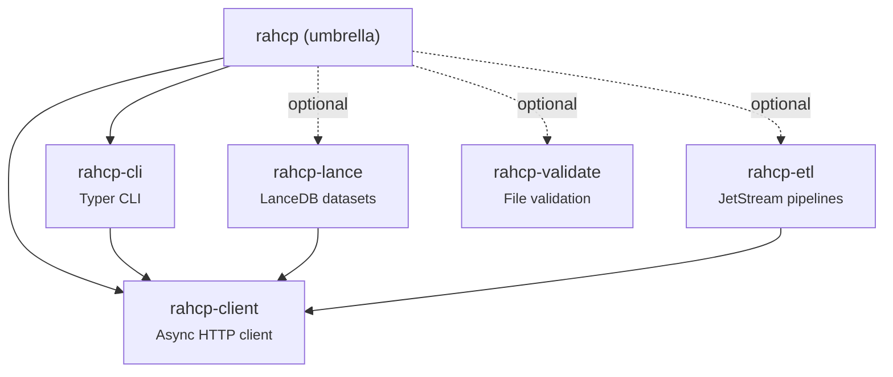
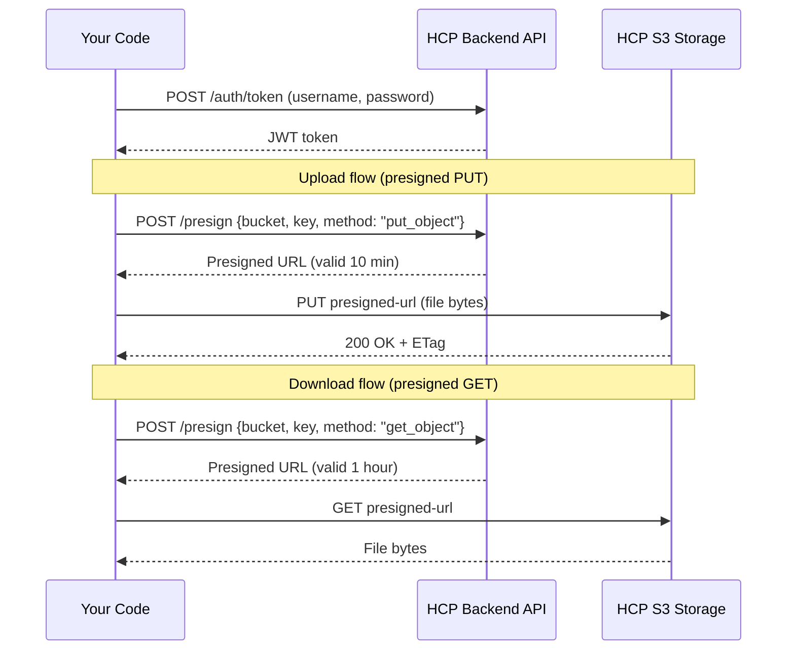
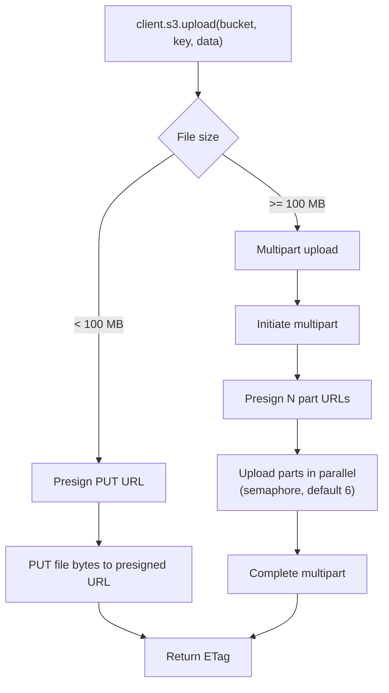
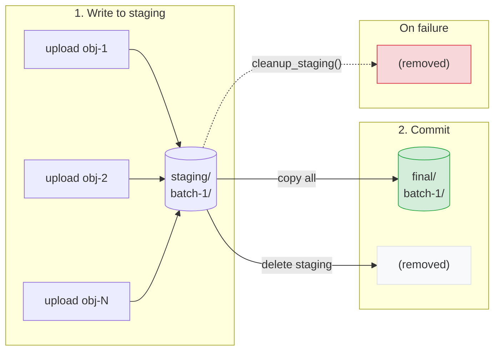
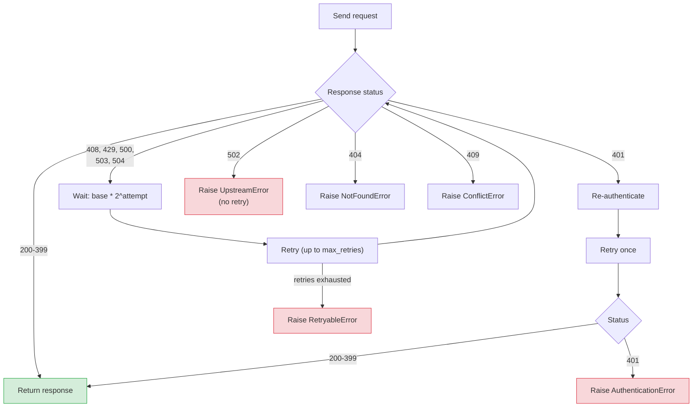
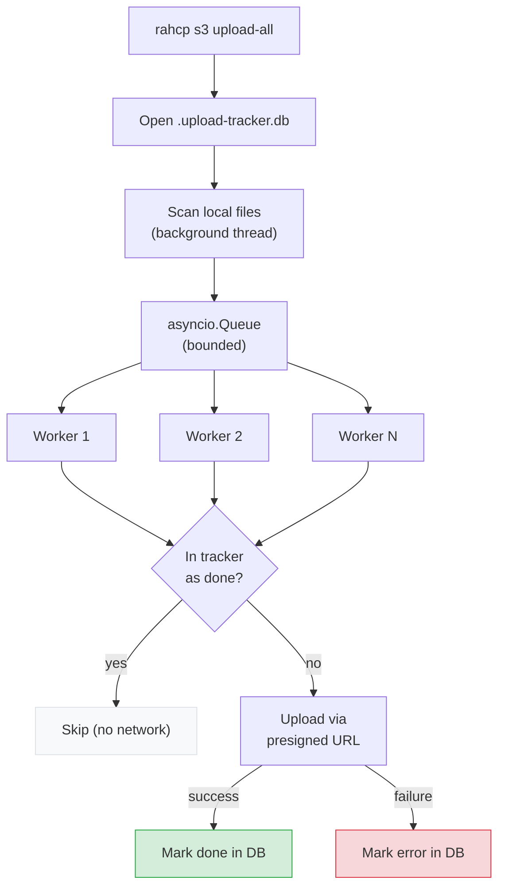
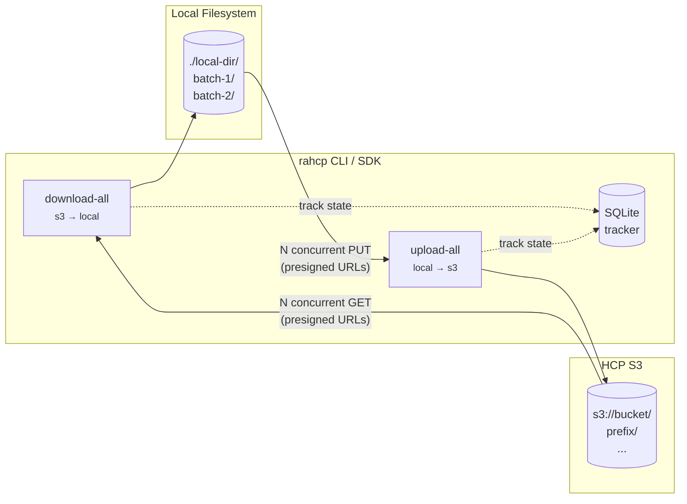
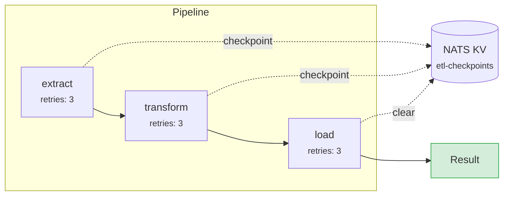

# Python SDK

The `rahcp` Python SDK provides a lightweight, async-first client for the HCP Unified API. It is distributed as a [uv workspace](https://docs.astral.sh/uv/concepts/workspaces/) with five installable packages:



## Installation

Requires **Python >= 3.13** and [uv](https://docs.astral.sh/uv/).

```bash
# SDK + CLI (default)
uv pip install rahcp

# With OpenTelemetry tracing
uv pip install "rahcp-client[otel]"

# With Lance dataset support
uv pip install "rahcp[lance]"

# With ETL pipelines (NATS JetStream)
uv pip install "rahcp[etl]"

# With image validation (Pillow)
uv pip install "rahcp[validate]"

# Everything
uv pip install "rahcp[all]"
```

The default install includes both the Python SDK (`rahcp-client`) and the CLI (`rahcp-cli`). The heavier packages (Lance, ETL, validation) are opt-in.

For local development from the repository:

```bash
uv sync                    # install all workspace packages
uv run rahcp s3 ls         # run CLI via uv
uv run rahcp auth whoami   # check current identity
```

!!! tip "uv run vs rahcp"
    When developing locally, use `uv run rahcp` to run the CLI without installing globally. After `uv pip install rahcp`, you can use `rahcp` directly.

---

## rahcp-client

Async HTTP client built on `httpx`. Handles authentication, retries, presigned URL transfers, and multipart uploads.

### How it works

The SDK never sends file data through the backend API. Instead, it uses **presigned URLs** -- short-lived, signed S3 URLs that allow direct transfer between your code and HCP storage:



This design keeps the backend stateless and avoids bottlenecking large transfers through the API server.

### Quick start

```python
import asyncio
from rahcp_client import HCPClient

async def main():
    async with HCPClient(
        endpoint="http://localhost:8000/api/v1",
        username="admin",
        password="password",
        tenant="dev-ai",
    ) as client:
        # List buckets
        result = await client.s3.list_buckets()
        print(result)

        # Upload a file (auto-selects presigned or multipart)
        from pathlib import Path
        etag = await client.s3.upload("my-bucket", "data/report.pdf", Path("report.pdf"))
        print(f"Uploaded: {etag}")

        # Download
        size = await client.s3.download("my-bucket", "data/report.pdf", Path("out.pdf"))
        print(f"Downloaded {size} bytes")

asyncio.run(main())
```

### Configuration

`HCPClient` accepts these parameters:

| Parameter | Type | Default | Description |
|-----------|------|---------|-------------|
| `endpoint` | `str` | `http://localhost:8000/api/v1` | HCP API base URL |
| `username` | `str` | `""` | HCP username |
| `password` | `str` | `""` | HCP password |
| `tenant` | `str \| None` | `None` | Target tenant (omit for system-level) |
| `timeout` | `float` | `30.0` | Request timeout in seconds |
| `max_retries` | `int` | `4` | Maximum retries for transient failures |
| `retry_base_delay` | `float` | `1.0` | Base delay for exponential backoff |
| `multipart_threshold` | `int` | `104857600` | File size threshold for multipart upload (100 MB) |
| `multipart_chunk` | `int` | `67108864` | Chunk size per multipart part (64 MB) |
| `multipart_concurrency` | `int` | `6` | Number of parallel part uploads |
| `verify_ssl` | `bool` | `True` | Verify SSL certificates for S3 data transfers |

#### From environment variables

```python
client = HCPClient.from_env()
```

Reads from `HCP_ENDPOINT`, `HCP_USERNAME`, `HCP_PASSWORD`, `HCP_TENANT`, `HCP_TIMEOUT`, `HCP_MAX_RETRIES`, `HCP_MULTIPART_THRESHOLD`, `HCP_MULTIPART_CHUNK`, `HCP_MULTIPART_CONCURRENCY`, `HCP_VERIFY_SSL`.

#### Properties

| Property | Type | Description |
|----------|------|-------------|
| `client.s3` | `S3Ops` | S3 data-plane operations (lazy-loaded) |
| `client.mapi` | `MapiOps` | MAPI namespace administration (lazy-loaded) |
| `client.token` | `str \| None` | Current JWT bearer token (set after login) |

### S3 operations

`client.s3` returns an `S3Ops` instance with these methods:

#### Uploads and downloads

The `upload()` method automatically selects the best transfer strategy based on file size:



```python
# Upload (auto-selects presigned PUT or multipart based on file size)
etag = await client.s3.upload("bucket", "key", data_or_path)

# Multipart upload (explicit, parallel parts)
etag = await client.s3.upload_multipart("bucket", "key", Path("large.bin"), concurrency=6)

# Download to file
byte_count = await client.s3.download("bucket", "key", Path("dest.bin"))

# Download to bytes
data = await client.s3.download_bytes("bucket", "key")
```

#### Presigned URLs

All data transfers use presigned URLs internally. You can also generate them directly for sharing or browser-based transfers:

```python
# Single presigned URL
url = await client.s3.presign_get("bucket", "key", expires=3600)
url = await client.s3.presign_put("bucket", "key", expires=3600)

# Bulk presigned download URLs
urls = await client.s3.presign_bulk("bucket", ["key1", "key2"], expires=3600)
```

#### Listing and metadata

```python
# List buckets
result = await client.s3.list_buckets()

# List objects (with prefix filtering)
result = await client.s3.list_objects("bucket", prefix="data/", max_keys=1000)
# Returns: {'objects': [...], 'common_prefixes': [...], 'is_truncated': bool, ...}

# Object metadata (HEAD)
meta = await client.s3.head("bucket", "key")
```

#### Delete and copy

```python
# Single delete
await client.s3.delete("bucket", "key")

# Bulk delete
result = await client.s3.delete_bulk("bucket", ["key1", "key2", "key3"])

# Copy object
await client.s3.copy("dest-bucket", "dest-key", "src-bucket", "src-key")
```

#### Staging pattern

Atomic directory-level operations: upload to a staging prefix, validate, then commit to the final prefix in one step. This prevents downstream consumers from seeing partial results.



```python
# Move all objects from staging/ to final/
count = await client.s3.commit_staging("bucket", "staging/batch-1/", "final/batch-1/")

# Clean up staging on failure
count = await client.s3.cleanup_staging("bucket", "staging/batch-1/")
```

??? example "Full runnable example — staging_commit.py"

    ```python
    --8<-- "examples/staging_commit.py:staging-commit"
    ```

### Bulk transfers (SDK)

The `bulk_upload` and `bulk_download` functions provide the same producer-consumer pipeline used by the CLI, available for programmatic use:

```python
import asyncio
from pathlib import Path
from rahcp_client import (
    HCPClient,
    TransferTracker,
    BulkUploadConfig,
    BulkDownloadConfig,
    bulk_upload,
    bulk_download,
)

async def main():
    async with HCPClient.from_env() as client:
        tracker = TransferTracker(Path(".upload-tracker.db"))

        stats = await bulk_upload(BulkUploadConfig(
            client=client,
            bucket="images-batch",
            source_dir=Path("/data/scans"),
            tracker=tracker,
            prefix="2025/",
            workers=20,
            on_progress=lambda s: print(f"{s.done} files, {s.mb_per_sec:.1f} MB/s"),
            on_error=lambda key, exc: print(f"FAILED: {key} — {exc}"),
        ))

        print(f"Done: {stats.ok} uploaded, {stats.skipped} skipped, {stats.errors} errors")
        print(f"Throughput: {stats.mb_per_sec:.1f} MB/s over {stats.elapsed:.0f}s")
        tracker.close()

asyncio.run(main())
```

#### BulkUploadConfig

| Field | Type | Default | Description |
|-------|------|---------|-------------|
| `client` | `HCPClient` | required | Authenticated client instance |
| `bucket` | `str` | required | Target S3 bucket |
| `source_dir` | `Path` | required | Local directory to upload |
| `tracker` | `TransferTracker` | required | SQLite progress tracker |
| `prefix` | `str` | `""` | Key prefix prepended to all keys |
| `workers` | `int` | `10` | Number of concurrent upload workers |
| `queue_depth` | `int` | `8` | Queue size multiplier (queue = workers × depth) |
| `skip_existing` | `bool` | `True` | Skip files already on remote with matching size |
| `retry_errors` | `bool` | `False` | Only process files marked as error in tracker |
| `include` | `list[str]` | `[]` | Glob patterns — only matching filenames are transferred |
| `exclude` | `list[str]` | `[]` | Glob patterns — matching filenames are skipped |
| `verify_upload` | `bool` | `False` | HEAD check after each upload to verify size matches |
| `on_progress` | callback | `None` | Called periodically with `TransferStats` |
| `on_error` | callback | `None` | Called on each file failure with `(key, exception)` |
| `progress_interval` | `float` | `5.0` | Minimum seconds between progress callbacks |

#### BulkDownloadConfig

Same fields as upload, except `source_dir` is replaced by `dest_dir: Path`, `verify_upload` becomes `verify_download`, and there is no `skip_existing` (downloads always skip files with matching size on disk).

#### TransferTracker

SQLModel-backed SQLite database for tracking transfer state:

```python
from rahcp_client import TransferTracker, TransferStatus

tracker = TransferTracker(Path("my-job.db"), flush_every=200)

# Mark files
tracker.mark("folder/file.jpg", 12345, TransferStatus.done)
tracker.mark("folder/bad.jpg", 0, TransferStatus.error, "SSL timeout")

# Query state
done = tracker.done_keys()           # set[str] — instant skip lookups
errors = tracker.error_entries()     # list[(key, size)] — for retry
summary = tracker.summary()          # {"pending": 0, "done": 500, "error": 3}

# Lifecycle
tracker.flush()   # write buffered marks to DB
tracker.commit()  # alias for flush
tracker.close()   # flush + release resources
```

Marks are buffered in memory and flushed to SQLite every `flush_every` entries (default 200) or on explicit `flush()` / `close()`. The database uses WAL mode for safe concurrent access.

### MAPI operations

`client.mapi` returns a `MapiOps` instance for namespace administration:

```python
# List namespaces
namespaces = await client.mapi.list_namespaces("dev-ai", verbose=True)

# Get namespace details
ns = await client.mapi.get_namespace("dev-ai", "datasets", verbose=True)

# Create namespace
result = await client.mapi.create_namespace("dev-ai", {
    "name": "new-ns",
    "description": "My namespace",
    "hardQuota": "100 GB",
    "softQuota": 80,
})

# Update namespace
await client.mapi.update_namespace("dev-ai", "new-ns", {
    "description": "Updated description",
})

# Delete namespace
await client.mapi.delete_namespace("dev-ai", "new-ns")

# Export as template
template = await client.mapi.export_namespace("dev-ai", "datasets")

# Export multiple
bundle = await client.mapi.export_namespaces("dev-ai", ["datasets", "archives"])
```

### Error handling

All errors inherit from `HCPError`:

| Exception | HTTP status | When |
|-----------|------------|------|
| `AuthenticationError` | 401, 403 | Invalid credentials or insufficient permissions |
| `NotFoundError` | 404 | Resource does not exist |
| `ConflictError` | 409 | Resource already exists |
| `RetryableError` | 408, 429, 500, 503, 504 | Transient failure (raised after retries exhausted) |
| `UpstreamError` | 502 | HCP system unreachable |

```python
from rahcp_client.errors import HCPError, NotFoundError

try:
    await client.s3.head("bucket", "missing-key")
except NotFoundError:
    print("Object not found")
except HCPError as e:
    print(f"HCP error {e.status_code}: {e.message}")
```

### Observability

The SDK has optional OpenTelemetry tracing. Every API request creates a span with method, path, and status code attributes.

```bash
# Install with OTel support
uv pip install "rahcp-client[otel]"
```

When `opentelemetry-api` is installed, the SDK creates spans automatically for every HTTP request and key S3 operations (upload, download, multipart). The OTEL exporter is configured via standard environment variables -- the same ones the backend uses:

```bash
OTEL_SERVICE_NAME=rahcp-cli
OTEL_EXPORTER_OTLP_ENDPOINT=https://otlp-gateway.example.com/otlp
OTEL_EXPORTER_OTLP_PROTOCOL=http/protobuf    # or grpc
OTEL_EXPORTER_OTLP_HEADERS=Authorization=Basic%20...
```

When OTel is **not** installed, the tracer is a no-op -- zero overhead, no dependency. Structured logging via Python's `logging` module is always active (method, path, status, duration in ms).

OTEL can also be configured programmatically in the SDK:

```python
from rahcp_client.tracing import configure_tracing

configure_tracing(
    service_name="my-etl-pipeline",
    endpoint="https://otlp-gateway.example.com/otlp",
    protocol="http/protobuf",  # or "grpc"
)
```

Or via the CLI config file (`otel_endpoint`, `otel_protocol`, `otel_service_name` fields per profile).

#### Logging

Control log verbosity with the `--log-level` flag, the `RAHCP_LOG_LEVEL` env var, or the `log_level` profile setting:

```bash
# Debug — see every HTTP request with timing
rahcp --log-level debug s3 ls

# Info — see auth events and summaries
rahcp --log-level info s3 download-all my-bucket
```

| Level | What you see |
|-------|-------------|
| `debug` | Every HTTP request with method, path, status, duration (ms) |
| `info` | Authentication, upload/download summaries |
| `warning` | Retries, transport errors (default) |
| `error` | Non-retryable failures |

#### Credential safety

The SDK never logs passwords or tokens. Error messages from HCP are redacted -- any JSON response field matching `password`, `token`, `access_token`, `secret`, or `authorization` is replaced with `[REDACTED]` before logging or raising exceptions.

Presigned URL errors (e.g. 403 on upload/download) never expose the signed URL -- the SDK strips the signature parameters and shows only `403 Forbidden for bucket/key`. Use `--log-level debug` for the full request path and redacted response body.

### Retry behavior

The client automatically retries transient failures with exponential backoff:



---

## rahcp-cli

Command-line interface built on [Typer](https://typer.tiangolo.com/) and [Rich](https://rich.readthedocs.io/).

### Quick start

```bash
# Check identity
rahcp auth whoami

# List buckets
rahcp s3 ls

# List objects in a bucket
rahcp s3 ls my-bucket --prefix data/

# Upload a single file
rahcp s3 upload my-bucket reports/q1.pdf ./q1-report.pdf

# Upload an entire directory
rahcp s3 upload-all my-bucket ./local-data --prefix data/

# Download a single file
rahcp s3 download my-bucket reports/q1.pdf --output ./q1.pdf

# Download all objects from a bucket
rahcp s3 download-all my-bucket --output ./local-backup

# Delete objects
rahcp s3 rm my-bucket temp/file1.txt temp/file2.txt

# Get a presigned URL
rahcp s3 presign my-bucket reports/q1.pdf --expires 7200
```

!!! tip "Local development"
    When running from the repo without installing, prefix with `uv run`:
    ```bash
    uv run rahcp s3 ls
    uv run rahcp s3 upload-all mlflow-artifacts /path/to/dump
    ```

### Configuration

Settings are resolved in priority order: **CLI flags > environment variables > config file profile > defaults**.

#### Config file

Create `~/.rahcp/config.yaml` (or copy from `.rahcp.example.yaml`):

```yaml
default: dev

profiles:
  dev:
    endpoint: http://localhost:8000/api/v1
    username: admin
    password: secret
    tenant: dev-ai
    verify_ssl: false       # disable for local dev
    timeout: 60             # seconds per request (default 30)
    log_level: info         # debug | info | warning | error

    # Multipart upload thresholds
    multipart_threshold: 104857600  # 100 MB (trigger multipart above this)
    multipart_chunk: 67108864       # 64 MB per part
    multipart_concurrency: 6       # parallel part uploads

    # Bulk transfer defaults (upload-all / download-all)
    bulk_workers: 20                # concurrent transfers
    bulk_progress_interval: 5.0     # seconds between progress reports
    bulk_queue_depth: 8             # queue size = workers × this
    bulk_tracker_flush_every: 200   # tracker DB writes buffered per flush
    bulk_tracker_dir: ""            # tracker DB directory (default: ~/.rahcp/)

  prod:
    endpoint: https://hcp-api.example.com/api/v1
    username: svc-account
    password: ""
    tenant: prod-archive
    verify_ssl: true        # always verify in production
    log_level: warning      # quiet in production
    bulk_workers: 30        # more workers for production throughput
    otel_endpoint: https://otlp-gateway.example.com/otlp
    otel_protocol: http/protobuf   # or grpc
    otel_service_name: rahcp-cli
```

#### Global options

| Flag | Env var | Description |
|------|---------|-------------|
| `--config` | `RAHCP_CONFIG` | Path to config YAML |
| `--profile` / `-c` | `HCP_PROFILE` | Named profile |
| `--endpoint` / `-e` | `HCP_ENDPOINT` | API base URL |
| `--username` / `-u` | `HCP_USERNAME` | Username |
| `--password` / `-p` | `HCP_PASSWORD` | Password |
| `--tenant` / `-t` | `HCP_TENANT` | Tenant |
| `--log-level` | `RAHCP_LOG_LEVEL` | Log level: `debug`, `info`, `warning`, `error` |
| `--otel-endpoint` | `OTEL_EXPORTER_OTLP_ENDPOINT` | OTLP endpoint for traces (empty = disabled) |
| `--json` | -- | Output raw JSON |

### Commands

#### `rahcp auth`

| Command | Description |
|---------|-------------|
| `whoami` | Decode JWT and show current user/tenant |

#### `rahcp s3`

| Command | Description |
|---------|-------------|
| `ls [BUCKET]` | List buckets (no args) or objects in a bucket |
| `upload BUCKET KEY FILE` | Upload single file (auto multipart for large files) |
| `upload-all BUCKET DIR` | Upload directory with tracked resume and parallel workers |
| `download BUCKET KEY` | Download single object (with `--output` / `-o`) |
| `download-all BUCKET` | Download bucket with tracked resume and parallel workers |
| `rm BUCKET KEY [KEY ...]` | Delete one or more objects |
| `presign BUCKET KEY` | Generate presigned download URL (with `--expires`) |
| `verify BUCKET DIR` | Verify all local files exist in bucket with matching sizes |

##### `rahcp s3 ls` -- browsing objects

The `ls` command supports pagination, prefix filtering, delimiter grouping, and key search:

| Flag | Short | Default | Description |
|------|-------|---------|-------------|
| `--prefix` | `-p` | `""` | Filter by key prefix |
| `--max-keys` | `-n` | `100` | Max results per page |
| `--delimiter` | `-d` | -- | Group by delimiter (e.g. `/` for folder view) |
| `--filter` | `-f` | -- | Client-side filter: only show keys containing this string |
| `--page` | -- | -- | Continuation token for next page (shown when results are truncated) |

**Examples:**

```bash
# List all buckets
rahcp s3 ls

# First 20 objects in a bucket
rahcp s3 ls ai-lagfart -n 20

# Only objects under data/
rahcp s3 ls ai-lagfart --prefix data/

# Top-level folders only (delimiter groups)
rahcp s3 ls ai-lagfart -d /

# Filter keys containing "lagfart"
rahcp s3 ls ai-lagfart -f lagfart

# Next page (if truncated, the CLI shows the token)
rahcp s3 ls ai-lagfart --page <token>

# Combine: first 10 TIFF files under data/
rahcp s3 ls ai-lagfart --prefix data/ -n 10 -f .tif
```

When results are truncated, the CLI prints a `More results available` hint with the exact `--page` command to fetch the next page.

##### `rahcp s3 download-all` -- bulk download

Download all objects from a bucket (or prefix) to a local directory with concurrent transfers. Uses a producer-consumer pipeline with SQLite-backed progress tracking for crash-safe resume.

| Flag | Short | Default | Description |
|------|-------|---------|-------------|
| `--prefix` | `-p` | `""` | Only download keys under this prefix |
| `--output` | `-o` | `.` | Local destination directory |
| `--workers` | `-w` | `10` | Number of concurrent downloads |
| `--include` / `-I` | -- | all files | Only download keys matching these glob patterns (repeatable) |
| `--exclude` / `-E` | -- | none | Skip keys matching these glob patterns (repeatable) |
| `--validate` | -- | off | Validate each file after download (auto-detects format by extension) |
| `--verify` | -- | off | Verify each download by checking file size after transfer |
| `--retry-errors` | -- | off | Only retry files that failed in a previous run |
| `--tracker-db` | -- | same dir as config.yaml | Path to SQLite tracker database |

**Examples:**

```bash
# Download entire bucket to current directory
rahcp s3 download-all my-bucket

# Download a prefix to a specific directory
rahcp s3 download-all my-bucket --prefix data/scans/ -o ./local-scans

# Download only JPEGs with validation and verification
rahcp s3 download-all my-bucket --include '*.jpg' --validate --verify -o ./output

# Retry only files that failed last time
rahcp s3 download-all my-bucket --retry-errors --validate --verify

# Only download JPEGs
rahcp s3 download-all my-bucket --include '*.jpg' --include '*.jpeg'

# Skip temp files
rahcp s3 download-all my-bucket --exclude '*.tmp' --exclude '*.log'

# Verify file integrity after each download
rahcp s3 download-all my-bucket --verify

# Use a custom tracker location
rahcp s3 download-all my-bucket --tracker-db /tmp/my-download.db
```

##### `rahcp s3 upload-all` -- bulk upload

Upload an entire local directory to a bucket, preserving the directory structure as S3 key prefixes. Uses a producer-consumer pipeline with SQLite-backed progress tracking for crash-safe resume.

| Flag | Short | Default | Description |
|------|-------|---------|-------------|
| `--prefix` | `-p` | `""` | Key prefix to prepend to all uploaded keys |
| `--workers` | `-w` | `10` | Number of concurrent uploads |
| `--skip-existing` / `--overwrite` | -- | `--skip-existing` | Skip files that already exist with matching size (idempotent) |
| `--include` / `-I` | -- | all files | Only upload files matching these glob patterns (repeatable) |
| `--exclude` / `-E` | -- | none | Skip files matching these glob patterns (repeatable) |
| `--validate` | -- | off | Validate each file before upload (auto-detects format by extension) |
| `--verify` | -- | off | Verify each upload by checking remote size (HEAD) after transfer |
| `--retry-errors` | -- | off | Only retry files that failed in a previous run |
| `--tracker-db` | -- | same dir as config.yaml | Path to SQLite tracker database |

**Examples:**

```bash
# Upload a directory to a bucket (preserves folder structure)
rahcp s3 upload-all my-bucket ./local-scans

# Upload with a key prefix
rahcp s3 upload-all my-bucket ./scans --prefix data/2025/

# Only upload JPEGs, validate and verify each one (maximum safety)
rahcp s3 upload-all my-bucket ./scans --include '*.jpg' --validate --verify

# Upload everything except temp files
rahcp s3 upload-all my-bucket ./data --exclude '*.tmp' --exclude '*.log'

# Retry only files that failed last time
rahcp s3 upload-all my-bucket ./archive --retry-errors --validate --verify

# After upload, batch-verify everything
rahcp s3 verify my-bucket ./scans --prefix data/2025/
```

**How `--validate` works:**

Auto-detects file type by extension and runs format-specific checks:

| Extension | Validation |
|-----------|-----------|
| `.jpg` / `.jpeg` | SOI/EOI markers + Pillow full decode |
| `.tif` / `.tiff` | Magic bytes + version 42 + Pillow full decode |
| `.png` | PNG signature + Pillow full decode |
| Other | Skipped (no validation error) |

Requires `rahcp-validate` (`uv pip install 'rahcp-cli[validate]'`).

**Error handling:**

Failed files (validation, transfer, or verification) are marked as `error` in the tracker with the reason. The job **continues** — it does not stop on errors. After completion:

```bash
# See what failed
uv run python -c "
from rahcp_client import TransferTracker
from pathlib import Path
t = TransferTracker(Path('.rahcp/.upload-tracker.db'))
for key, size in t.error_entries():
    print(key)
t.close()
"

# Retry only the failures
rahcp s3 upload-all my-bucket ./scans --retry-errors --validate --verify
```

The command is **idempotent by default** -- re-running it skips files that already exist in the bucket with matching size. This makes it safe to retry after partial failures.

The command recursively finds all files in the source directory and uploads them with keys that mirror the local path. For example, uploading `./scans/` with `--prefix data/` maps:

```
./scans/batch-1/image-001.tif  →  s3://my-bucket/data/batch-1/image-001.tif
./scans/batch-1/image-002.tif  →  s3://my-bucket/data/batch-1/image-002.tif
./scans/batch-2/image-003.tif  →  s3://my-bucket/data/batch-2/image-003.tif
```

##### Bulk transfer tracking

Both `upload-all` and `download-all` track progress in a local SQLite database (`.upload-tracker.db` / `.download-tracker.db` in the current working directory by default). This enables:

- **Instant resume** -- on re-run, completed files are skipped without any network calls
- **Selective retry** -- `--retry-errors` retries only files that failed previously
- **Progress visibility** -- periodic stats with files/s and MB/s throughput

The tracker database persists across runs. To start fresh, delete the `.db` file.

Tracker location resolution: `--tracker-db` flag > `bulk_tracker_dir` in profile > config file directory (e.g. `~/.rahcp/` or `.rahcp/` if using `--config`).



##### Performance tuning

Bulk transfer throughput depends on network bandwidth, HCP endpoint capacity, file sizes, and local I/O. The default settings are conservative — here's how to tune them for your hardware.

**Key settings:**

| Setting | config.yaml | CLI | Default | What it controls |
|---------|------------|-----|---------|-----------------|
| `bulk_workers` | Yes | `--workers` | 10 | Concurrent upload/download coroutines |
| `bulk_queue_depth` | Yes | — | 8 | Queue size = workers × depth. Higher = more files buffered ahead |
| `bulk_progress_interval` | Yes | — | 5.0 | Seconds between progress reports |
| `bulk_tracker_flush_every` | Yes | — | 200 | Marks buffered before writing to SQLite |
| `bulk_tracker_dir` | Yes | `--tracker-db` | same dir as config.yaml | Where the tracker DB lives |
| `multipart_threshold` | Yes | — | 100 MB | Files above this use multipart upload |
| `multipart_chunk` | Yes | — | 64 MB | Part size for multipart uploads |
| `multipart_concurrency` | Yes | — | 6 | Parallel parts per multipart upload |
| `verify_ssl` | Yes | — | true | Set `false` for self-signed HCP certs |

**Tuning by scenario:**

=== "Many small files (< 5 MB each)"

    The bottleneck is request overhead — each file needs a presigned URL request + a PUT. Increase workers aggressively:

    ```yaml
    bulk_workers: 40        # more concurrent requests
    bulk_queue_depth: 12    # keep workers fed
    bulk_tracker_flush_every: 500  # less frequent DB writes
    ```

    Expected: 30-60 files/s depending on network latency to HCP.

=== "Fewer large files (> 100 MB each)"

    The bottleneck is bandwidth. Workers don't help much — tune multipart instead:

    ```yaml
    bulk_workers: 10        # fewer concurrent transfers
    multipart_threshold: 52428800   # 50 MB — trigger multipart sooner
    multipart_chunk: 33554432       # 32 MB parts — more parallelism per file
    multipart_concurrency: 10       # more parallel parts
    ```

=== "Mixed sizes (archive directories)"

    Balance between request concurrency and bandwidth:

    ```yaml
    bulk_workers: 20
    bulk_queue_depth: 8
    multipart_concurrency: 6
    ```

=== "Slow or high-latency network"

    Reduce workers to avoid overwhelming the connection, increase timeouts:

    ```yaml
    bulk_workers: 5
    timeout: 120
    verify_ssl: false       # if SSL handshake adds latency
    ```

=== "Fast datacenter network (> 1 Gbps)"

    Push workers high and reduce overhead:

    ```yaml
    bulk_workers: 60
    bulk_queue_depth: 16
    bulk_tracker_flush_every: 1000
    ```

**How to diagnose bottlenecks:**

| Symptom | Likely bottleneck | Fix |
|---------|------------------|-----|
| files/s increases with more workers | Worker-bound | Increase `bulk_workers` |
| files/s plateaus despite more workers | Network or HCP-bound | Don't increase workers further |
| MB/s is high but files/s is low | Large files | Normal — fewer files but more bytes per file |
| MB/s is low and CPU is low | Network latency | Increase `bulk_workers` to overlap round-trips |
| High memory usage (>10 GB) | Large file list in memory | Normal for millions of files — `done_keys` set + file list |
| Errors appearing | SSL, timeout, or HCP rate limit | Check `verify_ssl`, increase `timeout`, reduce workers |

**Monitoring a running transfer:**

```bash
# Reattach to the tmux session
tmux attach -t upload

# Check tracker DB from another terminal
uv run python -c "
from rahcp_client import TransferTracker
from pathlib import Path
t = TransferTracker(Path.home() / '.rahcp/.upload-tracker.db')
print(t.summary())
t.close()
"

# Verify what's on S3 so far
rahcp s3 ls my-bucket -n 5
```

**Running long transfers safely:**

Always run bulk transfers inside `tmux` or `screen` so they survive SSH disconnects:

```bash
tmux new -s upload
rahcp s3 upload-all my-bucket ./data --workers 20
# Ctrl+B, D to detach — reattach with: tmux attach -t upload
```

If the process is interrupted (Ctrl+C, crash, reboot), re-run the same command. The tracker skips all completed files instantly — no re-upload, no HEAD requests.

##### Integrity verification

There are two ways to verify transfers. Choose based on your needs:

**Option 1: `--verify` flag (inline, per-file)**

Checks each file immediately after transfer. Adds one HEAD request per upload or one size check per download.

```bash
rahcp s3 upload-all my-bucket ./critical-data --verify
rahcp s3 download-all my-bucket --verify
```

**Cost:** 50% more API calls on upload (presign + PUT + HEAD per file instead of presign + PUT). On a 1.9M file upload at 40 files/s, this drops throughput to ~25-30 files/s and adds ~5-7 hours. Downloads are cheaper — the size check is local (no extra API call).

**When to use:** Mission-critical data where a single corrupt file is unacceptable and you need immediate detection.

**Option 2: `rahcp s3 verify` (post-transfer, batch)**

Runs a single pass after the transfer is complete. Lists all remote objects and compares sizes against local files.

```bash
# After upload finishes
rahcp s3 verify my-bucket ./local-scans
rahcp s3 verify my-bucket ./scans --prefix data/2025/
```

**Cost:** One paginated listing (1 request per 1000 objects) + local file walk. For 1.9M files, that's ~1,900 API calls total vs ~1.9M HEAD calls with `--verify`.

**When to use:** Most transfers. Run once at the end — if anything is missing or wrong, use `--retry-errors` to fix it.

Output:
```
Verification: 603 local files, 601 remote objects

  597 OK — present with matching size
  6 MISSING — not found in bucket:
    0/955e67d3.../artifacts/donut-model/model.safetensors
    17/6802f8af.../artifacts/weights/best.pt
    ...
```

Exits with code 1 if any files are missing or have size mismatches, making it usable in scripts and CI.

**Recommendation:** For large transfers (>10K files), use `verify` after the transfer. For small critical batches (<1K files), use `--verify` inline.

##### Bulk transfer overview



#### `rahcp ns`

| Command | Description |
|---------|-------------|
| `list TENANT` | List namespaces (with `--verbose`) |
| `get TENANT NS` | Get namespace details (with `--verbose`) |
| `create TENANT` | Create namespace (with `--name`, `--quota`) |
| `delete TENANT NS` | Delete namespace |
| `export TENANT NS` | Export namespace as JSON template (with `--output`) |
| `import TENANT FILE` | Create namespace(s) from exported template |

---

## rahcp-lance

Manage [LanceDB](https://lancedb.github.io/lancedb/) datasets stored on HCP S3.

### Quick start

```python
import asyncio
from rahcp_client import HCPClient
from rahcp_lance import LanceDataset

async def main():
    async with HCPClient.from_env() as client:
        ds = LanceDataset(client, bucket="my-bucket", prefix="lance/")

        # List tables
        tables = await ds.list_tables()
        print(tables)

        # Create a table from data
        table = await ds.create("embeddings", data=[
            {"text": "hello", "vector": [0.1, 0.2, 0.3]},
            {"text": "world", "vector": [0.4, 0.5, 0.6]},
        ])

        # Get table info
        info = await ds.table_info("embeddings")
        print(f"{info.name}: {info.num_rows} rows")

        # Ingest more data
        result = await ds.ingest("embeddings", [
            {"text": "foo", "vector": [0.7, 0.8, 0.9]},
        ])
        print(f"Added {result.rows_added}, total {result.total_rows}")

asyncio.run(main())
```

### Querying

```python
from rahcp_lance.query import scan, vector_search
from rahcp_lance.schemas import ScanParams, VectorSearchParams

# Scan with filtering and pagination
table = await ds.open("embeddings")
result = await scan(table, ScanParams(
    columns=["text", "vector"],
    filter="text != 'hello'",
    limit=10,
    offset=0,
))

# Vector similarity search
results = await vector_search(table, VectorSearchParams(
    vector=[0.1, 0.2, 0.3],
    column="vector",
    k=5,
))
for r in results:
    print(f"  distance={r.distance:.4f}  data={r.data}")
```

### Data models

| Model | Fields |
|-------|--------|
| `TableInfo` | `name`, `num_rows`, `schema_fields: list[FieldInfo]` |
| `FieldInfo` | `name`, `dtype`, `nullable` |
| `IngestResult` | `table`, `rows_added`, `total_rows` |
| `ScanParams` | `columns`, `filter`, `limit`, `offset` |
| `VectorSearchParams` | `vector`, `column`, `k`, `filter`, `columns` |
| `SearchResult` | `data`, `distance` |

---

## rahcp-etl

Stateful ETL orchestration with [NATS JetStream](https://docs.nats.io/nats-concepts/jetstream) for event-driven pipelines.

### Pipeline DAG

Define multi-stage pipelines with per-stage retry policies and checkpoint-based resumption:



Each stage saves a checkpoint after success. If the pipeline fails and is re-run with the same `pipeline_id`, it resumes from the last checkpoint.

```python
import asyncio
from rahcp_etl.pipeline import Pipeline
from rahcp_etl.checkpointing import CheckpointStore
import nats

async def main():
    nc = await nats.connect("nats://localhost:4222")
    store = await CheckpointStore.create(nc)
    pipeline = Pipeline(checkpoint_store=store)

    @pipeline.stage("extract", retries=3, backoff=2.0)
    async def extract(payload):
        # Download source data
        return {"records": ["a", "b", "c"]}

    @pipeline.stage("transform")
    async def transform(payload):
        # Process records
        return {"transformed": [r.upper() for r in payload["records"]]}

    @pipeline.stage("load")
    async def load(payload):
        # Write results
        return {"loaded": len(payload["transformed"])}

    result = await pipeline.run(
        {"source": "s3://bucket/input"},
        pipeline_id="batch-2025-03-18",  # enables checkpoint resume
    )
    print(result)

asyncio.run(main())
```

**Behavior:**

- Stages execute sequentially; each receives the output of the previous stage
- Failed stages retry with exponential backoff (`delay * 2^attempt`)
- After each successful stage, a checkpoint is saved to NATS KV
- If a pipeline fails and is re-run with the same `pipeline_id`, it resumes from the last checkpoint
- Checkpoints are cleared on successful completion

### JetStream consumer

Durable message consumer for event-driven processing:

```python
from rahcp_etl.consumer import ETLConsumer

consumer = ETLConsumer(
    nats_url="nats://localhost:4222",
    stream="INGEST",
    subject="ingest.images.>",
    durable="image-processor",
    max_deliver=5,
    ack_wait=30.0,
)

async def handle(payload: bytes):
    data = json.loads(payload)
    # Process message...
    return {"status": "ok"}

await consumer.start(handle)
```

### Dead letter queue

Route permanently-failed messages for inspection and replay:

```python
from rahcp_etl.dlq import DeadLetterHandler

dlq = await DeadLetterHandler.create(nc)

# Send failed message to DLQ
await dlq.send("ingest.images.batch-1", payload, error="corrupt TIFF")

# Replay all DLQ messages back to original subjects
count = await dlq.replay()

# Purge old messages
count = await dlq.purge(older_than=timedelta(days=7))
```

---

## rahcp-validate

Pre-upload file validation with format-specific checks and composable rules.

### Image validation

```python
from pathlib import Path
from rahcp_validate.images import validate_tiff, validate_jpg, ValidationError

try:
    validate_tiff(Path("scan.tiff"))
    print("TIFF is valid")
except ValidationError as e:
    print(f"Invalid: {e.reason}")

try:
    validate_jpg(Path("photo.jpg"))
except ValidationError as e:
    print(f"Invalid: {e.reason}")
```

**TIFF checks:** magic bytes (II/MM), version == 42, full Pillow load.

**JPEG checks:** SOI marker (0xFFD8), EOI marker (0xFFD9), full Pillow decode.

### Composable rules

```python
from pathlib import Path
from rahcp_validate.rules import validate, max_file_size, image_dimensions, allowed_extensions

rules = [
    max_file_size(100 * 1024 * 1024),         # 100 MB max
    allowed_extensions(".tiff", ".tif", ".jpg", ".jpeg"),
    image_dimensions(min_w=100, min_h=100, max_w=10000, max_h=10000),
]

errors = validate(Path("scan.tiff"), rules)
if errors:
    for e in errors:
        print(f"  FAIL: {e}")
else:
    print("All checks passed")
```

| Rule factory | Description |
|-------------|-------------|
| `max_file_size(limit_bytes)` | Reject files larger than limit |
| `image_dimensions(min_w, min_h, max_w, max_h)` | Check pixel dimensions are within bounds |
| `allowed_extensions(*exts)` | Only allow specified file extensions |

---

## Comparison: SDK vs raw HTTP

The SDK eliminates boilerplate around authentication, retries, presigned URLs, and multipart uploads. Here is the same upload workflow with raw `httpx` vs the SDK:

=== "rahcp SDK"

    ```python
    from rahcp_client import HCPClient
    from pathlib import Path

    async with HCPClient.from_env() as client:
        etag = await client.s3.upload("my-bucket", "data/file.bin", Path("file.bin"))
        print(f"Uploaded: {etag}")
    ```

=== "Raw httpx"

    ```python
    import httpx

    BASE = "http://localhost:8000/api/v1"

    async with httpx.AsyncClient(base_url=BASE) as c:
        # 1. Authenticate
        resp = await c.post("/auth/token", data={
            "username": "admin", "password": "password", "tenant": "dev-ai",
        })
        token = resp.json()["access_token"]
        c.headers["Authorization"] = f"Bearer {token}"

        # 2. Get presigned upload URL
        resp = await c.post("/presign", json={
            "bucket": "my-bucket", "key": "data/file.bin", "method": "put_object",
        })
        url = resp.json()["url"]

        # 3. Upload to presigned URL
        data = Path("file.bin").read_bytes()
        async with httpx.AsyncClient() as hcp:
            resp = await hcp.put(url, content=data)
            resp.raise_for_status()
            print(f"Uploaded: {resp.headers['etag']}")
    ```

The SDK also handles automatic retries, token refresh, and multipart upload for large files -- none of which are shown in the raw example above.
