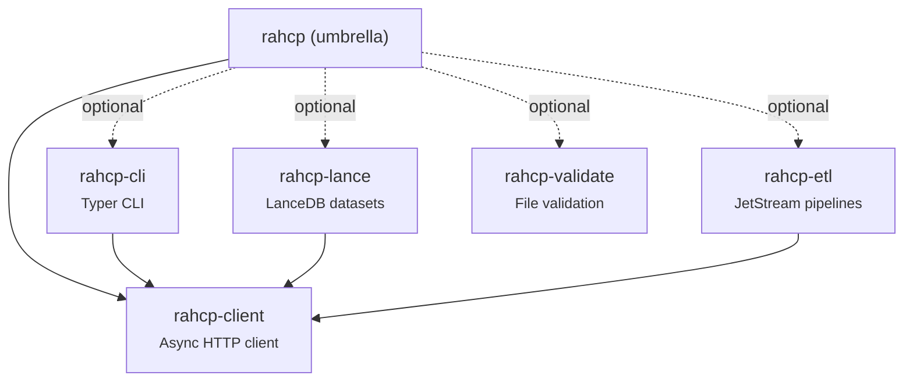

# Python SDK

The `rahcp` Python SDK provides a lightweight, async-first client for the HCP Unified API. It is distributed as a [uv workspace](https://docs.astral.sh/uv/concepts/workspaces/) with five installable packages:



## Installation

Requires **Python >= 3.13** and [uv](https://docs.astral.sh/uv/).

```bash
# Core client only
uv pip install rahcp

# With CLI
uv pip install "rahcp[cli]"

# With Lance dataset support
uv pip install "rahcp[lance]"

# Everything
uv pip install "rahcp[all]"
```

For local development from the repository:

```bash
cd packages
uv sync
```

---

## rahcp-client

Async HTTP client built on `httpx`. Handles authentication, retries, presigned URL transfers, and multipart uploads.

### Quick start

```python
import asyncio
from rahcp_client import HCPClient

async def main():
    async with HCPClient(
        endpoint="http://localhost:8000/api/v1",
        username="admin",
        password="password",
        tenant="dev-ai",
    ) as client:
        # List buckets
        result = await client.s3.list_buckets()
        print(result)

        # Upload a file (auto-selects presigned or multipart)
        from pathlib import Path
        etag = await client.s3.upload("my-bucket", "data/report.pdf", Path("report.pdf"))
        print(f"Uploaded: {etag}")

        # Download
        size = await client.s3.download("my-bucket", "data/report.pdf", Path("out.pdf"))
        print(f"Downloaded {size} bytes")

asyncio.run(main())
```

### Configuration

`HCPClient` accepts these parameters:

| Parameter | Type | Default | Description |
|-----------|------|---------|-------------|
| `endpoint` | `str` | `http://localhost:8000/api/v1` | HCP API base URL |
| `username` | `str` | `""` | HCP username |
| `password` | `str` | `""` | HCP password |
| `tenant` | `str \| None` | `None` | Target tenant (omit for system-level) |
| `timeout` | `float` | `30.0` | Request timeout in seconds |
| `max_retries` | `int` | `4` | Maximum retries for transient failures |
| `retry_base_delay` | `float` | `1.0` | Base delay for exponential backoff |
| `multipart_threshold` | `int` | `67108864` | File size threshold for multipart upload (64 MB) |
| `multipart_chunk` | `int` | `16777216` | Chunk size per multipart part (16 MB) |

#### From environment variables

```python
client = HCPClient.from_env()
```

Reads from `HCP_ENDPOINT`, `HCP_USERNAME`, `HCP_PASSWORD`, `HCP_TENANT`, `HCP_TIMEOUT`, `HCP_MAX_RETRIES`.

### S3 operations

`client.s3` returns an `S3Ops` instance with these methods:

#### Uploads and downloads

```python
# Upload (auto-selects presigned PUT or multipart based on file size)
etag = await client.s3.upload("bucket", "key", data_or_path)

# Multipart upload (explicit, parallel parts)
etag = await client.s3.upload_multipart("bucket", "key", Path("large.bin"), concurrency=6)

# Download to file
byte_count = await client.s3.download("bucket", "key", Path("dest.bin"))

# Download to bytes
data = await client.s3.download_bytes("bucket", "key")
```

#### Presigned URLs

```python
# Single presigned URL
url = await client.s3.presign_get("bucket", "key", expires=3600)
url = await client.s3.presign_put("bucket", "key", expires=3600)

# Bulk presigned download URLs
urls = await client.s3.presign_bulk("bucket", ["key1", "key2"], expires=3600)
```

#### Listing and metadata

```python
# List buckets
result = await client.s3.list_buckets()

# List objects (with prefix filtering)
result = await client.s3.list_objects("bucket", prefix="data/", max_keys=1000)
# Returns: {'objects': [...], 'common_prefixes': [...], 'is_truncated': bool, ...}

# Object metadata (HEAD)
meta = await client.s3.head("bucket", "key")
```

#### Delete and copy

```python
# Single delete
await client.s3.delete("bucket", "key")

# Bulk delete
result = await client.s3.delete_bulk("bucket", ["key1", "key2", "key3"])

# Copy object
await client.s3.copy("dest-bucket", "dest-key", "src-bucket", "src-key")
```

#### Staging pattern

Atomic directory-level operations: upload to a staging prefix, validate, then commit to the final prefix in one step.

```python
# Move all objects from staging/ to final/
count = await client.s3.commit_staging("bucket", "staging/batch-1/", "final/batch-1/")

# Clean up staging on failure
count = await client.s3.cleanup_staging("bucket", "staging/batch-1/")
```

### MAPI operations

`client.mapi` returns a `MapiOps` instance for namespace administration:

```python
# List namespaces
namespaces = await client.mapi.list_namespaces("dev-ai", verbose=True)

# Get namespace details
ns = await client.mapi.get_namespace("dev-ai", "datasets", verbose=True)

# Create namespace
result = await client.mapi.create_namespace("dev-ai", {
    "name": "new-ns",
    "description": "My namespace",
    "hardQuota": "100 GB",
    "softQuota": 80,
})

# Update namespace
await client.mapi.update_namespace("dev-ai", "new-ns", {
    "description": "Updated description",
})

# Delete namespace
await client.mapi.delete_namespace("dev-ai", "new-ns")

# Export as template
template = await client.mapi.export_namespace("dev-ai", "datasets")

# Export multiple
bundle = await client.mapi.export_namespaces("dev-ai", ["datasets", "archives"])
```

### Error handling

All errors inherit from `HCPError`:

| Exception | HTTP status | When |
|-----------|------------|------|
| `AuthenticationError` | 401, 403 | Invalid credentials or insufficient permissions |
| `NotFoundError` | 404 | Resource does not exist |
| `ConflictError` | 409 | Resource already exists |
| `RetryableError` | 408, 429, 500, 503, 504 | Transient failure (raised after retries exhausted) |
| `UpstreamError` | 502 | HCP system unreachable |

```python
from rahcp_client.errors import HCPError, NotFoundError

try:
    await client.s3.head("bucket", "missing-key")
except NotFoundError:
    print("Object not found")
except HCPError as e:
    print(f"HCP error {e.status_code}: {e.message}")
```

### Retry behavior

The client automatically retries transient failures (408, 429, 500, 502, 503, 504) with exponential backoff. On a `401` response, it re-authenticates once and retries.

---

## rahcp-cli

Command-line interface built on [Typer](https://typer.tiangolo.com/) and [Rich](https://rich.readthedocs.io/).

### Quick start

```bash
# Authenticate and check identity
rahcp auth whoami

# List buckets
rahcp s3 ls

# List objects in a bucket
rahcp s3 ls my-bucket --prefix data/

# Upload a file
rahcp s3 upload my-bucket reports/q1.pdf ./q1-report.pdf

# Download a file
rahcp s3 download my-bucket reports/q1.pdf --output ./q1.pdf

# Delete objects
rahcp s3 rm my-bucket temp/file1.txt temp/file2.txt

# Get a presigned URL
rahcp s3 presign my-bucket reports/q1.pdf --expires 7200
```

### Configuration

Settings are resolved in priority order: **CLI flags > environment variables > config file profile > defaults**.

#### Config file

Create `~/.rahcp/config.yaml` (or copy from `.rahcp.example.yaml`):

```yaml
default: dev

profiles:
  dev:
    endpoint: http://localhost:8000/api/v1
    username: admin
    password: secret
    tenant: dev-ai

  prod:
    endpoint: https://hcp-api.example.com/api/v1
    username: svc-account
    password: ""
    tenant: prod-archive
```

#### Global options

| Flag | Env var | Description |
|------|---------|-------------|
| `--config` | `RAHCP_CONFIG` | Path to config YAML |
| `--profile` / `-c` | `HCP_PROFILE` | Named profile |
| `--endpoint` / `-e` | `HCP_ENDPOINT` | API base URL |
| `--username` / `-u` | `HCP_USERNAME` | Username |
| `--password` / `-p` | `HCP_PASSWORD` | Password |
| `--tenant` / `-t` | `HCP_TENANT` | Tenant |
| `--json` | -- | Output raw JSON |

### Commands

#### `rahcp auth`

| Command | Description |
|---------|-------------|
| `whoami` | Decode JWT and show current user/tenant |

#### `rahcp s3`

| Command | Description |
|---------|-------------|
| `ls [BUCKET]` | List buckets (no args) or objects in a bucket |
| `upload BUCKET KEY FILE` | Upload file (auto multipart for large files) |
| `download BUCKET KEY` | Download object (with `--output` / `-o`) |
| `rm BUCKET KEY [KEY ...]` | Delete one or more objects |
| `presign BUCKET KEY` | Generate presigned download URL (with `--expires`) |

##### `rahcp s3 ls` -- browsing objects

The `ls` command supports pagination, prefix filtering, delimiter grouping, and key search:

| Flag | Short | Default | Description |
|------|-------|---------|-------------|
| `--prefix` | `-p` | `""` | Filter by key prefix |
| `--max-keys` | `-n` | `100` | Max results per page |
| `--delimiter` | `-d` | -- | Group by delimiter (e.g. `/` for folder view) |
| `--filter` | `-f` | -- | Client-side filter: only show keys containing this string |
| `--page` | -- | -- | Continuation token for next page (shown when results are truncated) |

**Examples:**

```bash
# List all buckets
rahcp s3 ls

# First 20 objects in a bucket
rahcp s3 ls ai-lagfart -n 20

# Only objects under data/
rahcp s3 ls ai-lagfart --prefix data/

# Top-level folders only (delimiter groups)
rahcp s3 ls ai-lagfart -d /

# Filter keys containing "lagfart"
rahcp s3 ls ai-lagfart -f lagfart

# Next page (if truncated, the CLI shows the token)
rahcp s3 ls ai-lagfart --page <token>

# Combine: first 10 TIFF files under data/
rahcp s3 ls ai-lagfart --prefix data/ -n 10 -f .tif
```

When results are truncated, the CLI prints a `More results available` hint with the exact `--page` command to fetch the next page.

#### `rahcp ns`

| Command | Description |
|---------|-------------|
| `list TENANT` | List namespaces (with `--verbose`) |
| `get TENANT NS` | Get namespace details (with `--verbose`) |
| `create TENANT` | Create namespace (with `--name`, `--quota`) |
| `delete TENANT NS` | Delete namespace |
| `export TENANT NS` | Export namespace as JSON template (with `--output`) |
| `import TENANT FILE` | Create namespace(s) from exported template |

---

## rahcp-lance

Manage [LanceDB](https://lancedb.github.io/lancedb/) datasets stored on HCP S3.

### Quick start

```python
import asyncio
from rahcp_client import HCPClient
from rahcp_lance import LanceDataset

async def main():
    async with HCPClient.from_env() as client:
        ds = LanceDataset(client, bucket="my-bucket", prefix="lance/")

        # List tables
        tables = await ds.list_tables()
        print(tables)

        # Create a table from data
        table = await ds.create("embeddings", data=[
            {"text": "hello", "vector": [0.1, 0.2, 0.3]},
            {"text": "world", "vector": [0.4, 0.5, 0.6]},
        ])

        # Get table info
        info = await ds.table_info("embeddings")
        print(f"{info.name}: {info.num_rows} rows")

        # Ingest more data
        result = await ds.ingest("embeddings", [
            {"text": "foo", "vector": [0.7, 0.8, 0.9]},
        ])
        print(f"Added {result.rows_added}, total {result.total_rows}")

asyncio.run(main())
```

### Querying

```python
from rahcp_lance.query import scan, vector_search
from rahcp_lance.schemas import ScanParams, VectorSearchParams

# Scan with filtering and pagination
table = await ds.open("embeddings")
result = await scan(table, ScanParams(
    columns=["text", "vector"],
    filter="text != 'hello'",
    limit=10,
    offset=0,
))

# Vector similarity search
results = await vector_search(table, VectorSearchParams(
    vector=[0.1, 0.2, 0.3],
    column="vector",
    k=5,
))
for r in results:
    print(f"  distance={r.distance:.4f}  data={r.data}")
```

### Data models

| Model | Fields |
|-------|--------|
| `TableInfo` | `name`, `num_rows`, `schema_fields: list[FieldInfo]` |
| `FieldInfo` | `name`, `dtype`, `nullable` |
| `IngestResult` | `table`, `rows_added`, `total_rows` |
| `ScanParams` | `columns`, `filter`, `limit`, `offset` |
| `VectorSearchParams` | `vector`, `column`, `k`, `filter`, `columns` |
| `SearchResult` | `data`, `distance` |

---

## rahcp-etl

Stateful ETL orchestration with [NATS JetStream](https://docs.nats.io/nats-concepts/jetstream) for event-driven pipelines.

### Pipeline DAG

Define multi-stage pipelines with per-stage retry policies and checkpoint-based resumption:

```python
import asyncio
from rahcp_etl.pipeline import Pipeline
from rahcp_etl.checkpointing import CheckpointStore
import nats

async def main():
    nc = await nats.connect("nats://localhost:4222")
    store = await CheckpointStore.create(nc)
    pipeline = Pipeline(checkpoint_store=store)

    @pipeline.stage("extract", retries=3, backoff=2.0)
    async def extract(payload):
        # Download source data
        return {"records": ["a", "b", "c"]}

    @pipeline.stage("transform")
    async def transform(payload):
        # Process records
        return {"transformed": [r.upper() for r in payload["records"]]}

    @pipeline.stage("load")
    async def load(payload):
        # Write results
        return {"loaded": len(payload["transformed"])}

    result = await pipeline.run(
        {"source": "s3://bucket/input"},
        pipeline_id="batch-2025-03-18",  # enables checkpoint resume
    )
    print(result)

asyncio.run(main())
```

**Behavior:**

- Stages execute sequentially; each receives the output of the previous stage
- Failed stages retry with exponential backoff (`delay * 2^attempt`)
- After each successful stage, a checkpoint is saved to NATS KV
- If a pipeline fails and is re-run with the same `pipeline_id`, it resumes from the last checkpoint
- Checkpoints are cleared on successful completion

### JetStream consumer

Durable message consumer for event-driven processing:

```python
from rahcp_etl.consumer import ETLConsumer

consumer = ETLConsumer(
    nats_url="nats://localhost:4222",
    stream="INGEST",
    subject="ingest.images.>",
    durable="image-processor",
    max_deliver=5,
    ack_wait=30.0,
)

async def handle(payload: bytes):
    data = json.loads(payload)
    # Process message...
    return {"status": "ok"}

await consumer.start(handle)
```

### Dead letter queue

Route permanently-failed messages for inspection and replay:

```python
from rahcp_etl.dlq import DeadLetterHandler

dlq = await DeadLetterHandler.create(nc)

# Send failed message to DLQ
await dlq.send("ingest.images.batch-1", payload, error="corrupt TIFF")

# Replay all DLQ messages back to original subjects
count = await dlq.replay()

# Purge old messages
count = await dlq.purge(older_than=timedelta(days=7))
```

---

## rahcp-validate

Pre-upload file validation with format-specific checks and composable rules.

### Image validation

```python
from pathlib import Path
from rahcp_validate.images import validate_tiff, validate_jpg, ValidationError

try:
    validate_tiff(Path("scan.tiff"))
    print("TIFF is valid")
except ValidationError as e:
    print(f"Invalid: {e.reason}")

try:
    validate_jpg(Path("photo.jpg"))
except ValidationError as e:
    print(f"Invalid: {e.reason}")
```

**TIFF checks:** magic bytes (II/MM), version == 42, full Pillow load.

**JPEG checks:** SOI marker (0xFFD8), EOI marker (0xFFD9), full Pillow decode.

### Composable rules

```python
from pathlib import Path
from rahcp_validate.rules import validate, max_file_size, image_dimensions, allowed_extensions

rules = [
    max_file_size(100 * 1024 * 1024),         # 100 MB max
    allowed_extensions(".tiff", ".tif", ".jpg", ".jpeg"),
    image_dimensions(min_w=100, min_h=100, max_w=10000, max_h=10000),
]

errors = validate(Path("scan.tiff"), rules)
if errors:
    for e in errors:
        print(f"  FAIL: {e}")
else:
    print("All checks passed")
```

| Rule factory | Description |
|-------------|-------------|
| `max_file_size(limit_bytes)` | Reject files larger than limit |
| `image_dimensions(min_w, min_h, max_w, max_h)` | Check pixel dimensions are within bounds |
| `allowed_extensions(*exts)` | Only allow specified file extensions |

---

## Comparison: SDK vs raw HTTP

The SDK eliminates boilerplate around authentication, retries, presigned URLs, and multipart uploads. Here is the same upload workflow with raw `httpx` vs the SDK:

=== "rahcp SDK"

    ```python
    from rahcp_client import HCPClient
    from pathlib import Path

    async with HCPClient.from_env() as client:
        etag = await client.s3.upload("my-bucket", "data/file.bin", Path("file.bin"))
        print(f"Uploaded: {etag}")
    ```

=== "Raw httpx"

    ```python
    import httpx

    BASE = "http://localhost:8000/api/v1"

    async with httpx.AsyncClient(base_url=BASE) as c:
        # 1. Authenticate
        resp = await c.post("/auth/token", data={
            "username": "admin", "password": "password", "tenant": "dev-ai",
        })
        token = resp.json()["access_token"]
        c.headers["Authorization"] = f"Bearer {token}"

        # 2. Get presigned upload URL
        resp = await c.post("/presign", json={
            "bucket": "my-bucket", "key": "data/file.bin", "method": "put_object",
        })
        url = resp.json()["url"]

        # 3. Upload to presigned URL
        data = Path("file.bin").read_bytes()
        async with httpx.AsyncClient() as hcp:
            resp = await hcp.put(url, content=data)
            resp.raise_for_status()
            print(f"Uploaded: {resp.headers['etag']}")
    ```

The SDK also handles automatic retries, token refresh, and multipart upload for large files -- none of which are shown in the raw example above.
