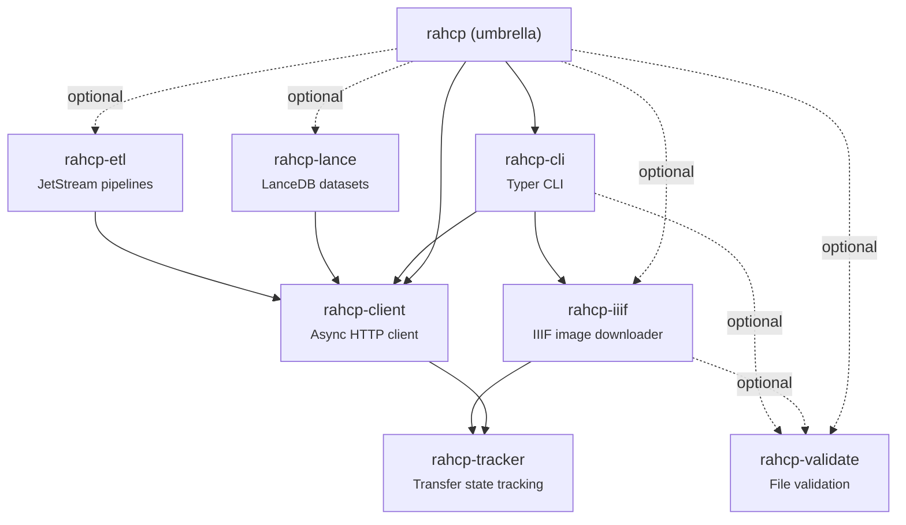

# Python SDK

The `rahcp` Python SDK provides a lightweight, async-first client for the HCP Unified API. It is distributed as a [uv workspace](https://docs.astral.sh/uv/concepts/workspaces/) with seven installable packages:



## Installation

Requires **Python >= 3.13** and [uv](https://docs.astral.sh/uv/).

```bash
# SDK + CLI (default)
uv pip install rahcp

# With OpenTelemetry tracing
uv pip install "rahcp-client[otel]"

# With Lance dataset support
uv pip install "rahcp[lance]"

# With ETL pipelines (NATS JetStream)
uv pip install "rahcp[etl]"

# With image validation (Pillow)
uv pip install "rahcp[validate]"

# With IIIF image downloader
uv pip install "rahcp[iiif]"

# Everything
uv pip install "rahcp[all]"
```

The default install includes both the Python SDK (`rahcp-client`) and the CLI (`rahcp-cli`). The heavier packages (Lance, ETL, validation) are opt-in.

For local development from the repository:

```bash
uv sync                    # install all workspace packages
uv run rahcp s3 ls         # run CLI via uv
uv run rahcp auth whoami   # check current identity
```

!!! tip "uv run vs rahcp"
    When developing locally, use `uv run rahcp` to run the CLI without installing globally. After `uv pip install rahcp`, you can use `rahcp` directly.

## Packages

| Package | Documentation | Description |
|---------|--------------|-------------|
| [rahcp-client](client.md) | Client library | Async HTTP client with auth, retries, presigned URLs, bulk transfers |
| [rahcp-cli](cli.md) | CLI tool | Command-line interface for S3, IIIF, and namespace operations |
| [rahcp-tracker](tracker.md) | Transfer tracking | Resumable transfer state tracking with SQLite |
| [rahcp-iiif](iiif.md) | IIIF downloader | Async IIIF image downloader with parallel workers |
| [rahcp-lance](lance.md) | LanceDB datasets | LanceDB dataset management on HCP S3 |
| [rahcp-etl](etl.md) | ETL pipelines | NATS JetStream event-driven pipelines with checkpointing |
| [rahcp-validate](validation.md) | File validation | Format-specific file validation with composable rules |

## Comparison: SDK vs raw HTTP

The SDK eliminates boilerplate around authentication, retries, presigned URLs, and multipart uploads. Here is the same upload workflow with raw `httpx` vs the SDK:

=== "rahcp SDK"

    ```python
    from rahcp_client import HCPClient
    from pathlib import Path

    async with HCPClient.from_env() as client:
        etag = await client.s3.upload("my-bucket", "data/file.bin", Path("file.bin"))
        print(f"Uploaded: {etag}")
    ```

=== "Raw httpx"

    ```python
    import httpx

    BASE = "http://localhost:8000/api/v1"

    async with httpx.AsyncClient(base_url=BASE) as c:
        # 1. Authenticate
        resp = await c.post("/auth/token", data={
            "username": "admin", "password": "password", "tenant": "dev-ai",
        })
        token = resp.json()["access_token"]
        c.headers["Authorization"] = f"Bearer {token}"

        # 2. Get presigned upload URL
        resp = await c.post("/presign", json={
            "bucket": "my-bucket", "key": "data/file.bin", "method": "put_object",
        })
        url = resp.json()["url"]

        # 3. Upload to presigned URL
        data = Path("file.bin").read_bytes()
        async with httpx.AsyncClient() as hcp:
            resp = await hcp.put(url, content=data)
            resp.raise_for_status()
            print(f"Uploaded: {resp.headers['etag']}")
    ```

The SDK also handles automatic retries, token refresh, and multipart upload for large files -- none of which are shown in the raw example above.
