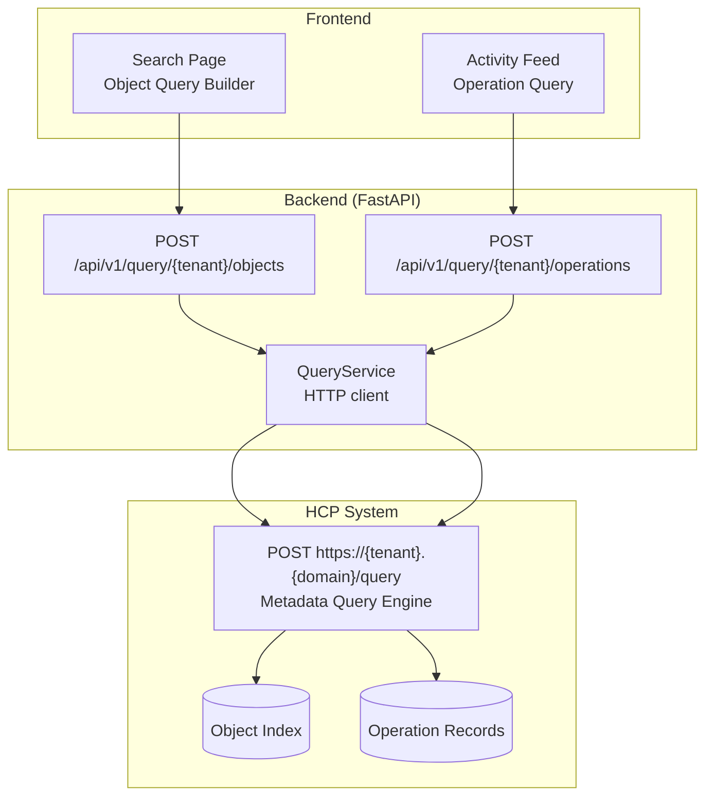
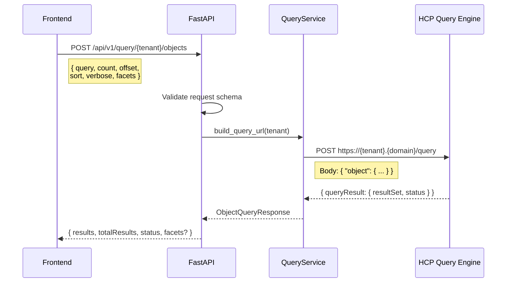
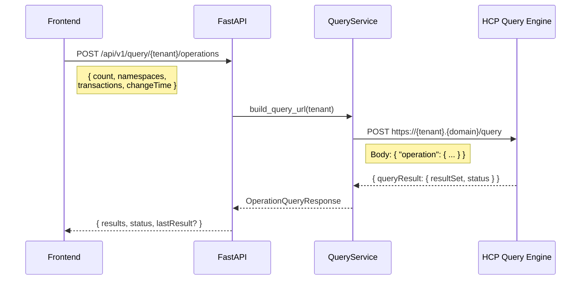

# HCP Metadata Query API — Implementation Plan

## Context

HCP has a dedicated **Metadata Query API** separate from the Management API (MAPI). It enables searching objects by system metadata, custom metadata, ACLs, and content properties — plus tracking create/delete/purge operations as an audit trail. Our backend currently supports indexing *configuration* (`customMetadataIndexingSettings`) but has zero query capability.

The Query API uses a different URL pattern from MAPI:
- **MAPI:** `https://admin.hcp:9090/mapi/tenants/{T}/...`
- **Query:** `https://{tenant}.{hcp-domain}/query` (POST only)

Authentication is identical (same `Authorization: HCP base64(user):md5(pass)` header).

### Source Documentation

- `docs/hcp_docs/hcp_search.md` — Full HCP Metadata Query API reference
- `docs/hcp_docs/api_findings.md` — Gap analysis (Section 5: "No S3 Search API")

---

## Architecture Overview

### Two Query Types



### Object-Based Query Flow



### Operation-Based Query Flow (Activity/Audit)



---

## Phase 1: Backend — Schemas & Service

### 1.1 Pydantic Request Schemas

**File:** `backend/app/schemas/query.py`

```python
# --- Object-based query ---

class ObjectQuery(BaseModel):
    """POST body for object-based metadata queries."""
    query: str                              # Query expression (e.g. "+namespace:\"ns.tenant\" +size:[1000 TO *]")
    count: int = 100                        # Max results per page (-1 = all, 0 = count only)
    offset: int = 0                         # Skip N results (paging, max 100000)
    sort: Optional[str] = None              # e.g. "changeTimeMilliseconds+desc,size+asc"
    verbose: bool = False                   # Return full metadata vs just urlName/version/operation/changeTime
    object_properties: Optional[str] = None # Comma-separated property list (overrides verbose)
    facets: Optional[str] = None            # e.g. "namespace,retentionClass,hold"

class ObjectQueryRequest(BaseModel):
    """Wrapper matching HCP JSON format: { "object": { ... } }"""
    object: ObjectQuery


# --- Operation-based query ---

class ChangeTimeRange(BaseModel):
    start: Optional[int] = None  # Milliseconds since epoch, or ISO 8601
    end: Optional[int] = None

class OperationSystemMetadata(BaseModel):
    change_time: Optional[ChangeTimeRange] = Field(None, alias="changeTime")
    namespaces: Optional[dict] = None       # { "namespace": ["ns.tenant", ...] }
    directories: Optional[dict] = None      # { "directory": ["/path", ...] }
    transactions: Optional[dict] = None     # { "transaction": ["create","delete",...] }
    indexable: Optional[bool] = None
    replication_collision: Optional[bool] = Field(None, alias="replicationCollision")

class OperationQuery(BaseModel):
    """POST body for operation-based queries."""
    count: int = 100
    verbose: bool = False
    object_properties: Optional[str] = Field(None, alias="objectProperties")
    system_metadata: Optional[OperationSystemMetadata] = Field(None, alias="systemMetadata")
    last_result: Optional[dict] = Field(None, alias="lastResult")
    # lastResult: { urlName, changeTimeMilliseconds, version }

class OperationQueryRequest(BaseModel):
    """Wrapper: { "operation": { ... } }"""
    operation: OperationQuery
```

### 1.2 Pydantic Response Schemas

```python
class QueryResultObject(BaseModel):
    """A single object/operation record in the result set."""
    url_name: str = Field(alias="urlName")
    operation: str                          # CREATED, DELETED, DISPOSED, PRUNED, PURGED, NOT_FOUND
    change_time_milliseconds: str = Field(alias="changeTimeMilliseconds")
    version: Optional[int] = None
    # --- verbose/objectProperties fields (all optional) ---
    size: Optional[int] = None
    owner: Optional[str] = None
    hash: Optional[str] = None
    namespace: Optional[str] = None
    utf8_name: Optional[str] = Field(None, alias="utf8Name")
    ingest_time_string: Optional[str] = Field(None, alias="ingestTimeString")
    change_time_string: Optional[str] = Field(None, alias="changeTimeString")
    retention: Optional[int] = None
    retention_class: Optional[str] = Field(None, alias="retentionClass")
    hold: Optional[bool] = None
    shred: Optional[bool] = None
    index: Optional[bool] = None
    custom_metadata: Optional[bool] = Field(None, alias="customMetadata")
    acl: Optional[bool] = None
    replicated: Optional[bool] = None
    object_path: Optional[str] = Field(None, alias="objectPath")

    model_config = {"populate_by_name": True}

class FacetFrequency(BaseModel):
    value: str
    count: int

class Facet(BaseModel):
    property: str
    frequency: list[FacetFrequency]

class QueryStatus(BaseModel):
    total_results: Optional[int] = Field(None, alias="totalResults")  # Object-based only
    results: int
    message: str = ""
    code: str  # "COMPLETE" or "INCOMPLETE"

class ObjectQueryResponse(BaseModel):
    """Response from object-based query."""
    query: Optional[dict] = None
    result_set: list[QueryResultObject] = Field(default_factory=list, alias="resultSet")
    status: QueryStatus
    facets: Optional[list[Facet]] = None

class OperationQueryResponse(BaseModel):
    """Response from operation-based query."""
    query: Optional[dict] = None
    result_set: list[QueryResultObject] = Field(default_factory=list, alias="resultSet")
    status: QueryStatus
```

### 1.3 QueryService

**File:** `backend/app/services/query_service.py`

The key difference from `MapiService`: URL is `https://{tenant}.{hcp_domain}/query` not `https://admin:9090/mapi/...`.

```python
class QueryService:
    """HTTP client for the HCP Metadata Query API."""

    def __init__(self, settings: MapiSettings):
        self.settings = settings
        self._client: Optional[httpx.AsyncClient] = None

    def _build_query_url(self, tenant: str) -> str:
        """Build URL: https://{tenant}.{hcp_domain}/query"""
        domain = self.settings.hcp_domain  # e.g. "hcp.example.com"
        return f"https://{tenant}.{domain}/query"

    def _get_auth_header(self) -> str:
        """Same auth as MapiService."""
        # Reuse MapiService._get_auth_header() or duplicate the logic

    async def object_query(self, tenant: str, query: ObjectQueryRequest) -> ObjectQueryResponse:
        """Execute an object-based metadata query."""
        url = self._build_query_url(tenant)
        body = query.model_dump(by_alias=True, exclude_none=True)
        resp = await self._post(url, body)
        return ObjectQueryResponse.model_validate(resp["queryResult"])

    async def operation_query(self, tenant: str, query: OperationQueryRequest) -> OperationQueryResponse:
        """Execute an operation-based query (audit trail)."""
        url = self._build_query_url(tenant)
        body = query.model_dump(by_alias=True, exclude_none=True)
        resp = await self._post(url, body)
        return OperationQueryResponse.model_validate(resp["queryResult"])

    async def _post(self, url: str, body: dict) -> dict:
        client = await self._get_client()
        headers = {
            "Authorization": self._get_auth_header(),
            "Content-Type": "application/json",
            "Accept": "application/json",
        }
        resp = await client.post(url, json=body, headers=headers)
        if resp.status_code != 200:
            raise HTTPException(status_code=resp.status_code, detail=resp.text)
        return resp.json()
```

**Config addition** (`config.py`): `hcp_domain` already exists in `MapiSettings`. No new config needed.

---

## Phase 2: Backend — API Endpoints

**File:** `backend/app/api/v1/endpoints/query/search.py`

```
POST /api/v1/query/{tenant_name}/objects        → object-based search
POST /api/v1/query/{tenant_name}/operations     → operation-based audit
```

```python
router = APIRouter(tags=["Metadata Query"])

@router.post("/{tenant_name}/objects", response_model=ObjectQueryResponse)
async def search_objects(
    tenant_name: str,
    body: ObjectQuery,
    qs: QueryService = Depends(get_query_service),
):
    """Search objects by metadata, paths, ACLs, and content properties."""
    request = ObjectQueryRequest(object=body)
    return await qs.object_query(tenant_name, request)

@router.post("/{tenant_name}/operations", response_model=OperationQueryResponse)
async def search_operations(
    tenant_name: str,
    body: OperationQuery,
    qs: QueryService = Depends(get_query_service),
):
    """Query create/delete/purge operation records (audit trail)."""
    request = OperationQueryRequest(operation=body)
    return await qs.operation_query(tenant_name, request)
```

**Router registration** (`router.py`):
```python
from .endpoints.query import search as query_search
api_router.include_router(query_search.router, prefix="/query", dependencies=_auth)
```

---

## Phase 3: Mock Server

**File:** `backend/mock_server/mapi_state.py` — add query handlers

**File:** `backend/mock_server/fixtures.py` — add query result fixtures

### Mock Object Query Results

```python
MOCK_OBJECTS = [
    {
        "urlName": "https://finance-ns.my-tenant.hcp.example.com/rest/reports/Q1_2024.pdf",
        "operation": "CREATED",
        "changeTimeMilliseconds": "1700000000000.00",
        "version": 83920048912257,
        "size": 245678,
        "owner": "USER,my-tenant,admin",
        "namespace": "finance-ns.my-tenant",
        "utf8Name": "Q1_2024.pdf",
        "objectPath": "/reports/Q1_2024.pdf",
        "ingestTimeString": "2024-01-15T10:30:00+0000",
        "changeTimeString": "2024-01-15T10:30:00+0000",
        "hash": "SHA-256 9B6D4E2F...",
        "retention": 0,
        "hold": False,
        "shred": False,
        "index": True,
        "customMetadata": True,
        "acl": False,
    },
    # ... 10-20 more mock objects across different namespaces
]
```

### Mock Operation Records

```python
MOCK_OPERATIONS = [
    {
        "urlName": "https://finance-ns.my-tenant.hcp.example.com/rest/reports/Q1_2024.pdf",
        "operation": "CREATED",
        "changeTimeMilliseconds": "1700000000000.00",
        "version": 83920048912257,
    },
    {
        "urlName": "https://logs-ns.my-tenant.hcp.example.com/rest/archive/old-log.txt",
        "operation": "DELETED",
        "changeTimeMilliseconds": "1700100000000.00",
        "version": 83920048912300,
    },
    # ... mix of CREATED, DELETED, PURGED with realistic timestamps
]
```

### Mock Query Handler Logic

```python
def handle_object_query(body: dict) -> dict:
    """Filter MOCK_OBJECTS based on query expression."""
    obj = body.get("object", {})
    query_expr = obj.get("query", "*:*")
    count = obj.get("count", 100)
    offset = obj.get("offset", 0)
    verbose = obj.get("verbose", False)

    # Simple filtering: parse namespace:"x" from query expression
    results = filter_by_query(MOCK_OBJECTS, query_expr)
    total = len(results)
    page = results[offset : offset + count]

    if not verbose:
        page = [strip_to_basic(obj) for obj in page]

    return {
        "queryResult": {
            "resultSet": page,
            "status": {
                "totalResults": total,
                "results": len(page),
                "code": "COMPLETE" if offset + count >= total else "INCOMPLETE",
                "message": "",
            },
        }
    }

def handle_operation_query(body: dict) -> dict:
    """Filter MOCK_OPERATIONS based on time range and transaction types."""
    op = body.get("operation", {})
    sm = op.get("systemMetadata", {})
    transactions = sm.get("transactions", {}).get("transaction", ["create", "delete", "purge"])
    # ... filter by changeTime range, namespace, transaction type
```

---

## Phase 4: Frontend — Search UI

### 4.1 Remote Functions

**File:** `frontend/src/lib/search.remote.ts`

```typescript
export const search_objects = command(
    z.object({
        tenant: z.string(),
        query: z.string(),
        count: z.number().optional(),
        offset: z.number().optional(),
        sort: z.string().optional(),
        verbose: z.boolean().optional(),
        facets: z.string().optional(),
    }),
    async ({ tenant, ...body }) => {
        const res = await apiFetch(`/api/v1/query/${tenant}/objects`, {
            method: "POST",
            body: JSON.stringify(body),
        });
        if (!res.ok) throw new Error("Search failed");
        return await res.json();
    }
);

export const search_operations = command(
    z.object({
        tenant: z.string(),
        count: z.number().optional(),
        transactions: z.array(z.string()).optional(),
        startTime: z.number().optional(),
        endTime: z.number().optional(),
        namespaces: z.array(z.string()).optional(),
    }),
    async ({ tenant, transactions, startTime, endTime, namespaces, ...rest }) => {
        const body = {
            ...rest,
            systemMetadata: {
                ...(startTime || endTime ? { changeTime: { start: startTime, end: endTime } } : {}),
                ...(namespaces ? { namespaces: { namespace: namespaces } } : {}),
                ...(transactions ? { transactions: { transaction: transactions } } : {}),
            },
        };
        const res = await apiFetch(`/api/v1/query/${tenant}/operations`, {
            method: "POST",
            body: JSON.stringify(body),
        });
        if (!res.ok) throw new Error("Query failed");
        return await res.json();
    }
);
```

### 4.2 Search Page

**Route:** `/search` or `/namespaces/[namespace]/search`

Features:
- Query input (text field or structured builder)
- Namespace filter dropdown
- Results table: Name, Path, Size, Modified, Owner, Operation
- Paging controls (offset-based)
- Facet sidebar (namespace breakdown, retention class distribution)
- Toggle between object search and operation history

### 4.3 Activity Feed on Overview

Use operation-based queries to show recent activity on the overview page:
- Last N create/delete/purge events across all namespaces
- Timestamp, object name, operation type, namespace
- Replaces "no queryable log API" limitation noted in TODO

---

## Implementation Order

| Step | What | Files | Depends on |
|------|------|-------|------------|
| 1 | Pydantic schemas | `schemas/query.py` | — |
| 2 | QueryService | `services/query_service.py` | Step 1 |
| 3 | API endpoints | `api/v1/endpoints/query/search.py`, `router.py` | Steps 1-2 |
| 4 | Mock fixtures | `mock_server/fixtures.py` | Step 1 |
| 5 | Mock handlers | `mock_server/mapi_state.py` | Steps 1, 4 |
| 6 | Frontend remote functions | `lib/search.remote.ts` | Steps 3, 5 |
| 7 | Search page UI | `routes/(app)/search/+page.svelte` | Step 6 |
| 8 | Activity feed on overview | `routes/(app)/overview/+page.svelte` | Step 6 |

### Effort Estimates

- **Phase 1** (schemas + service): Small — ~200 lines
- **Phase 2** (endpoints): Small — ~50 lines
- **Phase 3** (mock server): Medium — ~200 lines (realistic fixtures + filtering)
- **Phase 4** (frontend): Medium-Large — search page + activity integration

---

## HCP Query Expression Quick Reference

For building the frontend query builder and mock parser:

```
# Property queries
namespace:"finance-ns.my-tenant"
size:[1000 TO 50000]
hold:true
retention:0                          # Deletion Allowed
retention:"-1"                       # Deletion Prohibited
hashScheme:SHA-256
owner:"USER,my-tenant,admin"
utf8Name:report*                     # Wildcard
objectPath:"/Corporate/Employees/*"

# Text search (custom metadata full-text)
customMetadataContent:keyword
customMetadataContent:"element.value.element"

# Boolean operators
+namespace:"ns.tenant" +size:[1000 TO *]       # Both required
+hold:true -retention:0                         # On hold AND not deletable
+(retention:0 hold:true)                        # Either condition

# Time ranges
ingestTimeString:[2024-01-01T00:00:00 TO 2024-12-31T23:59:59]
changeTimeMilliseconds:[1700000000000.00 TO *]  # After timestamp

# Sort
sort: "changeTimeMilliseconds+desc"
sort: "namespace+asc,size+desc"

# Special
*:*                                  # Match all objects
```

### Operation Types (for operation-based queries)

| Transaction | Meaning |
|------------|---------|
| `create` | Object created or modified (current version) |
| `delete` | Object deleted (delete marker if versioned) |
| `dispose` | Object removed by retention disposition |
| `prune` | Old version pruned (versioned namespaces only) |
| `purge` | All versions permanently removed |
