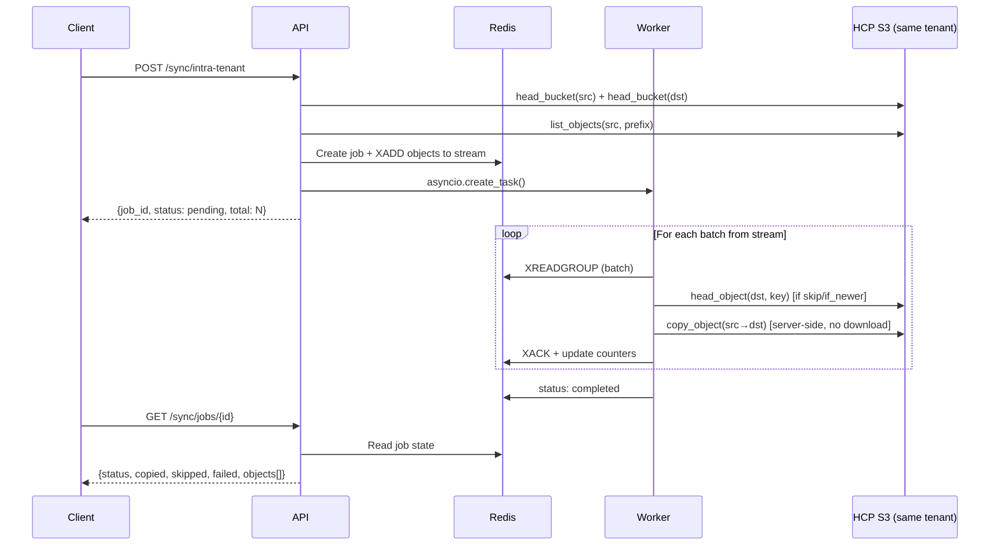
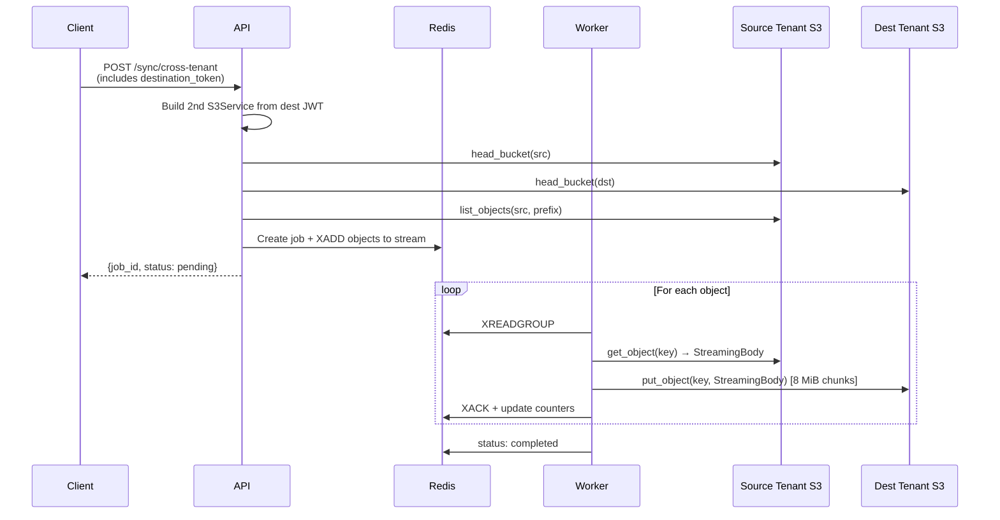
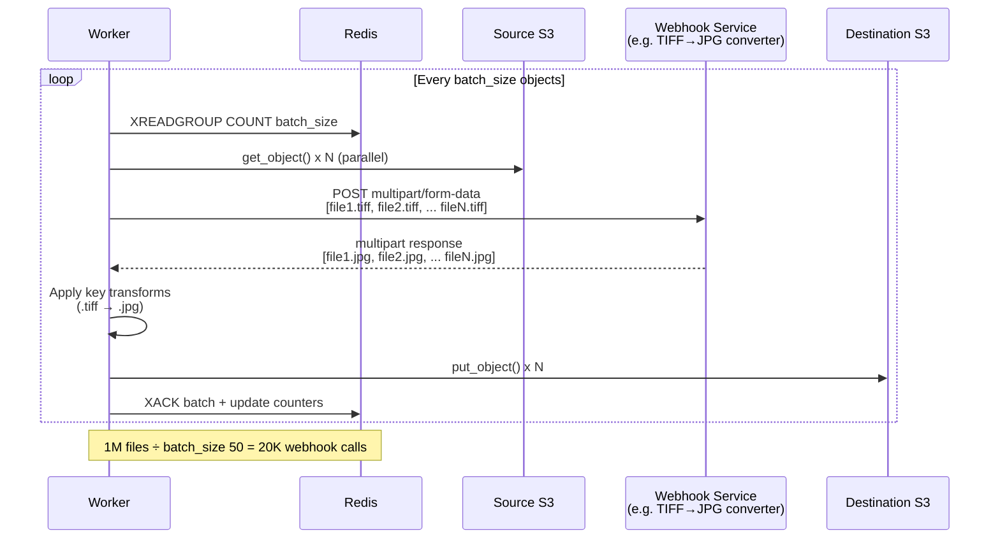
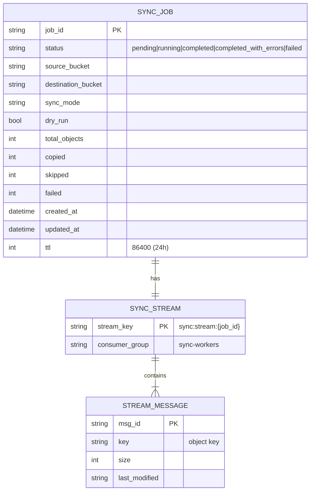
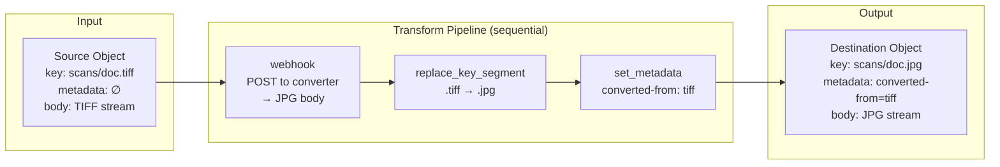

# Bucket Sync Endpoints — Implementation Plan

## Context

The HCP backend has single-object copy but no bulk sync. HCP S3 docs confirm there's no native bulk copy API — `CopyObject` works within the same tenant only, and each object must be copied individually. We need two sync endpoints (intra-tenant, cross-tenant) backed by Redis Streams for durable job processing and pluggable data+metadata transformations.

## Architecture Overview

### High-Level Flow

```mermaid
flowchart TB
    subgraph Client
        A[POST /sync/intra-tenant<br/>or /sync/cross-tenant]
        B[GET /sync/jobs/job_id]
    end

    subgraph API Server
        V[Validate buckets<br/>+ list source objects]
        P[Publish objects<br/>to Redis Stream]
        L[Launch background<br/>consumer task]
        R[Return job_id<br/>+ status: pending]
    end

    subgraph Redis
        S[(Stream<br/>sync:stream:job_id)]
        J[(Job State<br/>sync:job:job_id)]
    end

    subgraph Consumer Worker – background thread
        C[XREADGROUP<br/>batch of objects]
        D{Needs data<br/>transform?}
        E[Server-side<br/>CopyObject ⚡]
        F[Stream through:<br/>GET → transform → PUT]
        K[XACK + update<br/>job counters]
    end

    A --> V --> P --> S
    P --> L --> R
    L -.-> C
    C --> S
    C --> D
    D -- No webhook --> E
    D -- Webhook or<br/>cross-tenant --> F
    E --> K --> J
    F --> K
    B --> J
```

### Intra-Tenant Sync (fast path — no data transfer)



### Cross-Tenant Sync (stream-through)



### Webhook Transform Pipeline (batch mode)



### Redis State Model



### Transform Pipeline



Redis required for sync operations (returns 503 if not configured).

## Design Decisions

- **Cross-tenant auth**: Second JWT token provided in request body (user logs in to both tenants)
- **Sync modes**: Configurable per-request — `overwrite_all`, `skip_existing`, `if_newer`
- **Dry run**: Preview what would be synced without copying
- **Prefix filter**: Optional prefix to sync a subset of objects
- **Transforms**: Optional pluggable pipeline with key, metadata, and webhook (data) transforms
- **Durability**: Redis Streams with per-object checkpoints (XADD/XACK)
- **Async jobs**: POST returns job_id, poll GET for status/progress

## Usage Modes

Transforms are **fully optional**. The `transforms` field defaults to `[]`. Three usage patterns:

### Mode 1: Plain sync (no transforms)
```json
POST /api/v1/sync/intra-tenant
{
  "source_bucket": "bucket-a",
  "destination_bucket": "bucket-b",
  "sync_mode": "skip_existing"
}
```
Objects copied as-is — same keys, same metadata. Intra-tenant uses fast server-side `CopyObject` (no data flows through the API).

### Mode 2: Key/metadata transforms only (no webhook, still fast)
```json
{
  "source_bucket": "bucket-a",
  "destination_bucket": "bucket-b",
  "transforms": [
    {"type": "add_key_prefix", "config": {"prefix": "backup/2024/"}},
    {"type": "set_metadata", "config": {"key": "source", "value": "bucket-a"}}
  ]
}
```
Still uses server-side `CopyObject` with `x-amz-metadata-directive: REPLACE`. No data download/upload needed.

### Mode 3: With webhook (external data transformation)
```json
{
  "source_bucket": "raw-images",
  "destination_bucket": "processed-images",
  "prefix": "scans/",
  "transforms": [
    {"type": "webhook", "config": {"url": "http://converter:8080/tiff-to-jpg", "timeout": 300, "batch_size": 50}},
    {"type": "replace_key_segment", "config": {"pattern": "\\.tiff$", "replacement": ".jpg"}},
    {"type": "set_metadata", "config": {"key": "converted-from", "value": "tiff"}}
  ]
}
```
Falls back to stream-through mode **only when a webhook is present**. Data flows: source → webhook service → destination. Bounded memory (8 MiB chunks).

With `batch_size: 50`, a bucket with 1,000,000 files results in ~20,000 webhook calls instead of 1,000,000. The webhook receives a multipart request with up to 50 files and returns 50 transformed files. Without `batch_size` (or `batch_size: 1`), it falls back to one-file-per-request.

**The consumer automatically picks the optimal path**: server-side CopyObject when possible, stream-through only when necessary (cross-tenant or webhook transforms).

## Files to Create/Modify

### 1. `backend/app/schemas/sync.py` (new)

```python
# Enums
SyncMode: overwrite_all | skip_existing | if_newer
ObjectSyncStatus: copied | skipped | failed
SyncJobStatus: pending | running | completed | completed_with_errors | failed

# Transform definitions
TransformType: add_key_prefix | strip_key_prefix | replace_key_segment
             | set_metadata | remove_metadata | rename_metadata_key
             | webhook

TransformStep:
    type: TransformType
    config: dict  # type-specific config, examples:
    # Key transforms:    {"prefix": "backup/"}, {"pattern": "\\.tiff$", "replacement": ".jpg"}
    # Metadata:          {"key": "dept", "value": "sales"}
    # Webhook:           {"url": "http://converter:8080/tiff-to-jpg", "timeout": 120, "batch_size": 50}

# Request models
IntraTenantSyncRequest:
    source_bucket: str
    destination_bucket: str
    prefix: str | None = None
    sync_mode: SyncMode = overwrite_all
    dry_run: bool = False
    transforms: list[TransformStep] = []  # optional pipeline

CrossTenantSyncRequest:
    (same as above)
    destination_token: str  # JWT for destination tenant

# Response models
ObjectSyncResult:
    key: str
    destination_key: str  # may differ if key transforms applied
    status: ObjectSyncStatus
    error: str | None
    source_last_modified: datetime | None
    size: int | None

SyncJobResponse:
    job_id: str
    status: SyncJobStatus
    source_bucket: str
    destination_bucket: str
    sync_mode: SyncMode
    dry_run: bool
    total_objects: int
    copied: int
    skipped: int
    failed: int
    created_at: datetime
    updated_at: datetime
    objects: list[ObjectSyncResult]
```

### 2. `backend/app/services/transform_service.py` (new)

Pluggable transform pipeline — applies both key/metadata and data transforms.

```python
class TransformContext:
    """Mutable context passed through the transform pipeline."""
    key: str                    # destination object key (mutable)
    metadata: dict[str, str]    # x-amz-meta-* headers (mutable)
    body: IO[bytes] | None      # object body stream (replaceable for data transforms)

class TransformService:
    """Apply a list of TransformSteps to a TransformContext."""

    def apply(self, ctx: TransformContext, steps: list[TransformStep]) -> TransformContext:
        for step in steps:
            handler = self._handlers[step.type]
            handler(ctx, step.config)
        return ctx

# Built-in handlers:
# Key transforms:
# - add_key_prefix: prepend prefix to key       → config: {"prefix": "backup/"}
# - strip_key_prefix: remove prefix from key    → config: {"prefix": "raw/"}
# - replace_key_segment: regex replace in key   → config: {"pattern": "\\.tiff$", "replacement": ".jpg"}
# Metadata transforms:
# - set_metadata: add/overwrite metadata key    → config: {"key": "department", "value": "finance"}
# - remove_metadata: delete metadata key        → config: {"key": "temporary"}
# - rename_metadata_key: rename metadata key    → config: {"old_key": "dept", "new_key": "department"}
# Data transforms (webhook):
# - webhook: POST object body to URL, use response as new body
#   config: {"url": "http://converter:8080/tiff-to-jpg", "timeout": 120, "method": "POST"}
#   Streams request body to webhook, streams response body back. Bounded memory.
#   Webhook receives raw object bytes, returns transformed bytes.
#   Use case: TIFF→JPG conversion, image resize, data anonymization, etc.
```

**Webhook transform detail**: Uses `httpx` (already a dependency) to stream the object body to the external service. The response body is wrapped as a file-like object for `put_object()`. This means:
1. `get_object()` → `StreamingBody`
2. `httpx.post(url, content=streaming_body)` → streams to webhook
3. Webhook response `iter_bytes()` → wrapped as `IO[bytes]` → `put_object()`
4. Memory bounded: only one chunk in memory at a time

**Batch webhook support**: For high-volume syncs (e.g., 1 million files), sending one HTTP request per object to the webhook is extremely wasteful. The webhook transform supports an optional `batch_size` config:

```python
# Single-object webhook (default, batch_size=1):
#   POST /tiff-to-jpg  body=<single file>  →  response=<converted file>
#
# Batch webhook (batch_size > 1):
#   POST /tiff-to-jpg  body=multipart/form-data with N files
#   Response: multipart/form-data with N converted files (same order)
#
# config: {"url": "...", "timeout": 300, "batch_size": 50}
```

The consumer collects `batch_size` messages from the Redis Stream before calling the webhook once with all objects as a multipart request. This turns 1,000,000 webhook calls into 20,000 calls at `batch_size=50`. The webhook service must support multipart batch processing when `batch_size > 1`.

Batching flow:
1. Consumer reads up to `batch_size` messages from XREADGROUP
2. Downloads all objects from source (can be parallelized with a thread pool)
3. Sends single multipart POST to webhook with all objects
4. Receives multipart response with all transformed objects
5. Uploads all transformed objects to destination
6. XACKs all messages in the batch
7. Updates job counters once per batch (not per object — reduces Redis writes)

**Example — TIFF to JPG conversion:**
```json
POST /api/v1/sync/intra-tenant
{
  "source_bucket": "raw-images",
  "destination_bucket": "processed-images",
  "prefix": "scans/",
  "transforms": [
    {
      "type": "webhook",
      "config": {
        "url": "http://converter:8080/tiff-to-jpg",
        "timeout": 300,
        "batch_size": 50
      }
    },
    {
      "type": "replace_key_segment",
      "config": {"pattern": "\\.tiff$", "replacement": ".jpg"}
    },
    {
      "type": "set_metadata",
      "config": {"key": "converted-from", "value": "tiff"}
    }
  ]
}
```

### 3. `backend/app/services/sync_service.py` (new)

Core sync service — **publishes to Redis Streams** and **consumes messages**.

**Publisher methods** (called from endpoint):
- `create_job(cache, job_id, request_params)` — stores job metadata in Redis
- `publish_objects(cache, job_id, objects)` — XADD each object to stream `sync:stream:{job_id}`

**Consumer method** (runs as background task in thread pool):
- `consume_and_sync(cache, job_id, s3, dst_s3, sync_mode, dry_run, transforms)`:
  1. Create consumer group on stream
  2. XREADGROUP in batches
  3. For each message:
     - Check `_should_copy()` logic (head_object on destination for skip_existing/if_newer)
     - If intra-tenant with no data transforms: `s3.copy_object()` (server-side, fast)
     - If cross-tenant or data transforms present: stream `get_object()` → apply transforms → `put_object()`
     - XACK the message
     - Update job counters in Redis (`sync:job:{job_id}`)
  4. Set final job status

**Key design**: Intra-tenant with no data transforms uses server-side CopyObject (fast, no data flows through API). If webhook or other body-modifying transforms are requested on intra-tenant, it falls back to stream-through mode (like cross-tenant).

**Helper methods:**
- `_list_all_objects(s3, bucket, prefix)` — paginate with continuation tokens (1000 per page)
- `_head_object_safe(s3, bucket, key)` — returns None on 404
- `_should_copy(sync_mode, dst_meta, src_last_modified)` — decision logic for copy/skip
- `_stream_object(src_s3, dst_s3, src_bucket, dst_bucket, key, transforms)` — streaming helper with transform pipeline

**Redis keys:**
- `sync:job:{id}` — JSON with job metadata + counters + results array (TTL: 24h)
- `sync:stream:{id}` — Redis Stream with one message per object (TTL: 24h, cleaned after job)

### 4. `backend/app/services/cache_service.py` (modify)

Add sync methods for Redis Streams operations (used by SyncService in thread pool):

```python
# New sync methods
def xadd_sync(self, stream: str, fields: dict, maxlen: int | None = None) -> str | None
def xgroup_create_sync(self, stream: str, group: str, id: str = "0") -> bool
def xreadgroup_sync(self, group: str, consumer: str, streams: dict, count: int = 10, block: int = 5000) -> list
def xack_sync(self, stream: str, group: str, *ids: str) -> int
def xlen_sync(self, stream: str) -> int
def expire_sync(self, key: str, seconds: int) -> bool
```

These wrap `self._sync_redis.xadd()`, etc. with error handling matching the existing pattern (swallow errors gracefully, return None/False on failure).

### 5. `backend/app/api/v1/endpoints/s3/sync.py` (new)

Router: `APIRouter(prefix="/sync", tags=["S3 Sync"])`

**`POST /intra-tenant`** → `SyncJobResponse`
1. Check Redis is available (else 503)
2. Validate bucket access via `s3.head_bucket()` for both buckets
3. List all source objects (paginated)
4. Generate `job_id` (uuid4)
5. `sync_service.create_job()` — store initial state in Redis
6. `sync_service.publish_objects()` — XADD each object to stream
7. Launch consumer: `asyncio.create_task(asyncio.to_thread(sync_service.consume_and_sync, ...))`
8. Store task ref in `request.app.state.sync_tasks[job_id]`
9. Return `SyncJobResponse` with status=pending

**`POST /cross-tenant`** → `SyncJobResponse`
Same as above but:
- Builds destination S3Service from `body.destination_token` via `build_s3_service_from_token()`
- Validates destination bucket with destination S3Service
- Passes both S3 services to consumer

**`GET /jobs/{job_id}`** → `SyncJobResponse`
- Read job state from Redis, 404 if not found

### 6. `backend/app/api/dependencies.py` (modify)

Add `build_s3_service_from_token(token, s3_cache) -> S3Service`:
- Decodes JWT via existing `verify_token_with_credentials()`
- Derives S3 keys via existing `_derive_s3_keys()`
- Builds endpoint via existing `s3_endpoint_for_tenant()`
- Caches in `request.app.state.s3_cache`

### 7. `backend/app/api/v1/router.py` (modify)

```python
from app.api.v1.endpoints.s3 import sync
api_router.include_router(sync.router, dependencies=_auth)
```

### 8. `backend/app/main.py` (modify)

- Add `app.state.sync_tasks = {}` in lifespan startup
- Add OpenAPI tag: `{"name": "S3 Sync", "description": "Async bucket sync with Redis-backed job tracking and transform pipelines."}`

## Key Technical Details

**Intra-tenant copy (no data transforms)**: Server-side `CopyObject` — no data flows through API. Key/metadata transforms use `CopyObject` with `x-amz-metadata-directive: REPLACE` and new key.

**Intra-tenant copy (with data transforms/webhook)**: Falls back to stream-through mode — `get_object()` → transform pipeline → `put_object()`.

**Cross-tenant streaming**: `get_object()` returns `StreamingBody` (implements `read(amt)`). Passed through transform pipeline, then to `put_object()`. boto3 reads in 8 MiB chunks matching `TransferConfig.multipart_chunksize`. Max ~8 MiB in memory per object.

**Transform pipeline**: `TransformContext` carries mutable key, metadata dict, and body stream. Each `TransformStep` handler modifies the context in-place. Key/metadata transforms are cheap. Webhook transforms stream data through an external HTTP service.

**Redis Streams flow**:
1. `XADD sync:stream:{job_id} * key <obj_key> size <size> last_modified <ts>` for each object
2. `XGROUP CREATE sync:stream:{job_id} sync-workers 0`
3. Consumer: `XREADGROUP GROUP sync-workers worker-1 COUNT 10 BLOCK 5000 STREAMS sync:stream:{job_id} >`
4. After processing: `XACK sync:stream:{job_id} sync-workers <msg_id>`
5. Loop until stream drained (XREADGROUP returns empty)

**`if_newer` comparison**: Source `LastModified` from `list_objects_v2`, destination from `head_object`. Both UTC-aware datetimes from boto3. Direct `>` comparison. Copy if timestamps unavailable.

**Atomicity guarantees**:
- Both buckets validated before job starts (fast-fail on POST)
- Per-object: message in stream → process → ACK. If consumer crashes, unACKed messages can be reclaimed via XPENDING/XCLAIM
- State persisted in Redis after each object — survives connection drops
- Re-running with `skip_existing` is safe (idempotent — skips already-copied objects)
- Final status: `completed` (all ok) vs `completed_with_errors` (some failed)

**Background task lifecycle**: `asyncio.create_task()` wrapping `asyncio.to_thread()`. Task ref stored in `app.state.sync_tasks[job_id]`. If server restarts, in-flight tasks are lost but Redis state shows last checkpoint — user re-submits.

## Files Summary

| File | Action | Purpose |
|------|--------|---------|
| `app/schemas/sync.py` | Create | Request/response models, enums, transform types |
| `app/services/transform_service.py` | Create | Pluggable transform pipeline (key, metadata, webhook) |
| `app/services/sync_service.py` | Create | Redis Streams publisher + consumer with sync logic |
| `app/services/cache_service.py` | Modify | Add sync Redis Streams methods (xadd, xreadgroup, xack, etc.) |
| `app/api/v1/endpoints/s3/sync.py` | Create | Endpoint handlers + async job launcher |
| `app/api/dependencies.py` | Modify | Add `build_s3_service_from_token()` helper |
| `app/api/v1/router.py` | Modify | Wire sync router with auth |
| `app/main.py` | Modify | Add `sync_tasks` state + OpenAPI tag |

## Verification

1. `make run-api-mock` (requires Redis running locally)
2. Login → `POST /api/v1/auth/token`
3. Submit intra-tenant sync (`dry_run: true`) → verify job_id returned, poll GET for preview results
4. Submit intra-tenant sync (`dry_run: false`) → verify objects copied
5. Submit with transforms (`add_key_prefix`, `set_metadata`) → verify transforms applied
6. Submit with webhook transform → verify external service called and data transformed
7. Submit cross-tenant sync with second token → verify streaming works
8. Test sync_mode variations (`skip_existing`, `if_newer`)
9. Test prefix filtering
10. Verify 503 when Redis not configured
11. Verify 404 on non-existent bucket
12. Verify partial failure reporting (some objects fail, job still completes)
13. Run `pytest` for unit tests
